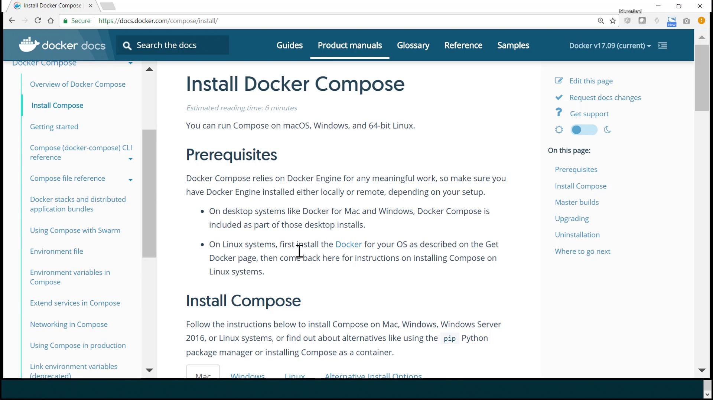

# Demo Example Voting App using Docker Compose

Source: https://notes.kodekloud.com/docs/Docker-SWARM-SERVICES-STACKS-Hands-on/Docker-Compose/Demo-Example-Voting-App-using-Docker-Compose/page

This guide covers deploying a multi-container voting application stack using Docker Compose, including setup, configuration, and running interconnected services.

Welcome to this comprehensive guide on deploying a multi-container voting application stack with Docker Compose. In this tutorial, you’ll learn how to set up and run various interconnected services that form a complete voting app ecosystem.

<Frame>
  
</Frame>

<Callout icon="lightbulb">
  Docker Compose is not included by default when Docker is installed. You need to install it separately. For instructions tailored to your operating system (Mac, Windows, or Linux), please refer to the Docker documentation.
</Callout>

Since this demo runs on Linux, follow these steps to install Docker Compose:

1. Download the Docker Compose binary using `curl`.
2. Set executable permissions.
3. Verify the installation with the version command.

```bash theme={null}
sudo curl -L "https://github.com/docker/compose/releases/download/1.16.1/docker-compose-$(uname -s)-$(uname -m)" -o /usr/local/bin/docker-compose
sudo chmod +x /usr/local/bin/docker-compose
docker-compose --version
