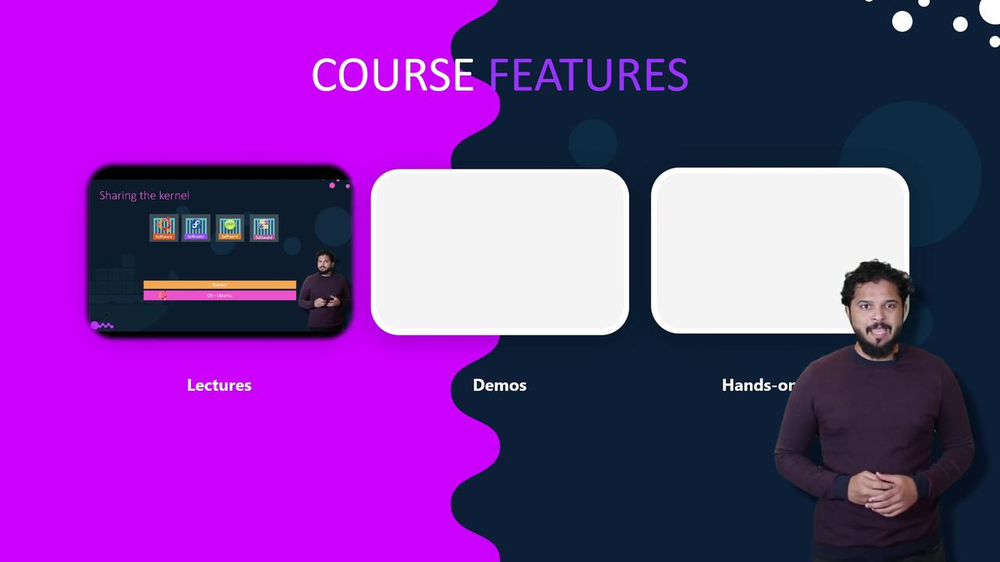
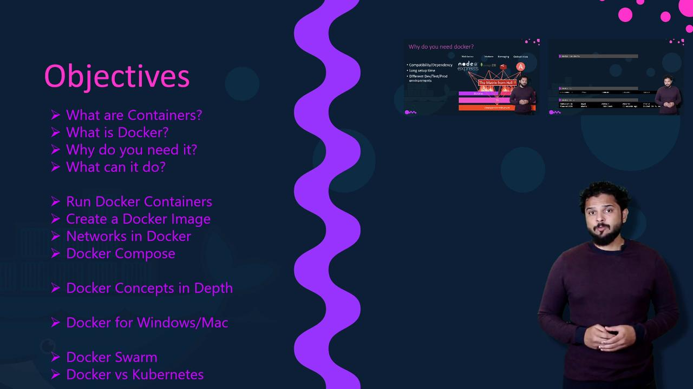

# inside container now; exit to stop and remove
```

## Next steps

After installation and verification, try:

* Building a simple Dockerfile and image:

```dockerfile theme={null}
# Example Dockerfile
FROM alpine:latest
CMD ["echo", "Hello from my image"]
```

Build and run:

```bash theme={null}
docker build -t my-hello .
docker run --rm my-hello
```

* Exploring networking with `docker run -p` to expose ports.
* Learning image layering and how to optimize Dockerfiles.

## Links and references

* Docker Engine installation guides: [https://docs.docker.com/engine/install/](https://docs.docker.com/engine/install/)
* Docker Desktop (macOS & Windows): [https://docs.docker.com/desktop/](https://docs.docker.com/desktop/)
* WSL2 (Windows Subsystem for Linux): [https://learn.microsoft.com/windows/wsl/](https://learn.microsoft.com/windows/wsl/)
* VirtualBox (VM option for macOS/Windows): [https://www.virtualbox.org/](https://www.virtualbox.org/)

This completes the basic getting-started flow. In the next lesson we'll build a Dockerfile, create an image, and run a multi-container example.

- [Watch Video](https://learn.kodekloud.com/user/courses/docker-training-course-for-the-absolute-beginner/module/cadd438c-e11b-445c-b802-029caf6d9b89/lesson/4c60b5a6-40e4-410c-a440-50a65baa4ade)


# Introduction

Source: https://notes.kodekloud.com/docs/Docker-Training-Course-for-the-Absolute-Beginner/Introduction/Introduction/page

This tutorial introduces Docker through engaging lectures, practical demos, and interactive labs to help beginners master container technology.

Hello and welcome to the Docker for Beginners tutorial. I'm Mumshad Mannambeth, your instructor and a seasoned DevOps and cloud trainer at [KodeKloud](https://kodekloud.com). With over 13 years of industry experience and a passion for hands-on learning, I've helped thousands of students master technology in a fun and interactive manner.

In this guide, you'll explore Docker through engaging lectures enriched with animations, illustrations, and analogies that simplify complex concepts. We also include practical demos to help you install and get started with Docker.



We also provide interactive hands-on labs that you can access directly from your browser. These labs offer you a terminal connected to a Docker host along with a quiz portal. Through these interactive quizzes, you can test your ability to navigate the environment, gather information, and execute Docker commands.

Before diving into the labs, let’s review the key objectives of this tutorial. By the end of this course, you will learn how to:

* Run Docker containers
* Build custom Docker images
* Configure Docker networking and use Docker Compose
* Leverage Docker Registry and deploy a private registry

Additionally, we will delve into Docker’s internals and explore Docker for Windows and Mac. We'll also introduce container orchestration tools such as Docker Swarm and Kubernetes.



> **lightbulb** While you can set up your own labs, this course offers real labs that are accessible from your browser—anytime and anywhere. Each lab includes a terminal connected to a Docker host and an integrated quiz portal that validates your efforts in real time.

Each lecture within this course is paired with interactive quizzes, making the process of learning Docker both engaging and effective.

I hope you're as excited as I am to dive into the world of Docker. Let's explore its powerful capabilities and transform the way you work with containers!

- [Watch Video](https://learn.kodekloud.com/user/courses/docker-training-course-for-the-absolute-beginner/module/cadd438c-e11b-445c-b802-029caf6d9b89/lesson/c94c0650-a1d8-447a-a52e-92a47f038b3f)
