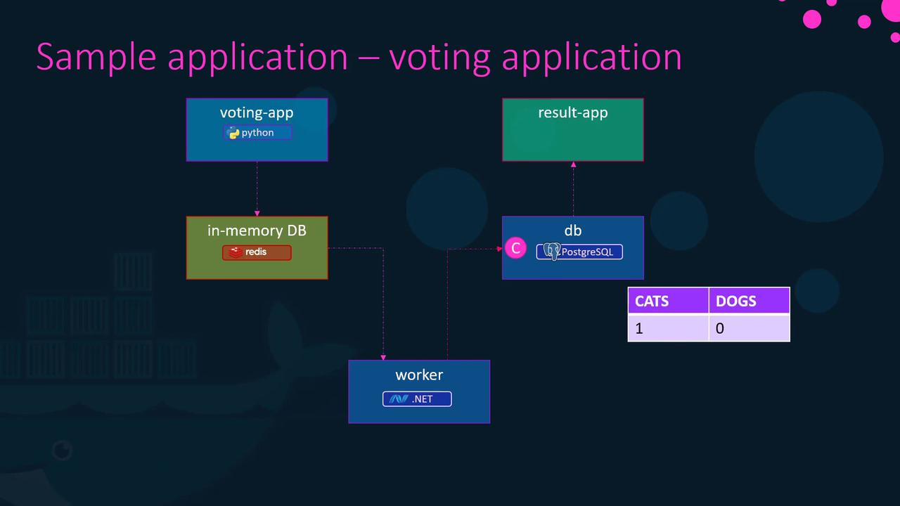
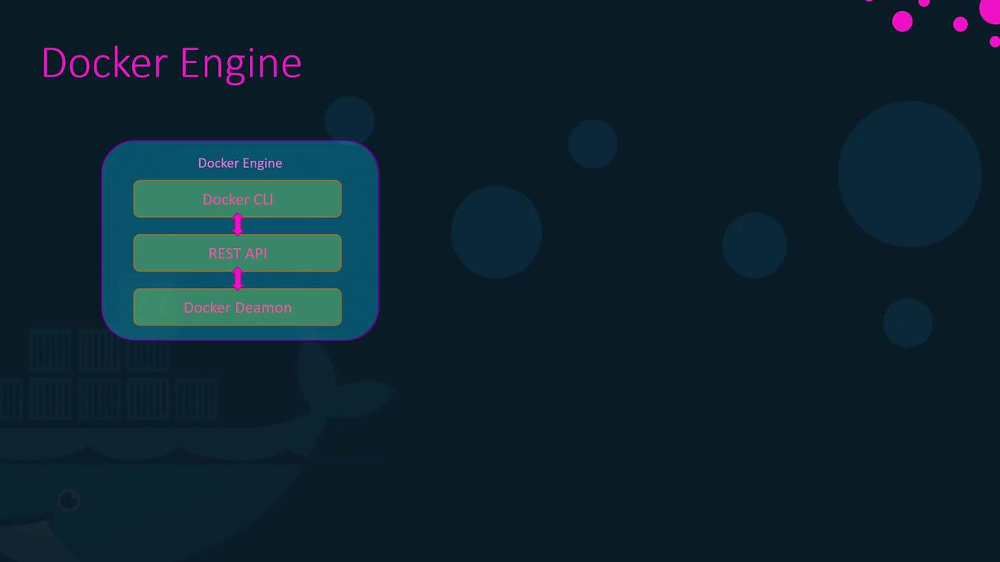
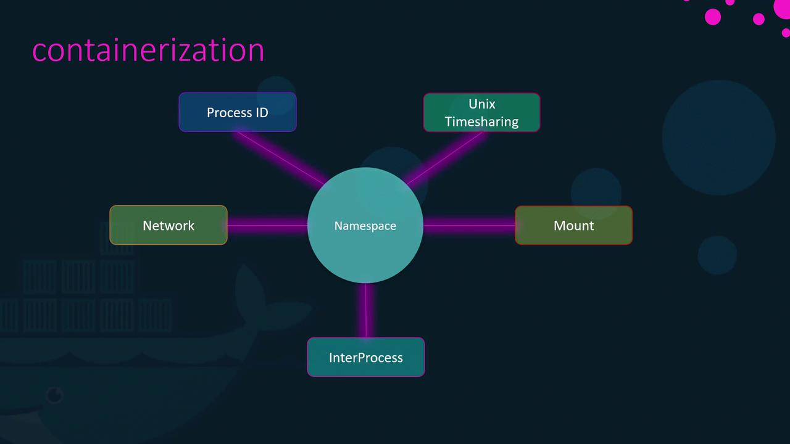
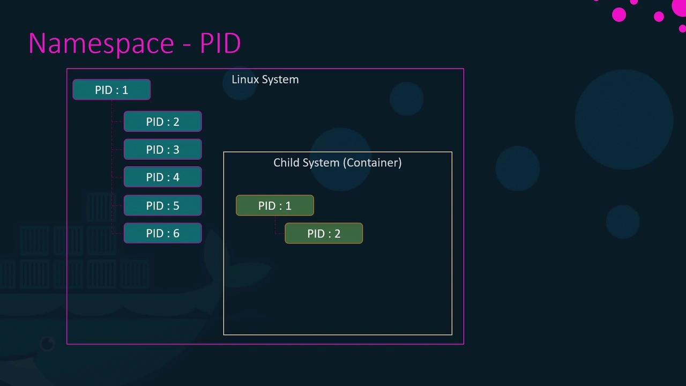
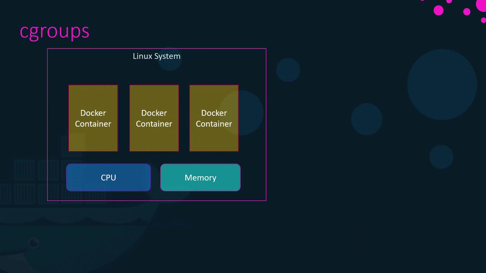

# docker-compose.yml
services:
  web:
    image: "mmunshad/simple-webapp"
  database:
    image: "mongodb"
  messaging:
    image: "redis:alpine"
  orchestration:
    image: "ansible"
```

Start your multi-container application with:

```bash theme={null}
docker-compose up
```

> **lightbulb** These instructions assume that you are running containers on a single Docker host. We'll explore more details about YAML file structures further in this guide.

***

## Sample Application: Voting App Architecture

To illustrate Docker Compose in practice, consider a sample voting application. This application demonstrates how Docker can integrate services built with different programming languages and frameworks.

### Voting Application Components

* **Python Front-End:** A web interface that lets users vote between options (e.g., cat or dog). Votes are stored in a Redis instance, serving as an in-memory database.
* **.NET Worker:** A background service that processes votes and updates a PostgreSQL database with the vote counts.
* **Node.js Back-End:** A web application that displays voting results by reading data from PostgreSQL.

Below is the diagram that outlines the voting application's architecture and data flow:



This architecture clearly demonstrates Docker's versatility in handling services developed in languages such as Python, Node.js, and .NET.

***

## Deploying the Application Using Docker Run

To get started, let’s deploy each layer of the voting application using individual Docker run commands. This example assumes that all necessary images are available in your Docker repository.

1. **Start a Redis Container:**

   ```bash theme={null}
   docker run -d --name=redis redis
   ```

2. **Deploy the PostgreSQL Database:**

   ```bash theme={null}
   docker run -d --name=db postgres
   ```

3. **Deploy the Voting Application (Front-End):**

   Map the container's port 80 to host port 5000.

   ```bash theme={null}
   docker run -d --name=vote -p 5000:80 voting-app
   ```

4. **Deploy the Results Web Application (Back-End):**

   Map the container's port 80 to host port 5001.

   ```bash theme={null}
   docker run -d --name=result -p 5001:80 result-app
   ```

5. **Deploy the Worker Container:**

   ```bash theme={null}
   docker run -d --name=worker worker
   ```

At this point, all containers are running. However, they are isolated—meaning the voting app does not know where to locate the associated Redis or PostgreSQL service.

***

## Linking Containers

To enable communication between containers, use the `--link` option. This option creates an entry in the container's `/etc/hosts` file for resolving the linked service by name.

For example, link the voting app container to Redis as follows:

```bash theme={null}
docker run -d --name=vote -p 5000:80 --link redis:redis voting-app
```

Similarly, link the results app to PostgreSQL:

```bash theme={null}
docker run -d --name=result -p 5001:80 --link db:db result-app
```

For the worker container that requires access to both Redis and PostgreSQL, run:

```bash theme={null}
docker run -d --name=worker --link redis:redis --link db:db worker
```

### Accessing Linked Containers in Code

Below is an example of how the voting application might access Redis:

```python theme={null}
def get_redis():
    if not hasattr(g, 'redis'):
        g.redis = Redis(host="redis", db=0, socket_timeout=5)
    return g.redis
```

And here's how the worker application might connect to PostgreSQL:

```javascript theme={null}
pg.connect('postgres://postgres@db/postgres', function(err, client, done) {
  if (err) {
    console.error("Waiting for db");
  }
  callback(err, client);
});
```

> **triangle-alert** Linking containers using the `--link` option is deprecated. Modern Docker networking features, like those in Docker Swarm, provide more robust solutions.

***

## Transitioning to Docker Compose

After verifying the Docker run commands, it’s straightforward to transition to a Docker Compose configuration. By combining all container definitions into a single YAML file, you can simplify multi-container deployments.

### Docker Run Commands Recap

```bash theme={null}
docker run -d --name=redis redis
docker run -d --name=db postgres:9.4
docker run -d --name=vote -p 5000:80 --link redis:redis voting-app
docker run -d --name=result -p 5001:80 --link db:db result-app
docker run -d --name=worker --link db:db --link redis:redis worker

docker-compose up
```

### Equivalent Docker Compose File

```yaml theme={null}
redis:
  image: redis
db:
  image: postgres:9.4
vote:
  image: voting-app
  ports:
    - 5000:80
  links:
    - redis
result:
  image: result-app
  ports:
    - 5001:80
  links:
    - db
worker:
  image: worker
  links:
    - redis
    - db
```

For services that have not yet been built, you can use the `build` option. For example, if the voting app source code resides in a folder named `vote`, update your Compose file like this:

```yaml theme={null}
redis:
  image: redis
db:
  image: postgres:9.4
vote:
  image: voting-app
  build: ./vote
  ports:
    - 5000:80
  links:
    - redis
result:
  image: result
  build: ./result
  ports:
    - 5001:80
  links:
    - db
worker:
  image: worker
  build: ./worker
  links:
    - db
    - redis
```

***

## Understanding Docker Compose File Versions

Docker Compose file formats have evolved from version 1 to version 3, each introducing new features and improvements.

### Version 1

Version 1 files define services at the root level and rely on links for networking:

```yaml theme={null}
# version: 1
redis:
  image: redis
db:
  image: postgres:9.4
vote:
  image: voting-app
  ports:
    - 5000:80
  links:
    - redis
```

### Version 2

Version 2 introduces a `services` section and improvements such as `depends_on` for defining container dependencies:

```yaml theme={null}
# version: 2
version: 2
services:
  redis:
    image: redis
  db:
    image: postgres:9.4
  vote:
    image: voting-app
    ports:
      - 5000:80
    depends_on:
      - redis
```

### Version 3

Version 3 retains a similar structure to version 2 but adds support for Docker Swarm along with enhanced networking capabilities:

```yaml theme={null}
# version: 3
version: 3
services:
  redis:
    image: redis
  db:
    image: postgres:9.4
  vote:
    image: voting-app
    ports:
      - 5000:80
```

For more details, consult the [Docker Documentation](https://docs.docker.com/compose/compose-file/).

***

## Configuring Networks in Docker Compose

Docker Compose lets you define custom networks to control traffic between services. For instance, you might separate external (user-facing) traffic from internal (service-to-service) communication.

### Example: Defining Separate Networks

This example configuration connects the voting and results applications to both the `front-end` (user traffic) and `back-end` (internal services) networks, while Redis and PostgreSQL are only accessible on the `back-end` network.

```yaml theme={null}
version: 2
services:
  redis:
    image: redis
    networks:
      - back-end
  db:
    image: postgres:9.4
    networks:
      - back-end
  vote:
    image: voting-app
    ports:
      - 5000:80
    networks:
      - front-end
      - back-end
  result:
    image: result
    ports:
      - 5001:80
    networks:
      - front-end
      - back-end
networks:
  front-end:
  back-end:
```

This configuration ensures that internal data remains secure while still allowing user access to essential services.

***

## Conclusion

Now that you have a comprehensive understanding of Docker Compose, it's time to put this knowledge into practice. Whether you're managing simple multi-container applications or complex microservices architectures, Docker Compose empowers you to streamline deployments and manage configurations efficiently.

Happy coding and containerizing!

- [Watch Video](https://learn.kodekloud.com/user/courses/docker-training-course-for-the-absolute-beginner/module/e4f7711c-d82a-4953-ab4c-bce10b901ed9/lesson/244ac680-2542-48d8-b9f7-c8657ebdc29f)


# Docker Engine

Source: https://notes.kodekloud.com/docs/Docker-Training-Course-for-the-Absolute-Beginner/Docker-Engine-Storage/Docker-Engine/page

This article provides an overview of Docker Engines architecture, container isolation, and resource management using Linux namespaces and cgroups.

Welcome to this in-depth guide on Docker Engine. In this article, we explore Docker's architecture, the mechanics behind containerized applications, and the underlying processes that make Docker so powerful.

## Core Components of Docker on Linux

When you install Docker on a Linux host, you are integrating three essential components:

1. **Docker Daemon:**\
   A background process that manages Docker objects such as images, containers, volumes, and networks.

2. **Docker REST API Server:**\
   An interface enabling programs to communicate with the daemon. This API facilitates the development of custom tools and integrations.

3. **Docker CLI:**\
   A command-line interface used to execute operations such as starting or stopping containers and managing images. The CLI communicates with the Docker daemon via the REST API.

> **lightbulb** It is important to note that the Docker CLI does not need to be on the same host as the Docker Engine. You can install it on a remote system (e.g., your laptop) and connect to a remote Docker Engine using the `-H` option, specifying the host address and port.



For example, to run an Nginx container on a remote Docker host, use the command below:

```bash theme={null}
docker -H=10.123.2.1:2375 run nginx
```

## How Containers Isolate Applications

Docker leverages Linux namespaces to isolate various system resources including:

* Workspaces
* Process IDs
* Network interfaces
* Inter-process communication (IPC)
* Filesystem mounts
* Unix time-sharing systems

This isolation provides containers with the appearance of independent systems while sharing hardware resources with the host.



### Understanding Process ID (PID) Namespaces

At system boot, Linux starts with a single process (PID 1) which then branches out to create all subsequent processes. When a container is created, it obtains its own PID namespace. This means that:

* Processes inside the container appear to start from PID 1.
* In reality, these processes are managed by the host system with their own unique PID assignments.

For example, if you deploy an Nginx server inside a container, it may show as PID 1 within the container, even though it has a different PID when observed from the host using commands like `ps`.



## Managing Resources with cgroups

Containers by default can use as much resource as they require, which may lead to resource exhaustion on the host. Docker utilizes Linux control groups (cgroups) to constrain the hardware resources available to each container, ensuring efficient resource management.



You can limit resource usage by employing options such as `--cpus` and `--memory`. For instance, to restrict a container to using only 50% of the host CPU and 100 megabytes of memory, run:

```bash theme={null}
docker run --cpus=0.5 ubuntu
docker run --memory=100m ubuntu
```

## Summary

This article provided an overview of Docker Engine’s architecture, the role of Linux namespaces in container isolation, and resource management via cgroups. For a deeper dive into these topics, consider exploring additional resources and Docker documentation.

In the next article, we will delve into advanced topics such as Docker storage and file systems. Stay tuned!

Transcribed by [Otter.ai](https://otter.ai)

- [Watch Video](https://learn.kodekloud.com/user/courses/docker-training-course-for-the-absolute-beginner/module/8eec0a67-f2a1-4b9b-8c25-9c9ddc3e48b6/lesson/79bc077c-b4f2-48fe-b094-0db12b9c5888)
