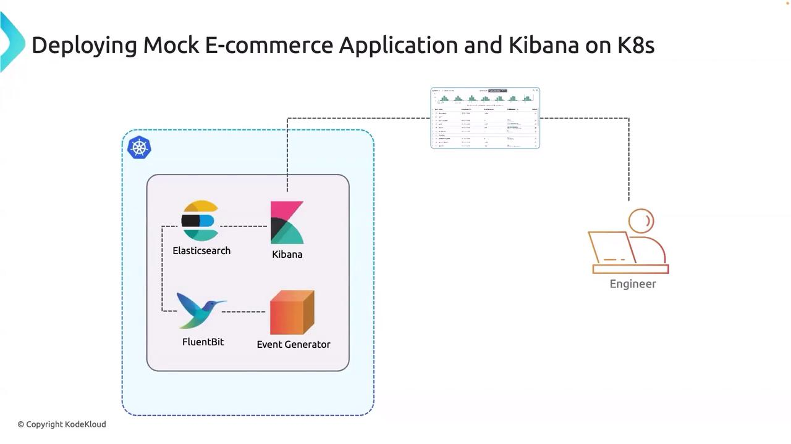

# Deploying Mock E Commerce Application on K8s

Source: https://notes.kodekloud.com/docs/EFK-Stack-Enterprise-Grade-Logging-and-Monitoring/Deploying-E-Commerce-Application-on-K8s/Deploying-Mock-E-Commerce-Application-on-K8s/page

This tutorial covers deploying a mock e-commerce application on Kubernetes and integrating it with an EFK stack for efficient log management.

Welcome to this tutorial on deploying a mock e-commerce application on Kubernetes and integrating it with an EFK (Elasticsearch, Fluent Bit, Kibana) stack for efficient log management.

<Callout icon="lightbulb">
  In this lesson, we'll demonstrate how to deploy an event-generating e-commerce application within a dedicated Kubernetes namespace, configure Fluent Bit for log collection, and visualize those logs using Kibana and Elasticsearch.
</Callout>

## Architecture Overview

Before diving into the implementation, it's important to understand the architecture of our deployment:

* **Kubernetes Cluster Setup:** The deployment occurs within a dedicated namespace where Elasticsearch and Kibana are already installed.
* **Log Management Integration:** Fluent Bit collects logs generated by the mock e-commerce application (event generator) and forwards them to Elasticsearch.
* **Visualization:** Kibana provides a user interface that allows engineers and developers to inspect and analyze the logs.

The diagram below provides a clear illustration of the deployment architecture:

<Frame>
  
</Frame>

## Implementation

In this section, we will walk through the key steps to set up our environment. The following components are involved in the implementation:

* **Deploying the Mock E-Commerce Application:** Launching the event generator within the Kubernetes namespace.
* **Configuring Fluent Bit:** Setting up Fluent Bit to collect and forward logs from the application.
* **Setting Up Elasticsearch:** Configuring Elasticsearch to store the logs received from Fluent Bit.
* **Using Kibana:** Accessing Kibana to visualize and analyze the log data.

These steps ensure that logs from the e-commerce application are efficiently collected, stored, and visualized, making troubleshooting and monitoring significantly easier.

<Callout icon="lightbulb">
  After completing this setup, you will have a robust logging system integrated with your mock e-commerce application. This setup provides critical insights into application behavior, which is essential for maintaining high availability and performance.
</Callout>

That concludes this tutorial. We appreciate your attention, and we look forward to exploring more advanced topics in our next lesson.

Thank you for reading!

<CardGroup>
  <Card title="Watch Video" icon="video" href="https://learn.kodekloud.com/user/courses/efk-stack-enterprise-grade-logging-and-monitoring/module/b1b021b3-26c0-4701-aa90-d98fd3d8dc49/lesson/b4f057f6-cbdf-409b-9b75-04393ea00cc5" />
</CardGroup>
