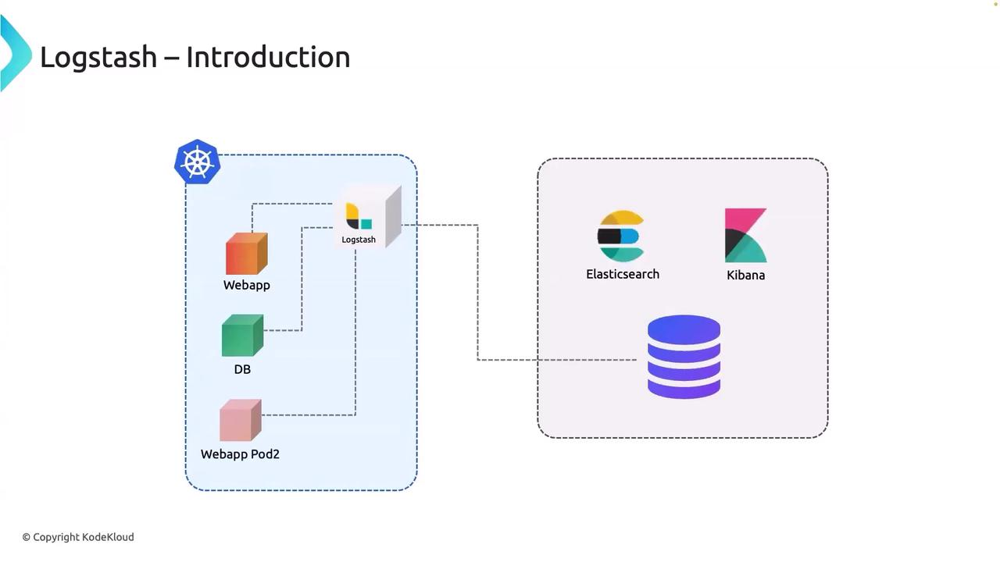
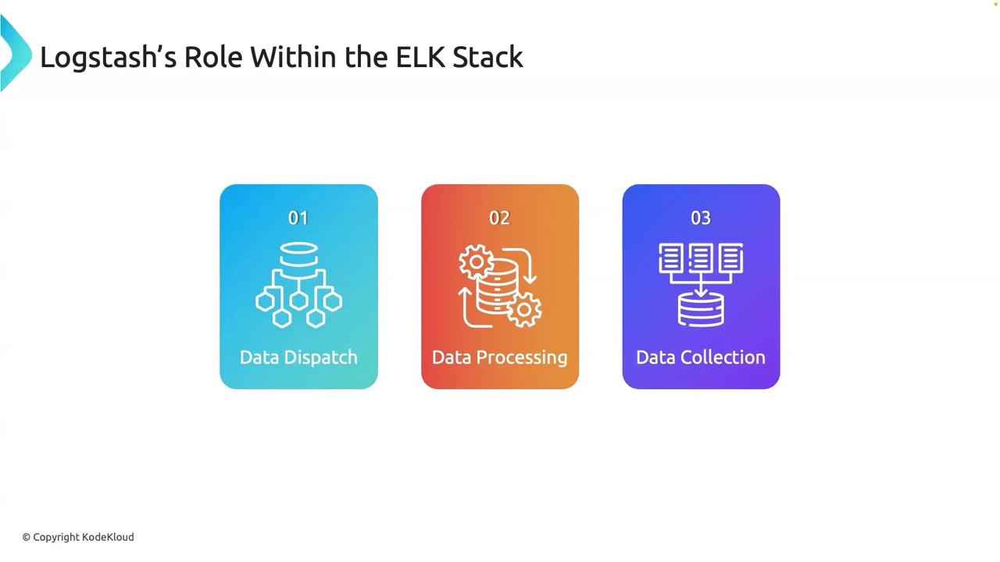

# Logstashs Role within the ELK Stack

Source: https://notes.kodekloud.com/docs/EFK-Stack-Enterprise-Grade-Logging-and-Monitoring/Fluent-Bit/Logstashs-Role-within-the-ELK-Stack/page

This guide explains how log data travels from applications to Elasticsearch using Logstash, focusing on log flow, key functions, and benefits in Kubernetes environments.

Welcome to this detailed guide explaining how log data travels from an application to Elasticsearch using Logstash, all while keeping up with modern technology trends. In this tutorial, we assume that your application is running inside a Kubernetes cluster, and we break down the log flow, key Logstash functions, and the benefits of this approach.

## How Logs Flow from the Application to Elasticsearch

Imagine that your web application generates logs continuously. Instead of burdening the application with the responsibility of sending these logs directly to Elasticsearch—which could hinder its primary function of processing user requests—Logstash steps in as a dedicated log collector and forwarder.

Logstash runs separately as a pod (within the same or a different namespace) and gathers the log data produced by your web app container. Once the logs are aggregated, Logstash sends them to Elasticsearch, regardless of whether Elasticsearch is running in-cluster or hosted on Elastic Cloud.

This architecture is highly scalable and can handle even complex environments. For example, consider a setup where you have:

* A web application running in Kubernetes,
* A database service,
* And various other related service pods.

A single Logstash pod efficiently collects logs from all these components and forwards them to Elasticsearch, thus simplifying log management and ensuring proper routing for analysis.

<Frame>
  
</Frame>

<Callout icon="lightbulb">
  Logstash acts as a log aggregator that alleviates the logging burden from your application, allowing it to focus on serving user requests efficiently.
</Callout>

## Why Use Logstash Instead of Direct Log Shipping?

You might be curious why an application cannot send logs directly to Elasticsearch. While it might appear to be a simpler method, integrating log shipping into your app adds an unnecessary load. By offloading the log collection and processing tasks to Logstash, each component in your architecture remains focused on its primary responsibilities, leading to a more robust and scalable system.

## The Three Key Functions of Logstash

Logstash plays a critical role within the EFK (Elasticsearch, Fluentd/Logstash, Kibana) stack by performing three essential tasks:

1. **Data Dispatch:**\
   Logstash connects to a variety of log sources using a broad spectrum of input plugins. Whether the logs originate from system applications, servers, HTTP sources, Syslogs, or custom applications, Logstash systematically captures them all.

2. **Data Processing:**\
   Once the logs are collected, Logstash routes them through a powerful processing pipeline. Here, filters can be applied to parse, transform, and enrich the log data. This step ensures that unstructured logs are converted into structured data, making them easier to analyze and visualize.

3. **Data Collection:**\
   After processing, Logstash dispatches the logs to their final destination, typically Elasticsearch. Thanks to its diverse output plugins, Logstash can send data to multiple endpoints—including message queues, databases, and various cloud services. In the context of an EFK stack, Elasticsearch indexes the structured data, which can then be searched and visualized using Kibana for actionable insights.

<Frame>
  
</Frame>

<Callout icon="lightbulb">
  Logstash serves as a vital component in managing the log data flow—from collection and processing to final delivery—ensuring that your logs are optimized and ready for deep analysis in Elasticsearch.
</Callout>

## Next Steps: Exploring Logstash vs. Fluent Bit

In a forthcoming discussion, we will compare Logstash with Fluent Bit, another powerful log processing tool, and highlight their key differences and use cases. This comparison will help you determine which tool best fits your logging and data processing requirements.

That concludes this lesson. Thank you for reading, and stay tuned for the next installment in our series on log management within modern architectures.

<CardGroup>
  <Card title="Watch Video" icon="video" href="https://learn.kodekloud.com/user/courses/efk-stack-enterprise-grade-logging-and-monitoring/module/fde8c25d-412a-4b83-95dd-b2a21ea186f3/lesson/0e59faa4-8970-42a9-8a54-d7b019f1ea93" />
</CardGroup>
