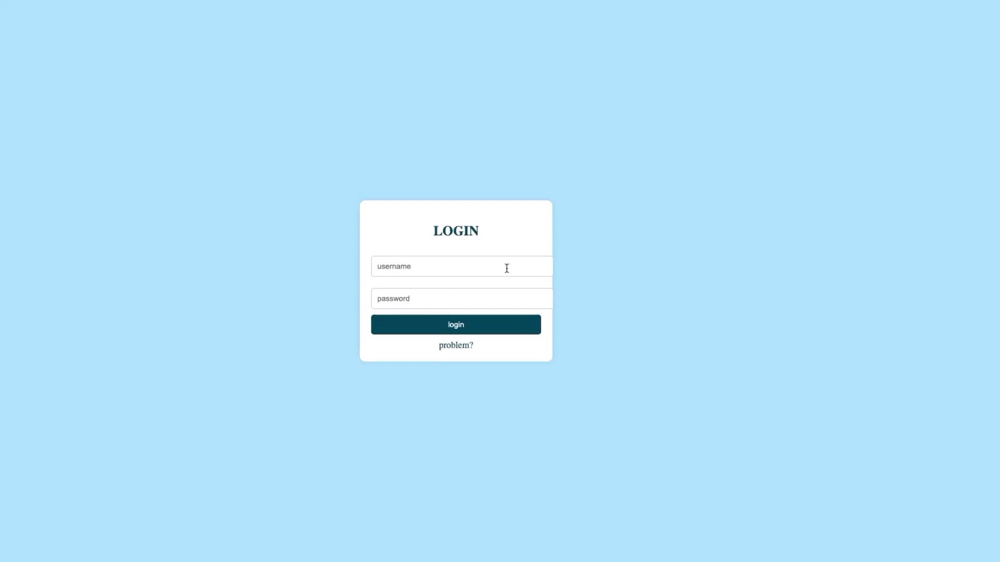
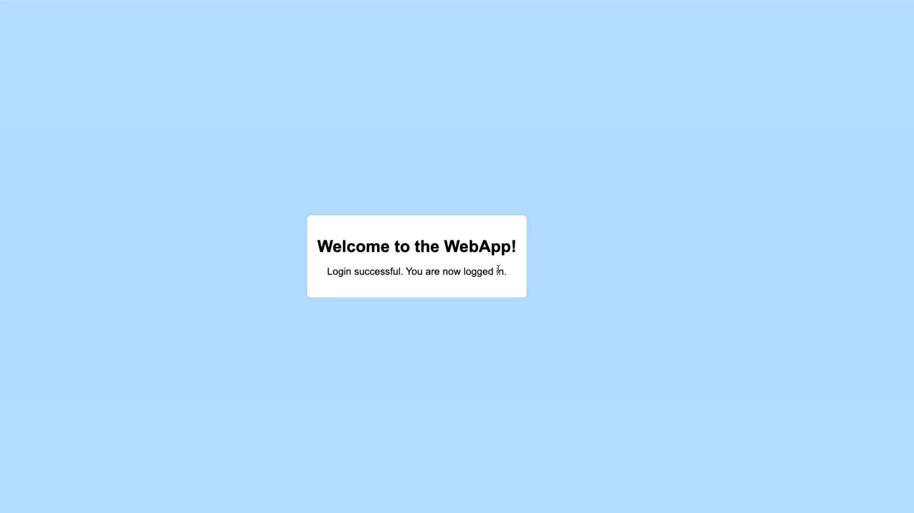
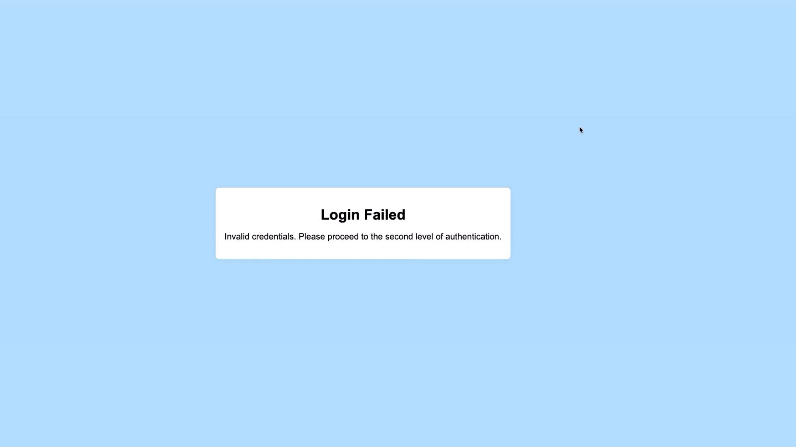

# Deploying and Validating the Login App on Kubernetes

Source: https://notes.kodekloud.com/docs/EFK-Stack-Enterprise-Grade-Logging-and-Monitoring/Instrumenting-a-Simple-Python-App-for-Logging/Deploying-and-Validating-the-Login-App-on-Kubernetes/page

This article provides a guide for deploying and validating the Login App on Kubernetes, including setup, configuration, and testing.

Welcome to this step-by-step guide on deploying and validating the Login App on Kubernetes. In this tutorial, you'll learn how to verify your Elasticsearch and Kibana pods, explore the repository structure, review Kubernetes deployment files, deploy your application, and examine logging and authentication details. Let's dive into the lab!

***

## Verifying Elasticsearch and Kibana Pods

Before deploying the Login App, ensure that your Elasticsearch and Kibana pods are up and running. Execute the following command:

```bash theme={null}
kubectl get pods
```

You should see an output similar to this:

```bash theme={null}
controlplane ~ ➤  kubectl get pods
NAME                                 READY   STATUS      RESTARTS   AGE
elasticsearch-0                      1/1     Running     0          3m57s
kibana-5bf7c766b4-dfpxr              1/1     Running     0          3m57s
controlplane ~ ➤
```

Both services must be active for the Login App deployment to work correctly.

<Callout icon="triangle-alert">
  If either service is not in the Running state, verify your setup and resolve any issues before proceeding.
</Callout>

***

## Cloning the Repository and Exploring the File Structure

First, clone the GitHub repository that contains all the necessary application files:

```bash theme={null}
git clone https://github.com/kodekloudhub/efk-stack.git
```

After cloning, navigate into the repository and list the files and directories:

```bash theme={null}
cd efk-stack/
ls -lrt
```

The directory structure should look similar to this:

```text theme={null}
total 32
drwxr-xr-x 2 root     root    4096 Jul  6 14:17 webapp
-rw-r--r-- 1 root     root    1117 Jul  6 14:17 README.md
drwxr-xr-x 1 root     root    4096 Jul  6 14:17 python-webapp
drwxr-xr-x 2 root     root    4096 Jul  6 14:17 python-simple
drwxr-xr-x 2 root     root    4096 Jul  6 14:17 nginx
drwxr-xr-x 2 root     root    4096 Jul  6 14:17 k8-monitoring
drwxr-xr-x 2 root     root    4096 Jul  6 14:17 event-generator
drwxr-xr-x 2 root     root    4096 Jul  6 14:17 elasticsearch-kibana
```

Focus on the **python-webapp** directory. Change into this directory:

```bash theme={null}
cd python-webapp
ls -lrt
```

The output should list the following files and directories:

```text theme={null}
total 36
drwxr-xr-x 2 root root 4096 Jul  6 14:17 templates
-rw-r--r-- 1 root root  259 Jul  6 14:17 service.yaml
-rw-r--r-- 1 root root  201 Jul  6 14:17 requirements.txt
-rw-r--r-- 1 root root 3035 Jul  6 14:17 README.md
-rw-r--r-- 1 root root  4096 Jul  6 14:17 k8-deployment
-rw-r--r-- 1 root root  201 Jul  6 14:17 Dockerfile
-rw-r--r-- 1 root root  682 Jul  6 14:17 deployment.yaml
-rw-r--r-- 1 root root 1884 Jul  6 14:17 app.py
```

<Callout icon="lightbulb">
  The **templates** directory contains the CSS and HTML files for the Login App. Configuration files such as **service.yaml** and **deployment.yaml** will be applied later, while **requirements.txt** and **app.py** contain the necessary dependencies and application code. The **Dockerfile** is used to build your Docker image, which is available on Docker Hub.
</Callout>

***

## Reviewing Kubernetes Deployment Files

Next, navigate to the Kubernetes deployment folder to review the deployment configuration:

```bash theme={null}
cd k8-deployment
ls -lrt
```

Within this folder, you will find several files, including configurations for Fluent Bit, as well as two critical files for our Python application:

* **python-app-service.yaml**
* **python-app-deployment.yaml**

Let's inspect the contents of **python-app-deployment.yaml**:

```bash theme={null}
ls -lrt
cat python-app-deployment.yaml
```

The file should resemble the following YAML configuration:

```yaml theme={null}
apiVersion: apps/v1
kind: Deployment
metadata:
  name: simple-webapp-deployment
  namespace: efk
  labels:
    app: simple-webapp
spec:
  replicas: 1
  selector:
    matchLabels:
      app: simple-webapp
  template:
    metadata:
      labels:
        app: simple-webapp
    spec:
      containers:
        - name: simple-webapp
          image: learnwithraghu/simple-login-page:v3
          volumeMounts:
            - mountPath: /log
              name: log-volume
      volumes:
        - name: log-volume
          hostPath:
            path: /var/log/webapp
            type: DirectoryOrCreate
```

This YAML defines a Deployment that pulls the Docker image from Docker Hub. The container mounts a volume at **/var/log/webapp**, ensuring that the directory is created if it does not exist already.

The associated service is defined as follows:

```yaml theme={null}
apiVersion: v1
kind: Service
metadata:
  name: simple-webapp-service
  namespace: efk
  labels:
    app: simple-webapp
spec:
  selector:
    app: simple-webapp
  type: NodePort
  ports:
    - port: 5005
      targetPort: 5005
      nodePort: 30001 # NodePort range is 30000-32767
```

This service configuration exposes the application on port 5005 with a NodePort set within the allowed range. Adjust the nodePort value as needed while keeping it between 30000 and 32767.

***

## Deploying the Application

Now that your configurations are in place, deploy the Login App by applying the deployment and service YAML files. Both files use the namespace "efk":

```bash theme={null}
kubectl apply -f python-app-deployment.yaml
kubectl apply -f python-app-service.yaml
```

After applying the configurations, verify that the pod is running:

```bash theme={null}
kubectl get pods
```

Then, check the service to confirm that the NodePort is correctly exposed:

```bash theme={null}
kubectl get svc
```

Open your browser and navigate to the NodePort address to view the Login App interface.

***

## Testing the Login Functionality

On the Login App page, use the following credentials:

1. Enter **admin** as the username.
2. Enter **password** as the password.
3. Click the login button.

A successful login displays a welcome page. For visual guidance, see the following images:

<Frame>
  
</Frame>

Upon successful login, the result should look similar to:

<Frame>
  
</Frame>

If you use any incorrect credentials (for example, a username other than **admin** or an incorrect password), the login will fail:

<Frame>
  
</Frame>

Only the credentials **admin/password** are accepted; all others result in a login failure.

***

## Verifying Application Logs

After interacting with the application, check the logs to monitor activities such as successful logins, weak password warnings, and failed attempts. Retrieve the logs with the following command:

```bash theme={null}
kubectl logs -f <pod-name>
```

The logs might include entries similar to:

```plaintext theme={null}
INFO:werkzeug:10.244.0.0 - [06/Jul/2024 14:22:21] "GET /static/style.css HTTP/1.1" 200 -
INFO:app:Request method: POST
INFO:app:User Agent: Mozilla/5.0 (Macintosh; Intel Mac OS X 10_15_7) ...
INFO:app:Client IP: 10.244.0.0
INFO:app:Response status: 200 OK
...
WARNING:app:Login failed for user: admin
...
```

These logs capture request details, including user agent, client IP, and response statuses. They also record warnings when weak passwords are used or if login attempts fail.

***

## Understanding the Application's Logging Mechanism

A detailed look at the **app.py** file shows how logging is implemented in the Login App. The logging module is configured to capture comprehensive details about each request and response. Key parts of the code include:

```python theme={null}
logging.basicConfig(level=logging.INFO)
logger = logging.getLogger(__name__)
