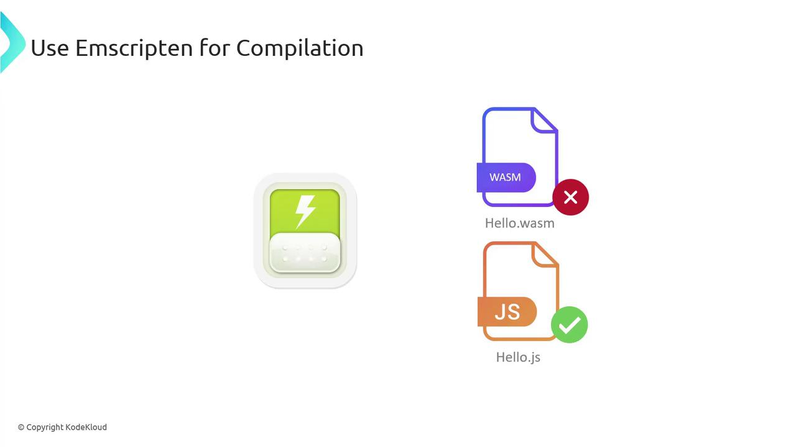
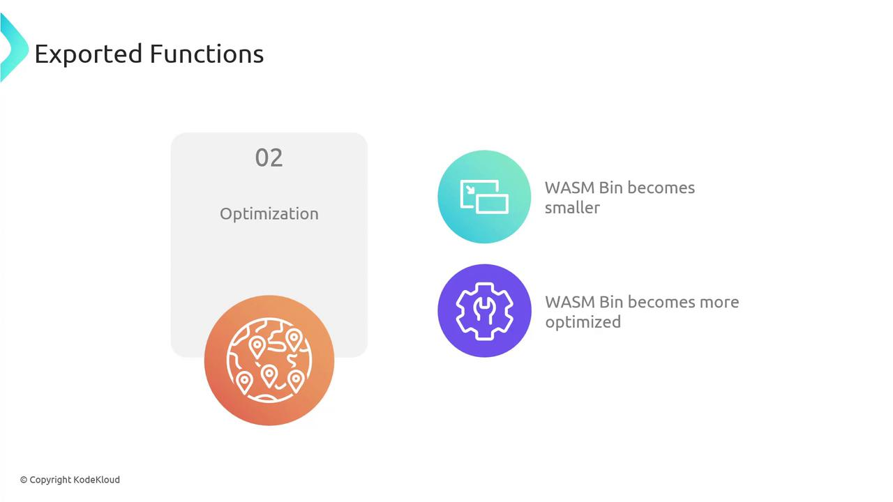
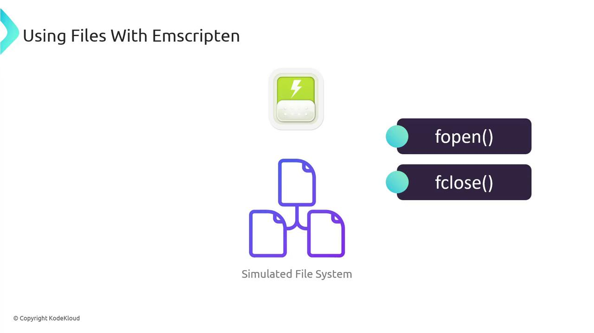
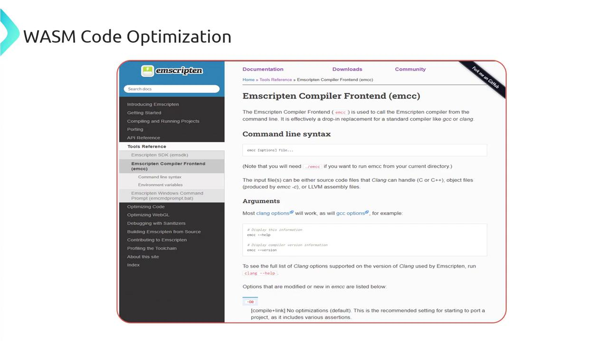
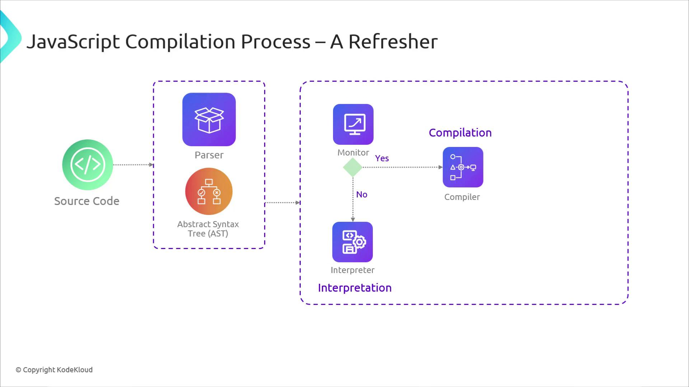
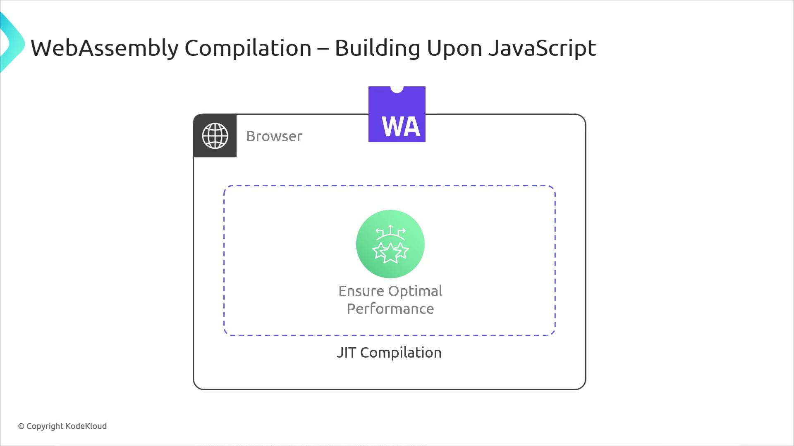
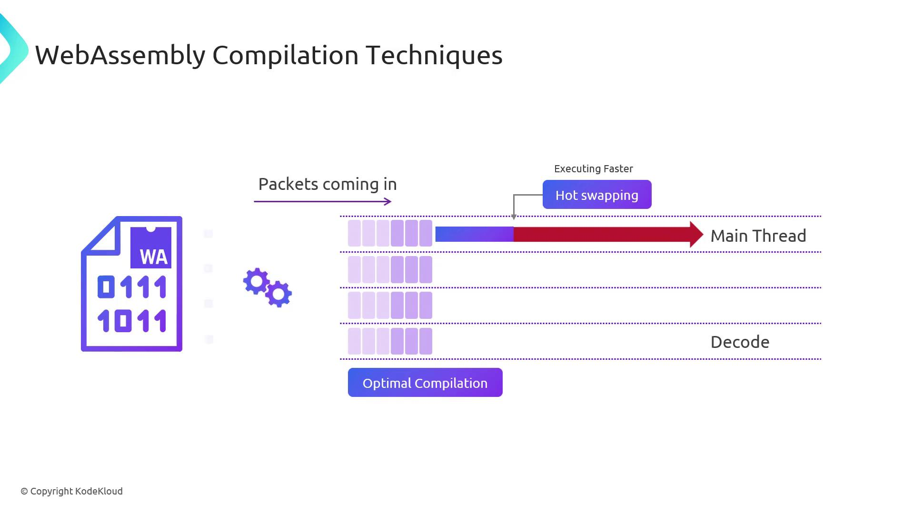
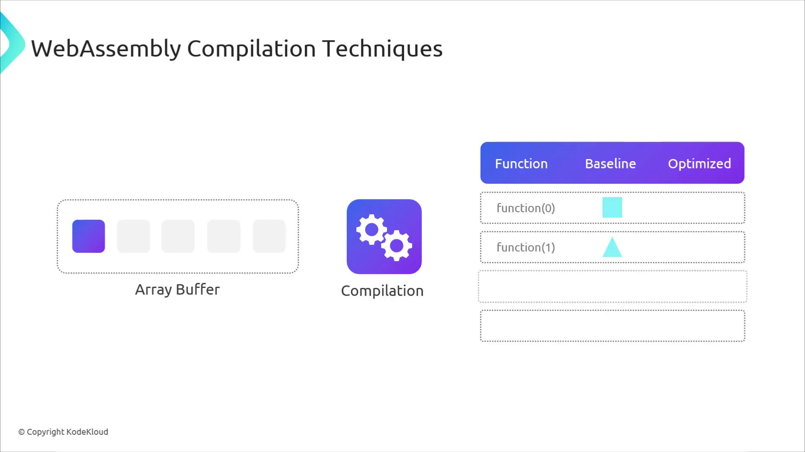
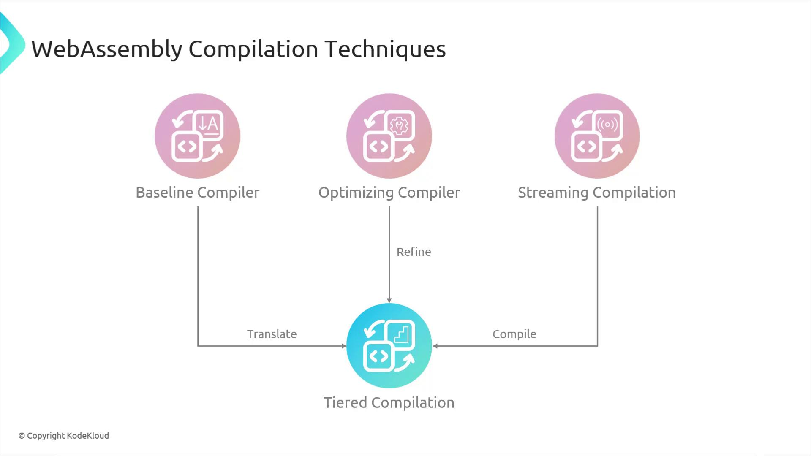

# Compile C/C++ files
emcc [options] file...
# Display help and version
emcc --help
emcc --version
```

By default, `emcc` generates:

* `*.wasm` — WebAssembly binary
* `*.js` — JavaScript loader

***

## Installation Options

Choose the approach that suits your workflow:

| Method        | Description                                        | Quick Start                                                                                |
| ------------- | -------------------------------------------------- | ------------------------------------------------------------------------------------------ |
| Docker        | Run Emscripten without local install               | `docker run --rm -v $(pwd):/src emscripten/emsdk emcc ...`                                 |
| EMSDK (Local) | Full SDK with version management (Linux/Win/macOS) | See [Emscripten SDK Downloads](https://emscripten.org/docs/getting_started/downloads.html) |

```bash theme={null}
# Docker example:
docker run --rm -v $(pwd):/src -u $(id -u):$(id -g) emscripten/emsdk
# Inside container:
emcc helloworld.cpp -o helloworld.js
```

<Callout icon="lightbulb">
  For local development, install the **Emscripten SDK (EMSDK)**. It bundles `emcc`, LLVM, Node.js support, and utility scripts.
</Callout>

***

## Verifying Your Installation

Ensure `emcc` is on your PATH and run:

```bash theme={null}
emcc -v
```

Expected output:

```C++ theme={null}
emcc (Emscripten gcc/clang-like replacement + linker emulating GNU ld) 3.1.45-git
clang version 18.0.0 (...)
Target: wasm32-unknown-emscripten
...
```

If you encounter missing-tool warnings, refer to the [official docs](https://emscripten.org/docs/) for troubleshooting.

***

## Your First WebAssembly Program

1. Create **`hello_world.c`**:

```c theme={null}
#include <stdio.h>
int main() {
    printf("Hello, World!\n");
    return 0;
}
```

2. Compile with Emscripten:

```bash theme={null}
emcc hello_world.c
```

This yields:

* **`a.out.wasm`** — WebAssembly module
* **`a.out.js`** — JS loader

3. Run in Node.js:

```bash theme={null}
node a.out.js
# → Hello, World!
```

### JavaScript Fallback

Force pure JavaScript output for environments without WASM:

<Frame>
  
</Frame>

```bash theme={null}
emcc hello_world.c -s WASM=0
```

***

## Creating an HTML Wrapper

Generate an HTML file that auto-loads your module:

```bash theme={null}
emcc hello_world.c -o hello.html
```

Open **`hello.html`** in a browser (or via a local server) to see “Hello, World!” rendered on the page.

***

## Enforcing Strict Mode

Use `-s STRICT=1` to catch deprecated or unsafe code patterns.

<Callout icon="triangle-alert">
  Strict mode treats deprecated patterns as errors. Ensure your code adheres to modern C/C++ standards.
</Callout>

```cpp theme={null}
// hello.cpp
#include <iostream>
#include <stdlib.h>
int main() {
    char *buffer = (char*)malloc(10); // Deprecated in C++
    if (!buffer) return 1;
    std::cout << "Memory allocated." << std::endl;
    free(buffer);
    return 0;
}
```

```bash theme={null}
emcc hello.cpp -o hello.html -s STRICT=1
```

You may see warnings like:

```text theme={null}
Warning: ‘malloc’ is not recommended in modern C++. Use ‘new’ instead
Warning: inclusion of the C header file <stdlib.h> is deprecated in STRICT mode
```

***

## Exporting Custom Functions

By default, only `main` is exported. Use `-s EXPORTED_FUNCTIONS` to expose additional functions:

<Frame>
  
</Frame>

```c theme={null}
#include <emscripten.h>
EMSCRIPTEN_KEEPALIVE
int multiplyNumbers(int a, int b) {
    return a * b;
}
```

```bash theme={null}
emcc multiplyNumbers.c -o multiplyNumbers.js \
    -s EXPORTED_FUNCTIONS="['_multiplyNumbers']"
```

Now call it in JS:

```js theme={null}
Module._multiplyNumbers(3, 4); // 12
```

***

## Simulated File System

Emscripten provides a virtual file system so your C/C++ code can use standard I/O in the browser:

<Frame>
  
</Frame>

**`test/hello_world_file.cpp`**:

```c theme={null}
#include <stdio.h>
int main() {
    FILE *file = fopen("hello_world_file.txt", "rb");
    if (!file) {
        printf("cannot open file\n");
        return 1;
    }
    int c;
    while ((c = fgetc(file)) != EOF) putchar(c);
    fclose(file);
    return 0;
}
```

Preload data at compile time:

```bash theme={null}
emcc test/hello_world_file.cpp -o hello.html \
    --preload-file test/hello_world_file.txt
```

Serve **`hello.html`** via HTTP to view the file contents in the browser.

***

## Build Optimizations

Fine-tune performance with standard optimization levels:

```bash theme={null}
emcc -O1 hello_world.cpp  # safe transformations
emcc -O2 hello_world.cpp  # balanced speed and size
emcc -O3 hello_world.cpp  # aggressive inlining & loop unrolling
```

* **O1**: removes assertions, minimal size reduction
* **O2**: faster runtime with code replacements
* **O3**: extensive optimizations for release builds

***

## Further Reading & References

* [Emscripten Documentation](https://emscripten.org/docs/)
* [WebAssembly Overview](https://webassembly.org)
* [Clang Official Site](https://clang.llvm.org)
* [LLVM Project](https://llvm.org)
* [Closure Compiler](https://developers.google.com/closure/compiler)

<Frame>
  
</Frame>

<CardGroup>
  <Card title="Watch Video" icon="video" href="https://learn.kodekloud.com/user/courses/exploring-webassembly-wasm/module/2589f119-decc-4dae-b626-5a5841b86220/lesson/7d69379f-6d71-4d4f-88f5-a9c09f749565" />
</CardGroup>


# Introduction to compiling to WASM

Source: https://notes.kodekloud.com/docs/Exploring-WebAssembly-WASM/Compiling-to-WebAssembly/Introduction-to-compiling-to-WASM/page

This article compares JavaScript and WebAssembly compilation methods in the browser, detailing their processes and techniques for performance optimization.

In this lesson, we’ll compare how JavaScript and WebAssembly handle compilation in the browser. We start by revisiting JavaScript’s just-in-time (JIT) approach and then explore WebAssembly’s ahead-of-time (AOT) plus JIT workflow.

## JavaScript Compilation in the Browser

Originally, JavaScript was interpreted line by line. Modern engines have evolved to use JIT compilation for better performance:

1. Browser parses the JS source code.
2. An Abstract Syntax Tree (AST) is generated.
3. Code is translated into machine instructions either immediately (interpretation) or just before execution (JIT).
4. Optimized machine code is cached for faster subsequent runs.

<Frame>
  
</Frame>

## WebAssembly Compilation Overview

WebAssembly adds an AOT phase before the browser sees your code:

* High-level languages (Rust, C, C++) compile to the WASM binary format offline.
* The binary contains compact, low-level instructions that are quick to parse.
* Upon loading, the browser’s JIT further translates WASM into optimized, device-specific machine code.

<Frame>
  
</Frame>

## Key WebAssembly Compilation Techniques

Building on JavaScript’s foundation, WebAssembly employs multiple tiers of compilation:

1. **Baseline Compiler**\
   Quickly translates WASM binaries into a basic form of machine code, ensuring the application starts running with minimal delay.

2. **Optimizing Compiler**\
   Runs alongside the baseline compiler to identify hotspots and refine machine code, improving performance for long-running tasks.

3. **Streaming Compilation**\
   Begins converting chunks of the WASM binary as they arrive over the network, so most of the code is ready by the time the download finishes.

<Callout icon="lightbulb">
  Streaming compilation can significantly reduce startup latency, especially for large modules.
</Callout>

<Frame>
  
</Frame>

<Frame>
  
</Frame>

4. **Tiered Compilation**\
   Combines baseline and optimizing compilers: code starts on the baseline path and “tiers up” to the optimized version once it’s ready, all while streaming compilation continues to feed new segments.

<Callout icon="triangle-alert">
  Tiered compilation may increase memory usage as multiple compiler tiers run in parallel.
</Callout>

<Frame>
  
</Frame>

### Comparison of WASM Compilation Techniques

| Technique             | Purpose                       | Benefit                                     |
| --------------------- | ----------------------------- | ------------------------------------------- |
| Baseline Compiler     | Fast initial machine code gen | Quick startup                               |
| Optimizing Compiler   | Refine code for performance   | Enhanced long-term execution                |
| Streaming Compilation | Compile during download       | Reduced load time                           |
| Tiered Compilation    | Combine baseline & optimized  | Balanced startup latency & peak performance |

***

In our next lesson, we’ll explore popular WASM compilers—examining their features, trade-offs, and how they fit into the broader WebAssembly ecosystem.

## Links and References

* [WebAssembly Documentation](https://webassembly.org/docs/)
* [Mozilla: WebAssembly Guide](https://developer.mozilla.org/en-US/docs/WebAssembly)
* [WebAssembly GitHub Repository](https://github.com/WebAssembly)

<CardGroup>
  <Card title="Watch Video" icon="video" href="https://learn.kodekloud.com/user/courses/exploring-webassembly-wasm/module/2589f119-decc-4dae-b626-5a5841b86220/lesson/7bb42dc6-cb43-49fe-984c-808db017ccc2" />
</CardGroup>
