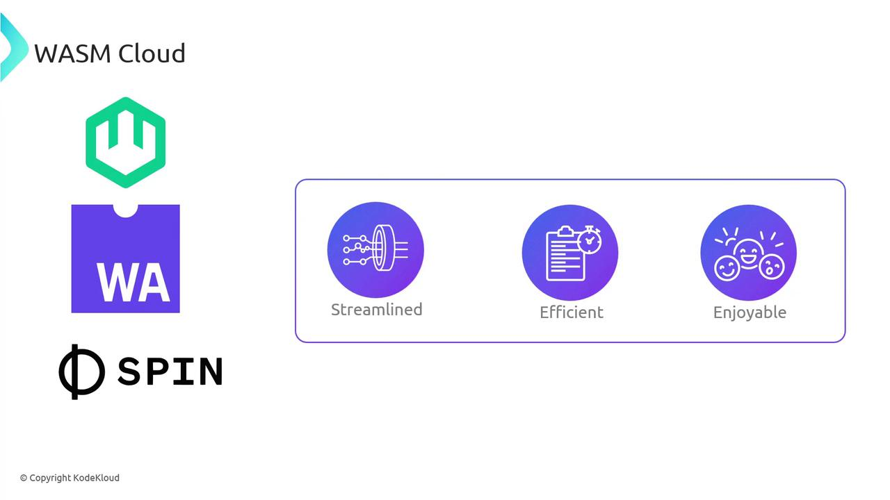
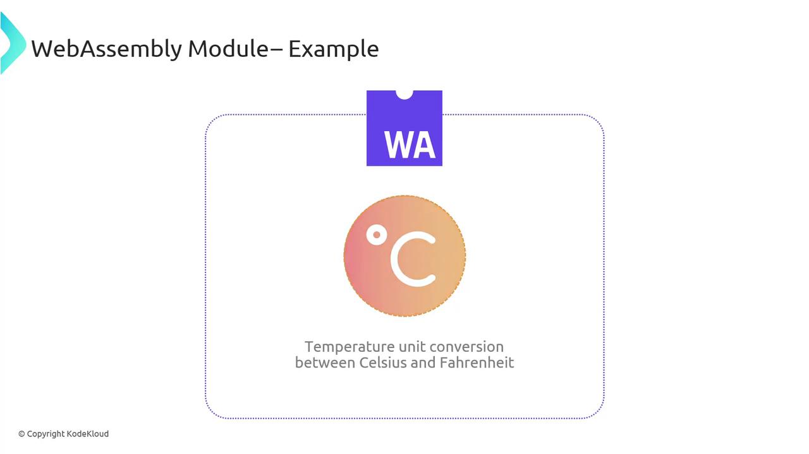
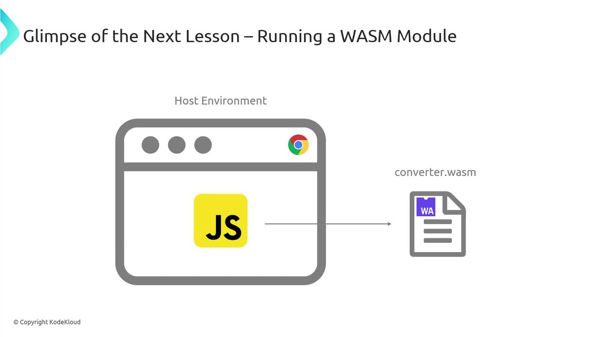

# Install Spin
curl https://spin.fermyon.dev/install.sh | bash

# Scaffold a new Spin application
spin new hello-spin

# Build and run locally
cd hello-spin
spin build
spin up
```

### WasmCloud

WasmCloud is a runtime and toolkit for distributed computing that runs anywhere—cloud, edge, IoT, or browser. It offers:

* **Enterprise-grade service discovery** and load balancing
* **Secure inter-service messaging** out of the box
* **Actor-model abstraction** reduces boilerplate

<Frame>
  
</Frame>

Start with WasmCloud in minutes:

```bash theme={null}
# Install wasmcloud host
curl https://wasmcloud.dev/install.sh | bash

# Launch a host
wasmcloud host start

# Deploy an actor (WASM module)
wash ctl start actor --image my-actor.wasm
```

***

## Conclusion

By adopting **Fermyon Spin** or **WasmCloud**, you eliminate manual service discovery, standardized messaging, robust security, and excessive boilerplate. These frameworks let you focus on core business logic while ensuring your WebAssembly microservices are scalable, secure, and maintainable.

## Links and References

* [Fermyon Spin Documentation](https://developer.fermyon.com/spin/)
* [WasmCloud Official Site](https://wasmcloud.dev/)
* [WebAssembly Official Website](https://webassembly.org/)

<CardGroup>
  <Card title="Watch Video" icon="video" href="https://learn.kodekloud.com/user/courses/exploring-webassembly-wasm/module/a9d35579-0f55-465c-8d70-eec38ff7c750/lesson/6bf8c896-33b5-4694-b4e8-cfbb7af15089" />
</CardGroup>


# Creating a simple WebAssembly Module

Source: https://notes.kodekloud.com/docs/Exploring-WebAssembly-WASM/Getting-Started-with-WebAssembly/Creating-a-simple-WebAssembly-Module/page

This guide teaches how to build a WebAssembly module for converting temperatures from Celsius to Fahrenheit using C and JavaScript.

In this guide, you’ll learn how to build a WebAssembly (WASM) module that converts temperatures from Celsius to Fahrenheit. We’ll cover:

1. Writing the C conversion function
2. Compiling to a `.wasm` binary with Emscripten
3. Loading and invoking the module from JavaScript

By the end, you’ll understand the end-to-end workflow of compiling native code into WebAssembly and integrating it into a web page.

<Callout icon="lightbulb">
  Make sure you have the [Emscripten SDK][emscripten-docs] installed and configured on your system. A basic understanding of C and JavaScript is assumed.
</Callout>

## 1. Defining the Celsius→Fahrenheit Function

Create a file named `converter.c` with the following implementation:

```c theme={null}
// converter.c
double Celsius_to_Fahrenheit(double celsius) {
    return (celsius * 9.0 / 5.0) + 32.0;
}
```

This function applies the standard formula: multiply by 9/5, then add 32.

<Frame>
  
</Frame>

## 2. Compiling to WebAssembly with Emscripten

Use the `emcc` compiler driver to produce a `.wasm` binary:

```bash theme={null}
emcc -O3 -s WASM=1 -o converter.wasm converter.c
```

| Flag        | Purpose                                                         | Example                    |
| ----------- | --------------------------------------------------------------- | -------------------------- |
| `-O3`       | Aggressive optimizations for speed and size                     | `-O0`, `-O1`, `-O2`, `-O3` |
| `-s WASM=1` | Enables WebAssembly output (avoids emitting JavaScript wrapper) |                            |
| `-o`        | Sets the output filename                                        | `-o converter.wasm`        |
| source file | Your C source code                                              | `converter.c`              |

<Callout icon="lightbulb">
  You can experiment with `-O0` (no optimizations) for faster builds during development.
</Callout>

After compilation, `converter.wasm` will export the `Celsius_to_Fahrenheit` function for JavaScript to consume.

## 3. Loading and Running the WASM Module in JavaScript

To invoke your WASM module from the browser, follow these steps:

```js theme={null}
// script.js
async function runConverter() {
  // 1. Fetch the WASM file
  const response = await fetch('converter.wasm');
  const bytes = await response.arrayBuffer();

  // 2. Instantiate the WebAssembly module
  const { instance } = await WebAssembly.instantiate(bytes);

  // 3. Call the exported function
  const celsius = 30;
  const fahrenheit = instance.exports.Celsius_to_Fahrenheit(celsius);
  console.log(`${celsius}°C → ${fahrenheit}°F`);
}

runConverter().catch(console.error);
```

<Frame>
  
</Frame>

<Callout icon="triangle-alert">
  Some older browsers may not support streaming compilation or certain WASM features. Test on the latest versions of Chrome, Firefox, or Edge.
</Callout>

### How It Works

1. **Fetch**: Retrieve `converter.wasm` via the `fetch` API.
2. **Instantiate**: Convert the response into an `ArrayBuffer` and pass it to `WebAssembly.instantiate`.
3. **Execute**: Call `instance.exports.Celsius_to_Fahrenheit` with a numeric argument.

This pattern lets you integrate high-performance, statically-typed code into your web applications.

## Links and References

* [Emscripten Documentation][emscripten-docs]
* [MDN WebAssembly Overview][mdn-wasm]
* [WebAssembly Specification][wasm-spec]

[emscripten-docs]: https://emscripten.org/docs/introducing_emscripten/about_emscripten.html

[mdn-wasm]: https://developer.mozilla.org/docs/WebAssembly

[wasm-spec]: https://www.w3.org/TR/wasm-core-1/

<CardGroup>
  <Card title="Watch Video" icon="video" href="https://learn.kodekloud.com/user/courses/exploring-webassembly-wasm/module/35f32a4b-b0a4-45ba-a4a8-827feffc5940/lesson/f3b62365-10f2-42bf-a971-f46987757322" />
</CardGroup>
