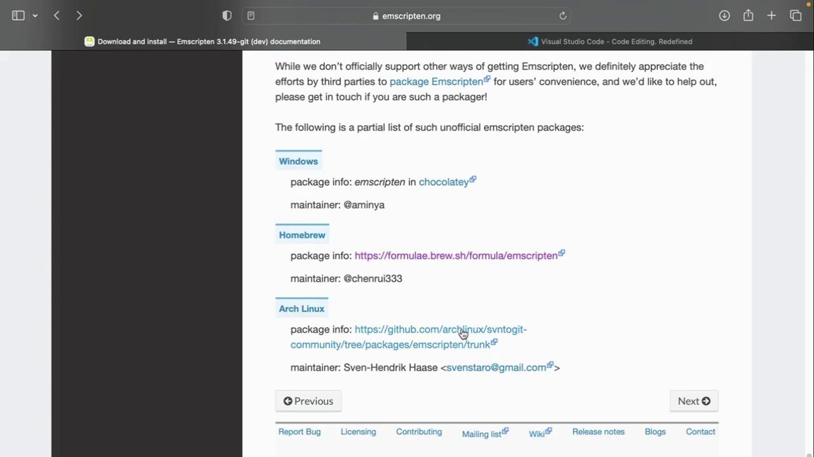
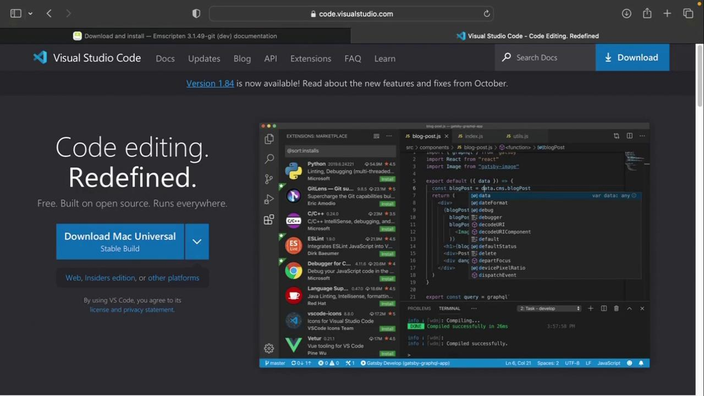
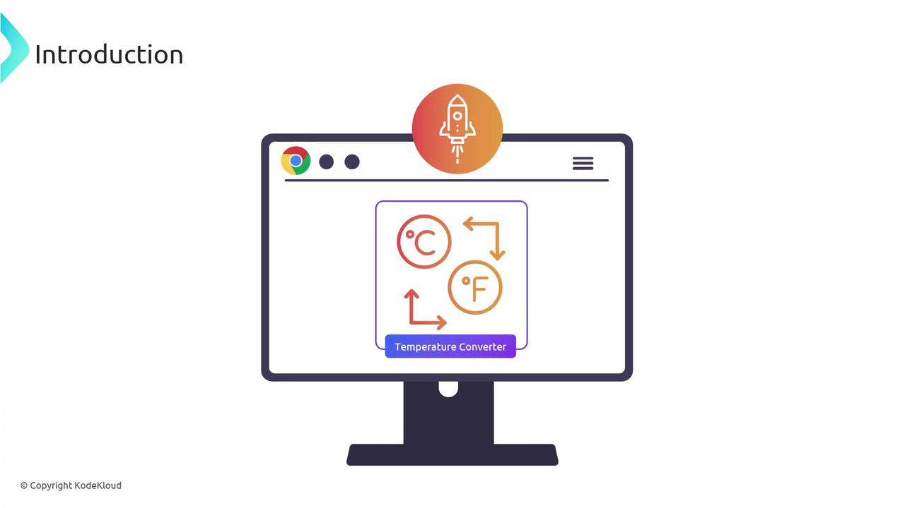
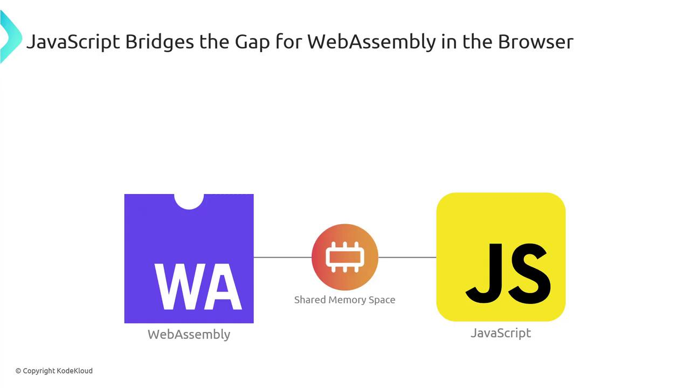
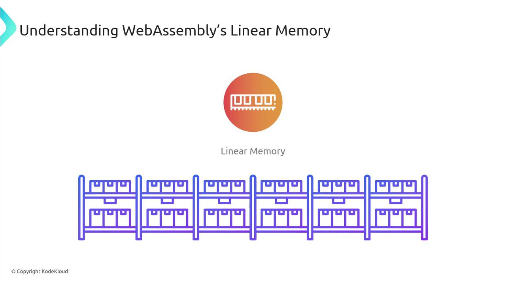
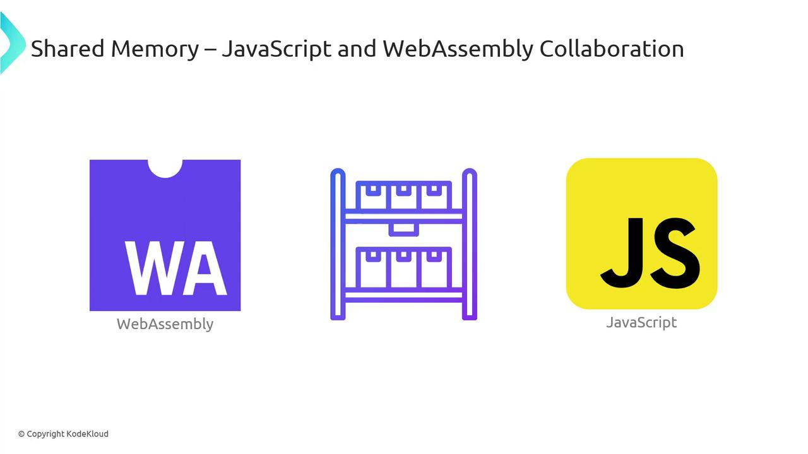
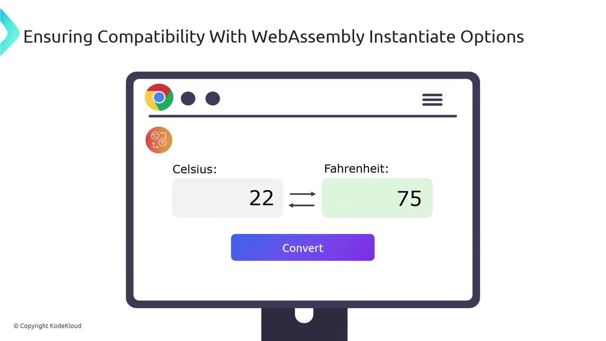
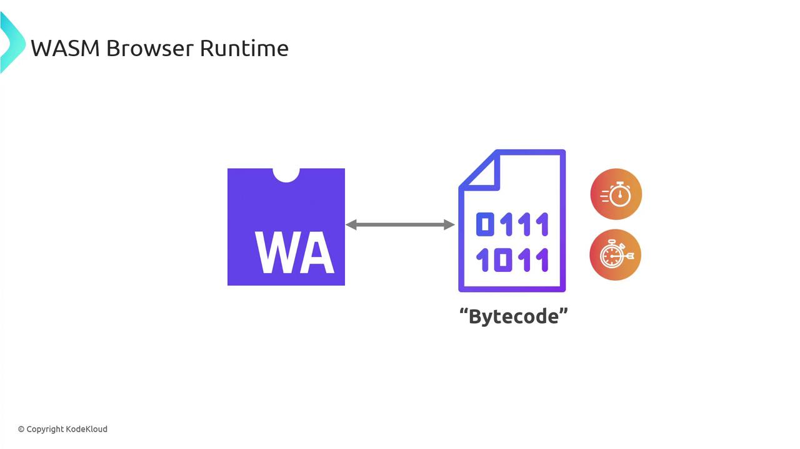
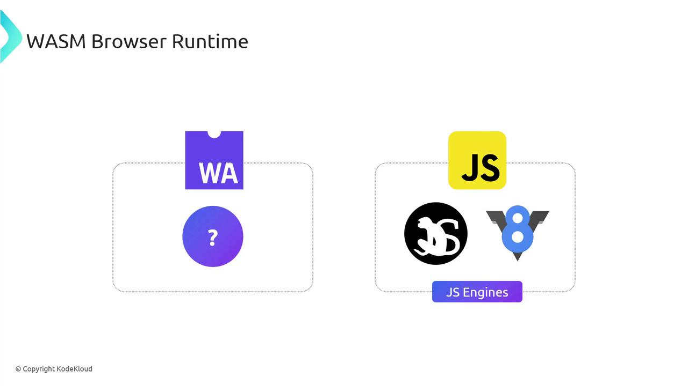
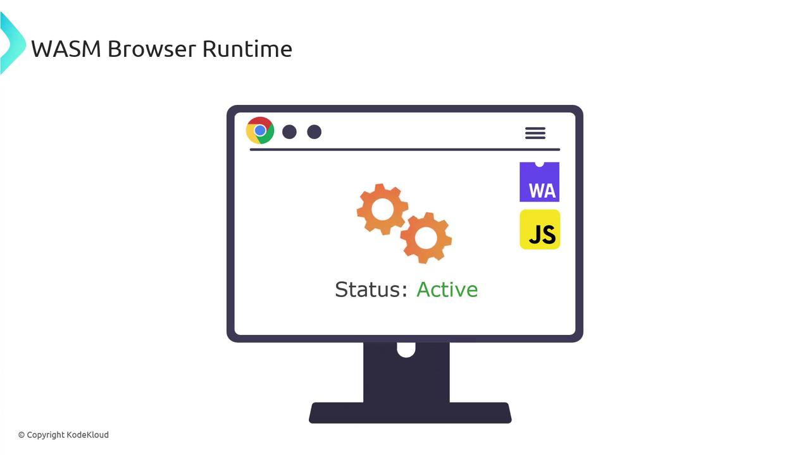

# 1. Clone the emsdk repository
git clone https://github.com/emscripten-core/emsdk.git

# 2. Change into the cloned directory
cd emsdk

# 3. (Optional) Update to the latest version if you cloned previously
git pull
```

<Callout icon="lightbulb">
  After cloning, install and activate the latest SDK release, then configure your shell environment:

  ```bash theme={null}
  ./emsdk install latest
  ./emsdk activate latest
  source ./emsdk_env.sh
  ```

  This step ensures you have the required compiler, linker, and runtime env set up.
</Callout>

## 2. Install Emscripten via Package Manager

Emscripten is also available through popular package managers:

| Platform | Package Manager | Install Command                                                                   |
| -------- | --------------- | --------------------------------------------------------------------------------- |
| Windows  | Chocolatey      | `choco install emscripten`                                                        |
| macOS    | Homebrew        | `brew install emscripten`                                                         |
| Linux    | Official Guide  | See [Linux downloads](https://emscripten.org/docs/getting_started/downloads.html) |

<Frame>
  
</Frame>

## 3. Verify Your Installation

After installation, confirm the Emscripten compiler is accessible:

```bash theme={null}
emcc --version
```

Expected output:

```text theme={null}
emcc (Emscripten gcc/clang-like replacement + linker emulating GNU ld) 3.1.48-git
Copyright (C) 2014 the Emscripten authors (see AUTHORS.txt)
This is free and open source software under the MIT license.
There is NO warranty; not even for MERCHANTABILITY or FITNESS FOR A PARTICULAR PURPOSE.
```

## 4. Choose Your Code Editor

We recommend using [Visual Studio Code](https://code.visualstudio.com/) for WebAssembly development:

<Frame>
  
</Frame>

1. Download and install VS Code.
2. Add extensions like “ESLint,” “Prettier,” and “WebAssembly Toolkit” for syntax support.

## 5. Create Your WASM Project Folder

Organize your demos and examples in a dedicated directory:

```bash theme={null}
mkdir WASM
cd WASM
```

Inside `WASM`, you can start adding C/C++, Rust, or AssemblyScript source files to compile into `.wasm`.

***

## Next Steps

Now that your environment is ready, the next lesson will cover writing and compiling a simple C program to WebAssembly. Stay tuned!

## References

* [Emscripten Documentation](https://emscripten.org/docs/getting_started/index.html)
* [WebAssembly Main Site](https://webassembly.org/)
* [Visual Studio Code](https://code.visualstudio.com/)

<CardGroup>
  <Card title="Watch Video" icon="video" href="https://learn.kodekloud.com/user/courses/exploring-webassembly-wasm/module/35f32a4b-b0a4-45ba-a4a8-827feffc5940/lesson/d1bcfbb7-2122-463c-90da-9d90cacb9c0f" />
</CardGroup>


# Running WebAssembly in the Browser

Source: https://notes.kodekloud.com/docs/Exploring-WebAssembly-WASM/Getting-Started-with-WebAssembly/Running-WebAssembly-in-the-Browser/page

This article explains how to run WebAssembly in the browser using JavaScript, covering instantiation, memory sharing, and a simple HTML example.

After compiling our temperature-converter to a WebAssembly module, you can load and execute it directly in the browser using JavaScript as a bridge. In this guide, we’ll cover:

* Fetching and instantiating a `.wasm` module
* Sharing memory between JavaScript and WebAssembly
* Building a minimal HTML example
* Understanding how browsers run WebAssembly

<Frame>
  
</Frame>

## 1. Loading and Instantiating WASM with JavaScript

The easiest way to download and compile a `.wasm` module in one step is with `WebAssembly.instantiateStreaming`. Modern browsers support this API, but if you need to support older environments, a two-step fallback is required.

| Approach                         | Browser Support | Behavior                                   |
| -------------------------------- | --------------- | ------------------------------------------ |
| `instantiateStreaming`           | Modern browsers | Streams fetch → compile → instantiate      |
| `fetch` → `instantiate` fallback | Legacy browsers | Downloads binary → compiles → instantiates |

<Callout icon="triangle-alert">
  Your server must serve `.wasm` files with `application/wasm`. Otherwise, streaming instantiation will fail.
</Callout>

### Streaming Instantiation

```javascript theme={null}
const importObject = {};

WebAssembly.instantiateStreaming(
  fetch('converter.wasm'),
  importObject
).then(({ instance }) => {
  const result = instance.exports.celsius_to_fahrenheit(25);
  console.log(`25°C is ${result}°F`);
}).catch(err => {
  console.error('WASM streaming failed:', err);
});
```

### Fallback for Older Browsers

```javascript theme={null}
fetch('converter.wasm')
  .then(resp => resp.arrayBuffer())
  .then(buffer =>
    WebAssembly.instantiate(buffer, importObject)
  )
  .then(({ instance }) => {
    const result = instance.exports.celsius_to_fahrenheit(25);
    console.log(`25°C is ${result}°F`);
  })
  .catch(err => {
    console.error('WASM instantiation failed:', err);
  });
```

Both methods produce an `instance` whose `exports` object contains your converter function.

## 2. JavaScript ↔ WebAssembly Memory Sharing

JavaScript and WebAssembly exchange data through **linear memory**—a shared `ArrayBuffer` where both sides can read and write.

<Frame>
  
</Frame>

WebAssembly’s linear memory is simply a contiguous array of bytes:

<Frame>
  
</Frame>

When JavaScript needs to pass a value (like the number 25) to WebAssembly:

1. JS writes the value into the shared buffer.
2. WASM reads it, performs the conversion, and writes the result back.
3. JS reads the converted value (e.g., 77) from the same buffer.

<Frame>
  
</Frame>

<Callout icon="lightbulb">
  By default, linear memory grows in 64 KB pages. You can configure initial and maximum sizes in your toolchain.
</Callout>

## 3. A Simple HTML Example

Combine everything into a minimal web page:

```html theme={null}
<!DOCTYPE html>
<html lang="en">
<head>
  <meta charset="UTF-8">
  <title>Temperature Converter</title>
</head>
<body>
  <label>
    Enter Celsius:
    <input id="celsiusInput" type="number" />
  </label>
  <button onclick="convert()">Convert</button>
  <div id="output"></div>

  <script src="script.js"></script>
</body>
</html>
```

In **script.js**, handle both instantiation paths and wire up the `convert()` function:

```javascript theme={null}
const importObject = {};
let wasmInstance = null;

// Try streaming instantiation
WebAssembly.instantiateStreaming(fetch('converter.wasm'), importObject)
  .then(({ instance }) => {
    wasmInstance = instance;
  })
  .catch(() => {
    // Fallback
    return fetch('converter.wasm')
      .then(res => res.arrayBuffer())
      .then(buffer => WebAssembly.instantiate(buffer, importObject))
      .then(({ instance }) => {
        wasmInstance = instance;
      });
  });

function convert() {
  const c = parseFloat(
    document.getElementById('celsiusInput').value
  );
  const f = wasmInstance.exports.celsius_to_fahrenheit(c);
  document.getElementById('output').innerText =
    `That's ${f.toFixed(2)}°F!`;
}
```

Open the page in your browser, input a Celsius value, and click **Convert**—the result comes straight from WebAssembly.

<Frame>
  
</Frame>

## 4. How Browsers Run WebAssembly

Browsers like Chrome (V8), Firefox (SpiderMonkey), Safari, and Edge integrate WebAssembly support directly into their JavaScript engines. They treat `.wasm` as bytecode, decoding and compiling it alongside JS.

When a `.wasm` module loads, the engine:

1. Parses the binary format.
2. Compiles it to native machine code.
3. Links it with the JS context (including linear memory).

<Frame>
  
</Frame>

This approach allows WebAssembly to leverage the same JIT optimizations, garbage collection, and security sandbox as JavaScript.

| Engine  | JavaScript Engine | WebAssembly Engine |
| ------- | ----------------- | ------------------ |
| Chrome  | V8                | Integrated WAsm    |
| Firefox | SpiderMonkey      | Integrated WAsm    |
| Safari  | JavaScriptCore    | Integrated WAsm    |
| Edge    | Chakra/Sparta     | Integrated WAsm    |

<Frame>
  
</Frame>

<Frame>
  
</Frame>

By understanding these internals, you can harness WebAssembly to accelerate compute-intensive tasks and integrate seamlessly with your existing JavaScript code.

## Links and References

* [MDN WebAssembly Guide](https://developer.mozilla.org/en-US/docs/WebAssembly)
* [MDN Fetch API](https://developer.mozilla.org/en-US/docs/Web/API/Fetch_API)
* [Can I use `instantiateStreaming`](https://caniuse.com/?search=instantiateStreaming)

<CardGroup>
  <Card title="Watch Video" icon="video" href="https://learn.kodekloud.com/user/courses/exploring-webassembly-wasm/module/35f32a4b-b0a4-45ba-a4a8-827feffc5940/lesson/d5c1a04f-eb81-4fb7-9528-5e1a168c61bc" />
</CardGroup>
