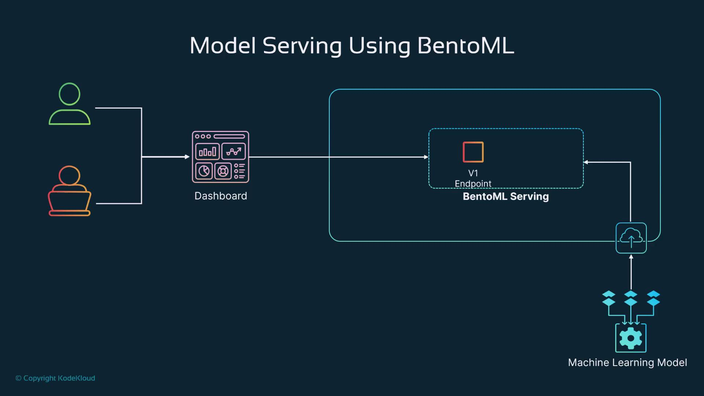

# Demo Model Serving using BentoML

Source: https://notes.kodekloud.com/docs/Fundamentals-of-MLOps/Model-Deployment-and-Serving/Demo-Model-Serving-using-BentoML/page

This article provides a guide on serving machine learning models using the BentoML platform, including deployment and API creation for a house price prediction model.

Welcome to this comprehensive guide on serving machine learning (ML) models with the BentoML platform. In this tutorial, we explain how to deploy a house price prediction model using synthetic data and serve it through a RESTful API. We will cover the complete workflow: environment setup, model training, saving the model to the BentoML repository, creating API endpoints to serve the model, and upgrading the model with additional features.

## Architecture Overview

Our solution architecture is designed for seamless interaction between users, microservices, and the ML model. Users interact through a dashboard, and requests are sent to an API endpoint to perform predictions. This endpoint, hosted on platforms like AWS, GCP, Azure, or an on-premises server, then communicates with the BentoML service that serves the ML model stored in an artifact registry (e.g., MLflow or the BentoML repository).

<Frame>
  
</Frame>

<Callout icon="lightbulb">
  This diagram outlines the flow from the user interface to the deployed ML model, emphasizing the role of microservices and API endpoints.
</Callout>

***

## Setting Up the Environment

Begin by creating a virtual environment to manage your project dependencies. In your working directory, run the following command:

```bash theme={null}
python3 -m venv bento-ml-env
```

Activate your virtual environment and install the necessary packages, including BentoML, scikit-learn, and pandas. During the process, you might see terminal output similar to the example below:

```bash theme={null}
@learnwithraghu ~ /workspaces/mlops-demo (main) $ git clone https://github.com/codekloudhub/Fundamentals-of-LLMops.git
Cloning into 'Fundamentals-of-LLMops'...
remote: Enumerating objects: 89, done.
remote: Counting objects: 100% (89/89), done.
remote: Compressing objects: 100% (67/67), done.
remote: Total 89 (delta 22), reused 76 (delta 14), pack-reused 0 (from 0)
Resolving deltas: 100% (22/22), done.
@learnwithraghu ~ /workspaces/mlops-demo (main) $ python3 -m venv bentonl-env
```

Once the dependencies are installed, you're ready to build, train, and save your ML model using BentoML.

***

## Training and Saving the V1 Model

In this section, we build a basic linear regression model for predicting house prices using synthetic data. The following code demonstrates how to generate the data, split it into training and testing sets, and configure it for training:

```python theme={null}
import pandas as pd
from sklearn.linear_model import LinearRegression
from sklearn.model_selection import train_test_split
import bentoml
