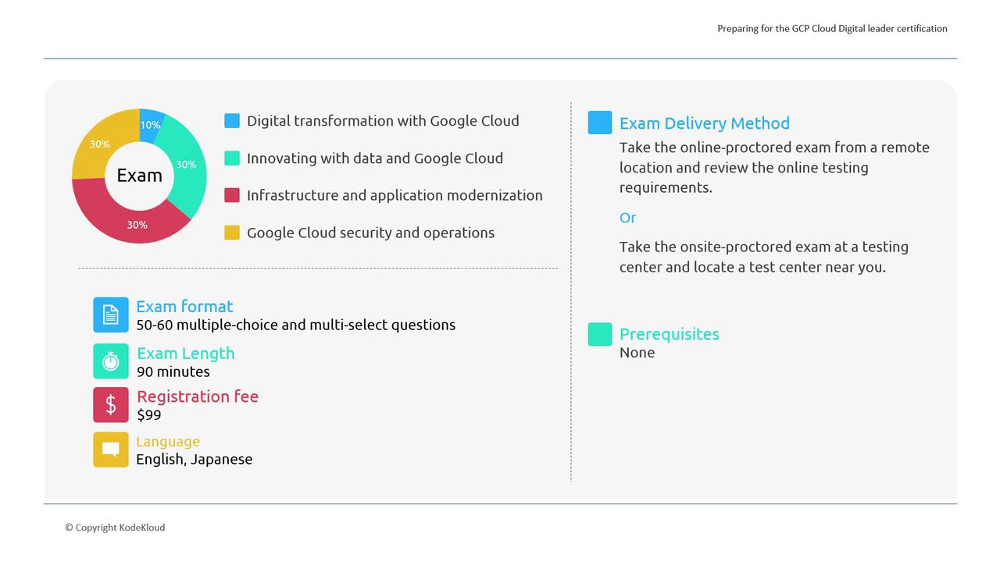

# Exam Overview

Source: https://notes.kodekloud.com/docs/GCP-Cloud-Digital-Leader-Certification/GCP-Cloud-Digital-Leader-Certification/Exam-Overview/page

This lesson helps you prepare for the Google Cloud certification exam by exploring key details, format, and logistics.

Welcome to this lesson on preparing for your certification exam with Google Cloud. In this lesson, we’ll explore key exam details, including the scope, format, and logistics, to help you confidently approach the test.

## Certification Focus Areas

The exam evaluates your expertise in four essential areas:

1. **Digital Transformation with Google Cloud**
2. **Innovating with Data and Google Cloud**
3. **Infrastructure and Application Modernization**
4. **Google Cloud Security and Operations**

We have previously covered the services and concepts related to each of these domains in detail.

## Exam Format and Details

The exam consists of approximately 50 to 60 multiple-choice questions. Here are the specifics you should know:

* **Question Formats:**\
  • Some questions require selecting the one correct answer.\
  • Others may have multiple correct answers.

* **Duration:** 90 minutes

* **Fee:** 99 US dollars

* **Languages Available:** English and Japanese

* **Exam Delivery:** Online – you can register and take the exam from the comfort of your home or office.

* **Prerequisites:** There are no prerequisites for this certification.

<Callout icon="lightbulb">
  If you have thoroughly reviewed the study materials, completed all quizzes, and practiced in the lab sessions, you will be well-prepared to pass the certification exam.
</Callout>

## Certification Exam Infographic

<Frame>
  
</Frame>

## Conclusion

This overview summarizes the key aspects of the certification exam. Thank you for following along, and we look forward to guiding you in the next lesson. For further details, check out [Google Cloud Certification](https://cloud.google.com/certification).

<CardGroup>
  <Card title="Watch Video" icon="video" href="https://learn.kodekloud.com/user/courses/gcp-cloud-digital-leader-certification/module/53abf496-66fe-496e-b513-77bdcfa11176/lesson/9e4116ff-2f6b-42fa-9673-9b43d0455f07" />
</CardGroup>
