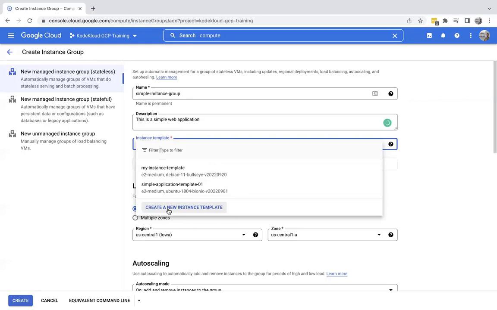
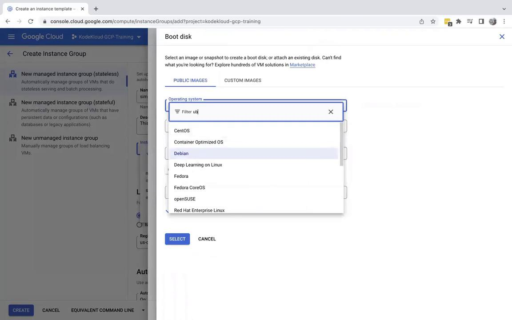
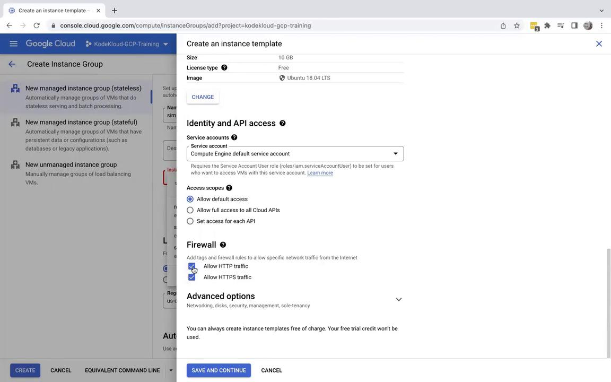
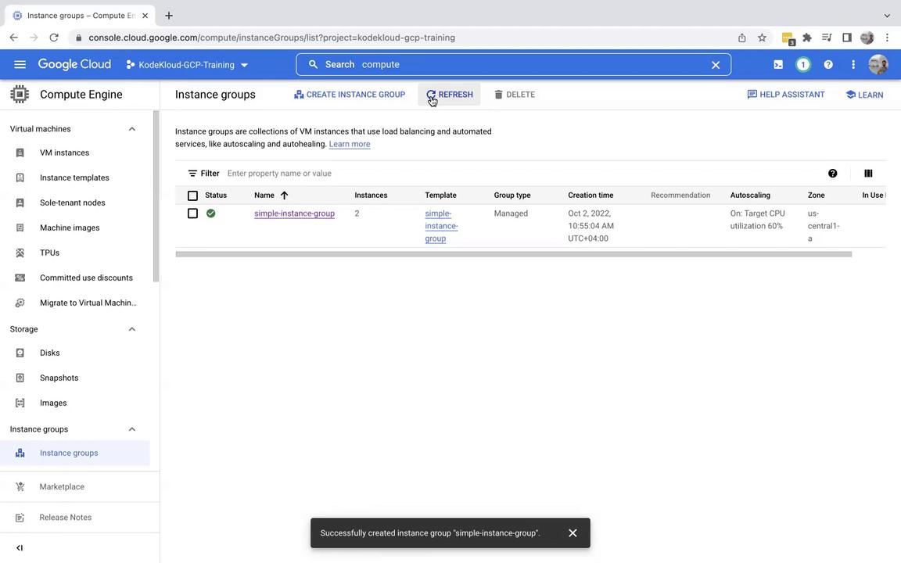
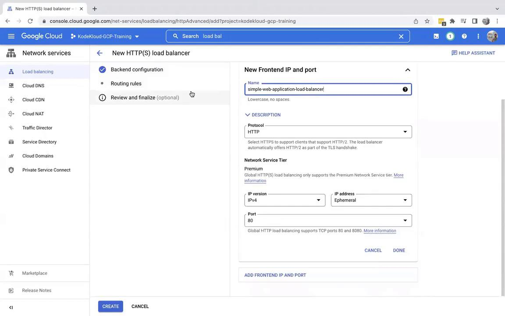
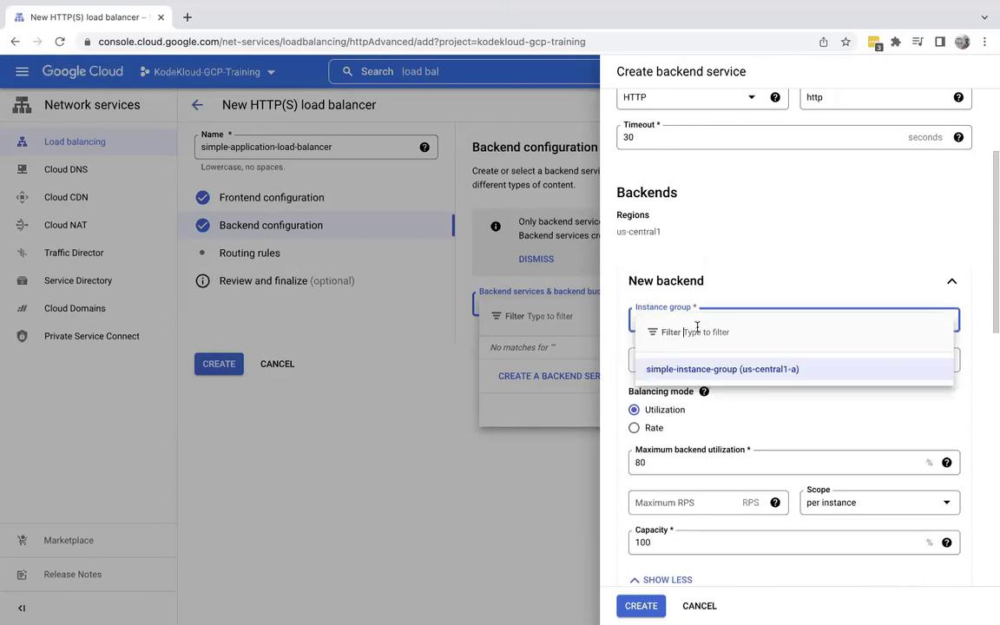
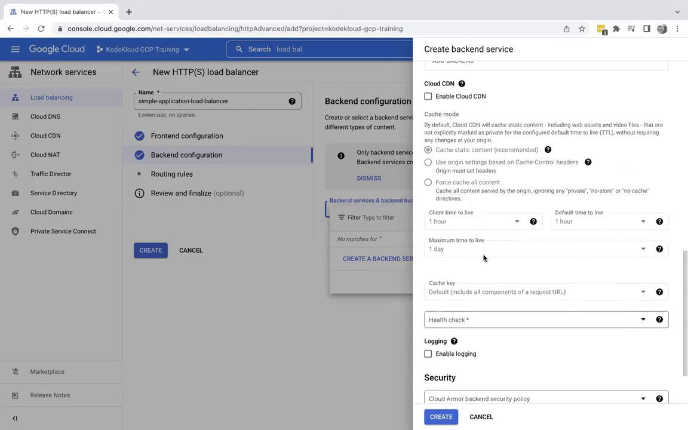
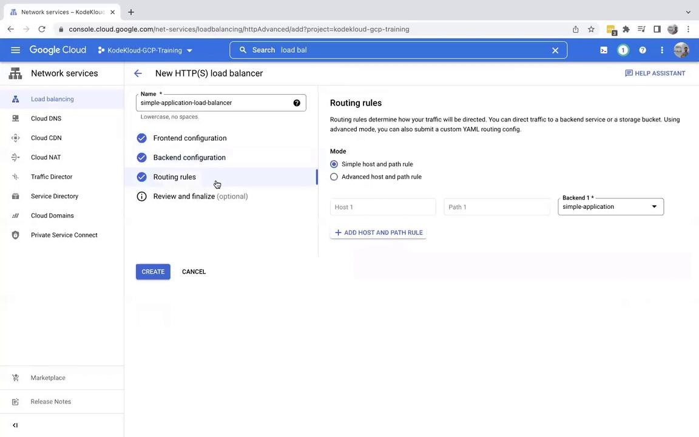
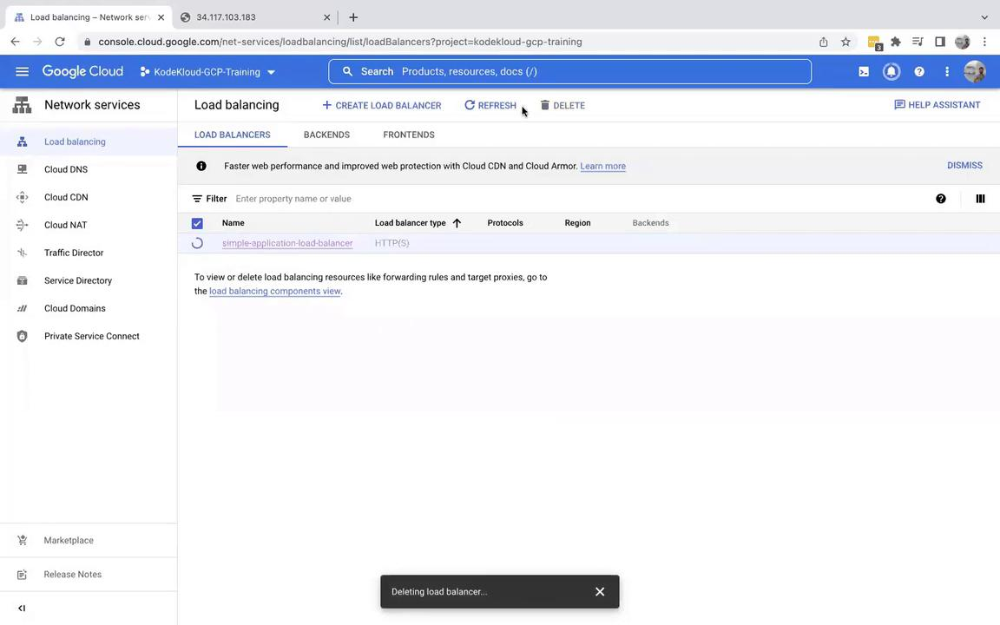
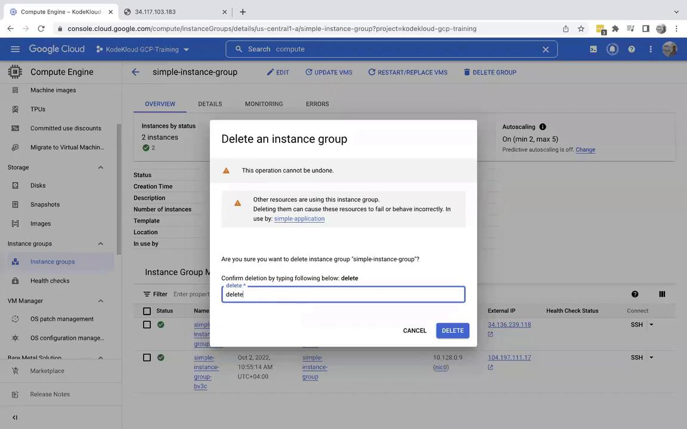

# Demo Lab Session

Source: https://notes.kodekloud.com/docs/GCP-Cloud-Digital-Leader-Certification/Usecase/Demo-Lab-Session/page

This article provides a step-by-step guide to deploying a simple application on Google Cloud Platform using various services.

Welcome to this comprehensive lab article. In this guide, you will learn how to deploy a simple application on Google Cloud Platform (GCP), leveraging Compute Engine, Instance Groups, Instance Templates, and HTTP Load Balancers. This step-by-step tutorial covers creating and managing virtual machines and automating your application deployment.

## Setting Up the Instance Group

Begin by logging into the GCP Console and confirming that you are in the correct project. Follow these steps to set up your instance group:

1. Navigate to **Compute Engine** by searching for "Compute" and selecting **Compute Engine**.
2. In the Compute Engine section, go to **Instance Groups** and create a new instance group.

   * Name the instance group: **simple instance group**
   * Add a description, for example, *this is a simple application*.

   You have the option to select an existing template; however, in this lab, you will create a new instance template.

<Frame>
  
</Frame>

### Creating an Instance Template

When creating the instance template, follow these instructions:

1. Name the template **simple instance group** (or **simple instance** for brevity).
2. Add a metadata key-value pair where the key is **ENV** and the value is **development**.
3. Keep the machine type as default. Scroll down to the boot script section, click **Change**, and select **Ubuntu**.

At this moment, the latest version of Ubuntu is automatically selected.

<Frame>
  
</Frame>

<Callout icon="lightbulb">
  If you receive an error indicating that the selected compute instance is not compatible with the chosen Ubuntu version, switch to the Intel version (x86\_64) and click **Select**.
</Callout>

## Understanding Instance Templates and Startup Scripts

An instance template is a blueprint for your virtual machines within an instance group. Ensure the following within the template:

* In the firewall section, enable both the HTTP and HTTPS traffic options. Enabling HTTP is crucial for external accessibility to your web application.

<Frame>
  
</Frame>

### Configuring a Startup Script

Under **Advanced Options**, navigate to **Management** where you will find the startup script section. A startup script automates the process of installing and configuring your application after the VM boots. Consider the following simple Bash startup script:

```bash theme={null}
#!/bin/bash
apt update
apt -y install apache2
echo 'Simple application running on $(hostname)' > /var/www/html/index.html
```

<Callout icon="lightbulb">
  Even if the startup script encounters an error, the virtual machine will continue running. You can extend this script to install additional packages or configure other services as necessary.
</Callout>

After entering your startup script, click on **Save and Continue**. Configure the instance group with these settings:

* Minimum instances: **2**
* Maximum instances: **5**

The default setting starts with two instances. Leave all other settings as default and then click **Create**. Please note that it may take up to five minutes for the instance group to become fully operational.

## Verifying the Instance Group and Application

After setting up the instance group, verify that everything is functioning as expected by checking the individual instances. Follow these steps:

1. Confirm that the startup script ran successfully by inspecting each instance.
2. Refresh the instances section to see the external IP addresses assigned.
3. Access the web application by clicking on an external IP address. Remember to use the HTTP protocol (not HTTPS). If the page does not load immediately, allow a few minutes for the updates.

<Frame>
  
</Frame>

## Configuring the HTTP Load Balancer

Next, set up an HTTP Load Balancer to distribute incoming traffic across your instances.

1. In the GCP Console, search for **Load Balancer** and create a new HTTP load balancer (initially, leave all configurations as default).
2. Name the load balancer **simple application load balancer**.

### Configuring the Backend Service

For the backend configuration, perform the following actions:

* Create a backend service and choose the previously created instance group.
* Set the backend port to **80**.
* Enable the default settings.
* Create a health check titled **Simple application** to verify port **80** using HTTP. This health check ensures traffic is only directed to healthy instances.

<Frame>
  
</Frame>

After configuring the backend, save your settings. You can leave the routing rules as default and then click **Create** to build the load balancer.

<Frame>
  
</Frame>

<Frame>
  
</Frame>

After the configuration, the load balancer will deploy and connect to your instance group. Keep in mind that it might take 10–15 minutes for the load balancer's IP address to become fully available and for all health checks to pass.

<Frame>
  
</Frame>

<Frame>
  
</Frame>

Test the load balancer by entering its IP address in your browser with HTTP on port 80. You might initially see a 404 error, but after refreshing, you should notice different instance names in the response—confirming that the traffic is being distributed across your virtual machines.

## Cleaning Up Resources

Once you have verified that your deployment is working correctly, it is important to clean up your resources to avoid incurring additional charges. The cleanup process should be performed in the following order:

1. Delete the load balancer (this will also remove the associated health check).
2. Navigate to **Compute Engine** > **Instance Groups** and then delete the instance group.

<Frame>
  
</Frame>

<Frame>
  
</Frame>

<Callout icon="triangle-alert">
  Ensure that you delete the load balancer before deleting the instance group to avoid dependency errors.
</Callout>

<Frame>
  
</Frame>

## Conclusion

This lab article demonstrated how to:

* Create and configure an instance group with a custom instance template.
* Automate application deployment using a startup script.
* Set up an HTTP load balancer to distribute traffic among virtual machines.
* Perform clean-up of resources to reduce unnecessary charges.

We hope you found this lab informative and that it helps you build your expertise in cloud computing on GCP. Happy cloud computing!

For additional resources and further reading, check out the following:

* [Google Cloud Documentation](https://cloud.google.com/docs)
* [Compute Engine Overview](https://cloud.google.com/compute)
* [Introduction to Load Balancing](https://cloud.google.com/load-balancing/docs)

<CardGroup>
  <Card title="Watch Video" icon="video" href="https://learn.kodekloud.com/user/courses/gcp-cloud-digital-leader-certification/module/04987f64-1ee0-4f81-9a84-f1882572de12/lesson/f7d053c1-0b35-4b18-b7f6-9c3b87bd8b45" />
</CardGroup>
