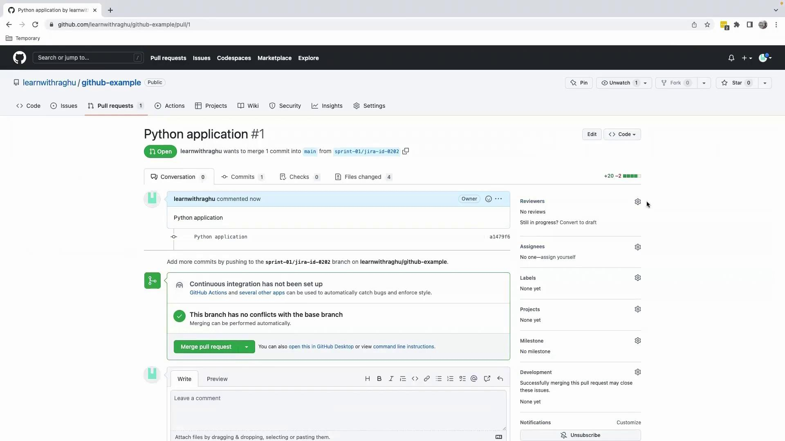

# Demo Commit changes to github repo

Source: https://notes.kodekloud.com/docs/GCP-DevOps-Project/Sprint-01/Demo-Commit-changes-to-github-repo/page

This guide explains how to containerize a Flask application with Docker and push code changes to a GitHub repository.

Welcome back! Now that your Flask application is running locally, it’s time to containerize it with Docker and push your code to GitHub. This guide walks you through creating a Dockerfile, staging and committing changes, working with feature branches, and opening a pull request.

## Preparing the Dockerfile

In VS Code (or your preferred editor), create a file named `Dockerfile` in your project root:

```dockerfile theme={null}
FROM python:3.8-slim-buster

WORKDIR /app

COPY requirements.txt .
RUN pip install --no-cache-dir -r requirements.txt

COPY . .

CMD ["python3", "-m", "flask", "run", "--host=0.0.0.0"]
```

This Dockerfile installs dependencies, copies your application code, and starts the Flask development server on all interfaces (0.0.0.0).

<Callout icon="lightbulb">
  Use `--no-cache-dir` with `pip` to reduce image size by preventing caching of package files.
</Callout>

## Staging and Committing Changes

Once your `Dockerfile`, `app.py`, `requirements.txt`, and `README.md` are ready, stage all modified and new files:

```bash theme={null}
git add .
```

Commit with a clear, descriptive message:

```bash theme={null}
git commit -m "Add Dockerfile and initial Flask application"
```

Expected output:

```bash theme={null}
[main a1479f6] Add Dockerfile and initial Flask application
 4 files changed, 20 insertions(+), 2 deletions(-)
 create mode 100644 Dockerfile
 create mode 100644 app.py
 create mode 100644 requirements.txt
```

Confirm you’re on the `main` branch:

```bash theme={null}
git branch
```

Output:

```bash theme={null}
* main
```

<Callout icon="triangle-alert">
  Make sure sensitive files (e.g., `.env`, keys) are listed in your `.gitignore` to avoid accidental commits.
</Callout>

## Branching and Pushing Feature Branch

Follow Git best practices by working in a feature branch named after your JIRA task:

1. Create and switch to the branch:
   ```bash theme={null}
   git checkout -b sprint-01/jira-id-0202
   ```
2. Push the branch to GitHub:
   ```bash theme={null}
   git push origin sprint-01/jira-id-0202
   ```

You should see:

```bash theme={null}
Enumerating objects: 8, done.
Counting objects: 100% (8/8), done.
Delta compression using up to 8 threads.
Compressing objects: 100% (5/5), done.
Writing objects: 100% (6/6), 730.00 KiB | 730.00 KiB/s, done.
Total 6 (delta 0), reused 0 (delta 0), pack-reused 0
remote: Create a pull request for 'sprint-01/jira-id-0202' on GitHub by visiting:
remote:   https://github.com/learnwithraghu/github-example/pull/new/sprint-01/jira-id-0202
* [new branch]      sprint-01/jira-id-0202 -> sprint-01/jira-id-0202
```

| Command                         | Description                             |
| ------------------------------- | --------------------------------------- |
| `git checkout -b <branch-name>` | Create & switch to a new feature branch |
| `git push origin <branch-name>` | Push local branch to remote repository  |
| `git add .`                     | Stage all changes                       |
| `git commit -m "<message>"`     | Commit staged changes with a message    |

## Opening a Pull Request

1. Navigate to your GitHub repository in a browser.
2. Click **Compare & pull request** for `sprint-01/jira-id-0202`.
3. Add a title and paste your commit message in the description.
4. Assign a reviewer from your team.

<Frame>
  
</Frame>

Once the PR is approved, click **Merge pull request**, then **Confirm merge**. Finally, switch back to `main` and pull the latest changes:

```bash theme={null}
git checkout main
git pull origin main
```

Your `main` branch now contains the merged feature.

## Next Steps

With Sprint 01 completed, we’ll proceed to the sprint review—covering objectives, demos, and feedback. Stay tuned!

## Links and References

* [Dockerfile reference](https://docs.docker.com/engine/reference/builder/)
* [Git branching workflows](https://www.atlassian.com/git/tutorials/comparing-workflows)
* [Creating a pull request on GitHub](https://docs.github.com/en/pull-requests)
* [Flask Quickstart](https://flask.palletsprojects.com/en/latest/quickstart/)

<CardGroup>
  <Card title="Watch Video" icon="video" href="https://learn.kodekloud.com/user/courses/gcp-devops-project/module/a334971a-4fa2-4c61-8891-9c189e2aab64/lesson/af157728-43a5-4bc1-b22d-f8a766485683" />
</CardGroup>
