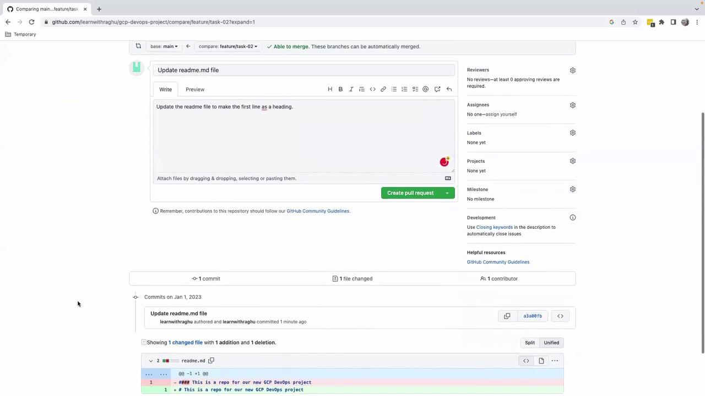
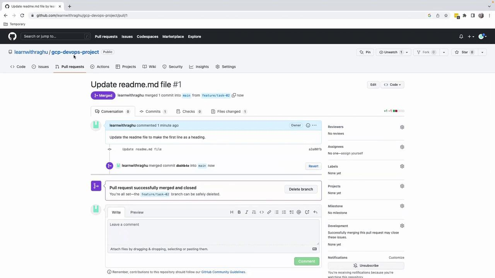

# On branch feature/task-02
# Changes to be committed:
git commit -m "Update README.md to use H1 heading"
```

### Pushing the Feature Branch

Push your branch to GitHub:

```bash theme={null}
git push origin feature/task-02
```

You should see a message prompting you to create a pull request:

```bash theme={null}
remote: Create a pull request for 'feature/task-02' on GitHub by visiting:
remote:   https://github.com/learnwithraghu/gcp-devops-project/pull/new/feature/task-02
```

## Creating and Merging a Pull Request

1. Click **Compare & pull request** in the GitHub banner.
2. On the **Open a pull request** page:
   * **Title**: Update README.md to use H1 heading
   * **Description**: Update the README file to make the first line a heading
3. Review your changes and click **Create pull request**.

<Frame>
  
</Frame>

4. Click **Merge pull request**, then **Confirm merge** (approvals are not required for solo projects).

<Frame>
  
</Frame>

After merging, your `main` branch includes the change. This clear, repeatable process scales with team size and project complexity.

## Links and References

* [GitHub Branch Protection Rules](https://docs.github.com/en/repositories/configuring-branches-and-merges-in-your-repository/configuring-protected-branches)
* [Git Branching Basics](https://git-scm.com/book/en/v2/Git-Branching-Basic-Branching-and-Merging)
* [GitHub Pull Requests](https://docs.github.com/en/pull-requests)

That's it for this lesson. See you in the next one!

<CardGroup>
  <Card title="Watch Video" icon="video" href="https://learn.kodekloud.com/user/courses/gcp-devops-project/module/a334971a-4fa2-4c61-8891-9c189e2aab64/lesson/3f5ae5f4-aa90-4540-a5bc-85e22ab94a55" />
</CardGroup>


# Demo Testing Debugging our code locally

Source: https://notes.kodekloud.com/docs/GCP-DevOps-Project/Sprint-01/Demo-Testing-Debugging-our-code-locally/page

This article provides a guide for building, testing, and debugging a Flask application within a Docker container.

Welcome to this step-by-step guide on building, testing, and debugging your Flask application locally within a Docker container. By the end of this tutorial, you’ll be able to:

* Containerize a Flask app using Docker
* Identify and fix common configuration typos
* Run and verify your application on a custom host port

<Callout icon="lightbulb">
  Ensure you have [Docker installed](https://docs.docker.com/get-docker/) and Python 3.8+ on your local machine before you begin.
</Callout>

## Prerequisites

* Python Flask application (`app.py`)
* `requirements.txt` listing `Flask` (and any other dependencies)
* A `Dockerfile` to containerize your application

## Project Structure

```text theme={null}
├── app.py
├── requirements.txt
└── Dockerfile
```

## 1. Initial Dockerfile

Below is our starting `Dockerfile`—note the typo in the `CMD` instruction that we’ll address later:

```dockerfile theme={null}
FROM python:3.8-slim-buster

WORKDIR /app

COPY requirements.txt requirements.txt
RUN pip3 install -r requirements.txt

COPY .
