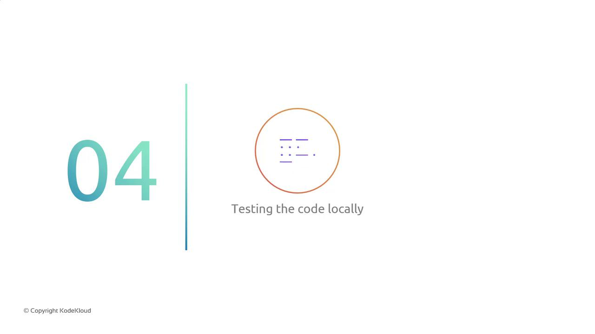
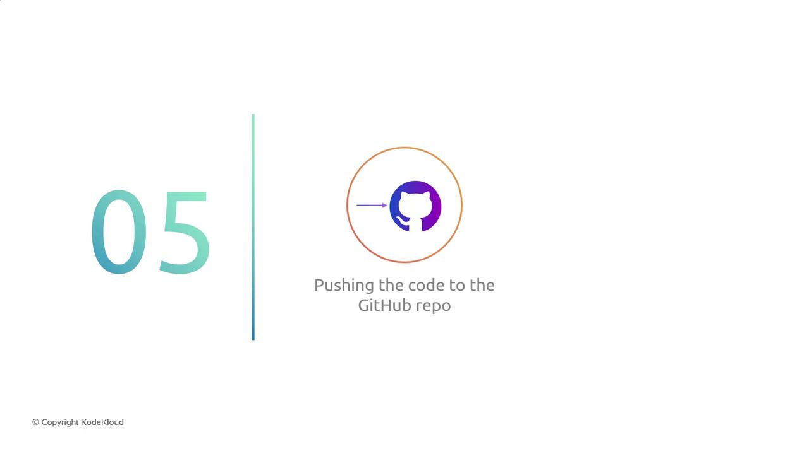
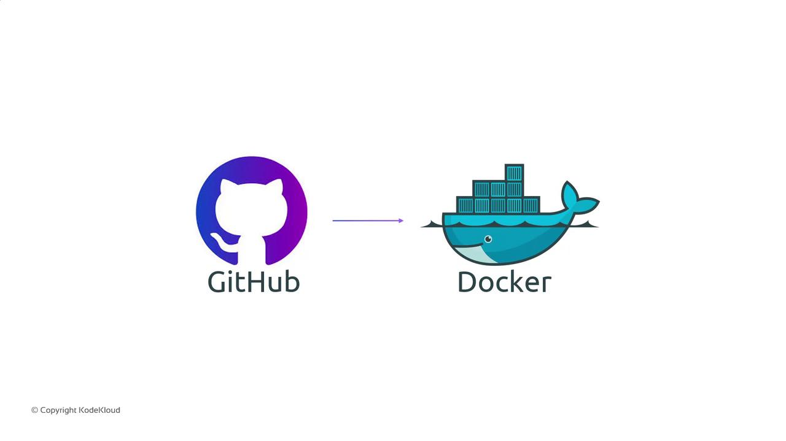

# Sprint 01

Source: https://notes.kodekloud.com/docs/GCP-DevOps-Project/Sprint-01/Sprint-01/page

This article covers the initialization of a DevOps pipeline, including GitHub setup, Docker image creation, local testing, and code pushing.

In Sprint-01, you’ll lay the groundwork for your DevOps pipeline by:

1. Creating and configuring a GitHub repository.
2. Applying organizational best practices (branching strategy, repository settings).
3. Writing a sample `Dockerfile` and building the image.
4. Running and testing the Docker image locally.

<Frame>
  
</Frame>

5. Pushing the tested code and Docker image to GitHub.

<Frame>
  
</Frame>

<Callout icon="lightbulb">
  * A [GitHub](https://github.com/) account with SSH keys configured
  * [Docker](https://www.docker.com/) installed locally
  * Git CLI set up on your machine
</Callout>

***

## 1. GitHub Repository Setup

1. Sign in to your GitHub account and click **New** repository.
2. Name the repo according to your organization’s naming convention (e.g., `project-name`).
3. Add a `README.md`, `.gitignore`, and your preferred branch protection rules.
4. Clone the repo locally:
   ```bash theme={null}
   git clone git@github.com:your-org/project-name.git
   cd project-name
   ```

## 2. Apply Organizational Best Practices

* Establish a branching strategy (e.g., `main`, `develop`, feature branches).
* Create issue and PR templates under `.github/`.
* Configure automated workflows or [GitHub Actions](https://docs.github.com/en/actions) as needed.

## 3. Sample Dockerfile and Image Build

Create a `Dockerfile` in the project root:

```dockerfile theme={null}
FROM alpine:3.18
WORKDIR /app
COPY . .
RUN apk add --no-cache python3 py3-pip \
 && pip3 install --no-cache-dir -r requirements.txt
CMD ["python3", "app.py"]
```

Build the Docker image:

```bash theme={null}
docker build -t your-org/project-sample:latest .
```

## 4. Local Testing of Docker Image

Run the container and verify functionality:

```bash theme={null}
docker run --rm -d -p 8080:80 your-org/project-sample:latest
curl http://localhost:8080/health
```

| Task          | Command                                          |
| ------------- | ------------------------------------------------ |
| Build image   | `docker build -t project-sample:latest .`        |
| Run container | `docker run -d -p 8080:80 project-sample:latest` |
| Health check  | `curl http://localhost:8080/health`              |

## 5. Push to GitHub

1. Stage and commit your changes:
   ```bash theme={null}
   git add .
   git commit -m "Initialize repo and add Dockerfile"
   ```
2. Push to the remote:
   ```bash theme={null}
   git push origin main
   ```

<Frame>
  
</Frame>

<Callout icon="triangle-alert">
  Avoid committing sensitive information (credentials, tokens) to the repository. Use [GitHub Secrets](/docs/secure-credentials) for secure storage.
</Callout>

That wraps up Sprint-01. You’ve now initialized the repository, enforced best practices, built and tested your Docker image, and pushed it to GitHub. Let’s continue to Sprint-02 for CI/CD integration!

***

## Links and References

* [GitHub Documentation](https://docs.github.com/)
* [Docker Documentation](https://docs.docker.com/)
* [Git CLI Reference](https://git-scm.com/docs)

<CardGroup>
  <Card title="Watch Video" icon="video" href="https://learn.kodekloud.com/user/courses/gcp-devops-project/module/a334971a-4fa2-4c61-8891-9c189e2aab64/lesson/5b728fd9-6957-467c-8114-f390c92cf261" />
</CardGroup>
