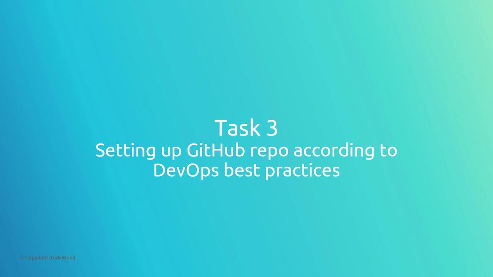
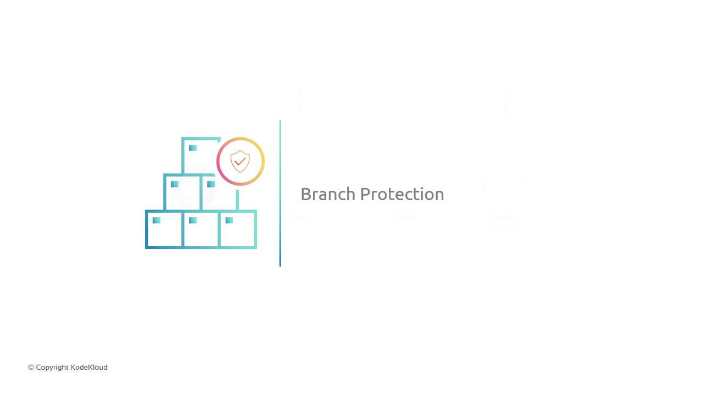

# Task 3Setup Github repo according to DevOps best practice

Source: https://notes.kodekloud.com/docs/GCP-DevOps-Project/Sprint-01/Task-3Setup-Github-repo-according-to-DevOps-best-practice/page

This guide covers configuring a GitHub repository to follow DevOps best practices, including branch protection and a feature-branch workflow.

<Frame>
  
</Frame>

In this guide, we'll walk through configuring your GitHub repository to align with DevOps best practices. You'll learn how to protect your `main` branch, enforce pull request reviews, and adopt a scalable workflow for collaborative development.

## Current Workflow and Its Drawbacks

Most teams begin with a simple process:

1. Clone the central repo.
2. Make changes directly on `main`.
3. Push updates back to `main`.

While straightforward, this method introduces two critical issues:

* **Unreviewed code**: Bugs or security flaws can reach production unvetted.
* **Frequent merge conflicts**: Multiple direct pushes to `main` often collide.

To solve these problems, we’ll enable branch protection and mandate pull requests.

## Enabling Branch Protection Rules

Branch protection rules block direct pushes to critical branches (like `main`) and enforce quality checks before merging.

<Frame>
  
</Frame>

### Key Branch Protection Settings

| Rule                         | Description                        | Benefit                         |
| ---------------------------- | ---------------------------------- | ------------------------------- |
| Require pull request reviews | Prevents direct commits to `main`  | Ensures code is peer-reviewed   |
| Enforce status checks        | CI/CD pipelines must pass          | Avoids broken or failing builds |
| Dismiss stale approvals      | Forces fresh reviews after changes | Keeps feedback up to date       |

<Callout icon="lightbulb">
  Configure branch protection under **Settings > Branches** in your GitHub repository. For details, see [GitHub Branch Protection](https://docs.github.com/en/repositories/configuring-branches-and-merges-in-your-repository/configuring-protected-branches).
</Callout>

With these rules enabled:

* Direct pushes to `main` are blocked.
* All changes must go through a pull request.
* Required CI/CD checks must be green before merging.

## Recommended GitHub Workflow

Adopt a feature-branch workflow to scale collaboration:

1. Clone the repository locally.
2. Create a new feature branch: `feature/your-feature-name`.
3. Commit work to the feature branch.
4. Push the branch and open a pull request against `main`.
5. Request reviews and address feedback.
6. Merge when approvals and checks are complete.

```bash theme={null}
