# List namespaces
kubectl get namespaces

# List pods in kube-system
kubectl get pods -n kube-system
```

Example output:

```bash theme={null}
$ kubectl get pods -n kube-system
NAME                              READY   STATUS    RESTARTS   AGE
filestore-node-7havk              3/3     Running   0          9m56s
filestore-node-hzc64              0/0     ----      0          9m56s
fluentbit-gce-small-4n47s         0/0     ----      0          9m56s
kube-api-access-tnhmb             0/0     ----      0          9m56s
gke-metadata-server-6srb6         1/1     Running   0          9m56s
gke-metrics-agent-tmb8p           1/1     Running   0          9m56s
ip-attach-agent-4kjdz             0/0     ----      0          9m56s
konnectivity-agent-8t894          1/1     Running   0          9m56s
kube-dns-648f67d9c4-kz6h6         1/1     Running   0          10m
kube-dns-648f67d9c4-6rxnl         1/1     Running   0          10m
metrics-server-6d49bb6c5-7xjg     1/1     Running   0          10m
metadefender                      0/0     ----      0          9m56s
metra-8cfb5dff73-9c8g             1/1     Running   0          9m55s
node-local-dns-9v4vd              2/2     Running   0          9m56s
```

## 3. View Workloads in Google Cloud Console

Inspect workloads and system metrics without leaving the Console:

1. Close the Cloud Shell terminal window.
2. In the left-hand navigation, click **Workloads**.
3. Toggle **Show system workloads**.
4. Filter by **kube-system** to view system pods.

<Frame>
  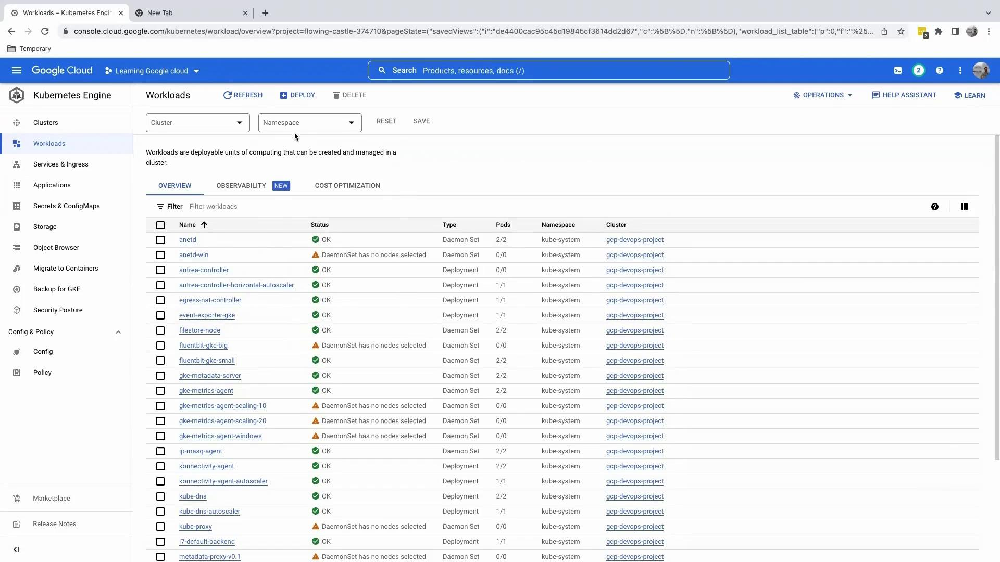
</Frame>

To see per-pod resource metrics:

* Use the namespace filter to select one or more namespaces.
* Examine CPU and memory usage, restarts, and error logs in the metrics panel.

<Frame>
  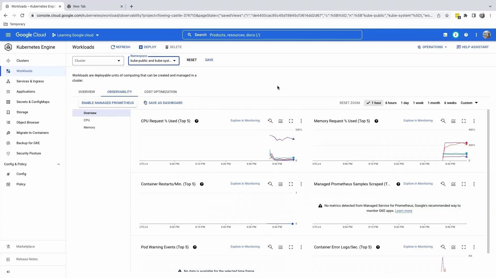
</Frame>

***

You’ve successfully connected to your GKE cluster via Cloud Shell, executed essential `kubectl` commands, and explored workloads in the GCP Console. Next, we’ll guide you through deploying applications to your cluster.

## References

* [Google Kubernetes Engine Documentation](https://cloud.google.com/kubernetes-engine/docs)
* [kubectl Cheat Sheet](https://kubernetes.io/docs/reference/kubectl/cheatsheet/)
* [Google Cloud Shell Overview](https://cloud.google.com/shell/docs/)

<CardGroup>
  <Card title="Watch Video" icon="video" href="https://learn.kodekloud.com/user/courses/gcp-devops-project/module/e0cc2e03-d889-468c-af73-0866856711aa/lesson/cda1b129-4799-46a5-8586-dae53949e5e9" />
</CardGroup>


# Creating GKE cluster

Source: https://notes.kodekloud.com/docs/GCP-DevOps-Project/Sprint-02/Creating-GKE-cluster/page

This guide explains how to create a Google Kubernetes Engine cluster on Google Cloud Platform, covering API activation, cluster types, configuration, and inspection.

In this guide, we’ll walk through creating your first Google Kubernetes Engine (GKE) cluster on Google Cloud Platform (GCP). You’ll learn how to enable the Kubernetes Engine API, compare Autopilot and Standard modes, configure node pools, networking, security, and inspect your new cluster.

## 1. Enable the Kubernetes Engine API

1. Sign in to the GCP Console and search for **GKE**, then click **Kubernetes Engine**.

<Frame>
  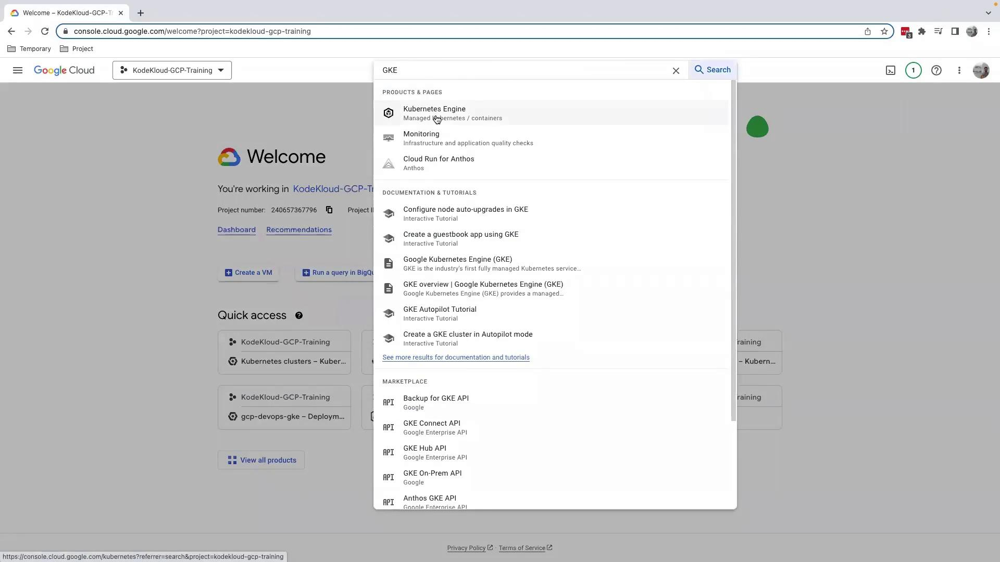
</Frame>

<Callout icon="lightbulb">
  If you’re on a managed learning environment (e.g., [KodeKloud](https://www.kodekloud.com)), the Kubernetes Engine API is often pre-enabled.
</Callout>

2. If prompted, click **Enable** to activate the Kubernetes Engine API.

<Frame>
  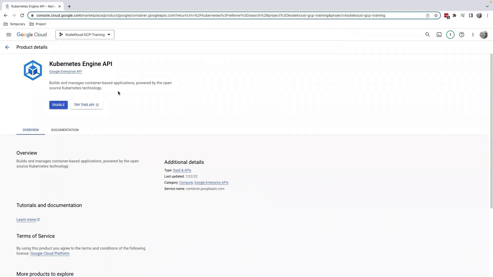
</Frame>

3. After enabling, you’ll be redirected to the **Kubernetes clusters** dashboard.

<Frame>
  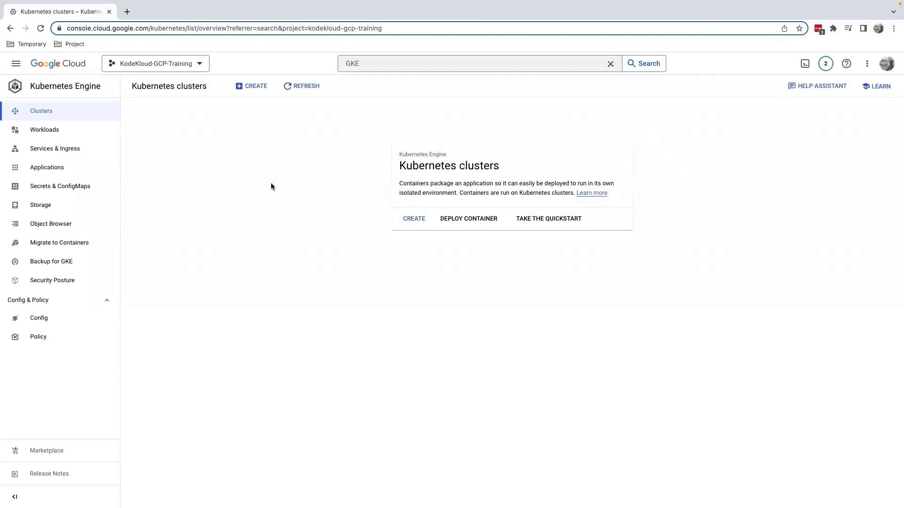
</Frame>

## 2. Choose Cluster Type

Click **Create** on the Kubernetes clusters page. You’ll see two modes:

<Frame>
  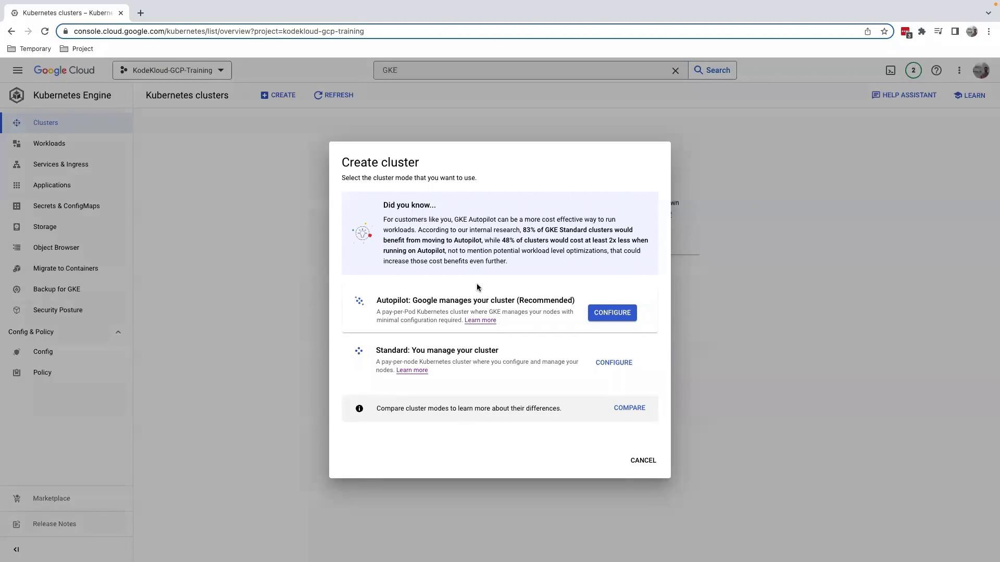
</Frame>

| Cluster Mode | Management Responsibility                        | Best Use Case                        |
| ------------ | ------------------------------------------------ | ------------------------------------ |
| Autopilot    | GCP manages nodes, upgrades, and scaling         | Minimal ops overhead and quick start |
| Standard     | You manage node pools, upgrades, and autoscaling | Custom machine types & security      |

For full control over node pools and configurations, select **Standard**, then click **Configure**.

## 3. Configure Your Standard Cluster

1. **Name** your cluster (e.g., `gcp-devops-project`).
2. Choose a **Location type**:
   * **Regional** spans multiple zones.
   * **Zonal** resides in a single zone (we’ll use Zonal here).

<Frame>
  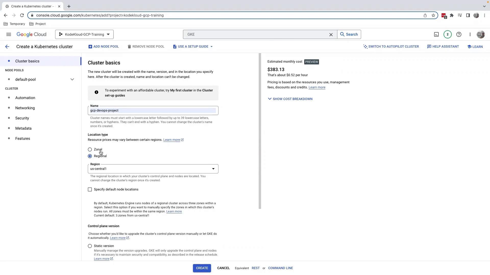
</Frame>

### 3.1 Node Pools

A **node pool** is a set of VM instances with the same configuration. By default, you get one node pool—expand **Node pools** to adjust settings.

<Frame>
  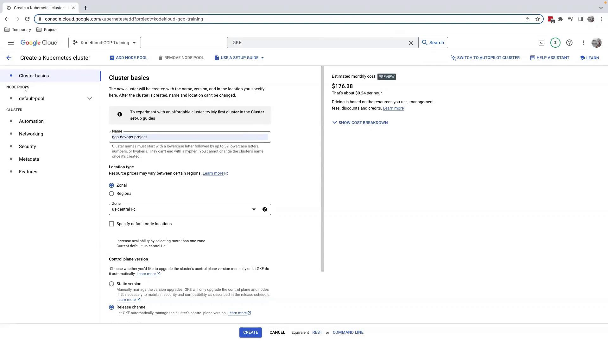
</Frame>

#### 3.1.1 Select Image Type

Under **Nodes**, choose your node image: Container-Optimized OS, Ubuntu, or Windows. We’ll keep the default.

<Frame>
  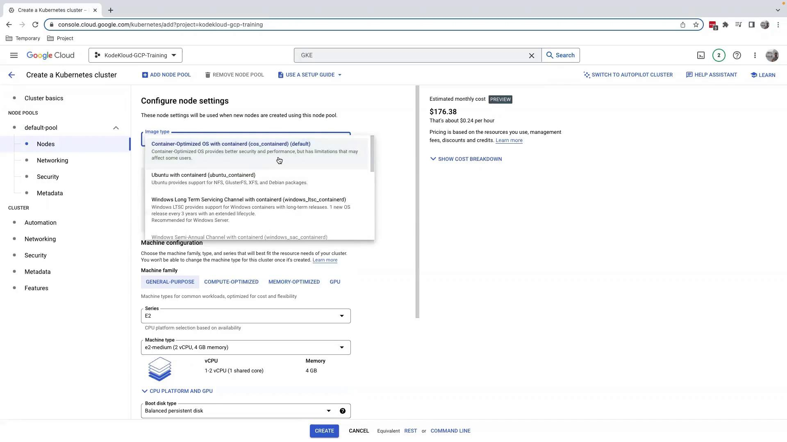
</Frame>

#### 3.1.2 Machine Type & Boot Disk

* **Machine type** defaults to `e2-medium`; adjust CPU and memory if needed.
* Reduce the **Boot disk** to 16 GB for cost savings.

### 3.2 Networking

Leave the network defaults. Note that **Maximum pods per node** is set to 110 by default.

<Frame>
  
</Frame>

### 3.3 Security & Metadata

Add **Kubernetes labels**, **taints**, or custom **GCE instance metadata**. Enforce security policies here.

<Frame>
  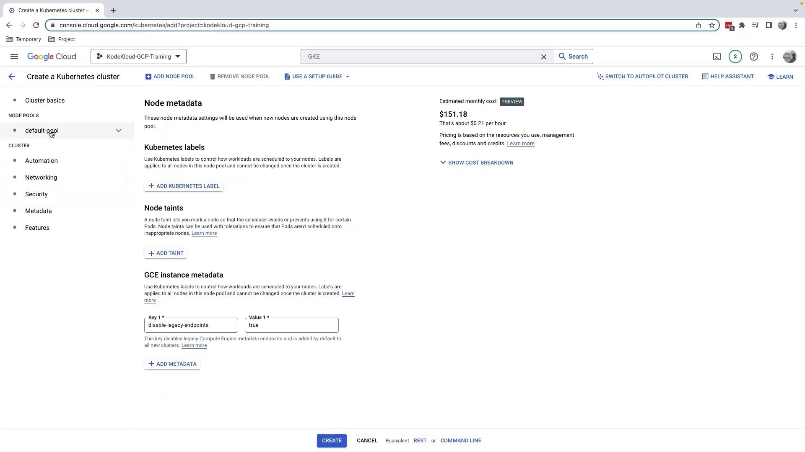
</Frame>

### 3.4 Autoscaling & Resource Management

Enable **Node Pool Autoscaling** or the **Vertical Pod Autoscaler** for dynamic scaling. The balanced policy distributes pods evenly across nodes.

<Frame>
  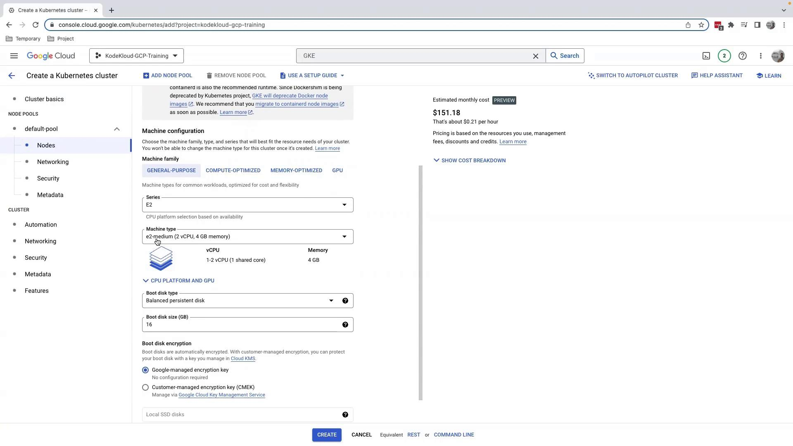
</Frame>

When you’re satisfied with the configuration, click **Create**. Provisioning takes about 5–10 minutes.

<Frame>
  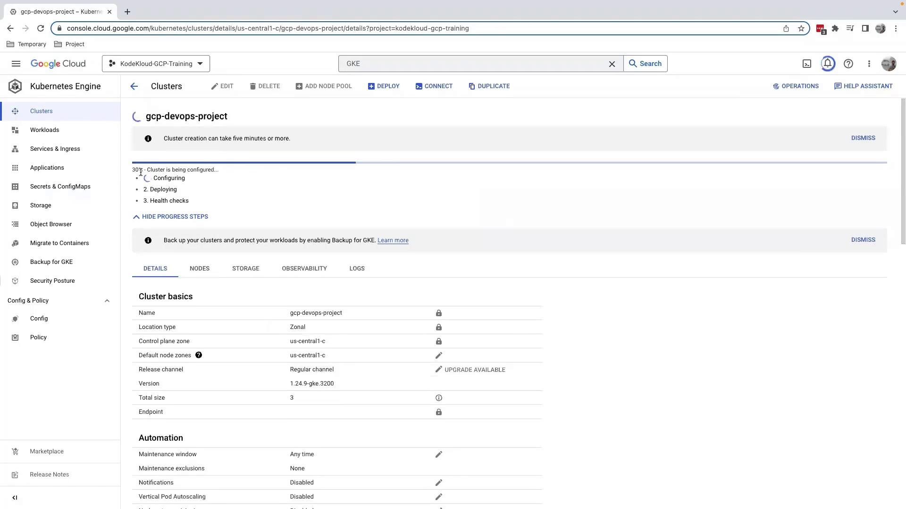
</Frame>

<Callout icon="triangle-alert">
  Provisioning GKE clusters incurs charges. Review [GKE pricing](https://cloud.google.com/kubernetes-engine/pricing) and delete unused clusters to avoid surprise costs.
</Callout>

## 4. Inspect Your Cluster

After provisioning completes (\~10 minutes), click your cluster name to open the details page:

<Frame>
  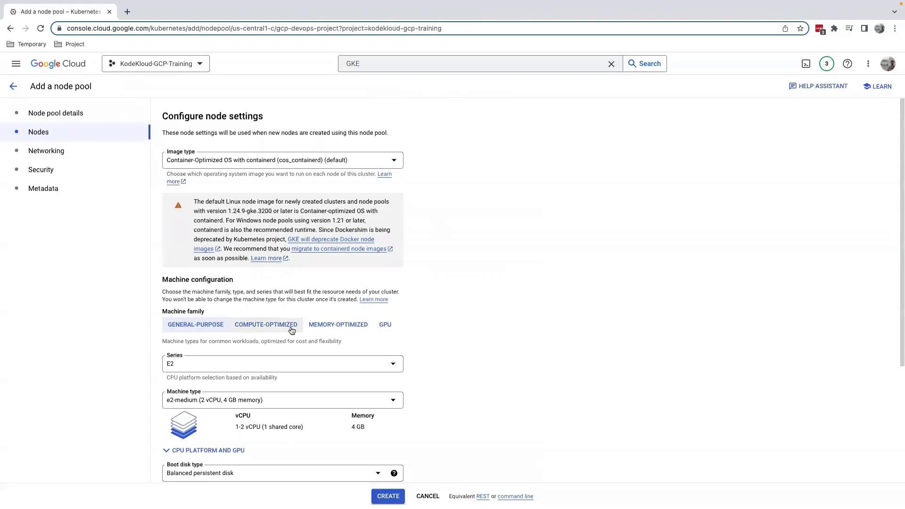
</Frame>

Here you can:

* **Add Node Pool**: Create pools with different machine types or sizes.
* **Workloads**: View running pods and deployments.
* **Maintenance**: Set maintenance windows and policies (avoid “Any time” for production).

Node pools help you segregate workloads by resource requirements—run lightweight services on small VMs and high-memory jobs on larger ones.

## 5. Cleaning Up

To remove your cluster:

1. Click **Delete** on the cluster details page.
2. Confirm the cluster name.

In managed labs, simply shutting down the environment clears resources.

***

## References

* [GKE Documentation](https://cloud.google.com/kubernetes-engine/docs)
* [GCP Pricing Calculator](https://cloud.google.com/products/calculator)
* [Kubernetes Official Site](https://kubernetes.io/)

<CardGroup>
  <Card title="Watch Video" icon="video" href="https://learn.kodekloud.com/user/courses/gcp-devops-project/module/e0cc2e03-d889-468c-af73-0866856711aa/lesson/a12d8574-1077-414f-bd5c-d6669826c32f" />
</CardGroup>
