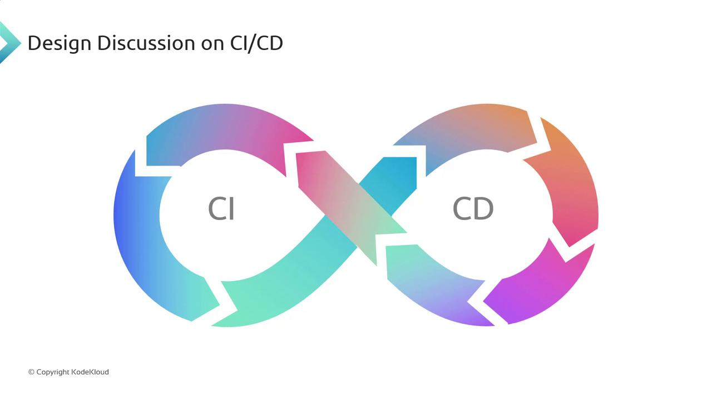
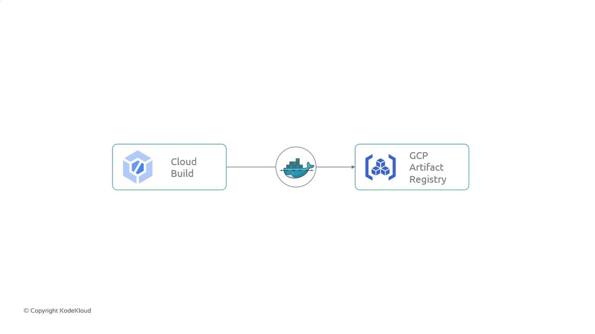

# Sprint 03 Review

Source: https://notes.kodekloud.com/docs/GCP-DevOps-Project/Sprint-03/Sprint-03-Review/page

This article reviews the design of a CI/CD pipeline on Google Cloud Platform, detailing completed work and outlining tasks for the next sprint.

Welcome back! In Sprint 03, we completed the design discussion around CI/CD on Google Cloud Platform (GCP), defined our problem statement, evaluated native GCP services, and selected the tools for an automated pipeline.

## Completed Work

We mapped out Continuous Integration and Continuous Deployment as an “infinity loop” to show how commits flow through build, test, and deploy stages—emphasizing feedback loops and full automation.

<Frame>
  
</Frame>

***

## Next Sprint: Implementation Roadmap

In Sprint 04, we’ll shift focus to hands-on setup using GCP services. Below is our task breakdown:

| Task                            | Objective                                     | Key Activities                                                                                                               |
| ------------------------------- | --------------------------------------------- | ---------------------------------------------------------------------------------------------------------------------------- |
| Explore Cloud Build             | Learn GCP’s managed CI service                | • Configure build triggers • Define steps & substitutions • Author `cloudbuild.yaml`                               |
| Understand Artifact Registry    | Compare to Container Registry                 | • Review repository types & regions • Set IAM permissions • Discuss supported artifacts (Docker, Maven, npm, etc.) |
| Implement Build & Push Pipeline | Automate Docker image creation and publishing | • Fetch source from GitHub • Build with `cloudbuild.yaml` • Tag & push to Artifact Registry                        |

<Callout icon="lightbulb">
  Make sure your `cloudbuild.yaml` is correctly indented. Even a single space error can cause build failures.
</Callout>

<Callout icon="triangle-alert">
  Verify IAM roles for Cloud Build and Artifact Registry. Missing permissions will block image pushes.
</Callout>

***

The conceptual flow below illustrates how Cloud Build retrieves code from GitHub, builds a Docker image via `cloudbuild.yaml`, and securely pushes it to Artifact Registry with proper tagging and permissions.

<Frame>
  
</Frame>

***

That wraps up our Sprint 03 review. In the next lesson, we’ll deep-dive into Cloud Build configuration and create our first automated pipeline. See you soon!

***

## Links and References

* [Cloud Build Documentation](https://cloud.google.com/build/docs)
* [Artifact Registry Overview](https://cloud.google.com/artifact-registry/docs)
* [GCP IAM Roles for Cloud Build](https://cloud.google.com/iam/docs/understanding-roles)

<CardGroup>
  <Card title="Watch Video" icon="video" href="https://learn.kodekloud.com/user/courses/gcp-devops-project/module/51908e95-ccbf-4a0d-b1e5-254367dec2a0/lesson/7d8e308b-f590-419f-b649-31b4d2dc8e4c" />
</CardGroup>
