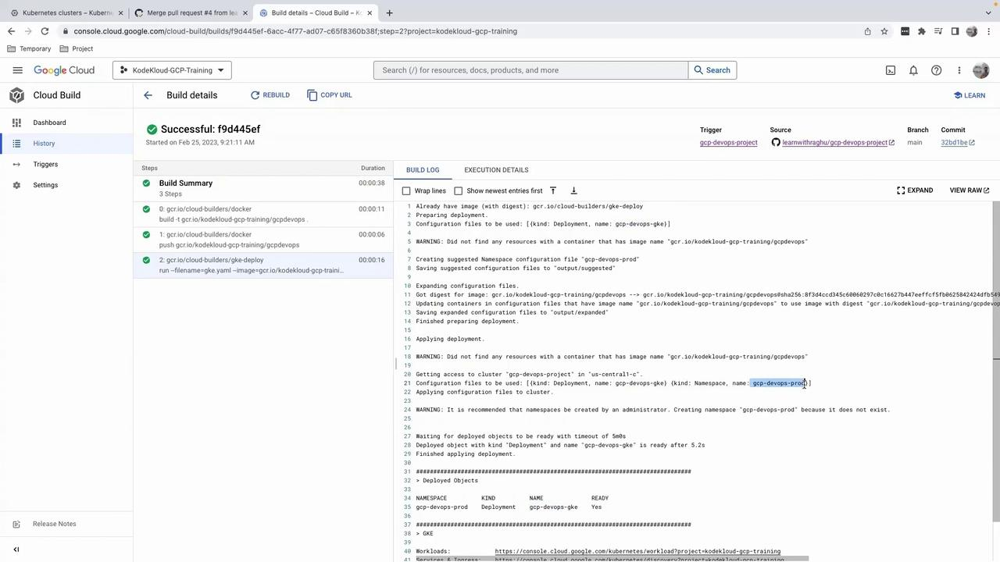
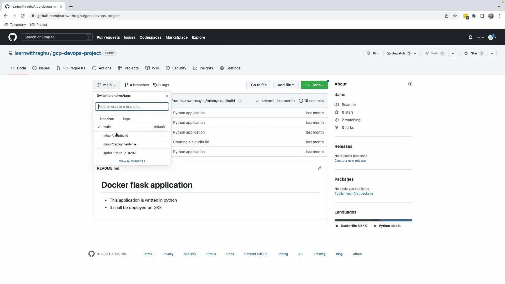
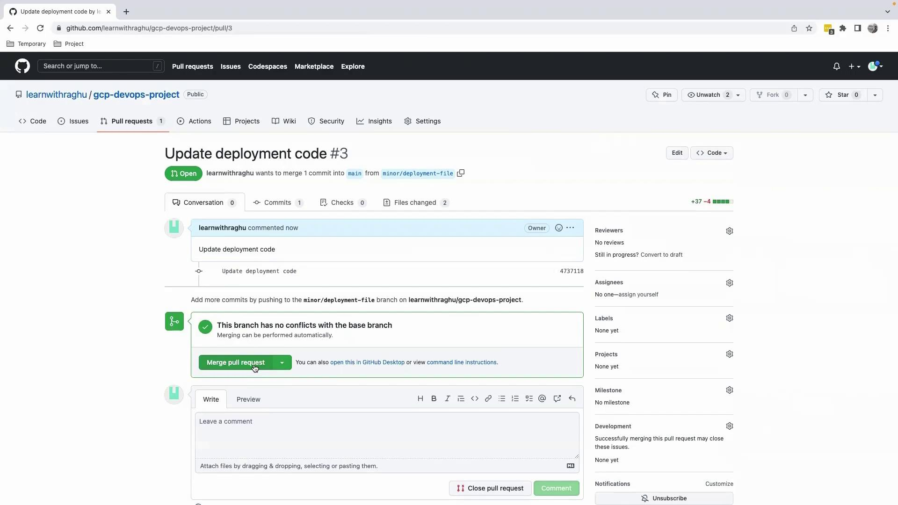
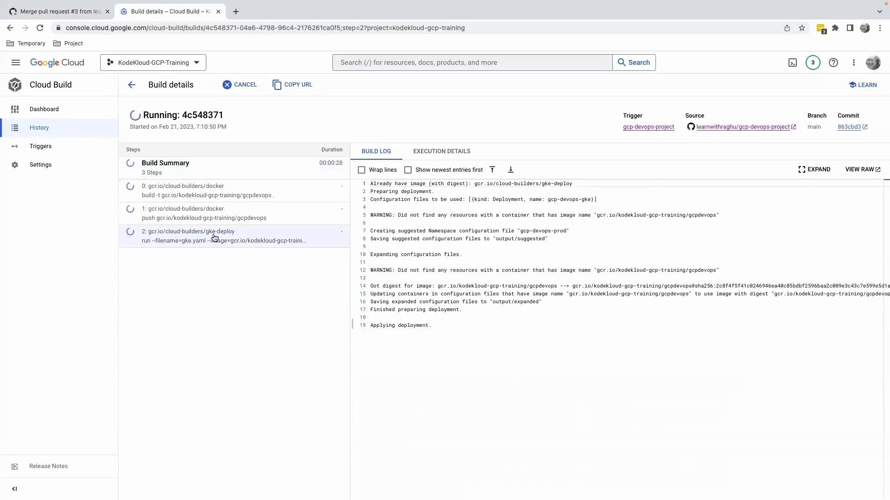
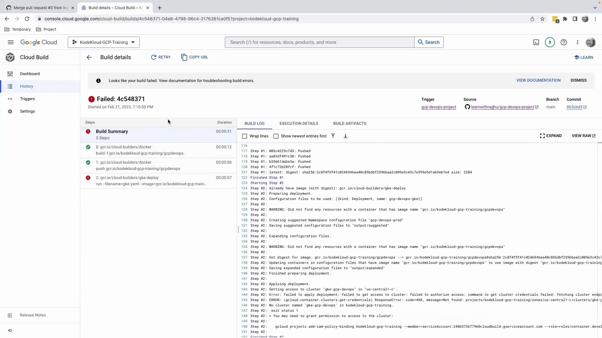
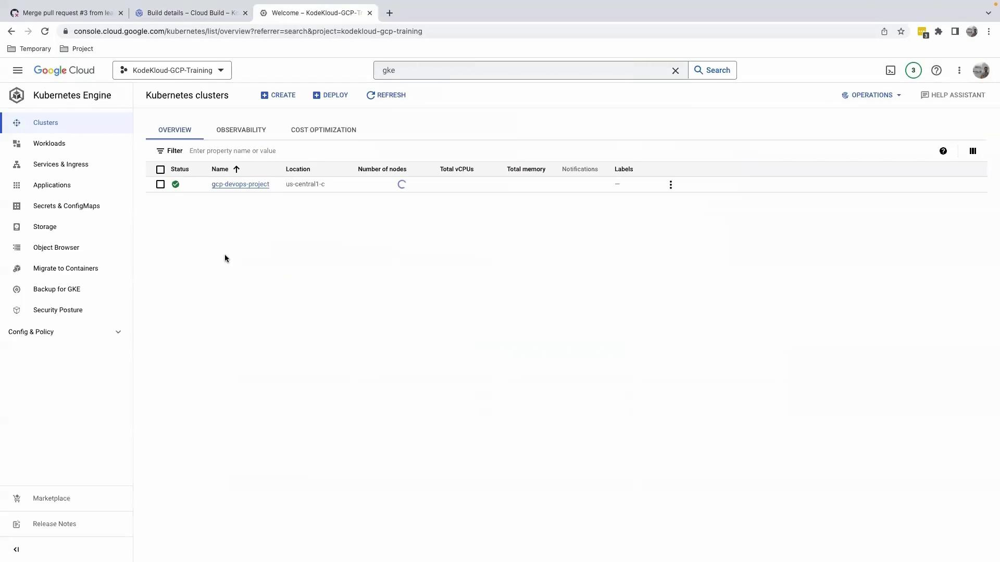

# Output: 2 files changed, 37 insertions(+), 4 deletions(-)
git push origin minor/deployment-file
```

Open a pull request titled **Update cluster name** on the `minor/deployment-file` branch and merge it. This triggers the Cloud Build pipeline on `main`.

## 5. Monitor the Build

After merging, you’ll see a green dot next to your repository. Click **Details** → **View more details on Google Cloud Build**.

| Step                       | Description                            |
| -------------------------- | -------------------------------------- |
| Build Docker image         | `gcr.io/cloud-builders/docker`         |
| Push to Container Registry | `gcr.io/cloud-builders/docker push`    |
| Deploy to GKE              | `gcr.io/cloud-builders/gke-deploy run` |

Cloud Build will:

1. Build the Docker image
2. Push it to Container Registry
3. Deploy to the GKE cluster with the corrected name

<Callout icon="triangle-alert">
  If the specified namespace (`gcp-devops-prod`) doesn't exist, the deployment will fail at the **gke-deploy** step. Ensure namespaces are created in advance.
</Callout>

<Frame>
  
</Frame>

## 6. Next Steps

The pipeline completes successfully, and your container is now running in the `gcp-devops-prod` namespace. In the next lesson, we'll explore how to verify running pods from the GCP console.

***

## Links and References

* [Cloud Build Triggers](https://cloud.google.com/build/docs/automating-builds/create-build-trigger)
* [gke-deploy Documentation](https://cloud.google.com/cloud-build/docs/gke-deploy)
* [Kubernetes Namespace Concepts](https://kubernetes.io/docs/concepts/overview/working-with-objects/namespaces/)

<CardGroup>
  <Card title="Watch Video" icon="video" href="https://learn.kodekloud.com/user/courses/gcp-devops-project/module/c1a43d47-87cb-459f-a9bf-2000d6223395/lesson/fe1a43b8-5218-4b6b-85ed-ec7e4551d2b4" />
</CardGroup>


# Deploy and validate our application on GKE

Source: https://notes.kodekloud.com/docs/GCP-DevOps-Project/Sprint-05/Deploy-and-validate-our-application-on-GKE/page

This article explains how to deploy and validate an application on GKE using Cloud Build and GitHub.

After configuring our `cloudbuild.yaml` to build, push, and deploy the Docker image to a GKE cluster via `gke.yaml`, we can automate the entire CI/CD workflow with a Cloud Build trigger. Once this file is committed to GitHub, the pipeline performs the following steps:

| Step | Builder                          | Purpose                              |
| ---- | -------------------------------- | ------------------------------------ |
| 1    | gcr.io/cloud-builders/docker     | Build the container image            |
| 2    | gcr.io/cloud-builders/docker     | Push the image to Container Registry |
| 3    | gcr.io/cloud-builders/gke-deploy | Deploy the image to our GKE cluster  |

```yaml theme={null}
steps:
  - name: "gcr.io/cloud-builders/docker"
    args:
      - "build"
      - "-t"
      - "gcr.io/$PROJECT_ID/gcpdevops"
      - "."
  - name: "gcr.io/cloud-builders/docker"
    args:
      - "push"
      - "gcr.io/$PROJECT_ID/gcpdevops"
  - name: "gcr.io/cloud-builders/gke-deploy"
    args:
      - run
      - --filename=gke.yaml
      - --image=gcr.io/$PROJECT_ID/gcpdevops
      - --location=us-central1-c
      - --cluster=gke-gcp-devops
      - --namespace=gcp-devops-prod
```

## Commit, Push, and Open a Pull Request

Use the following commands to stage, commit, and push your changes:

```bash theme={null}
git add cloudbuild.yaml gke.yaml
git commit -m "Update deployment code"
git push origin <branch-name>
```

Then, navigate to GitHub, select your feature branch, and click **Contribute** → **Open pull request**. After reviewing the diff, click **Create pull request** and then **Merge**.

<Frame>
  
</Frame>

<Frame>
  
</Frame>

## Monitoring the Build in Google Cloud Console

Once merged into `main`, the configured [Cloud Build trigger](https://cloud.google.com/build/docs/automating-builds/create-manage-triggers) executes our pipeline. Monitor progress under **Cloud Build** → **History**:

```plaintext theme={null}
Step #0: Downloading MarkupSafe-2.1.2...
Step #0: Successfully installed ...
Step #1: Pushing layers...
Step #0: Built 83c1e572684d
Step #0: Tagged gcr.io/kodekloud-gcp-training/gcpdevops:latest
...
```

<Frame>
  
</Frame>

<Callout icon="triangle-alert">
  The deployment step failed because the specified GKE cluster name does not exist. Always verify that `--cluster` matches your actual cluster in the correct zone or region.
</Callout>

<Frame>
  
</Frame>

Inspecting the logs reveals an IAM binding that references a non-existent cluster:

```bash theme={null}
gcloud projects add-iam-policy-binding kodekloud-gcp-training \
  --member=serviceAccount:248675367976-compute@cloudbuild.gserviceaccount.com \
  --role=roles/container.developer
```

```plaintext theme={null}
ERROR: (gcloud.container.clusters.get-credentials) ResponseError: code=404, message=Not found: projects/kodekloud-gcp-training/zones/us-central1-c/clusters/gke-gcp-devops.
```

## Verifying Your GKE Clusters

Check your actual cluster names and locations in the Kubernetes Engine section:

<Frame>
  
</Frame>

<Callout icon="lightbulb">
  If you need to list clusters via the CLI, use:

  ```bash theme={null}
  gcloud container clusters list --zone us-central1-c
  ```
</Callout>

## Correcting the Cluster Reference

Update the `cloudbuild.yaml` to use the correct cluster name:

```yaml theme={null}
steps:
  - name: "gcr.io/cloud-builders/docker"
    args: ["build", "-t", "gcr.io/$PROJECT_ID/gcpdevops", "."]
  - name: "gcr.io/cloud-builders/docker"
    args: ["push", "gcr.io/$PROJECT_ID/gcpdevops"]
  - name: "gcr.io/cloud-builders/gke-deploy"
    args:
      - run
      - --filename=gke.yaml
      - --image=gcr.io/$PROJECT_ID/gcpdevops
      - --location=us-central1-c
      - --cluster=gcp-devops-project
      - --namespace=gcp-devops-prod
```

After committing and merging these changes, the deployment will succeed.

## Links and References

* [Google Cloud Build Documentation](https://cloud.google.com/build/docs/)
* [gke-deploy | Google Anthos](https://cloud.google.com/anthos/gke-deploy)
* [Granting Roles](https://cloud.google.com/iam/docs/granting-changing-revoking-access)

<CardGroup>
  <Card title="Watch Video" icon="video" href="https://learn.kodekloud.com/user/courses/gcp-devops-project/module/c1a43d47-87cb-459f-a9bf-2000d6223395/lesson/744e03a4-d3ec-41db-8381-27244d222682" />
</CardGroup>
