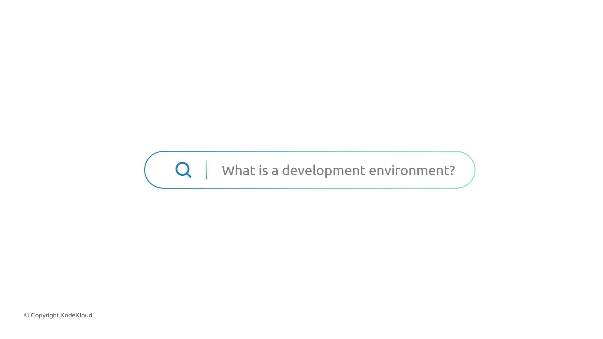
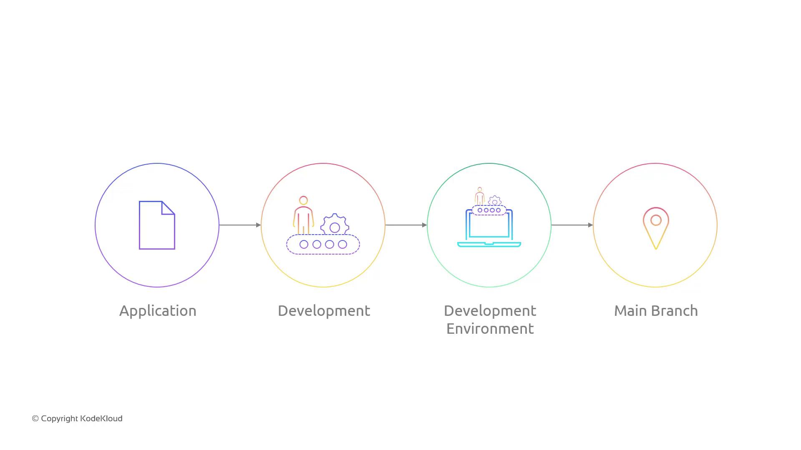

# Sprint 07

Source: https://notes.kodekloud.com/docs/GCP-DevOps-Project/Sprint-07/Sprint-07/page

This article outlines the goals and objectives for enhancing a GKE-based CI/CD pipeline with a dedicated development environment for safe code validation.

In Sprint 07, we’ll enhance our GKE-based CI/CD pipeline by introducing a dedicated **development environment**. This sandbox allows developers to validate changes safely before they reach production.

## Objectives

* Create a **development namespace** in the GKE cluster.
* Configure branch-based deployments:
  * Pushing to the `development` branch deploys to the development namespace.
  * Merging into the `main` branch deploys to production.

Whenever a developer pushes code to `development`, the pipeline triggers a rollout into the dev namespace. After tests and QA pass, merging into `main` initiates the production release.

<Callout icon="lightbulb">
  A development environment provides an isolated namespace in your GKE cluster for testing and validation of changes without impacting production.\
  Learn more in the [Kubernetes Namespaces documentation](https://kubernetes.io/docs/concepts/overview/working-with-objects/namespaces/).
</Callout>

<Frame>
  
</Frame>

<Frame>
  
</Frame>

## Branch-to-Namespace Mapping

| Git Branch  | Kubernetes Namespace | Trigger Event                |
| ----------- | -------------------- | ---------------------------- |
| development | dev                  | `git push` to develop        |
| main        | production           | Pull request merge into main |

## Updating the CI/CD Pipeline

Most CI/CD stages stay the same; we’ll only adjust:

1. Namespace creation steps.
2. Deployment job triggers.

### 1. Create the Development Namespace

```bash theme={null}
kubectl create namespace dev
```

### 2. Update Pipeline Configuration

In your CI/CD YAML (e.g., Cloud Build or GitHub Actions), add branch filters:

```yaml theme={null}
