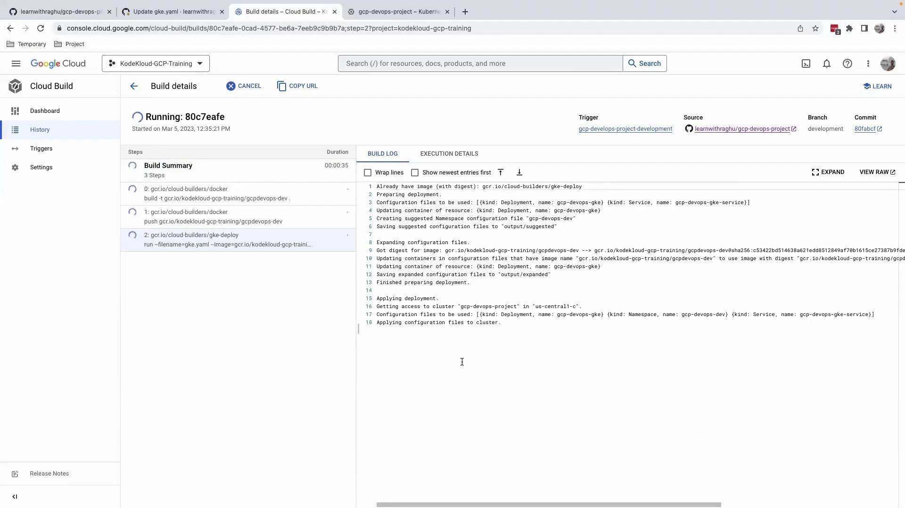
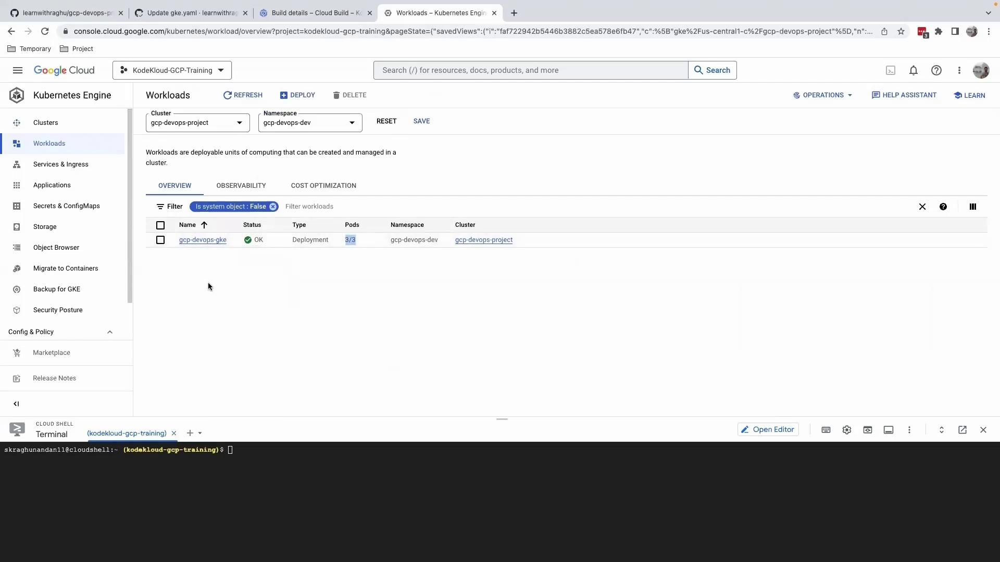

# Example GitHub Actions snippet
on:
  push:
    branches:
      - development
  pull_request:
    branches:
      - main

jobs:
  deploy-dev:
    if: github.ref == 'refs/heads/development'
    runs-on: ubuntu-latest
    steps:
      - name: Deploy to Dev Namespace
        run: |
          kubectl config use-context gke-cluster
          kubectl apply -f k8s/ --namespace=dev

  deploy-prod:
    if: github.event.pull_request.merged == true
    runs-on: ubuntu-latest
    steps:
      - name: Deploy to Production
        run: |
          kubectl config use-context gke-cluster
          kubectl apply -f k8s/ --namespace=production
```

## Next Steps

1. Validate the development environment by pushing a test commit to `development`.
2. Review logs and confirm the new namespace deployment.
3. Merge into `main` and watch the production rollout.

For more on CI/CD best practices with Kubernetes, see the [Kubernetes CI/CD guide](https://kubernetes.io/docs/concepts/cluster-administration/continuous-deployment/).

<CardGroup>
  <Card title="Watch Video" icon="video" href="https://learn.kodekloud.com/user/courses/gcp-devops-project/module/c8ea3a0c-6c88-4c7d-8317-f50354bae0e6/lesson/480f25b0-8750-416f-96b4-76d225635c52" />
</CardGroup>


# Upgrade replicas using the new flow

Source: https://notes.kodekloud.com/docs/GCP-DevOps-Project/Sprint-07/Upgrade-replicas-using-the-new-flow/page

Learn to scale GKE Deployment replicas using a GitOps workflow for reliable deployments and improved DevOps practices.

## Overview

In this guide, you’ll learn how to scale your GKE Deployment from 1 to 3 replicas using a GitOps-based workflow. Instead of applying changes directly to production, we will:

1. Update the `development` branch via the GitHub UI
2. Trigger a Cloud Build pipeline
3. Verify changes in the dev environment
4. Promote to the `main` branch for production rollout

This approach ensures reliable deployments and aligns with DevOps best practices, improving both velocity and confidence.

## Prerequisites

* A Google Cloud project with [GKE](https://cloud.google.com/kubernetes-engine/docs) cluster deployed
* A Cloud Build trigger configured to deploy the `development` branch
* Permissions to modify GitHub repositories and view Cloud Build logs

## Step 1: Update the Deployment via GitHub UI

<Callout icon="lightbulb">
  Hotfixes via the GitHub UI can be useful for quick changes, but in production environments it's recommended to use pull requests and code reviews.
</Callout>

1. Switch to the `development` branch in your GitHub repo.
2. Navigate to `gke.yaml`.
3. Change the `replicas` field from `1` to `3`:

```yaml theme={null}
apiVersion: apps/v1
kind: Deployment
metadata:
  name: gcp-devops-gke
spec:
  replicas: 3
  selector:
    matchLabels:
      app: gcp
  template:
    metadata:
      labels:
        app: gcp
    spec:
      containers:
        - name: gcp-devops-gke
          image: gcr.io/kodekloud-gcp-training/gcpdevops-dev:latest
          ports:
            - containerPort: 5000
          env:
            - name: PORT
              value: "5000"
---
apiVersion: v1
kind: Service
metadata:
  name: gcp-devops-gke-service
  namespace: gcp-devops-dev
  labels:
    app.kubernetes.io/managed-by: gcp-cloud-build-deploy
spec:
  ports:
    - protocol: TCP
      port: 80
      targetPort: 5000
```

4. Commit and push your changes. This action triggers the Cloud Build pipeline.

## Step 2: Monitor the Cloud Build Pipeline

After pushing the commit, navigate to the [Cloud Build Console](https://console.cloud.google.com/cloud-build) to follow the build steps. The pipeline typically includes:

| Step          | Description                        |
| ------------- | ---------------------------------- |
| Fetch Source  | Clone the `development` branch     |
| Build Image   | Build and push Docker image to GCR |
| Deploy to GKE | Apply updated manifests to GKE     |

<Frame>
  
</Frame>

<Callout icon="triangle-alert">
  Ensure your Cloud Build service account has the required [IAM roles](https://cloud.google.com/iam/docs/understanding-roles) for deploying to GKE.
</Callout>

## Step 3: Verify the Deployment in Dev Environment

1. Open the Google Cloud Console.
2. Navigate to **Kubernetes Engine** > **Workloads**.
3. Select the `gcp-devops-gke` workload in the `gcp-devops-dev` namespace.

<Frame>
  
</Frame>

You should see all three pods in the **Running** state. Perform any required functionality or load tests to validate the scaling update.

## Step 4: Promote Changes to Production

Once the dev environment tests pass:

1. Switch to the `main` (or `production`) branch.
2. Repeat the replica count update in `gke.yaml`.
3. Commit and push to trigger the production build and deployment.

This promotes consistency across environments and ensures a smooth rollout.

## Conclusion

By following this GitOps-style workflow, you can safely scale your GKE workloads, reduce manual errors, and enhance your deployment automation.

## References

* [Kubernetes Deployment Documentation](https://kubernetes.[SECRET_REDACTED]/)
* [Google Cloud Build](https://cloud.google.com/build)
* [GitHub Actions for Kubernetes](https://github.com/google-github-actions/setup-gcloud)

<CardGroup>
  <Card title="Watch Video" icon="video" href="https://learn.kodekloud.com/user/courses/gcp-devops-project/module/c8ea3a0c-6c88-4c7d-8317-f50354bae0e6/lesson/adbe809c-7750-42b3-9c11-c444460a1182" />
</CardGroup>
