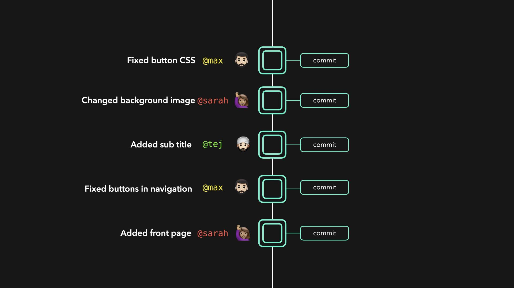
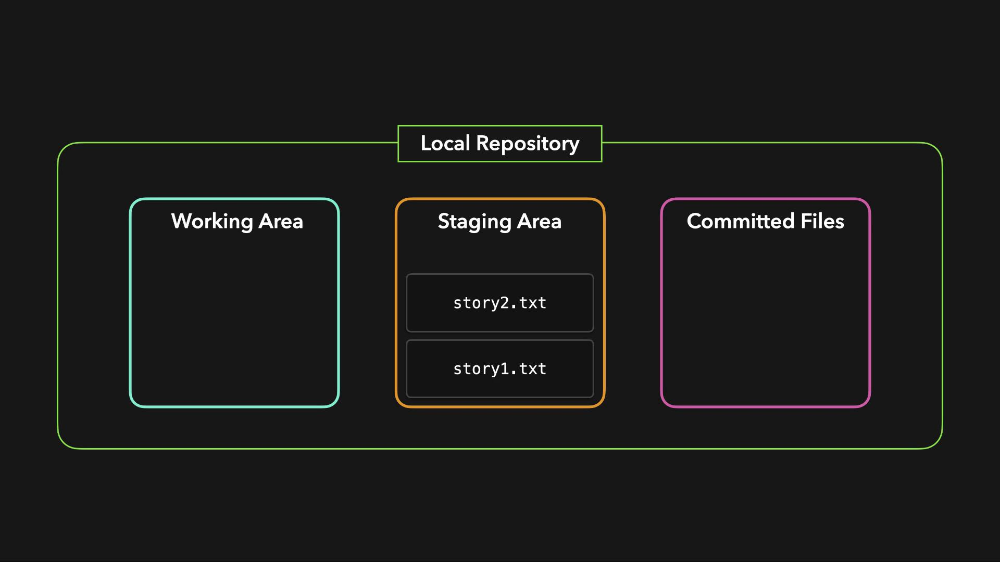

# Local and Remote Repositories

Source: https://notes.kodekloud.com/docs/GIT-for-Beginners/GIT-Introduction/Local-and-Remote-Repositories/page

This article explains the functions of local and remote repositories in Git for effective version control and team collaboration.

Git utilizes two distinct types of repositories: local and remote. Understanding how each functions is essential for effective version control and team collaboration.

<Callout icon="lightbulb">
  A remote repository not only acts as a secure backup in case of hardware failure but also enables seamless collaboration among team members.
</Callout>

## Repository Types

* **Local Repository**:\
  Stored on your machine, it gives you direct control over your project files and facilitates rapid development. This repository is where you perform your day-to-day work.

* **Remote Repository**:\
  Hosted on a centralized server, it serves as a backup and a shared workspace for the team. Teammates can clone the remote repository, work on their own local copies, and then push their changes back. Additionally, pulling updates from the remote repository ensures all local copies remain synchronized.

## Example: Simple HTML File

Below is an example of a basic HTML file that might be part of your project:

```html theme={null}
<html>
  <body>
    <h1>My Website!</h1>
  </body>
</html>
```

## Local Repository Structure

A typical local repository in Git is composed of three primary areas:

| Component         | Description                                                                                                 |
| ----------------- | ----------------------------------------------------------------------------------------------------------- |
| Working Directory | Contains the active files where you make changes. Git monitors these files but does not track their state.  |
| Staging Area      | Temporary storage where files are added after changes. Once reviewed, these files are prepped for a commit. |
| Committed Files   | Files that have been saved into the repository’s history via commits.                                       |

Files intended for a commit are first added to the staging area. After reviewing these staged changes, a commit is created to record the current state of the project. This practice not only preserves the history of your changes but also makes version control efficient and reliable.

<Frame>
  
</Frame>

By initializing local repositories and linking them with a remote repository, team members can pull project data onto their machines, work offline, and then push their commits back. This workflow ensures that every contributor's changes are integrated and the project remains up to date.

<Frame>
  
</Frame>

With this understanding of local and remote repositories, you're better equipped to manage changes, collaborate efficiently, and maintain a consistent project history using Git.

<CardGroup>
  <Card title="Watch Video" icon="video" href="https://learn.kodekloud.com/user/courses/git-for-beginners/module/99d7786d-6e68-4866-8a3b-e01fcfc804b5/lesson/d8fabd78-ff09-44c3-8024-2a4539d523d3" />
</CardGroup>
