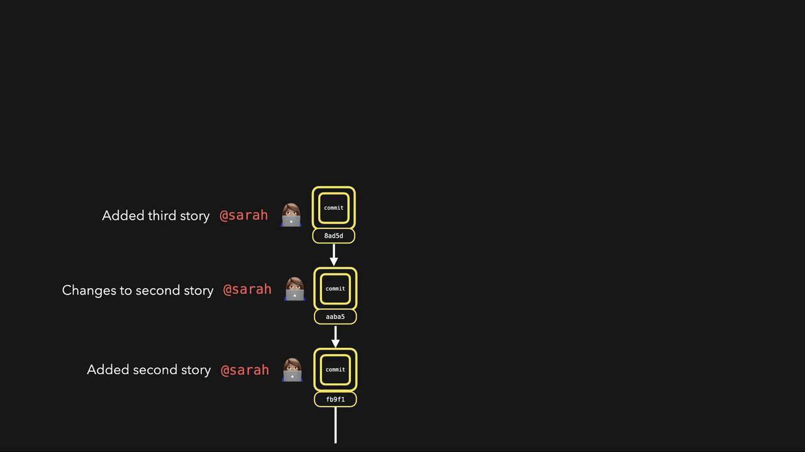

# Porcelain Commands
git add
git status
git commit
git stash
…

# Plumbing Commands
git hash-object
```

Using plumbing commands, you can compute the hash that Git uses internally. This process is similar to what happens when you run `git commit`. For example, suppose you have a file named `first_story.txt` containing a short sentence. First, add some content to the file:

```bash theme={null}
$ echo "This is my first story" >> first_story.txt
```

Next, generate a SHA-1 hash for this file using the following command. Notice how Git returns a hash value where the first two characters indicate the folder in which the content is stored:

```bash theme={null}
$ git hash-object first_story.txt
bea8d7fee8e7b11c2235ca623935e6ccccd8bac3
```

If you commit the `first_story.txt` file, Git will generate the same hash:

```bash theme={null}
$ git hash-object first_story.txt
bea8d7fee8e7b11c2235ca623935e6ccccd8bac3
```

Git then creates a folder using the first two characters of the hash—in this case, "be". You can inspect the internal Git structure by navigating to the `.git` folder, which is created when you run `git init`. For instance, after adding and committing the file, you might see:

```bash theme={null}
$ git add first_story.txt
$ git commit -m "First story"
$ ls .git/objects
26  be  a0  info  pack
$ ls .git/objects/be
a8d7fee8e7b11c2235ca623935e6ccccd8bac3
```

<Callout icon="lightbulb">
  To view the content corresponding to a particular hash, use the plumbing command `git cat-file` with the `-p` flag for pretty-printing:
</Callout>

For example, using the first part of the hash:

```bash theme={null}
$ git cat-file -p bea8d7
"This is my first story"
```

When you inspect a commit object, Git includes additional metadata along with the file content. Consider the following example:

```bash theme={null}
$ git cat-file -p 4cdf4
tree 2ea7de7ff3bd48cbb020b215b36feb67ee7f9a30
parent f4e830485cc852686cf115e75a79cbb41a0de713
author Lydia Hallie <e@mail.com> 1594547678 +0200
committer Lydia Hallie <e@mail.com> 1594547678 +0200

First story
```

This commit object contains:

* A tree reference that points to the repository's folder structure.
* A parent commit reference.
* Author information indicating who made the changes.
* Committer details showing who committed the changes.

Next, let's discuss Git's object types. Git organizes its internal storage into three primary object types:

| Object Type | Description                                                                                                | Example Use Case            |
| ----------- | ---------------------------------------------------------------------------------------------------------- | --------------------------- |
| Commit      | Represents a snapshot of your repository at a given time, recording metadata and pointers to tree objects. | Storing commit history      |
| Tree        | Represents a directory structure and links to blobs or subtrees.                                           | Organizing folder hierarchy |
| Blob        | Contains file data such as the contents of `first_story.txt`.                                              | Storing actual file content |

When you make multiple commits, Git builds a structure where each commit points to its parent. Each commit references trees (representing directory structures) and blobs (file data). For example, the first commit might reference a blob for `first_story.txt`, and a subsequent commit might reference both the previous blob and a new blob for another file.

<Frame>
  
</Frame>

Every commit acts as a snapshot of the repository, linking together trees and blobs to facilitate powerful version control features.

That concludes our lesson on how Git works internally. Stay tuned for the next lesson as we continue to explore Git's capabilities and best practices!

<CardGroup>
  <Card title="Watch Video" icon="video" href="https://learn.kodekloud.com/user/courses/git-for-beginners/module/6d339cba-e512-4329-a340-dccbb0454385/lesson/a25d9a1e-73bc-4b61-ba23-4fdab8247957" />
</CardGroup>


# Demo Apply labels and tags to GKE clusters

Source: https://notes.kodekloud.com/docs/GKE-Google-Kubernetes-Engine/GKE-Deployment-and-Administration/Demo-Apply-labels-and-tags-to-GKE-clusters/page

This tutorial teaches managing labels on Google Kubernetes Engine clusters and node pools.

In this tutorial, you’ll learn how to manage **labels** on Google Kubernetes Engine (GKE) clusters and their node pools. You will:

1. Create a new GKE cluster with labels
2. View labels on an existing cluster
3. Update labels on a cluster
4. Remove labels from a cluster
5. Verify labels on both the cluster and its node pools
6. Understand how cluster-level label changes affect node pools

***

## Table of Contents

* [1. Create a New Cluster with a Label](#1-create-a-new-cluster-with-a-label)
* [2. View Labels on an Existing Cluster](#2-view-labels-on-an-existing-cluster)
* [3. Update Labels on an Existing Cluster](#3-update-labels-on-an-existing-cluster)
* [4. Remove a Label from a Cluster](#4-remove-a-label-from-a-cluster)
* [5. Verify Labels on the New Cluster](#5-verify-labels-on-the-new-cluster)
* [6. Remove the Label from the New Cluster](#6-remove-the-label-from-the-new-cluster)
* [7. Node Pool Labels Remain After Cluster Label Removal](#7-node-pool-labels-remain-after-cluster-label-removal)
* [Command Reference](#command-reference)
* [Links and References](#links-and-references)

***

## 1. Create a New Cluster with a Label

Spin up a GKE cluster named `gke-deep-dive-new` with:

* 1 node
* 10 GB standard persistent disk
* Label `test=gke`

```bash theme={null}
gcloud container clusters create gke-deep-dive-new \
  --num-nodes=1 \
  --disk-type=pd-standard \
  --disk-size=10 \
  --labels=test=gke
```

This command provisions a single-node pool (HDD) and attaches the `test=gke` label at creation.

***

## 2. View Labels on an Existing Cluster

To inspect labels on a cluster (e.g., `gke-deep-dive`) run:

```bash theme={null}
gcloud container clusters describe gke-deep-dive \
  --format="yaml(resourceLabels)"
```

If there are no labels, the `resourceLabels` section will be empty.

***

## 3. Update Labels on an Existing Cluster

Add or modify labels using `--update-labels`. For example, set `newlabel=gkeold` on `gke-deep-dive`:

```bash theme={null}
gcloud container clusters update gke-deep-dive \
  --update-labels=newlabel=gkeold
```

Verify the update:

```bash theme={null}
gcloud container clusters describe gke-deep-dive \
  --format="yaml(resourceLabels)"
```

Expected output:

```yaml theme={null}
resourceLabels:
  newlabel: gkeold
```

***

## 4. Remove a Label from a Cluster

To delete a label, specify its key with `--remove-labels`:

```bash theme={null}
gcloud container clusters update gke-deep-dive \
  --remove-labels=newlabel
```

Confirm removal:

```bash theme={null}
gcloud container clusters describe gke-deep-dive \
  --format="yaml(resourceLabels)"
```

The `resourceLabels` field should now be empty.

***

## 5. Verify Labels on the New Cluster

Check that `gke-deep-dive-new` has the `test=gke` label:

```bash theme={null}
gcloud container clusters describe gke-deep-dive-new \
  --format="yaml(resourceLabels)"
```

You should see:

```yaml theme={null}
resourceLabels:
  test: gke
```

Alternatively, filter with `grep`:

```bash theme={null}
gcloud container clusters describe gke-deep-dive-new \
  | grep -i resourceLabels -A1
```

***

## 6. Remove the Label from the New Cluster

Remove the `test` label:

```bash theme={null}
gcloud container clusters update gke-deep-dive-new \
  --remove-labels=test
```

Verify:

```bash theme={null}
gcloud container clusters describe gke-deep-dive-new \
  --format="yaml(resourceLabels)"
```

`resourceLabels` will now be empty.

***

## 7. Node Pool Labels Remain After Cluster Label Removal

Cluster-level label updates **do not** automatically propagate to existing node pools. Even after removing `test` from the cluster, the default node pool still holds its label:

```bash theme={null}
gcloud container clusters describe gke-deep-dive-new \
  --format="yaml(nodePools[0].resourceLabels)"
```

```yaml theme={null}
resourceLabels:
  test: gke
```

To remove a label from the node pool itself:

```bash theme={null}
gcloud container node-pools update default-pool \
  --cluster=gke-deep-dive-new \
  --remove-labels=test
```

<Callout icon="lightbulb">
  After detaching a label from the cluster, always verify node-pool labels if you rely on them for workloads, autoscaling, or monitoring.
</Callout>

***

## Command Reference

| Operation                 | Command Snippet                                                |
| ------------------------- | -------------------------------------------------------------- |
| Create cluster with label | `gcloud container clusters create ... --labels=test=gke`       |
| View cluster labels       | `gcloud container clusters describe ... --format="yaml(...)"`  |
| Update cluster labels     | `gcloud container clusters update ... --update-labels=key=val` |
| Remove cluster labels     | `gcloud container clusters update ... --remove-labels=key`     |
| View node-pool labels     | `gcloud container clusters describe ... --format="yaml(...)"`  |
| Remove node-pool label    | `gcloud container node-pools update ... --remove-labels=key`   |

***

## Links and References

* [GKE Labels Documentation](https://cloud.google.com/kubernetes-engine/docs/concepts/labels)
* [Kubernetes Labels and Selectors](https://kubernetes.io/docs/concepts/overview/working-with-objects/labels/)
* [gcloud container clusters](https://cloud.google.com/sdk/gcloud/reference/container/clusters)
* [gcloud container node-pools](https://cloud.google.com/sdk/gcloud/reference/container/node-pools)

<CardGroup>
  <Card title="Watch Video" icon="video" href="https://learn.kodekloud.com/user/courses/gke-google-kubernetes-engine/module/897349c1-bf57-4c08-82fb-0aa0ce0e0f6b/lesson/c65372aa-2491-489b-a47c-c9c2c5163a8f" />
</CardGroup>
