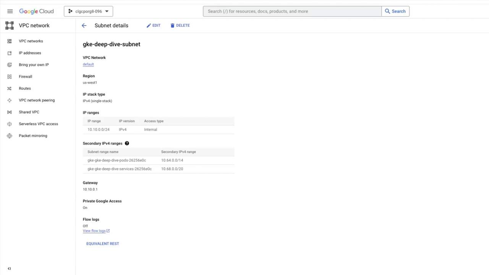
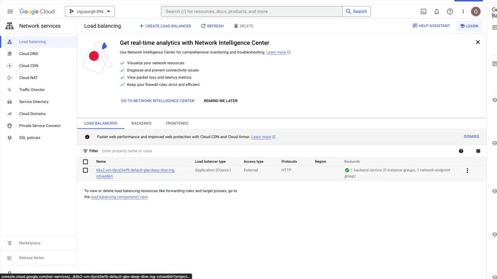
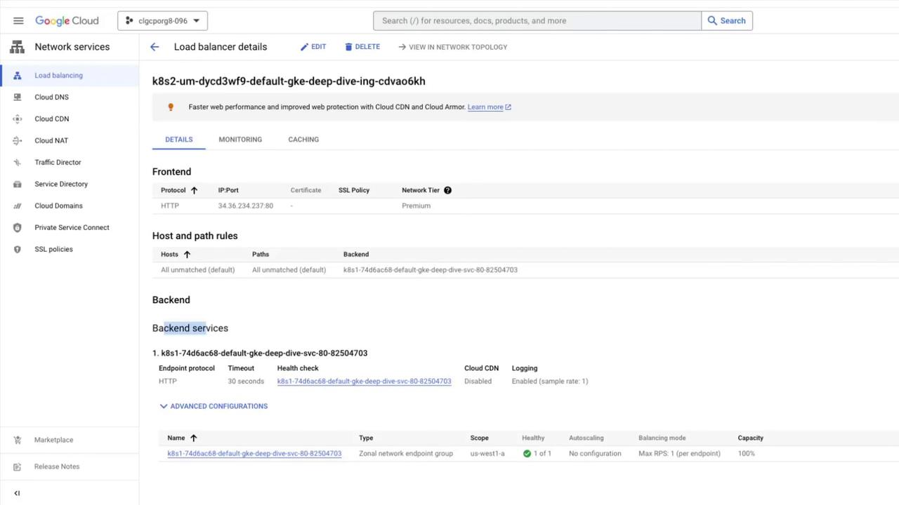
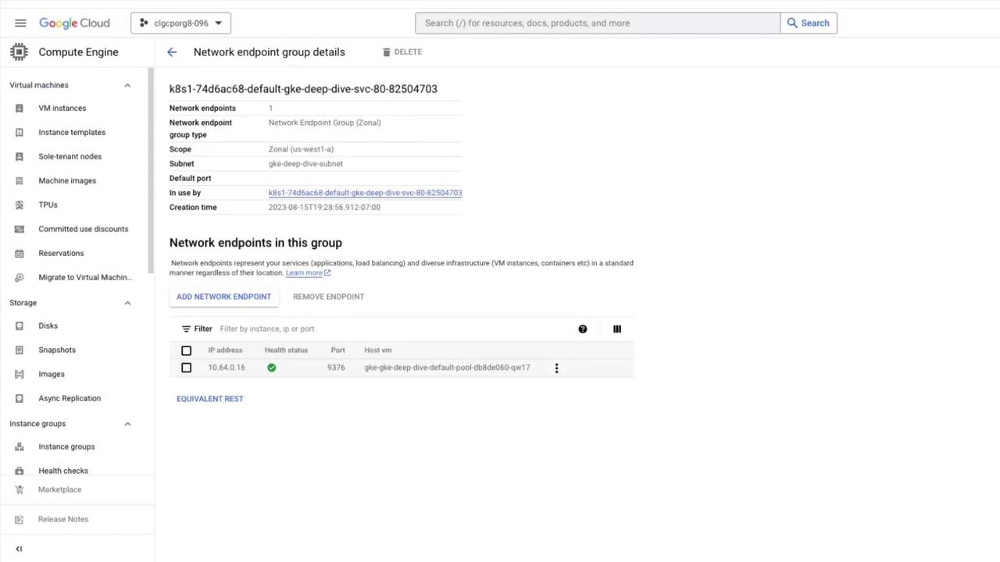

# gke-deep-dive-app.yaml
apiVersion: apps/v1
kind: Deployment
metadata:
  name: gke-deep-dive-app
spec:
  replicas: 2
  selector:
    matchLabels:
      app: online
  template:
    metadata:
      labels:
        app: online
    spec:
      containers:
      - name: gke-deep-dive-app
        image: gcr.io/google-containers/echoserver:1.10
        ports:
        - name: http
          containerPort: 8080
        readinessProbe:
          httpGet:
            path: /healthz
            port: 8080
          scheme: HTTP
```

<Callout icon="lightbulb">
  The readiness probe ensures that traffic is only routed to Pods that have successfully started.
</Callout>

## 4. Prepare the Service Manifest

Save the following Service definition in `gke-deep-dive-svc.yaml`. The annotation `cloud.google.com/l4-rbs: "true"` requests a backend service–based external L4 load balancer.

```yaml theme={null}
# gke-deep-dive-svc.yaml
apiVersion: v1
kind: Service
metadata:
  name: gke-deep-dive-svc
  annotations:
    cloud.google.com/l4-rbs: "true"
spec:
  type: LoadBalancer
  externalTrafficPolicy: Cluster
  selector:
    app: online
  ports:
    - name: tcp-port
      protocol: TCP
      port: 1729
      targetPort: 8080
```

## 5. Deploy the Application and Service

Apply both manifests and verify resources:

```bash theme={null}
kubectl apply -f gke-deep-dive-app.yaml
kubectl apply -f gke-deep-dive-svc.yaml
```

Check Pods and Services:

```bash theme={null}
kubectl get pods
kubectl get svc
```

Example output:

| Resource | NAME                  | READY | STATUS  | PORT(S)        |
| -------- | --------------------- | ----- | ------- | -------------- |
| Pod      | gke-deep-dive-app-xxx | 1/1   | Running |                |
| Service  | gke-deep-dive-svc     |       |         | 1729:31546/TCP |

Wait for the Service’s `EXTERNAL-IP` to appear (this may take a few minutes).

## 6. Verify the External Load Balancer

Retrieve the external IP and test connectivity:

```bash theme={null}
EXTERNAL_IP=$(kubectl get svc gke-deep-dive-svc \
  --output=jsonpath='{.status.loadBalancer.ingress[0].ip}')

curl ${EXTERNAL_IP}:1729
```

A successful response looks like:

```plaintext theme={null}
Hostname: gke-deep-dive-app-xxx
...
client_address=10.64.0.1
...
```

Multiple `curl` requests should alternate between Pod backends.

## 7. Inspect the Service Configuration

Describe the Service to confirm load balancer details:

```bash theme={null}
kubectl describe svc gke-deep-dive-svc
```

Key fields:

* **Type:** LoadBalancer
* **Annotations:** cloud.google.com/l4-rbs: "true"
* **Port Mapping:** 1729/TCP → 8080/TCP
* **Endpoints:** Pod IPs on port 8080
* **External Traffic Policy:** Cluster

Sample excerpt:

```plaintext theme={null}
Name:                     gke-deep-dive-svc
Type:                     LoadBalancer
LoadBalancer Ingress:     35.227.179.152
Port:                     tcp-port 1729/TCP → 8080/TCP
Endpoints:                10.68.132.199:8080,10.68.132.200:8080
```

Your backend service–based external load balancer is now active and distributing traffic across your GKE Pods.

## 8. Links and References

* [Google Kubernetes Engine Documentation](https://cloud.google.com/kubernetes-engine/docs)
* [Kubernetes Services](https://kubernetes.io/docs/concepts/services-networking/service/)
* [kubectl Reference](https://kubernetes.io/docs/reference/kubectl/)

<CardGroup>
  <Card title="Watch Video" icon="video" href="https://learn.kodekloud.com/user/courses/gke-google-kubernetes-engine/module/e39613e2-4771-4eaa-a8cf-6360f282895a/lesson/881d39ae-85b5-466a-81cf-00024d5626ad" />
</CardGroup>


# Demo Configure container native load balancing using Ingress

Source: https://notes.kodekloud.com/docs/GKE-Google-Kubernetes-Engine/Networking-for-GKE-clusters/Demo-Configure-container-native-load-balancing-using-Ingress/page

This tutorial explains setting up container-native load balancing on GKE using Ingress and Network Endpoint Groups.

In this tutorial, you’ll learn how to set up container-native load balancing for your GKE applications using Ingress and Network Endpoint Groups (NEGs). We’ll cover:

1. Creating a custom subnet in your VPC
2. Provisioning a VPC-native GKE cluster with IP aliasing
3. Deploying a simple HTTP server
4. Exposing it via Ingress backed by a NEG
5. Viewing the resulting Load Balancer and NEGs
6. Scaling the deployment and validating load balancing

This end-to-end guide uses Google Cloud Platform commands, Kubernetes manifests, and Console walkthroughs.

***

## 1. Create a custom subnet

First, create a `/24` subnet in the **default** VPC in **us-west1**:

```bash theme={null}
gcloud compute networks subnets create gke-deep-dive-subnet \
  --network=default \
  --region=us-west1 \
  --range=10.10.0.0/24
```

You can verify the new subnet under **VPC networks > default VPC** in the Cloud Console.

<Callout icon="lightbulb">
  Choose a CIDR range that doesn’t overlap with your existing networks. This subnet will host both Pods and Services via secondary IP ranges.
</Callout>

***

## 2. Provision a VPC-native GKE cluster

Set your Compute region and zone, then create a GKE cluster with **IP aliasing** enabled on the custom subnet:

```bash theme={null}
gcloud config set compute/region us-west1
gcloud config set compute/zone us-west1-a

gcloud container clusters create gke-deep-dive \
  --num-nodes=1 \
  --disk-type=pd-standard \
  --disk-size=10 \
  --enable-ip-alias \
  --subnetwork=gke-deep-dive-subnet
```

<Callout icon="lightbulb">
  Cluster provisioning typically takes 10–15 minutes. Verify that two secondary IP ranges (for Pods and Services) appear under your subnet.
</Callout>

<Frame>
  
</Frame>

***

## 3. Deploy the HTTP server application

We’ll deploy a basic HTTP server that responds with its Pod hostname.

### 3.1 Deployment manifest

Create a file named `gke-deep-dive-app.yaml`:

```yaml theme={null}
apiVersion: apps/v1
kind: Deployment
metadata:
  name: gke-deep-dive-app
  labels:
    app: gke-deep-dive-app
spec:
  replicas: 1
  selector:
    matchLabels:
      app: gke-deep-dive-app
  template:
    metadata:
      labels:
        app: gke-deep-dive-app
    spec:
      containers:
        - name: gke-deep-dive
          image: gcr.io/google-containers/serve_hostname
          ports:
            - containerPort: 80
              protocol: TCP
```

Apply and verify:

```bash theme={null}
kubectl apply -f gke-deep-dive-app.yaml
kubectl get pods
```

### 3.2 Service manifest

Expose the Deployment as a ClusterIP Service annotated for NEGs. Save as `gke-deep-dive-svc.yaml`:

```yaml theme={null}
apiVersion: v1
kind: Service
metadata:
  name: gke-deep-dive-svc
  annotations:
    cloud.google.com/neg: '{"ingress": true}'
spec:
  type: ClusterIP
  selector:
    app: gke-deep-dive-app
  ports:
    - name: http
      port: 80
      protocol: TCP
      targetPort: 80
```

Apply and confirm:

```bash theme={null}
kubectl apply -f gke-deep-dive-svc.yaml
kubectl get svc
```

### 3.3 Ingress manifest

Create `gke-deep-dive-ing.yaml` to route HTTP traffic via Ingress:

```yaml theme={null}
apiVersion: networking.k8s.io/v1
kind: Ingress
metadata:
  name: gke-deep-dive-ing
spec:
  defaultBackend:
    service:
      name: gke-deep-dive-svc
      port:
        number: 80
```

Apply the Ingress:

```bash theme={null}
kubectl apply -f gke-deep-dive-ing.yaml
kubectl get ingress
```

<Callout icon="triangle-alert">
  An **EXTERNAL-IP** may take a few minutes to appear. Wait until it’s provisioned before testing.
</Callout>

Once you have the IP, browse to:

```text theme={null}
http://<EXTERNAL_IP>
```

You should see the hostname of the serving Pod.

### 3.4 Resource manifest overview

| Resource Type | File                   | Purpose                                 |
| ------------- | ---------------------- | --------------------------------------- |
| Deployment    | gke-deep-dive-app.yaml | Deploy basic HTTP server                |
| Service       | gke-deep-dive-svc.yaml | Expose Pods with NEG annotation         |
| Ingress       | gke-deep-dive-ing.yaml | Route external HTTP traffic via Ingress |

***

## 4. View Load Balancer and NEG

In the Cloud Console, go to **Network services > Load balancing**. You’ll see an HTTP(S) Load Balancer created for your Ingress:

<Frame>
  
</Frame>

Click the Load Balancer name to view both frontend and backend configurations:

<Frame>
  
</Frame>

Select the backend service to inspect the NEG:

<Frame>
  
</Frame>

***

## 5. Scale and verify load balancing

Increase the Deployment to three replicas:

```bash theme={null}
kubectl scale deployment gke-deep-dive-app --replicas=3
kubectl get deployment gke-deep-dive-app
```

Refresh your browser at the Ingress IP. You’ll see responses cycling through the three Pod hostnames, demonstrating container-native load balancing via Ingress + NEGs.

***

## Links and References

* [GKE documentation](https://cloud.google.com/kubernetes-engine/docs)
* [Kubernetes Ingress Guide](https://kubernetes.io/docs/concepts/services-networking/ingress/)
* [Network Endpoint Groups](https://cloud.google.com/load-balancing/docs/negs)
* [VPC-Native Clusters (IP Aliasing)](https://cloud.google.com/kubernetes-engine/docs/concepts/alias-ips)
* [Google Cloud Console – Load Balancing](https://console.cloud.google.com/net-services/loadbalancing)

<CardGroup>
  <Card title="Watch Video" icon="video" href="https://learn.kodekloud.com/user/courses/gke-google-kubernetes-engine/module/e39613e2-4771-4eaa-a8cf-6360f282895a/lesson/61a3236b-29a3-4279-a59c-f5eec2167b64" />
</CardGroup>
