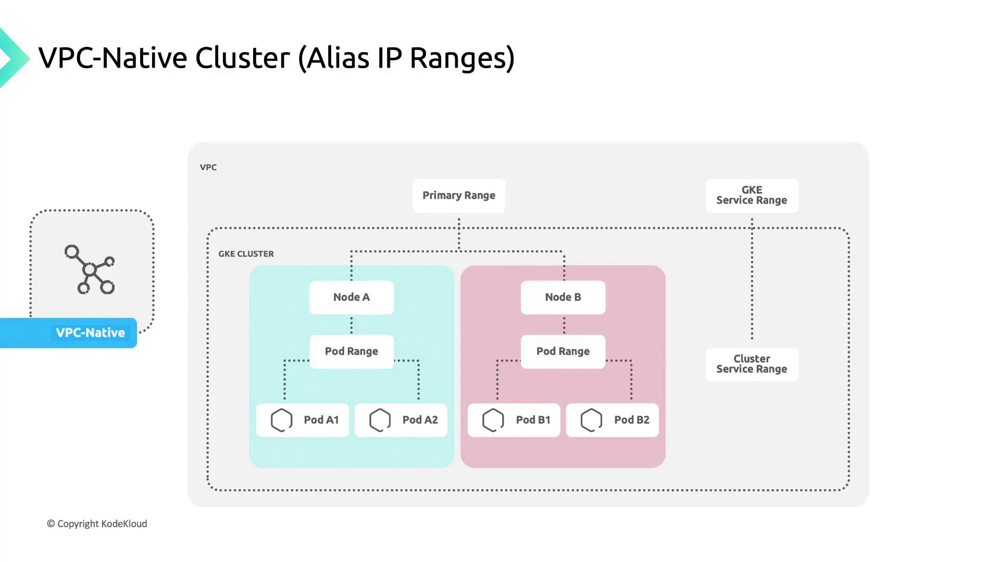
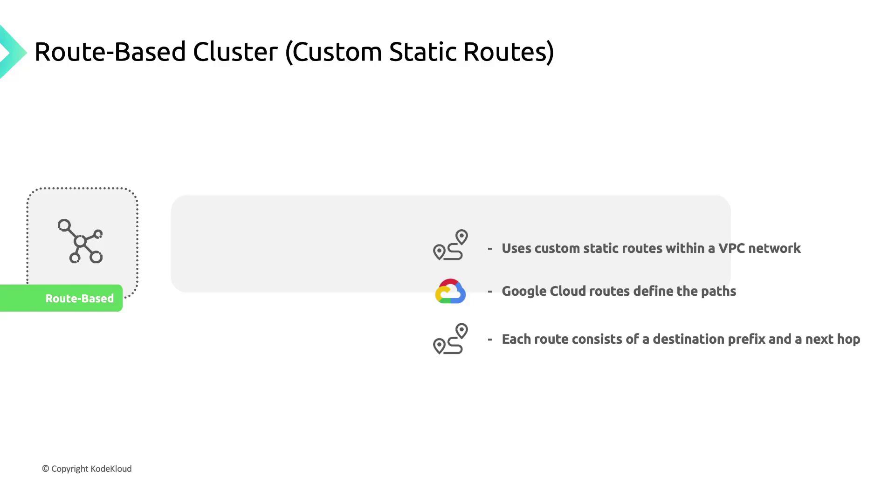
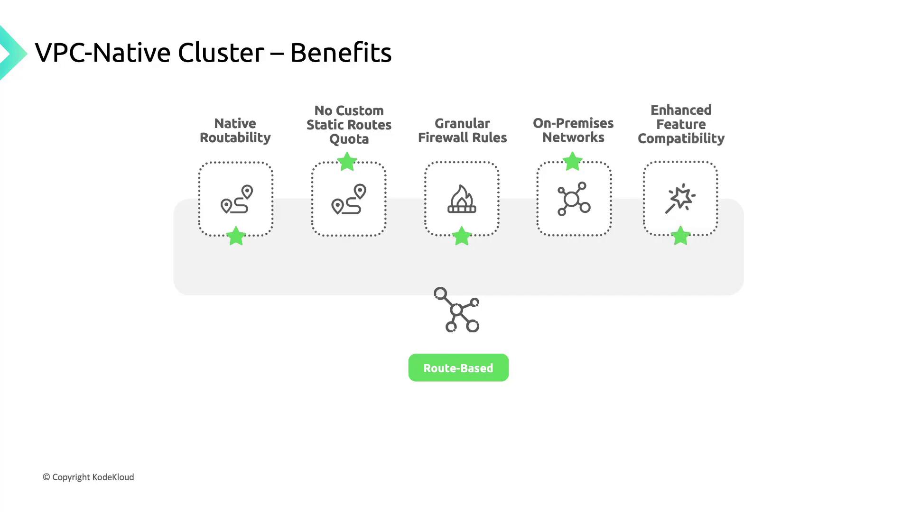

# VPC native and Route based cluster

Source: https://notes.kodekloud.com/docs/GKE-Google-Kubernetes-Engine/Networking-for-GKE-clusters/VPC-native-and-Route-based-cluster/page

This article explains the differences between VPC-native and route-based clusters in Google Kubernetes Engine, focusing on their networking models and operational considerations.

In Google Kubernetes Engine (GKE), clusters differ in how they route Pod-to-Pod traffic. You can choose between:

* **VPC-native clusters**
* **Route-based clusters**

Each approach has its own networking model and operational considerations.

***

## VPC-native Clusters

A VPC-native cluster leverages alias IP ranges so that each VM or Pod network interface can carry multiple IP addresses. This design allows Pods to have their own unique internal IP, simplifying network policies and firewall configurations.

<Frame>
  
</Frame>

<Callout icon="lightbulb">
  GKE Autopilot clusters enable VPC-native routing by default, so you don’t need to configure alias IPs manually.
</Callout>

***

## Route-based Clusters

In a route-based cluster, Pod networking relies on custom static routes defined in your VPC. Each route has:

* A **destination range** (CIDR block)
* A **next-hop** (instance, VPN tunnel, or gateway)

When a Pod sends traffic, Google Cloud uses the destination IP to look up the matching route and forward the packet accordingly.

<Frame>
  
</Frame>

***

## Key Differences

| Feature              | VPC-native            | Route-based                      |
| -------------------- | --------------------- | -------------------------------- |
| IP assignment        | Pod alias IP ranges   | Static routes for Pod CIDR       |
| Scalability          | No route quota limits | Limited by custom route quotas   |
| Firewall granularity | Per-Pod IP ranges     | Per-Node or broad CIDR           |
| VPC peering          | Fully supported       | Requires extra route propagation |
| Autopilot default    | Enabled               | Not available                    |

***

## Benefits of VPC-native Clusters

VPC-native clusters deliver several advantages:

* **Native routability**\
  Pod IPs are fully routable within the cluster’s VPC and any peered networks.
* **No static route quotas**\
  Alias IPs remove the need for per-Pod static routes, avoiding route quota consumption.
* **Granular firewall rules**\
  Apply policies directly to Pod IP ranges for tighter security controls.
* **On-premises connectivity**\
  Secondary Pod IP ranges can be reached via [Cloud VPN](https://cloud.google.com/vpn) or [Cloud Interconnect](https://cloud.google.com/interconnect) using [Cloud Router](https://cloud.google.com/router).
* **Enhanced feature support**\
  Services such as [Network Endpoint Groups (NEGs)](https://cloud.google.com/load-balancing/docs/negs) are optimized for VPC-native networking.

<Frame>
  
</Frame>

***

## References

* [Google Cloud VPN](https://cloud.google.com/vpn)
* [Cloud Interconnect](https://cloud.google.com/interconnect)
* [Cloud Router](https://cloud.google.com/router)
* [Network Endpoint Groups (NEGs)](https://cloud.google.com/load-balancing/docs/negs)
* [GKE Autopilot](https://cloud.google.com/kubernetes-engine/docs/concepts/autopilot-overview)

<CardGroup>
  <Card title="Watch Video" icon="video" href="https://learn.kodekloud.com/user/courses/gke-google-kubernetes-engine/module/e39613e2-4771-4eaa-a8cf-6360f282895a/lesson/4bdb2e96-e39b-448a-bbe8-ebb0bd7a27b2" />
</CardGroup>
