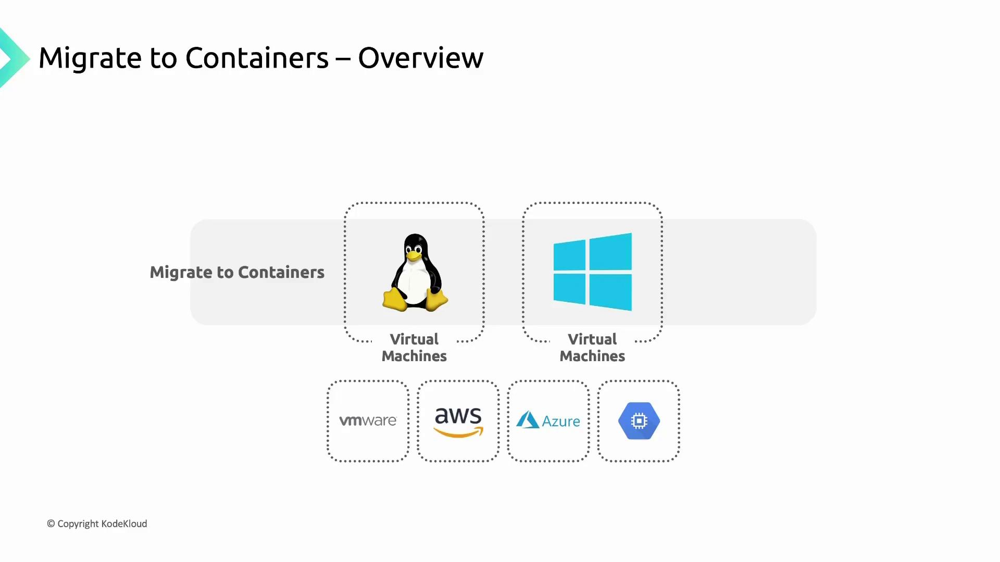
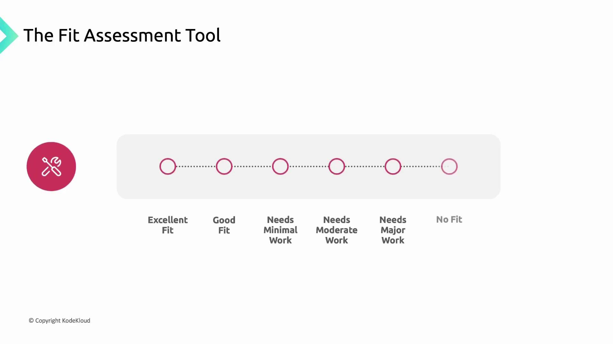

# Set your desired zone
gcloud config set compute/zone us-west1-a

# Create a cluster with one node
gcloud container clusters create gke-deep-dive \
  --num-nodes=1 \
  --machine-type=e2-medium \
  --disk-type=pd-standard \
  --disk-size=10
```

<Callout icon="lightbulb">
  Cluster provisioning can take a few minutes. You can monitor progress in the Google Cloud Console under Kubernetes Engine > Clusters.
</Callout>

***

## 2. Deploy a Simple Nginx Application

Create a Deployment manifest `gke-deep-dive-app.yaml` with two replicas of Nginx:

```yaml theme={null}
apiVersion: apps/v1
kind: Deployment
metadata:
  name: nginx-deployment
spec:
  replicas: 2
  selector:
    matchLabels:
      app: nginx
  template:
    metadata:
      labels:
        app: nginx
    spec:
      containers:
      - name: nginx
        image: nginx:1.7.9
        ports:
        - containerPort: 80
```

Apply the manifest and verify the pods:

```bash theme={null}
kubectl apply -f gke-deep-dive-app.yaml
kubectl get deployments
kubectl get pods
```

| RESOURCE TYPE | COMMAND                                   | DESCRIPTION                        |
| ------------- | ----------------------------------------- | ---------------------------------- |
| Deployment    | `kubectl apply -f gke-deep-dive-app.yaml` | Create or update the deployment    |
| Pods          | `kubectl get pods`                        | List running pods and their status |

***

## 3. Perform Rolling Updates

GKE supports in-place rolling updates, ensuring that at least one replica remains available while others are replaced.

| Action          | Command                                                           | Description                         |
| --------------- | ----------------------------------------------------------------- | ----------------------------------- |
| Update image    | `kubectl set image deployment/nginx-deployment nginx=nginx:1.9.1` | Change the container image to 1.9.1 |
| Monitor rollout | `kubectl rollout status deployment/nginx-deployment`              | Wait until the rollout completes    |

### 3.1 Update to Nginx 1.9.1

```bash theme={null}
kubectl set image deployment/nginx-deployment nginx=nginx:1.9.1
kubectl rollout status deployment/nginx-deployment
```

Verify the new pods are running:

```bash theme={null}
kubectl get pods
```

### 3.2 Update to Nginx 1.21.0

Perform another image update to observe an in-progress rollout:

```bash theme={null}
kubectl set image deployment/nginx-deployment nginx=nginx:1.21.0
kubectl rollout status deployment/nginx-deployment
```

***

## 4. Rollback a Deployment

If a rollout introduces an issue, you can revert to a previous revision.

### 4.1 Rollback to the Previous Revision

```bash theme={null}
kubectl rollout undo deployment/nginx-deployment
kubectl describe deployment/nginx-deployment | grep Image
```

### 4.2 Rollback to a Specific Revision

1. View rollout history:

   ```bash theme={null}
   kubectl rollout history deployment/nginx-deployment
   ```

2. Roll back to revision 1 (original version):

   ```bash theme={null}
   kubectl rollout undo deployment/nginx-deployment --to-revision=1
   kubectl describe deployment/nginx-deployment | grep Image
   ```

<Callout icon="triangle-alert">
  Rolling back to a previous revision may disrupt your application. Always test in a staging environment before rolling back in production.
</Callout>

***

## Links and References

* [GKE Documentation](https://cloud.google.com/kubernetes-engine/docs)
* [Kubernetes Deployments](https://kubernetes.[SECRET_REDACTED]/)
* [kubectl Rollout](https://kubernetes.io/[AWS_SECRET_ACCESS_KEY]-commands#rollout)
* [Nginx Docker Hub](https://hub.docker.com/_/nginx)

<CardGroup>
  <Card title="Watch Video" icon="video" href="https://learn.kodekloud.com/user/courses/gke-google-kubernetes-engine/module/12020a5d-e2fd-46b5-82fb-35aa9cd57ad6/lesson/1890a557-b949-417a-bcab-3faad7e84049" />
</CardGroup>


# Migrate workloads to GKE

Source: https://notes.kodekloud.com/docs/GKE-Google-Kubernetes-Engine/Plan-Deploy-And-Manage-Workloads-On-GKE/Migrate-workloads-to-GKE/page

This guide explains how to convert VM-based applications into containers for deployment on Google Kubernetes Engine using Migrate for Containers.

In this guide, you’ll learn how **Migrate for Containers** streamlines the process of converting VM-based applications into containers and deploying them on Google Kubernetes Engine (GKE). By migrating workloads from virtual machines to GKE, you unlock the benefits of Google Cloud’s managed environment, automated scaling, and integrated networking.

## Supported Source Environments

Migrate for Containers can containerize both Linux and Windows VMs running on any of these platforms:

| Source Environment | Supported OS   |
| ------------------ | -------------- |
| VMware             | Linux, Windows |
| AWS                | Linux, Windows |
| Azure              | Linux, Windows |
| Google Cloud       | Linux, Windows |

<Frame>
  
</Frame>

## Fit Assessment Tool

Before you begin containerization, evaluate each application’s readiness with the built-in **Fit Assessment tool** in Migrate for Containers. This tool scans your source VMs and generates a comprehensive report that:

* Assesses how well an application can run in a container vs. on Compute Engine
* Identifies technical obstacles or unsupported dependencies
* Suggests remediation steps for any issues found

<Frame>
  
</Frame>

### Fit Assessment Categories

| Fit Category  | What It Means                                       |
| ------------- | --------------------------------------------------- |
| Excellent Fit | Ready for containerization with no changes required |
| Good Fit      | Minor adjustments recommended before migration      |
| Fair Fit      | Moderate remediation or refactoring advised         |
| Poor Fit      | Complex dependencies; significant changes needed    |
| No Fit        | Not suitable for containerization at this time      |

<Callout icon="lightbulb">
  Review the assessment report thoroughly. Address any configuration tweaks or dependency updates before you proceed to containerize and deploy on GKE.
</Callout>

## Next Steps

1. Remediate any issues identified by the Fit Assessment tool.
2. Follow the [Migrate for Containers documentation](https://cloud.google.com/migrate/containers/docs) to containerize your VM workloads.
3. Deploy your new containers to GKE using the [GKE documentation](https://cloud.google.com/kubernetes-engine/docs).

By completing these steps, you’ll have your VM-based applications running reliably on Google Kubernetes Engine, taking full advantage of Google Cloud’s managed services and scalability.

<CardGroup>
  <Card title="Watch Video" icon="video" href="https://learn.kodekloud.com/user/courses/gke-google-kubernetes-engine/module/12020a5d-e2fd-46b5-82fb-35aa9cd57ad6/lesson/88d26274-e530-4f0e-9f1d-50d812af4ba0" />
</CardGroup>
