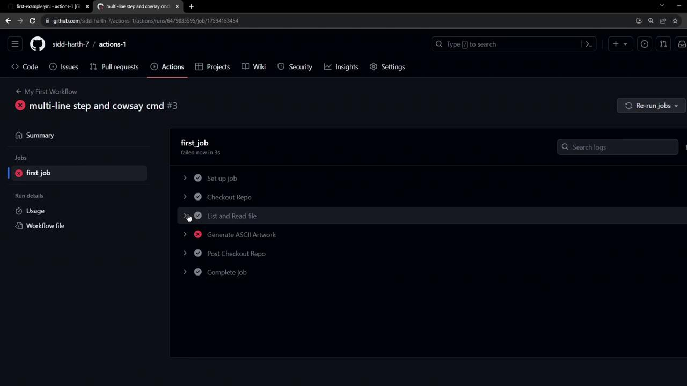

# Multi Line commands and Executing Third Party Libraries

Source: https://notes.kodekloud.com/docs/GitHub-Actions-Certification/GitHub-Actions-Core-Concepts/Multi-Line-commands-and-Executing-Third-Party-Libraries/page

This guide explains how to optimize GitHub Actions workflows by combining shell commands and integrating third-party CLI tools like cowsay.

In this guide, you’ll learn how to streamline your GitHub Actions workflow by combining multiple shell commands into a single step and integrating a third-party CLI tool (`cowsay`). This approach reduces verbosity and keeps your CI/CD pipeline maintainable.

## Workflow with Separate Steps

Initially, our workflow consisted of four discrete steps:

```yaml theme={null}
name: My First Workflow
on: push
jobs:
  first_job:
    runs-on: ubuntu-latest
    steps:
      - name: Checkout Repo
        uses: actions/checkout@v4

      - name: Welcome message
        run: echo "My first GitHub Actions Job"

      - name: List files
        run: ls

      - name: Read file
        run: cat README.md
```

While functional, this pattern can become repetitive as your CI job grows.

## Combining Multiple Commands in One Step

You can collapse several shell commands under a single `run` key by using a multiline pipe (`|`). Each command executes in sequence on the same virtual environment.

<Callout icon="lightbulb">
  Grouping commands reduces the number of workflow steps and improves readability. Remember that if any command fails, the entire step stops.
</Callout>

```yaml theme={null}
name: My First Workflow
on: push
jobs:
  first_job:
    runs-on: ubuntu-latest
    steps:
      - name: Checkout Repo
        uses: actions/checkout@v4

      - name: List and Read Files
        run: |
          echo "My first GitHub Actions Job"
          ls -ltra
          cat README.md
```

## Adding a Third-Party CLI Tool

Next, let’s use `cowsay`—a fun ASCII art generator—to create a dragon illustration and append it to `dragon.txt`:

```yaml theme={null}
      - name: Generate ASCII Artwork
        run: cowsay -f dragon "Run for cover, I am a DRAGON....RAWR" >> dragon.txt
```

<Callout icon="triangle-alert">
  The default Ubuntu runner does **not** include `cowsay`. You must install it before running the command.
</Callout>

### Installing Dependencies

Add an installation step immediately before invoking `cowsay`:

```yaml theme={null}
      - name: Install Cowsay
        run: |
          sudo apt-get update
          sudo apt-get install -y cowsay
```

## Complete Workflow Example

Putting it all together, here’s your optimized workflow:

```yaml theme={null}
name: My First Workflow
on: push
jobs:
  first_job:
    runs-on: ubuntu-latest
    steps:
      - name: Checkout Repo
        uses: actions/checkout@v4

      - name: List and Read Files
        run: |
          echo "My first GitHub Actions Job"
          ls -ltra
          cat README.md

      - name: Install Cowsay
        run: |
          sudo apt-get update
          sudo apt-get install -y cowsay

      - name: Generate ASCII Artwork
        run: cowsay -f dragon "Run for cover, I am a DRAGON....RAWR" >> dragon.txt
```

| Step Name              | Action            | Purpose                              |
| ---------------------- | ----------------- | ------------------------------------ |
| Checkout Repo          | `uses`            | Clone the repository to the runner   |
| List and Read Files    | `run` (multiline) | Echo a message, list and read files  |
| Install Cowsay         | `run` (multiline) | Install the `cowsay` package         |
| Generate ASCII Artwork | `run`             | Generate ASCII art into `dragon.txt` |

## Troubleshooting

Once you commit and push these changes, navigate to the **Actions** tab to monitor your workflow. If you forget to install `cowsay`, you’ll see a failure like this:

<Frame>
  
</Frame>

## References

* [GitHub Actions: Workflow Syntax](https://docs.github.com/en/actions/using-workflows/workflow-syntax-for-github-actions)
* [actions/checkout](https://github.com/actions/checkout)
* [GitHub Actions Runner Images](https://github.com/actions/runner-images)

<CardGroup>
  <Card title="Watch Video" icon="video" href="https://learn.kodekloud.com/user/courses/github-actions-certification/module/54711be0-66e6-461b-b935-f77d78a5e000/lesson/8b7d9602-42e0-49f7-a174-1815a112b3d6" />
</CardGroup>
