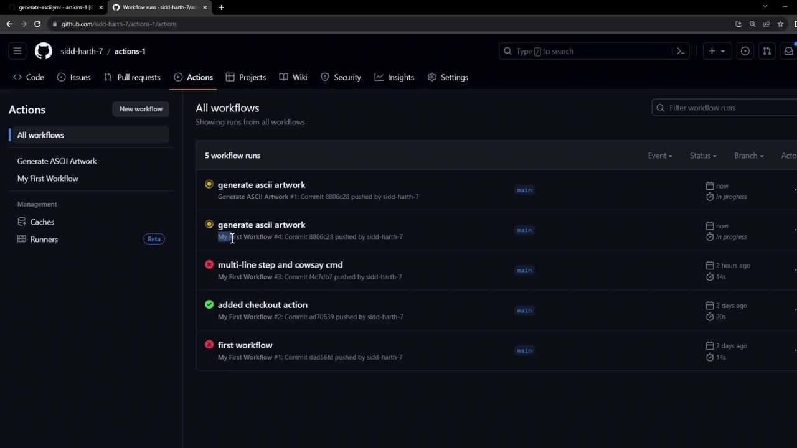

# .github/workflows/ci.yml
name: CI Pipeline

on:
  push:
    branches: [ main ]

jobs:
  build:
    runs-on: ubuntu-latest
    steps:
      - name: Check out repository
        uses: actions/checkout@v3.6.0
```

## Specifying Action Versions

Pinning Actions to specific versions helps maintain stability and repeatability in your CI/CD workflows. You can reference an Action by tag, branch, or SHA:

| Versioning Method | Stability                   | Syntax Example                                                    |
| ----------------- | --------------------------- | ----------------------------------------------------------------- |
| Tag               | Stable; semantic versioning | `uses: actions/checkout@v3.6.0`                                   |
| Branch            | Rolling updates (risky)     | `uses: actions/checkout@main`                                     |
| SHA               | Immutable commit            | `uses: actions/checkout@a824008085750b8e136effc585c3cd6082bd575f` |

<Callout icon="lightbulb">
  For production workflows, pin to a tagged release or a commit SHA to avoid unexpected breaking changes.
</Callout>

## Best Practices

* Reuse official and verified Actions when possible to reduce security risks.
* Extract common steps into [composite Actions][actions-docs] to keep workflows DRY.
* Regularly audit and update pinned versions to include security patches and new features.

## Links and References

* [GitHub Marketplace][marketplace]
* [GitHub Actions Documentation][actions-docs]
* [GitHub Actions Security Guidelines][security-guidelines]

[marketplace]: https://github.com/marketplace

[actions-docs]: https://docs.github.com/en/actions

[security-guidelines]: https://docs.github.com/en/actions/security-guides

<CardGroup>
  <Card title="Watch Video" icon="video" href="https://learn.kodekloud.com/user/courses/github-actions-certification/module/54711be0-66e6-461b-b935-f77d78a5e000/lesson/5fe28e1e-ea2a-4783-8b36-fae524609ac5" />
</CardGroup>


# Workflow to Generate ASCII Artwork

Source: https://notes.kodekloud.com/docs/GitHub-Actions-Certification/GitHub-Actions-Core-Concepts/Workflow-to-Generate-ASCII-Artwork/page

Automate ASCII art generation using the cowsay utility in a dedicated GitHub Actions workflow for clean and maintainable CI/CD pipelines.

Automate ASCII art generation using the `cowsay` utility in a dedicated GitHub Actions workflow. Isolating this process into its own workflow file keeps your CI/CD pipelines clean and easy to maintain.

## 1. Create the Workflow File

Under `.github/workflows/`, create `generate-ascii.yaml` and add:

```yaml theme={null}
name: Generate ASCII Artwork

on:
  push:

jobs:
  ascii_job:
    runs-on: ubuntu-latest
    steps:
      - name: Checkout Repository
        uses: actions/checkout@v4

      - name: Install cowsay
        run: |
          sudo apt-get update
          sudo apt-get install -y cowsay

      - name: Generate ASCII Art
        run: cowsay -f dragon "Run for cover, I am a DRAGON....RAWR" >> dragon.txt

      - name: Verify Output
        run: grep -i "dragon" dragon.txt

      - name: Display Artwork
        run: cat dragon.txt

      - name: List Workspace Files
        run: ls -ltra
```

### Summary of Steps

| Step                 | Purpose                                                 |
| -------------------- | ------------------------------------------------------- |
| Checkout Repository  | Retrieves your code so later steps can access files     |
| Install cowsay       | Installs the `cowsay` utility on the Ubuntu runner      |
| Generate ASCII Art   | Creates dragon ASCII art and appends it to `dragon.txt` |
| Verify Output        | Confirms the word “dragon” exists in the text file      |
| Display Artwork      | Prints the ASCII art to the console                     |
| List Workspace Files | Ensures `dragon.txt` is present in the runner directory |

## 2. Trigger the Workflow

Commit and push the new workflow to your repository:

```bash theme={null}
git add .github/workflows/generate-ascii.yaml
git commit -m "Add Generate ASCII Artwork workflow"
git push origin main
```

GitHub Actions will detect the `push` event and run **all** workflows configured for it—including your new ASCII art generator.

## 3. View and Inspect Runs

Navigate to the **Actions** tab in your GitHub repository to see the status of each workflow:

<Frame>
  
</Frame>

### Successful Run Logs

```console theme={null}
Run sudo apt-get update && sudo apt-get install -y cowsay
Reading package lists...
Building dependency tree...
Reading state information...
The following NEW packages will be installed:
  cowsay
Fetched 18.6 kB in 0s (269 kB/s)
Selecting previously unselected package cowsay.
...
> grep -i dragon dragon.txt
Run for cover, I am a DRAGON....RAWR

> cat dragon.txt
 ____________
< Run for cover, I am a DRAGON....RAWR >
 ------------
        \   ^__^
         \  (oo)\_______
            (__)\       )\/\
                ||----w |
                ||     ||
```

<Callout icon="lightbulb">
  Files created during a workflow run (e.g., `dragon.txt`) exist only on the runner VM. They are removed once the job completes and do not persist in your repository.
</Callout>

## 4. Disable an Outdated Workflow

If you have multiple workflows listening on `push` and want to prevent an old one from running:

1. Open the **Actions** tab and select the workflow to disable.
2. Click **Disable workflow** in the sidebar.

<Callout icon="triangle-alert">
  Disabling a workflow stops **all** future runs for that configuration. Ensure you’re disabling the correct workflow.
</Callout>

***

## References

* [GitHub Actions Documentation](https://docs.github.com/actions)
* [cowsay Manual](https://manpages.debian.org/bullseye/cowsay/cowsay.1.en.html)

<CardGroup>
  <Card title="Watch Video" icon="video" href="https://learn.kodekloud.com/user/courses/github-actions-certification/module/54711be0-66e6-461b-b935-f77d78a5e000/lesson/d3368b59-eb2e-43a7-8714-5e3470263955" />
</CardGroup>
