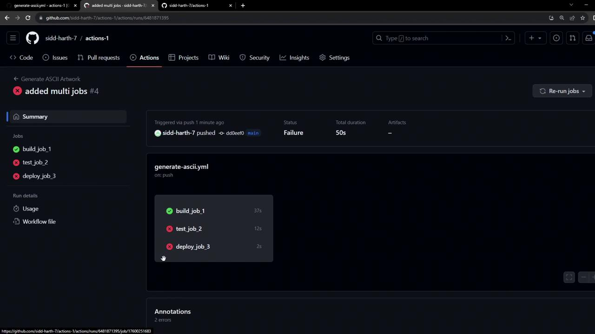
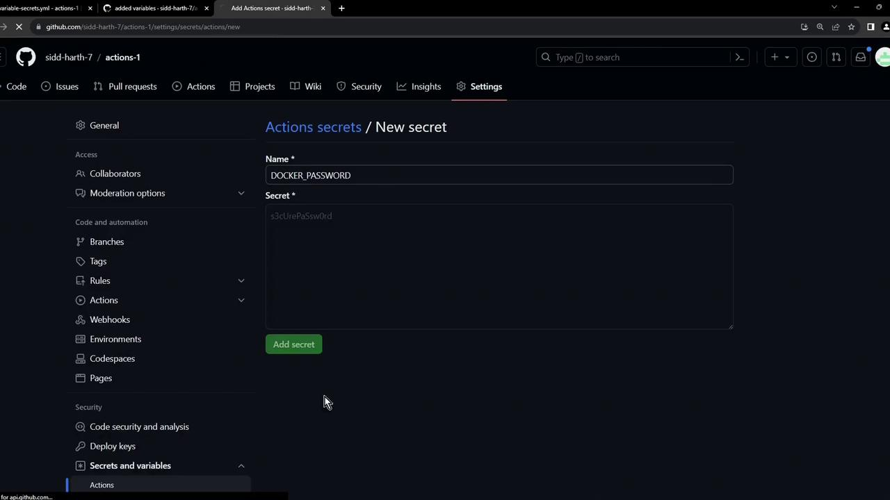
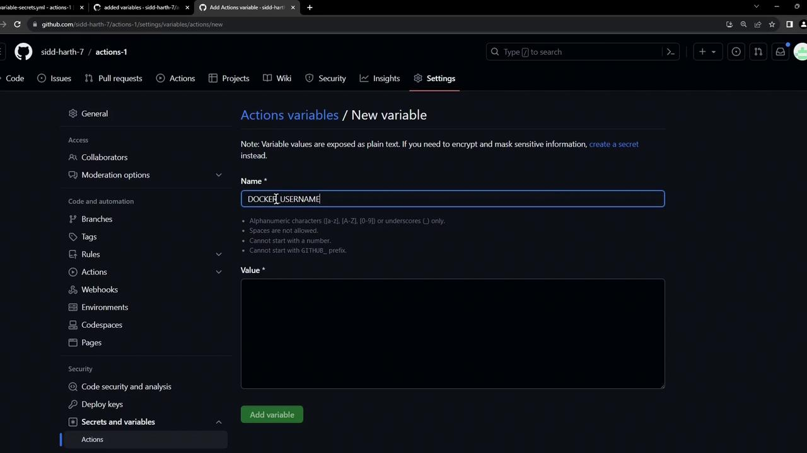
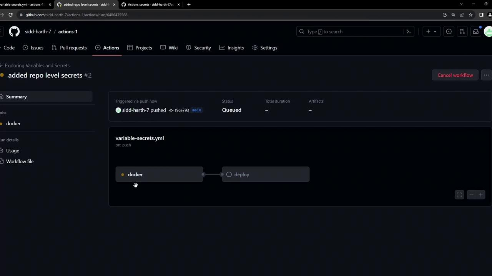
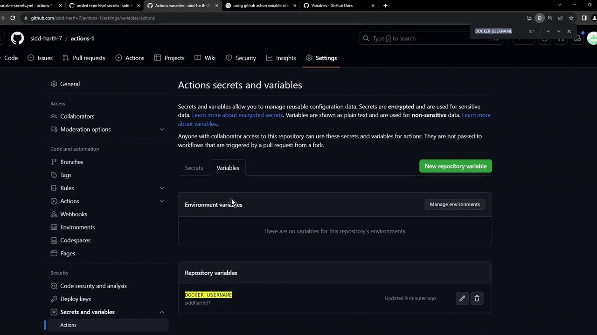

# .github/workflows/generate-ascii.yml
name: Generate ASCII Artwork
on: push

jobs:
  ascii_job:
    runs-on: ubuntu-latest
    steps:
      - name: Checkout repository
        uses: actions/checkout@v2

      - name: Execute ASCII script
        run: |
          chmod +x ascii-script.sh
          ./ascii-script.sh
```

This approach is simple but not scalable. Everything—from installation to deployment—occurs in a single VM instance.

***

## Multi-Job Workflow Setup

Below is an improved workflow with three distinct jobs: **build\_job\_1**, **test\_job\_2**, and **deploy\_job\_3**. Each job runs on its own runner:

```yaml theme={null}
# .github/workflows/generate-ascii.yml
name: Generate ASCII Artwork
on:
  push:
    branches:
      - main

jobs:
  build_job_1:
    runs-on: ubuntu-latest
    steps:
      - name: Checkout repository
        uses: actions/checkout@v2

      - name: Install cowsay
        run: sudo apt-get update && sudo apt-get install cowsay -y

      - name: Generate ASCII dragon
        run: cowsay -f dragon "Run for cover, I am a DRAGON.... RAWR" >> dragon.txt

      - name: Pause for 30 seconds
        run: sleep 30

  test_job_2:
    runs-on: ubuntu-latest
    steps:
      - name: Pause for 10 seconds
        run: sleep 10

      - name: Verify dragon.txt
        run: grep -i "dragon" dragon.txt

  deploy_job_3:
    runs-on: ubuntu-latest
    steps:
      - name: Display dragon.txt
        run: cat dragon.txt

      - name: Simulate deployment
        run: echo "Deploying dragon.txt..."
```

### Job Overview

| Job Name       | Purpose                         | Key Steps                               |
| -------------- | ------------------------------- | --------------------------------------- |
| build\_job\_1  | Install dependencies & generate | Install `cowsay`, create `dragon.txt`   |
| test\_job\_2   | Validate build output           | Check for “dragon” in `dragon.txt`      |
| deploy\_job\_3 | Output & deploy                 | Print file content, simulate deployment |

***

## Default Parallel Execution & Failures

By default, GitHub Actions runs jobs **in parallel** on separate VMs. Since there’s no shared filesystem or enforced order, downstream jobs may start before the build completes.

<Frame>
  
</Frame>

<Callout icon="lightbulb">
  Jobs in GitHub Actions are **isolated** by default. To share files or enforce ordering, you’ll need to use [job dependencies](https://docs.github.com/actions/using-workflows/workflow-syntax-for-github-actions#jobsjob_idneeds) and [artifacts](https://docs.github.com/actions/using-workflows/storing-workflow-data-as-artifacts).
</Callout>

***

## Common Errors

When jobs run in parallel without dependencies, you may see errors like:

```bash theme={null}
grep -i "dragon" dragon.txt
cat dragon.txt
# cat: dragon.txt: No such file or directory
# Error: Process completed with exit code 1.
```

***

## Issues to Address Next

1. **Job Sequencing**\
   Ensure `build_job_1` completes before `test_job_2`, and `test_job_2` before `deploy_job_3` using the `needs` keyword.

2. **Artifact Sharing**\
   Use `actions/upload-artifact` in the build job and `actions/download-artifact` in downstream jobs to pass `dragon.txt`.

***

## References

* [GitHub Actions: Workflow syntax](https://docs.github.com/actions/using-workflows/workflow-syntax-for-github-actions)
* [GitHub Actions: Using artifacts](https://docs.github.com/actions/using-workflows/storing-workflow-data-as-artifacts)
* [GitHub Actions: Job dependencies](https://docs.github.com/actions/using-workflows/workflow-syntax-for-github-actions#jobsjob_idneeds)

<CardGroup>
  <Card title="Watch Video" icon="video" href="https://learn.kodekloud.com/user/courses/github-actions-certification/module/54711be0-66e6-461b-b935-f77d78a5e000/lesson/ee44ec45-b859-4ead-bdb3-a63e71a7ea56" />
</CardGroup>


# Working with Repository Level Secrets

Source: https://notes.kodekloud.com/docs/GitHub-Actions-Certification/GitHub-Actions-Core-Concepts/Working-with-Repository-Level-Secrets/page

Managing sensitive data in GitHub Actions by storing credentials at the repository level and referencing them securely in workflows.

Securely managing sensitive data in GitHub Actions is essential for robust CI/CD pipelines. In this guide, you’ll learn how to store credentials at the repository level and reference them in your workflows without exposing plain-text values.

## Table of Contents

* [Why Use Secrets and Variables?](#why-use-secrets-and-variables)
* [Scopes of Secrets and Variables](#scopes-of-secrets-and-variables)
* [Adding a Repository-Level Secret](#adding-a-repository-level-secret)
* [Adding a Repository-Level Variable](#adding-a-repository-level-variable)
* [Referencing Secrets and Variables](#referencing-secrets-and-variables)
* [Inspecting Workflow Logs](#inspecting-workflow-logs)
* [Further Reading](#further-reading)

***

## Why Use Secrets and Variables?

Embedding credentials in workflow YAML blocks risks accidental leaks via PRs, clones, or shared logs. GitHub Actions provides a secure mechanism to inject encrypted values at runtime:

* **Secrets** for sensitive data (passwords, tokens).
* **Variables** for non-sensitive settings (usernames, tags).

## Scopes of Secrets and Variables

You can define secrets and variables at three different levels:

| Scope        | Use Case                                    | Visibility                            |
| ------------ | ------------------------------------------- | ------------------------------------- |
| Organization | Shared across multiple repositories         | Only Org Admins                       |
| Repository   | Shared by all workflows in a single repo    | Write access to Settings              |
| Environment  | Limited to specific deployment environments | Environment admins and selected roles |

***

## Adding a Repository-Level Secret

1. Navigate to **Settings** > **Secrets and variables** > **Actions**.
2. Click **New repository secret**, set the **Name** (e.g., `DOCKER_PASSWORD`), and paste your secret.
3. Click **Add secret** to save.

<Frame>
  
</Frame>

<Callout icon="lightbulb">
  Repository secrets are encrypted and cannot be viewed once saved. If you lose the value, you must recreate the secret.
</Callout>

***

## Adding a Repository-Level Variable

1. Still under **Settings** > **Secrets and variables** > **Actions**, select **New repository variable**.
2. Enter **Name** (e.g., `DOCKER_USERNAME`) and **Value**.
3. Click **Add variable** to confirm.

<Frame>
  
</Frame>

<Callout icon="lightbulb">
  Repository variables are visible in Settings but cannot expose sensitive information.\
  Use variables for configuration values that are not confidential.
</Callout>

***

## Referencing Secrets and Variables

Below is an **insecure** example with a plain-text password:

```yaml theme={null}
name: Exploring Variables and Secrets
on: [push]

env:
  CONTAINER_REGISTRY: docker.io
  DOCKER_USERNAME: siddharth1
  IMAGE_NAME: github-actions-nginx

jobs:
  docker:
    runs-on: ubuntu-latest
    steps:
      - name: Docker Build
        run: echo docker build

      - name: Docker Login
        env:
          DOCKER_PASSWORD: s3cUrePasSw0rd
        run: echo docker login --username=$DOCKER_USERNAME --password=$DOCKER_PASSWORD

      - name: Docker Publish
        run: echo docker push $CONTAINER_REGISTRY/$DOCKER_USERNAME/$IMAGE_NAME:latest
```

### Secure Workflow with Repository-Level Secrets and Variables

```yaml theme={null}
name: Exploring Variables and Secrets
on: [push]

env:
  CONTAINER_REGISTRY: docker.io
  IMAGE_NAME: github-actions-nginx

jobs:
  docker:
    runs-on: ubuntu-latest
    steps:
      - name: Docker Build
        run: |
          echo docker build \
            -t ${{ env.CONTAINER_REGISTRY }}/${{ vars.DOCKER_USERNAME }}/${{ env.IMAGE_NAME }}:latest

      - name: Docker Login
        run: |
          echo docker login \
            --username=${{ vars.DOCKER_USERNAME }} \
            --password=${{ secrets.DOCKER_PASSWORD }}

      - name: Docker Publish
        run: |
          echo docker push \
            ${{ env.CONTAINER_REGISTRY }}/${{ vars.DOCKER_USERNAME }}/${{ env.IMAGE_NAME }}:latest

  deploy:
    needs: docker
    runs-on: ubuntu-latest
    steps:
      - name: Docker Run
        run: |
          echo docker run -d -p 8080:80 \
            ${{ env.CONTAINER_REGISTRY }}/${{ vars.DOCKER_USERNAME }}/${{ env.IMAGE_NAME }}:latest
```

<Callout icon="triangle-alert">
  Your editor might flag unresolved `${{ vars.* }}` or `${{ secrets.* }}` references. These work at runtime and can be safely ignored.
</Callout>

***

## Inspecting Workflow Logs

After committing and pushing your workflow, visit the **Actions** tab to observe the run:

<Frame>
  
</Frame>

Expand the **Docker Login** step to verify masking:

```bash theme={null}
echo docker login \
  --username=${{ vars.DOCKER_USERNAME }} \
  --password=${{ secrets.DOCKER_PASSWORD }}
  shell: /usr/bin/bash -e {0}
  env:
    CONTAINER_REGISTRY: docker.io
    IMAGE_NAME: github-actions-nginx
docker login --username=siddharth1 --***
```

<Frame>
  
</Frame>

Secrets remain hidden (`***`) and variables load correctly at runtime.

***

## Further Reading

* [GitHub Actions: Encrypted Secrets](https://docs.github.com/actions/security-guides/encrypted-secrets)
* [GitHub Actions: Variables](https://docs.github.com/actions/learn-github-actions/variables)
* [GitHub Actions Workflow Syntax](https://docs.github.com/actions/using-workflows/workflow-syntax-for-github-actions)

<CardGroup>
  <Card title="Watch Video" icon="video" href="https://learn.kodekloud.com/user/courses/github-actions-certification/module/54711be0-66e6-461b-b935-f77d78a5e000/lesson/d5436351-8810-41ce-8101-735d3ccb00b4" />

  <Card title="Practice Lab" icon="installation" href="https://learn.kodekloud.com/user/courses/github-actions-certification/module/54711be0-66e6-461b-b935-f77d78a5e000/lesson/bfc35eeb-db29-492f-904f-05e0be0240c1" />
</CardGroup>
