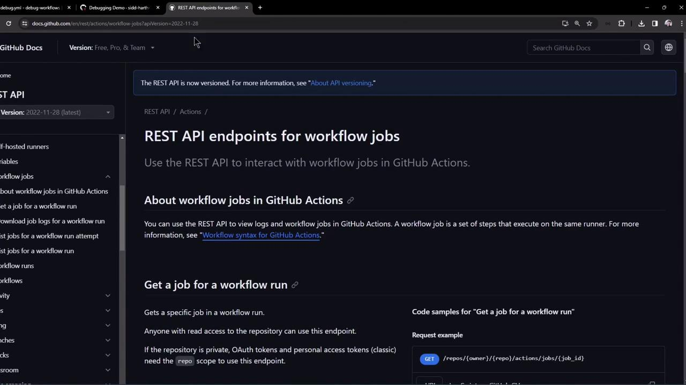
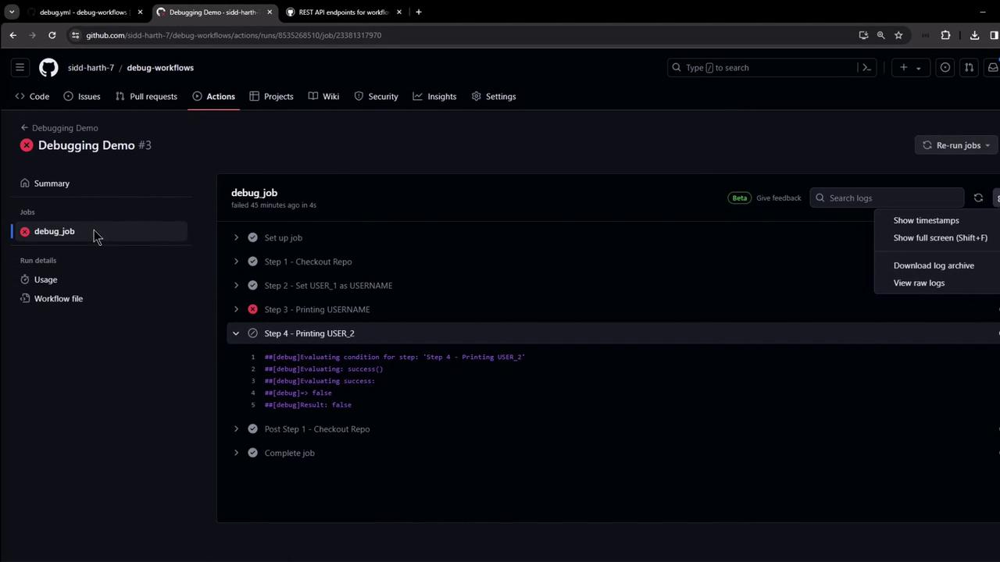
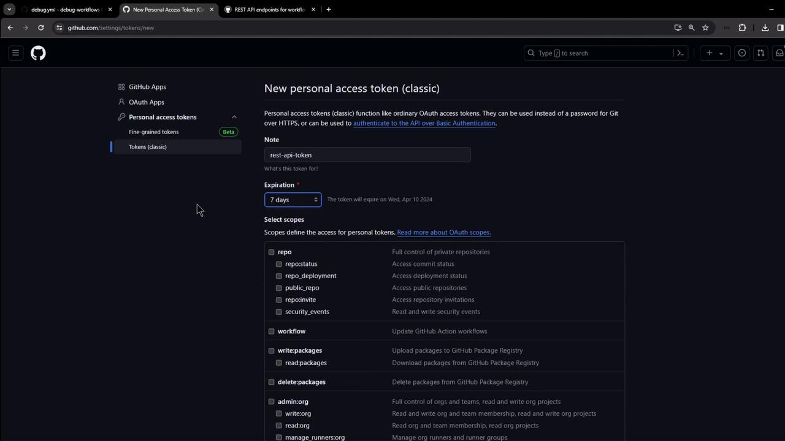
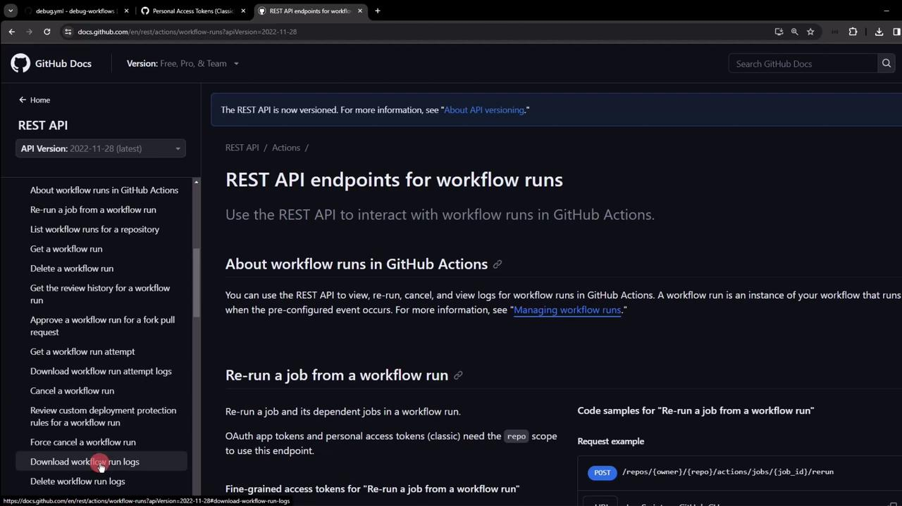

# Continue your action logic...
```

A non-zero `exit` will signal failure back to GitHub Actions.

***

## Links and References

* [GitHub Actions Workflow Commands](https://docs.github.com/en/actions/learn-github-actions/workflow-commands-for-github-actions)
* [GitHub Actions Toolkit](https://github.com/actions/toolkit)
* [GitHub Actions: Custom Actions](https://docs.github.com/en/actions/creating-actions)

<CardGroup>
  <Card title="Watch Video" icon="video" href="https://learn.kodekloud.com/user/courses/github-actions-certification/module/428391ee-45d0-4e9c-9e06-78d0c5ff7657/lesson/f8a38a6e-55ac-4234-9eb9-d887b501b041" />
</CardGroup>


# Access the workflow logs from GitHubs REST API

Source: https://notes.kodekloud.com/docs/GitHub-Actions-Certification/GitHub-Actions-Core-Concepts/Access-the-workflow-logs-from-GitHubs-REST-API/page

This guide explains how to automate retrieval of GitHub Actions workflow logs using the REST API for integration in CI/CD pipelines and monitoring tools.

In this guide, you’ll learn how to automate the retrieval of GitHub Actions workflow logs and job metadata using GitHub’s REST API. While the GitHub Actions UI lets you download logs manually, the REST endpoints enable seamless integration in CI/CD pipelines, monitoring tools, and other automation workflows.

<Frame>
  
</Frame>

## 1. Fetch a Specific Job’s Details

Use this endpoint to get metadata and step-level statuses for a particular job in a workflow run:

```bash theme={null}
curl -L \
  -H "Accept: application/vnd.github+json" \
  -H "Authorization: Bearer <YOUR_TOKEN>" \
  -H "X-GitHub-Api-Version: 2022-11-28" \
  https://api.github.com/repos/OWNER/REPO/actions/jobs/JOB_ID
```

Replace `OWNER`, `REPO`, and `JOB_ID` with your repository owner, name, and the numeric job ID.

<Callout icon="lightbulb">
  If you’re querying a public repository, you can omit the `Authorization` header.
</Callout>

Sample response excerpt:

```json theme={null}
{
  "id": 23381317970,
  "run_id": 8535268510,
  "workflow_name": "Debugging Demo",
  "head_branch": "main",
  "status": "completed",
  "conclusion": "failure",
  "steps": [
    { "name": "Set up job", "status": "completed", "conclusion": "success", "number": 1 },
    { "name": "Step 3 - Printing USERNAME", "status": "completed", "conclusion": "failure", "number": 4 },
    { "name": "Step 4 - Printing USER_2", "status": "completed", "conclusion": "skipped", "number": 5 }
  ]
}
```

<Frame>
  
</Frame>

## 2. Download Raw Logs for a Single Job

Once you know the `JOB_ID`, fetch its logs as a ZIP archive:

```bash theme={null}
curl -L -k \
  -H "Accept: application/vnd.github+json" \
  -H "Authorization: Bearer <YOUR_TOKEN>" \
  -H "X-GitHub-Api-Version: 2022-11-28" \
  https://api.github.com/repos/OWNER/REPO/actions/jobs/JOB_ID/logs \
  -o job_logs.zip
```

* `-k` skips SSL validation (only use in controlled environments).
* `-o job_logs.zip` writes the output to a file.

Unzip and inspect:

```bash theme={null}
unzip job_logs.zip -d job_logs
ls job_logs
```

Each file or folder in `job_logs` corresponds to individual steps and runner logs.

<Callout icon="triangle-alert">
  Avoid using `-k` in production—always validate SSL certificates to secure your data in transit.
</Callout>

## 3. Generate a GitHub Personal Access Token

For private repositories, set up a Personal Access Token (PAT) with the minimal scopes:

1. Navigate to **Settings → Developer settings → Personal access tokens → Tokens (classic)**.
2. Click **Generate new token**, add a descriptive note and expiration.
3. Select **repo** and **workflow** scopes.
4. Copy the token; use it as `Authorization: Bearer <YOUR_TOKEN>`.

<Frame>
  
</Frame>

## 4. Download Logs for an Entire Workflow Run

To grab logs for every job in a workflow run, hit the run-level endpoint:

```bash theme={null}
curl -L -k \
  -H "Accept: application/vnd.github+json" \
  -H "Authorization: Bearer <YOUR_TOKEN>" \
  -H "X-GitHub-Api-Version: 2022-11-28" \
  https://api.github.com/repos/OWNER/REPO/actions/runs/RUN_ID/logs \
  -o run_logs.zip
```

* Replace `RUN_ID` with the numeric workflow run ID.
* The ZIP contains logs for all jobs in the specified run.

<Frame>
  
</Frame>

After downloading:

```bash theme={null}
unzip run_logs.zip -d workflow_run_logs
ls workflow_run_logs
```

## Quick Reference: GitHub Actions Logs Endpoints

| Operation                | HTTP Method & Path              | Description                                   |
| ------------------------ | ------------------------------- | --------------------------------------------- |
| Get job details          | GET /repos///actions/jobs/      | Retrieves job metadata and step statuses      |
| Download single-job logs | GET /repos///actions/jobs//logs | Downloads a ZIP of logs for one job           |
| Download full run logs   | GET /repos///actions/runs//logs | Downloads a ZIP of logs for all jobs in a run |

## Conclusion

Automating the download and inspection of GitHub Actions logs with the REST API helps integrate build insights into custom dashboards, alerts, and other tools. Always follow best practices for token security and grant only the required scopes.

## Links and References

* [GitHub Actions REST API Documentation](https://docs.github.com/en/rest/actions)
* [Creating a Personal Access Token](https://docs.github.com/en/authentication/keeping-your-account-and-data-secure/creating-a-personal-access-token)
* [Unzipping Files on Linux](https://linux.die.net/man/1/unzip)

<CardGroup>
  <Card title="Watch Video" icon="video" href="https://learn.kodekloud.com/user/courses/github-actions-certification/module/54711be0-66e6-461b-b935-f77d78a5e000/lesson/69f61dcf-2635-4a33-93d1-58470ea8d0ee" />
</CardGroup>
