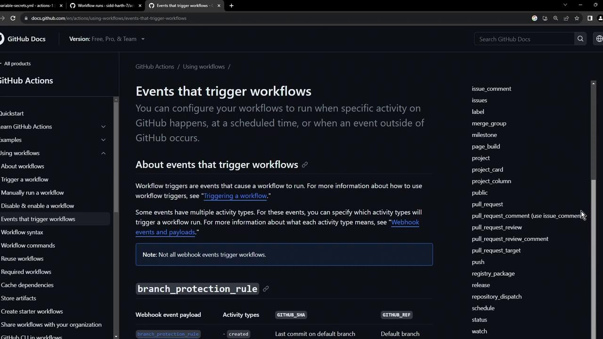
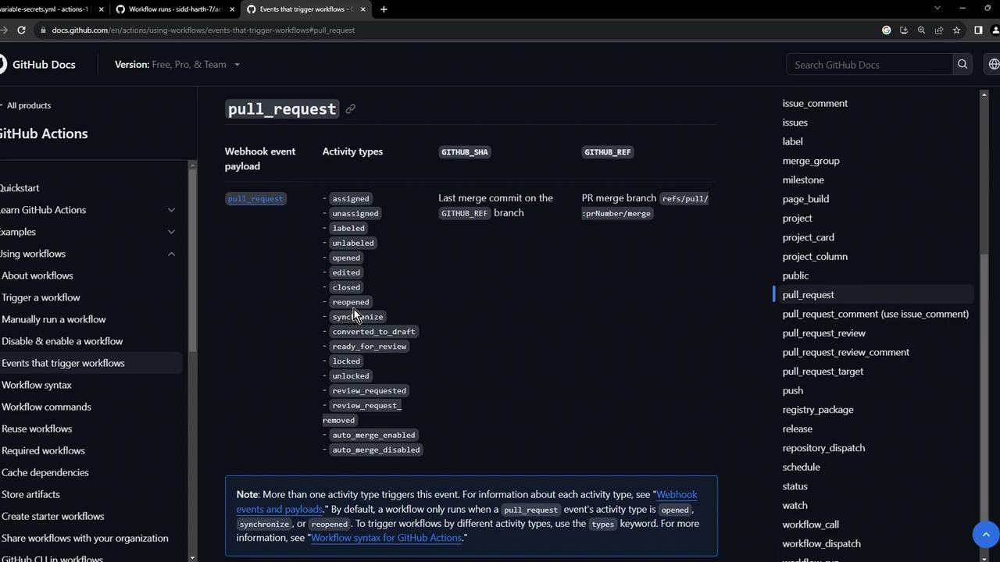
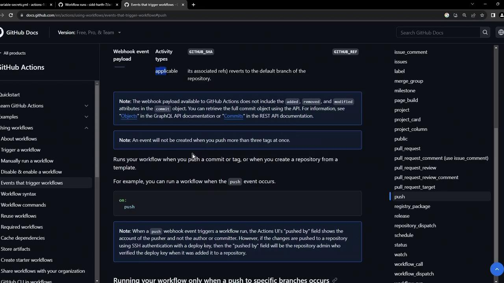
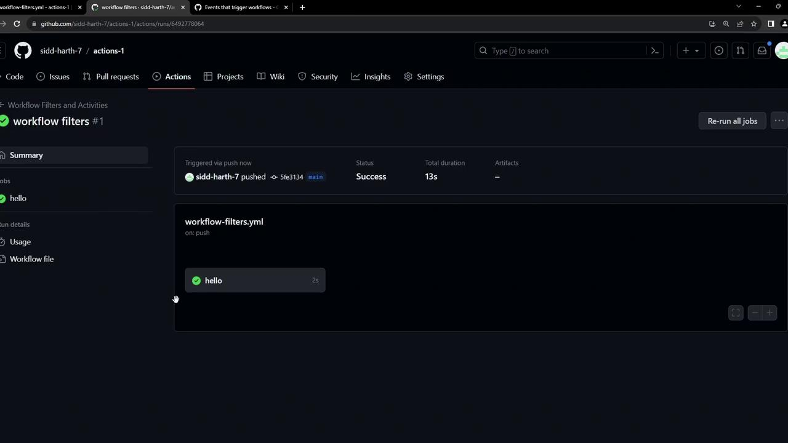

# Workflow Event Filters and Activity Types

Source: https://notes.kodekloud.com/docs/GitHub-Actions-Certification/GitHub-Actions-Core-Concepts/Workflow-Event-Filters-and-Activity-Types/page

This article explains how to fine-tune GitHub Actions workflows using event filters and activity types to optimize builds.

GitHub Actions workflows can trigger on events such as `push`, `workflow_dispatch`, and `schedule`. To avoid unnecessary builds, you can fine-tune which events—and which parts of those events—actually invoke your jobs.

First, review GitHub’s [list of available event activity types](https://docs.github.com/en/actions/using-workflows/events-that-trigger-workflows). For example, Pull Request events support activities like `assigned`, `opened`, and `closed`:

<Frame>
  
</Frame>

For details on Pull Request types, see the [official docs](https://docs.github.com/en/actions/using-workflows/events-that-trigger-workflows#pull_request):

<Frame>
  
</Frame>

Push events don’t have activity types, but you can filter by branches, tags, and paths:

<Frame>
  
</Frame>

## Key Filter Options

| Filter Key        | Description                           | Applies To             |
| ----------------- | ------------------------------------- | ---------------------- |
| `branches`        | Only run on listed branches           | `push`, `pull_request` |
| `branches-ignore` | Skip listed branches                  | `push`, `pull_request` |
| `paths-ignore`    | Exclude specific files or directories | `push`, `pull_request` |
| `types`           | Limit to certain activity types       | `pull_request`         |

<Callout icon="lightbulb">
  Using these filters reduces unexpected workflow runs and speeds up your CI/CD pipeline.
</Callout>

***

## Example Workflow: Combining Filters and Activity Types

Add the file at `.github/workflows/filters-and-activities.yml`:

```yaml theme={null}
name: Workflow Filters and Activities

on:
  workflow_dispatch:

  push:
    branches:
      - main
    branches-ignore:
      - 'feature/*'
      - 'test/**'

  pull_request:
    types:
      - opened
      - closed
    paths-ignore:
      - README.md
    branches:
      - main

jobs:
  hello:
    runs-on: ubuntu-latest
    steps:
      - name: Show Event
        run: echo "This workflow ran for event: ${{ github.event_name }}"
```

### Reviewing the Push Filter

* `branches: [main]` ensures only pushes to `main` trigger the workflow.
* `branches-ignore: ['feature/*', 'test/**']` skips any branch matching those patterns.

***

### Live Example 1: Push to `main`

Pushing to `main` queues and runs the workflow:

<Frame>
  
</Frame>

### Live Example 2: Push to Ignored Branch

```bash theme={null}
git checkout -b feature/event-testing
