# Edit README.md
git add README.md
git commit -m "Update README for testing"
git push -u origin feature/event-testing
```

Since `feature/*` is ignored, no workflow runs:

<Frame>
  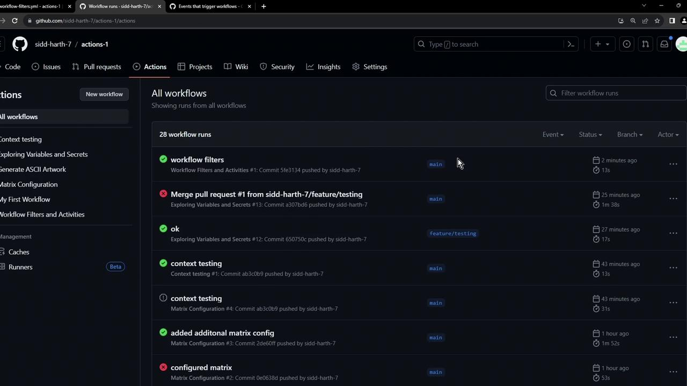
</Frame>

***

## Pull Request Filters and Activity Types

### Example 1: Only `README.md` Changed

Opening a PR from `feature/event-testing` to `main` with only `README.md` modified will not trigger the workflow due to `paths-ignore`:

<Frame>
  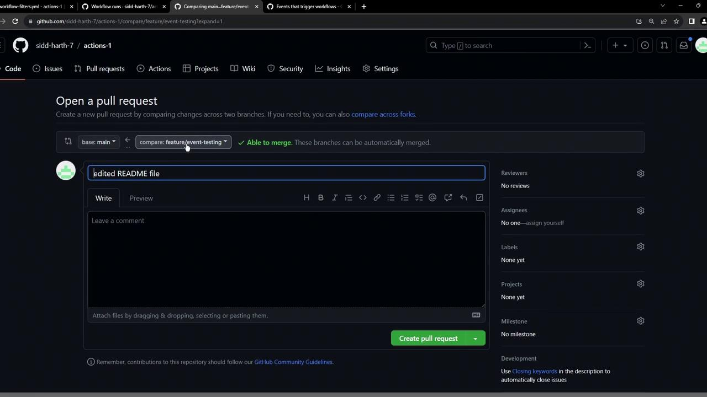
</Frame>

Even after opening or closing, nothing runs:

<Frame>
  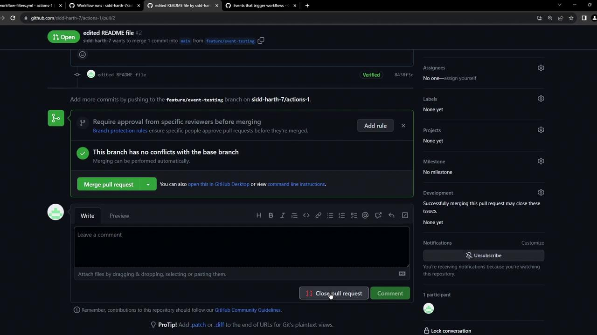
</Frame>

### Example 2: Other Files Changed

Modify any file besides `README.md`, push, and open a new PR. The workflow now triggers:

<Frame>
  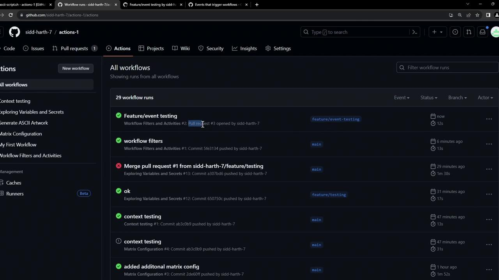
</Frame>

Click into the run to view the `hello` job:

<Frame>
  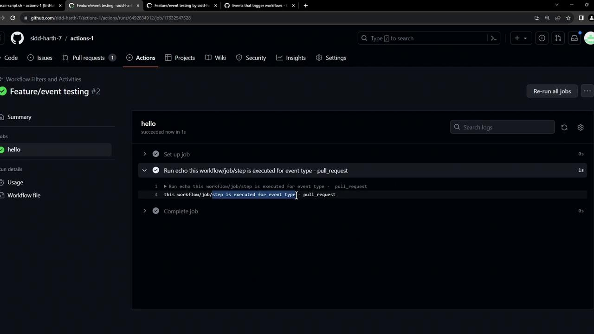
</Frame>

***

## Conclusion

By combining `branches`, `branches-ignore`, `paths-ignore`, and `types`, you gain precise control over which push and pull\_request events trigger your workflows. This leads to faster feedback cycles and cleaner CI build history.

<CardGroup>
  <Card title="Watch Video" icon="video" href="https://learn.kodekloud.com/user/courses/github-actions-certification/module/54711be0-66e6-461b-b935-f77d78a5e000/lesson/8d7ceef2-975e-47f4-8298-7d1b878dcb6c" />
</CardGroup>


# workflow dispatch Input Options

Source: https://notes.kodekloud.com/docs/GitHub-Actions-Certification/GitHub-Actions-Core-Concepts/workflow-dispatch-Input-Options/page

Learn to use the workflow_dispatch trigger in GitHub Actions for custom inputs in manual workflows, enhancing usability for team members and contributors.

In this guide, you’ll learn how to leverage the `workflow_dispatch` trigger in GitHub Actions to define custom inputs for manual workflows. By specifying parameters, you can create a more intuitive, guided interface for team members and contributors.

<Callout icon="lightbulb">
  GitHub supports up to 10 top-level inputs in a `workflow_dispatch` trigger. Use descriptive names and defaults to simplify the form.\
  See the [Workflow Syntax documentation](https://docs.github.com/actions/using-workflows/workflow-syntax-for-github-actions#onworkflow_dispatch) for details.
</Callout>

<Frame>
  
</Frame>

## Supported Input Types

Use these five input types to collect values in your workflow form:

| Input Type  | Description                         | YAML Example                |
| ----------- | ----------------------------------- | --------------------------- |
| boolean     | True/false toggle                   | `type: boolean`             |
| choice      | Select one option from a list       | `type: choice` + `options:` |
| string      | Free-form text                      | `type: string`              |
| number      | Numeric value                       | `type: number`              |
| environment | Select from repository environments | `type: environment`         |

## Basic Input Example

Below is a minimal example showing `choice`, `boolean`, `string`, and `environment` inputs. Access them in steps via `${{ inputs.<name> }}`:

```yaml theme={null}
on:
  workflow_dispatch:
    inputs:
      logLevel:
        description: 'Log level'
        required: true
        default: 'warning'
        type: choice
        options:
          - info
          - warning
          - debug
      print_tags:
        description: 'Print tags to STDOUT'
        required: true
        type: boolean
      tags:
        description: 'Test scenario tags'
        required: true
        type: string
      environment:
        description: 'Environment to run tests against'
        required: true
        type: environment

jobs:
  print-tag:
    runs-on: ubuntu-latest
    if: ${{ inputs.print_tags }}
    steps:
      - run: echo "Tags: ${{ inputs.tags }}"
```

***

## Example Repository

Clone or browse the **trigger-inputs** repository to see these inputs in action. It contains a simple README and one workflow file:

<Frame>
  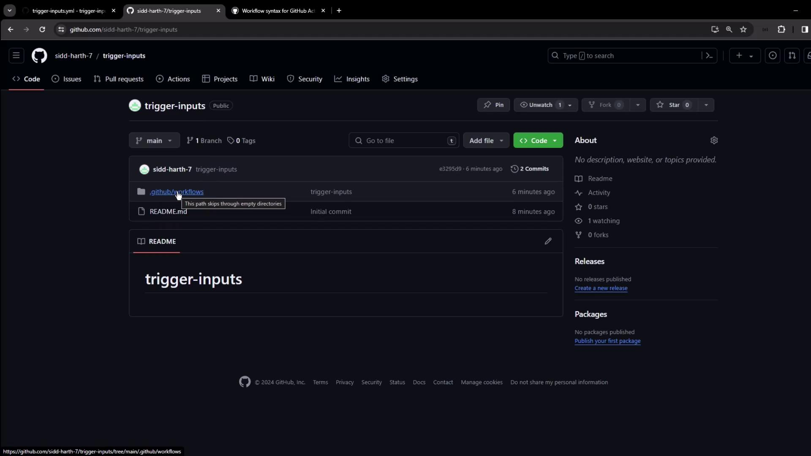
</Frame>

***

## Defining the Workflow

Open `.github/workflows/trigger-inputs.yml` in your editor:

<Frame>
  
</Frame>

This workflow declares five inputs and a job that prints them:

```yaml theme={null}
name: Triggered Workflow with Various Inputs
on:
  workflow_dispatch:
    inputs:
      run-tests:
        description: 'Run unit tests'
        required: false
        type: boolean
      test-type:
        description: 'Type of tests to run'
        type: choice
        options:
          - unit
          - integration
          - all
        required: true
      environment:
        description: 'Deployment target'
        type: environment
        required: true
      build-number:
        description: 'Custom build number'
        type: number
        required: false
      message:
        description: 'Additional message'
        type: string
        required: false

jobs:
  build-and-deploy:
    runs-on: ubuntu-latest
    steps:
      - name: Print workflow inputs
        run: |
          echo "Run tests: ${{ inputs.run-tests }}"
          echo "Test type: ${{ inputs.test-type }}"
          echo "Environment: ${{ inputs.environment }}"
          echo "Build number: ${{ inputs.build-number }}"
          echo "Message: ${{ inputs.message }}"

      - name: Run tests (if selected)
        if: ${{ inputs.run-tests }}
        run: echo "Running tests..."

      # Uncomment to deploy based on the selected environment
      # - name: Deploy to ${{ inputs.environment }}
      #   environment: ${{ inputs.environment }}
      #   run: echo "Deploying to ${{ inputs.environment }}"
```

***

## Running the Workflow

1. Go to the **Actions** tab, select **Triggered Workflow with Various Inputs**, and click **Run workflow**.
2. GitHub displays a form based on your `inputs` block:

<Frame>
  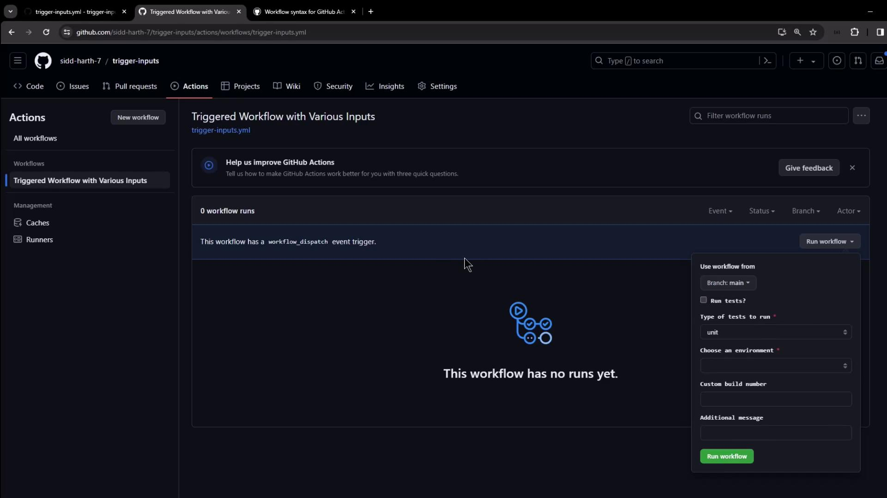
</Frame>

3. Choose the branch, toggle **Run tests**, pick your **Test type**, select an **Environment**, and enter **Build number** or **Message** as needed.
4. Click **Run workflow**.

***

## Creating Environments

If no environments exist, add them under **Settings** → **Environments**. We created two examples here:

<Frame>
  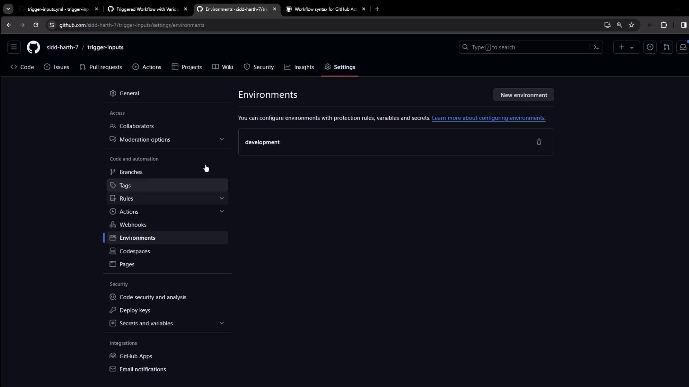
</Frame>

***

## Viewing the Run

After you submit the form, watch the job start:

<Frame>
  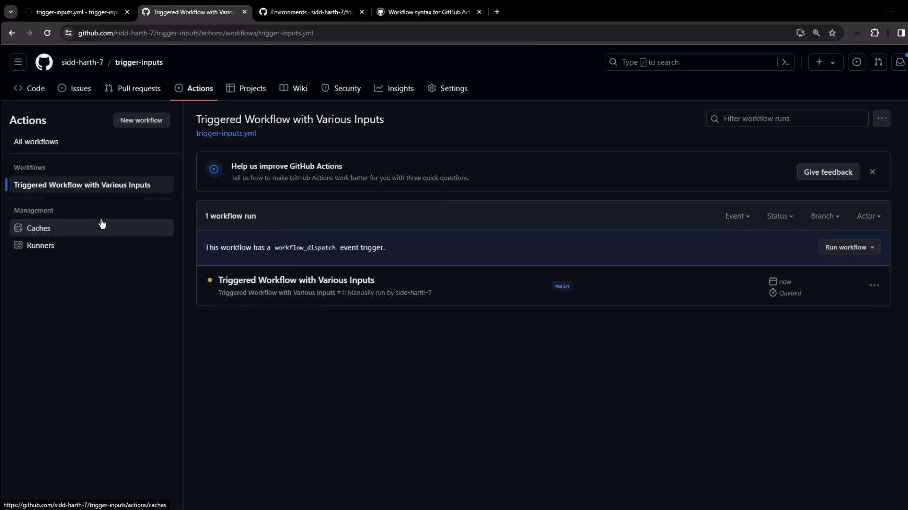
</Frame>

Once it finishes, open the logs to confirm your inputs:

<Frame>
  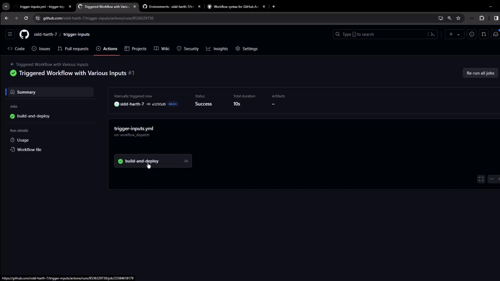
</Frame>

```bash theme={null}
echo "Run tests: true"
echo "Test type: integration"
echo "Environment: production"
echo "Build number: 12345"
echo "Message: testing input options"
```

***

## Conditional Steps and Debugging

When you guard a step with a boolean input, compare directly to a boolean:

```yaml theme={null}
- name: Run tests (if selected)
  if: ${{ inputs.run-tests }}
  run: echo "Testing..."
```

<Callout icon="triangle-alert">
  Avoid comparing a boolean input to a string (`'true'`). That always evaluates to false, as shown in the debug logs below.
</Callout>

<Frame>
  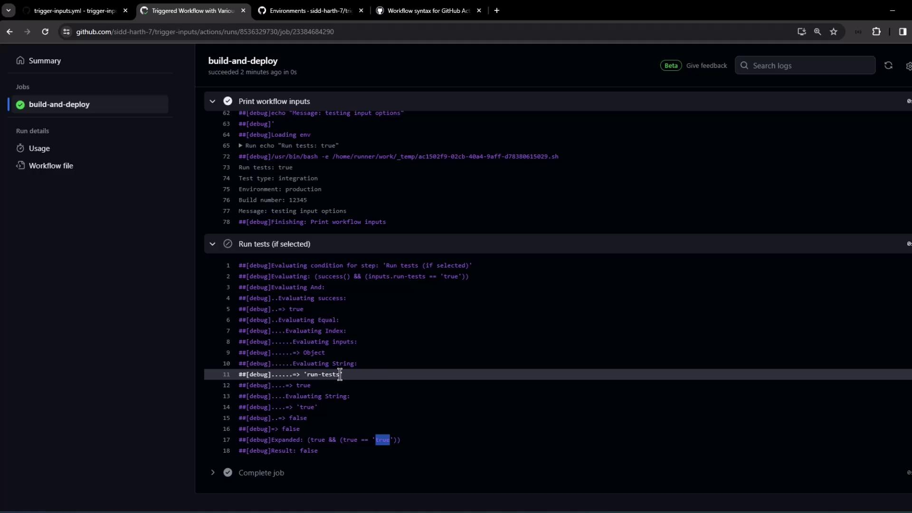
</Frame>

```plaintext theme={null}
##[debug]Evaluating: (success() && (inputs.run-tests == 'true'))
##[debug]=> success: true
##[debug]=> (true == 'true'): false
##[debug]Result: false
```

***

## Summary

* Define up to 10 `workflow_dispatch` inputs (boolean, choice, string, number, environment).
* Access values with `${{ inputs.<name> }}` in your steps.
* Use inputs in `if:` conditional expressions.
* Enable [workflow debug logs](https://docs.github.com/actions/managing-workflow-runs/enabling-debug-logging) to troubleshoot.

With these patterns, you can build flexible, user-friendly GitHub Actions workflows that adapt at run time.

<CardGroup>
  <Card title="Watch Video" icon="video" href="https://learn.kodekloud.com/user/courses/github-actions-certification/module/54711be0-66e6-461b-b935-f77d78a5e000/lesson/01eed79c-e158-4729-8b6a-a98e7410decb" />
</CardGroup>
