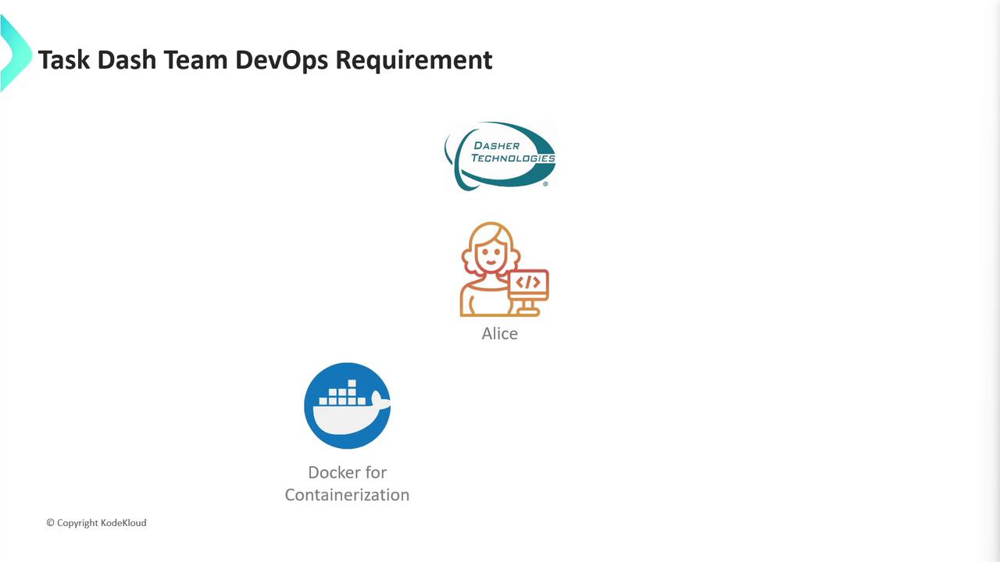
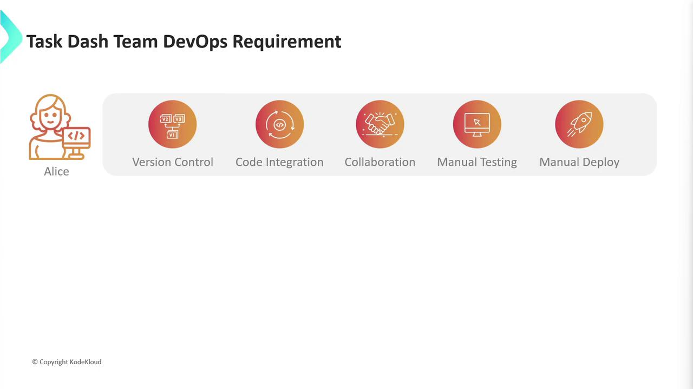
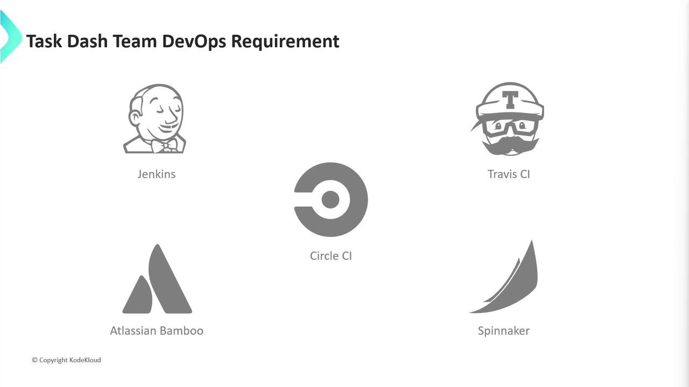
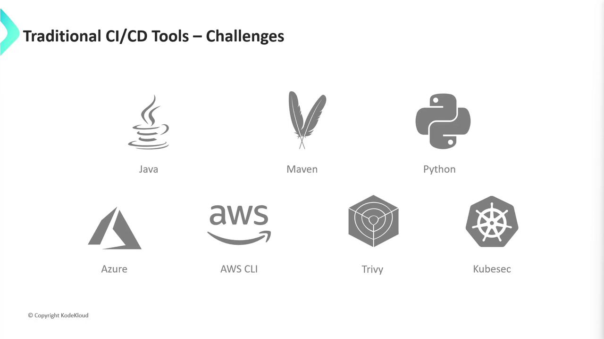
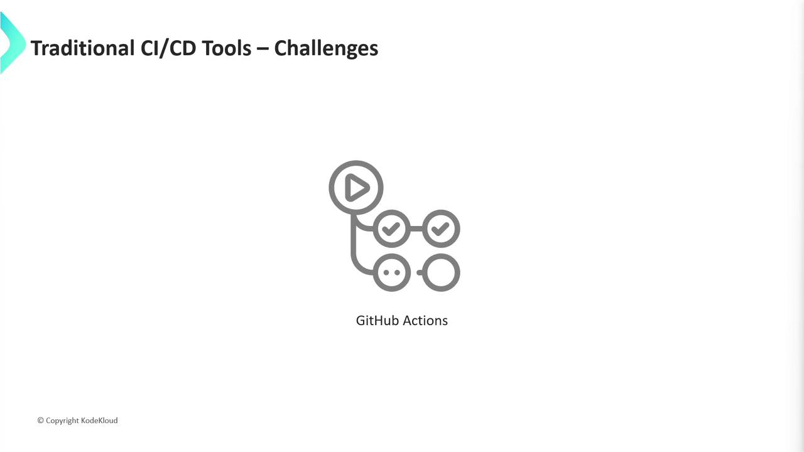

# Problem Statement Meeting with Dasher Team

Source: https://notes.kodekloud.com/docs/GitHub-Actions-Certification/Introduction/Problem-Statement-Meeting-with-Dasher-Team/page

The article discusses the migration of Dasher Technologys R&D efforts to the cloud using Docker and Kubernetes, focusing on improving DevOps practices.

## Overview

Dasher Technology specializes in connecting data, applications, and devices across on-premise environments. To modernize their R\&D efforts, the DevOps team led by Alice is migrating workloads to the cloud using Docker and Kubernetes. The initial focus is a Node.js application, with plans to extend these practices to Java and Python projects.

<Frame>
  
</Frame>

## Current Workflow and Roadmap

Alice’s team currently lacks standardized version control and automated pipelines. Manual coding, testing, and deployments introduce delays and instability. To streamline delivery, they have identified these core objectives:

* Version control and collaborative branching
* Automated unit testing with code coverage
* Container image building and registry publishing
* Kubernetes-based deployments
* Integration and end-to-end testing

<Frame>
  
</Frame>

### Key Pipeline Steps

1. Adopt GitHub for source control and PR reviews
2. Execute unit tests and generate coverage reports
3. Build Docker containers and push to a registry
4. Deploy to Kubernetes clusters
5. Run automated integration tests

<Frame>
  
</Frame>

## Evaluating CI/CD Platforms

A variety of CI/CD services exist. Below is a comparison of popular tools:

| Tool      | Type              | Pros                               | Cons                                 |
| --------- | ----------------- | ---------------------------------- | ------------------------------------ |
| Jenkins   | Self-hosted       | Highly extensible, large community | Requires VM provisioning and upkeep  |
| Travis CI | Hosted            | Simple YAML config                 | Limited concurrency on free tier     |
| CircleCI  | Hosted            | Containerized workflows            | Usage limits on open source projects |
| Bamboo    | Self-hosted       | Deep Atlassian integration         | Commercial license                   |
| Spinnaker | Self-hosted/cloud | Multi-cloud deployment support     | Steeper learning curve               |

<Frame>
  
</Frame>

## Why Jenkins Becomes Complex

Choosing Jenkins adds operational overhead:

* VM or dedicated server setup with proper CPU, memory, and storage
* Java JDK installation, firewall rules, and plugin management
* Multiple Node.js versions for cross-environment testing
* Docker Engine and Kubernetes CLI (kubectl, Helm)
* Third-party CLIs for security scanning and reporting

<Callout icon="triangle-alert">
  Manual configuration scales poorly as you add Java, Python, and cloud-specific CLIs (AWS, Azure).
</Callout>

<Frame>
  
</Frame>

## Incorporating DevSecOps

For a robust DevSecOps practice, tools like Trivy and KubeSec must be integrated. Onboarding these introduces even more setup tasks:

* Static analysis and vulnerability scanning
* Policy enforcement in Kubernetes manifests
* Reporting and alerting mechanisms

Alice needed a solution that eliminates infrastructure management yet delivers full CI/CD and security capabilities.

## Adopting GitHub Actions

GitHub Actions offers built-in workflows and hosted runners, reducing setup time and complexity:

* No VM provisioning—use GitHub-hosted or self-hosted runners
* Pre-installed tools for Node.js, Docker, Kubernetes, and common CLIs
* Native integration with GitHub repositories and pull request workflows
* Marketplace actions for testing, security scans, and deployments

<Callout icon="lightbulb">
  See [GitHub Actions documentation](https://docs.github.com/en/actions) for a full list of supported runners and actions.
</Callout>

<Frame>
  
</Frame>

## Next Steps

In the following sections, we will build GitHub Actions workflows for our Node.js application, covering:

* Source code checkout and branch strategies
* Automated testing with Jest and coverage publishing
* Docker build, tagging, and registry push
* Kubernetes deployment with Helm charts
* Integration tests and security scans

Stay tuned for a hands-on implementation guide using GitHub Actions.

## References

* [GitHub Actions](https://docs.github.com/en/actions)
* [Docker](https://www.docker.com/)
* [Kubernetes](https://kubernetes.io/)
* [Trivy](https://github.com/aquasecurity/trivy)
* [KubeSec](https://github.com/controlplaneio/kubesec)

<CardGroup>
  <Card title="Watch Video" icon="video" href="https://learn.kodekloud.com/user/courses/github-actions-certification/module/f7702c28-34a1-40fc-9511-9bbc4940a4af/lesson/6c2f3086-9608-4b8f-b7d8-ace11a98585a" />
</CardGroup>
