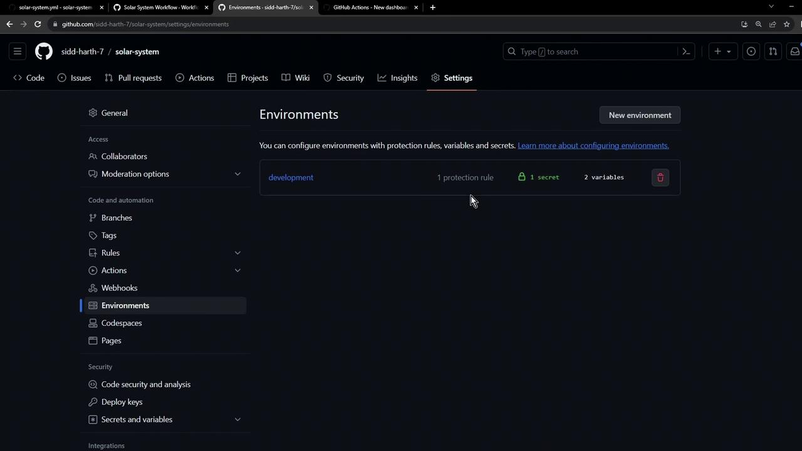
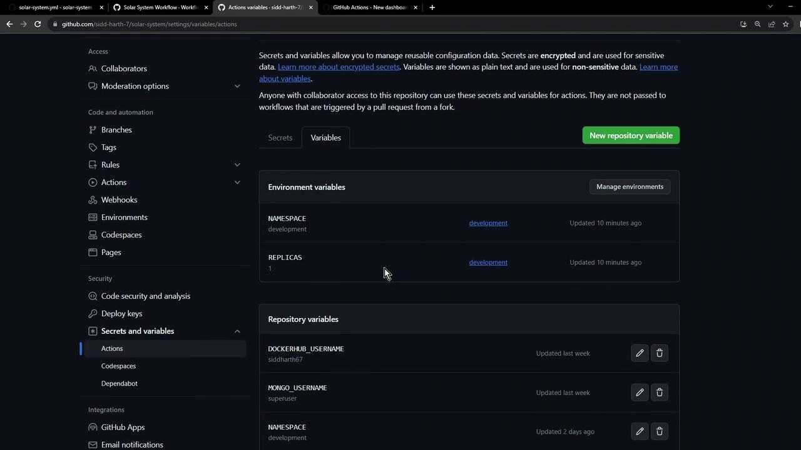

# Modify Dev Deployment Job to use Environment tags

Source: https://notes.kodekloud.com/docs/GitHub-Actions-Certification/Continuous-Deployment-with-GitHub-Actions/Modify-Dev-Deployment-Job-to-use-Environment-tags/page

This article explains how to enhance a GitHub Actions workflow by updating the dev-deploy job to utilize environment tags for better deployment management.

In this lesson, we’ll enhance our GitHub Actions workflow by updating the `dev-deploy` job to leverage **environment tags**. By specifying an environment:

* You can enforce protection rules (e.g., required approvals or wait timers).
* Access environment-scoped secrets and variables.
* Surface the deployment URL directly in the GitHub UI.

## Prerequisites: Review Your Environment

First, recall the `development` environment configuration. It includes one protection rule, one secret, and two variables. Environment-scoped variables always take precedence over repository-level variables.

<Frame>
  
</Frame>

<Callout icon="lightbulb">
  Environment-level variables override repository variables. This ensures you can customize settings (like replica counts) for each deployment stage.
</Callout>

Next, compare the repository-level variables (e.g., `replicas: 2`) against the environment-level variables (`replicas: 1`):

<Frame>
  
</Frame>

| Scope       | Definition                              | Priority |
| ----------- | --------------------------------------- | -------- |
| Repository  | Variables and secrets at the repo level | Lower    |
| Environment | Variables and secrets scoped to env.    | Higher   |

## Verify Current Deployment

Use `kubectl` to inspect your deployments and pods in the `development` namespace:

```bash theme={null}
kubectl -n development get deployments.apps
