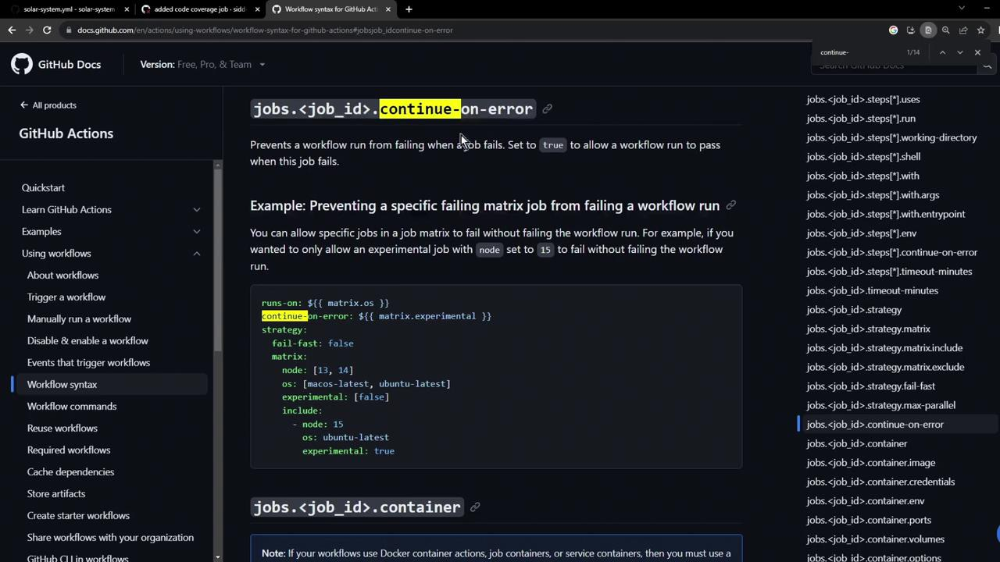
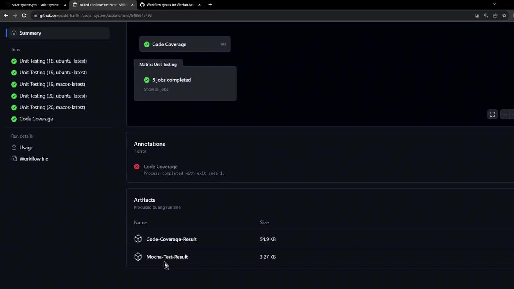

# Generate HTML/LCOV report
nyc --reporter=lcov npm test
```

### 4. Static Code Analysis (SonarCloud)

```bash theme={null}
sonar-scanner \
  -Dsonar.projectKey=my-app \
  -Dsonar.organization=my-org \
  -Dsonar.host.url=https://sonarcloud.io \
  -Dsonar.login=$SONAR_TOKEN
```

### 5. Containerization

```bash theme={null}
docker build -t my-app:${BRANCH_NAME}-${BUILD_NUMBER} .
```

### 6. Image Vulnerability Scan (Snyk)

```bash theme={null}
snyk test --docker my-app:${BRANCH_NAME}-${BUILD_NUMBER}
```

### 7. Push to Container Registry

```bash theme={null}
docker tag my-app:${BRANCH_NAME}-${BUILD_NUMBER} \
  123456789012.dkr.ecr.us-east-1.amazonaws.com/my-app:latest

docker push 123456789012.dkr.ecr.us-east-1.amazonaws.com/my-app:latest
```

***

## Continuous Deployment (CD)

Once the Docker image lands in AWS ECR, we deploy to an **EC2** instance:

1. **Run Container on EC2**
   ```bash theme={null}
   ssh ec2-user@ec2-instance \
     "docker pull 123456789012.dkr.ecr.us-east-1.amazonaws.com/my-app:latest && \
      docker run -d --name my-app -p 80:3000 \
      123456789012.dkr.ecr.us-east-1.amazonaws.com/my-app:latest"
   ```

2. **Integration Tests**
   ```bash theme={null}
   curl --fail http://ec2-instance/api/health
   curl --fail http://ec2-instance/api/endpoint
   ```

3. **Open Pull Request**\
   Contributors open a PR to merge `feature/*` into `main`, kicking off Continuous Delivery.

***

## Continuous Delivery (CDel)

After the PR CI build succeeds:

1. **Deploy to Kubernetes via GitOps**\
   Update the image tag in your Git manifest:

   ```bash theme={null}
   git checkout main
   sed -i "s|image: my-app:.*|image: my-app:${BUILD_NUMBER}|g" k8s/deployment.yaml
   git commit -am "chore: update image to ${BUILD_NUMBER}"
   git push origin main
   ```

   Argo CD auto-detects the change and syncs the cluster.

2. **Dynamic Application Security Testing (DAST)**
   ```bash theme={null}
   zap-baseline.py -t http://my-k8s-loadbalancer/api -r zap-report.html
   ```

3. **Merge Pull Request**\
   After security review, approve and merge into `main`.

4. **Approval & AWS Lambda Deployment**\
   Jenkins pauses for a manual approval. Once approved:

   ```bash theme={null}
   aws lambda update-function-code \
     --function-name my-app-function \
     --image-uri 123456789012.dkr.ecr.us-east-1.amazonaws.com/my-app:latest

   aws lambda update-function-configuration \
     --function-name my-app-function \
     --environment Variables={NODE_ENV=production} \
     --publish
   ```

5. **Lambda Invocation Tests**
   ```bash theme={null}
   aws lambda invoke \
     --function-name my-app-function \
     --payload '{}' response.json
   jq . response.json
   ```

<Callout icon="triangle-alert">
  Ensure your AWS credentials have `lambda:UpdateFunctionCode` and `lambda:UpdateFunctionConfiguration` permissions.
</Callout>

***

## Post-Build Reporting

Finalize the pipeline by aggregating results and notifying the team:

* **Archive & Publish Reports**
  ```groovy theme={null}
  archiveArtifacts artifacts: 'reports/**/*'
  aws s3 sync reports s3://my-app-ci-reports/${BUILD_NUMBER}/
  ```

* **Slack Notifications**
  ```groovy theme={null}
  slackSend(
    channel: '#ci-cd',
    color: currentBuild.currentResult == 'SUCCESS' ? 'good' : 'danger',
    message: "${env.JOB_NAME} build #${env.BUILD_NUMBER}: ${currentBuild.currentResult}"
  )
  ```

***

This end-to-end pipeline integrates roughly 15–20 stages, combining multiple security checks, tests, and deployment strategies. Let’s begin by configuring the Jenkinsfile for CI!

***

## Links and References

* [Jenkins][jenkins]
* [Argo CD (GitOps)][argocd]
* [AWS Lambda][aws-lambda]
* [SonarCloud](https://sonarcloud.io/)
* [OWASP Dependency Checker](https://owasp.org/www-project-dependency-check/)
* [Snyk](https://snyk.io/)

[jenkins]: https://www.jenkins.io/

[argocd]: https://argo-cd.readthedocs.io/

[aws-lambda]: https://docs.aws.amazon.com/lambda/latest/dg/welcome.html

<CardGroup>
  <Card title="Watch Video" icon="video" href="https://learn.kodekloud.com/user/courses/github-actions-certification/module/56d72a06-285c-4516-9880-073fb56f579b/lesson/ba402671-0499-4331-b978-3145420e8ca5" />
</CardGroup>


# Using continue on error expression

Source: https://notes.kodekloud.com/docs/GitHub-Actions-Certification/Continuous-Integration-with-GitHub-Actions/Using-continue-on-error-expression/page

Learn how to apply continue-on-error at step and job level to prevent non-critical failures from stopping your GitHub Actions workflows.

***

title: "Using continue-on-error in GitHub Actions"
description: "Learn how to apply continue-on-error at step and job level to prevent non-critical failures from stopping your GitHub Actions workflows."
-------------------------------------------------------------------------------------------------------------------------------------------------------

GitHub Actions provides the `continue-on-error` keyword to help you manage non-critical failures in your CI/CD workflows. By default, a non-zero exit code stops the job and any downstream steps. With `continue-on-error`, you can:

* Skip failing steps while continuing the job
* Mark jobs as neutral instead of failed

<Frame>
  
</Frame>

***

## Example Scenario

Imagine a **Code Coverage** job that runs tests and then validates coverage. If coverage falls below your threshold, the job fails immediately:

```console theme={null}
ERROR: Coverage for lines (88.88%) does not meet global threshold (90%)
File              % Stmts   % Branch   % Funcs  % Lines   Uncovered Line #s
All files         87.88      50         87.5    88.88     21,47-48,56
app.js            87.5       88.88     87.5     88.88     21,47-48,56
Error: Process completed with exit code 1.
```

Because of this exit code, the artifact upload step never runs.

***

## Step-Level continue-on-error

To allow subsequent steps to execute even when coverage fails, add `continue-on-error: true` to the **Check Code Coverage** step:

```yaml theme={null}
jobs:
  code-coverage:
    name: Code Coverage
    runs-on: ubuntu-latest
    steps:
      - name: Checkout Repository
        uses: actions/checkout@v4

      - name: Setup Node.js
        uses: actions/setup-node@v3
        with:
          node-version: 18

      - name: Install Dependencies
        run: npm install

      - name: Check Code Coverage
        continue-on-error: true
        run: npm run coverage

      - name: Archive Test Result
        uses: actions/upload-artifact@v3
        with:
          name: Code-Coverage-Result
          path: coverage
          retention-days: 5
```

After this change, the coverage step logs an error but the workflow proceeds:

```console theme={null}
Run npm run coverage
► Solar System@6.7.6 coverage
    nyc --reporter cobertura --reporter lcov --reporter text --reporter json-summary mocha app-test.js --timeout 10000 --exit

Server successfully running on port - 3000

Planets API Suite
  Fetching Planet Details
    ✓ it should fetch a planet named Mercury (34ms)
    … (other tests)

ERROR: Coverage for lines (88.8%) does not meet global threshold (90%)
Uploading artifact Code-Coverage-Result
```

### Quick Comparison

| Scope      | Applies To      | Behavior                          |
| ---------- | --------------- | --------------------------------- |
| Step-Level | Individual step | Only that step can fail silently  |
| Job-Level  | Entire job      | Job marked neutral, continues all |

***

## Job-Level continue-on-error

For matrix-based workflows, you can skip failures across all steps by setting `continue-on-error` at the job level:

```yaml theme={null}
jobs:
  code-coverage:
    runs-on: ${{ matrix.os }}
    continue-on-error: ${{ matrix.experimental }}
    strategy:
      fail-fast: false
      matrix:
        node: [13, 14]
        os: [macos-latest, ubuntu-latest]
        experimental: [false]
        include:
          - node: 15
            os: ubuntu-latest
            experimental: true
    steps:
      # same steps as above…
```

<Callout icon="lightbulb">
  Setting `fail-fast: false` ensures that other matrix runs continue even if one instance fails.
</Callout>

When `matrix.experimental` is `true`, failures in that job are treated as neutral, allowing the workflow to complete.

***

## Workflow Summary

In the summary below, unit tests pass, the code coverage job finishes with an error annotation, and the **Code-Coverage-Result** artifact is uploaded:

<Frame>
  
</Frame>

***

## Links and References

* [Workflow syntax for GitHub Actions](https://docs.github.com/actions/using-workflows/workflow-syntax-for-github-actions)
* [Storing workflow data as artifacts](https://docs.github.com/actions/using-workflows/storing-workflow-data-as-artifacts)

<CardGroup>
  <Card title="Watch Video" icon="video" href="https://learn.kodekloud.com/user/courses/github-actions-certification/module/56d72a06-285c-4516-9880-073fb56f579b/lesson/572c0a51-7286-42be-a9e8-a08edc54f440" />
</CardGroup>
