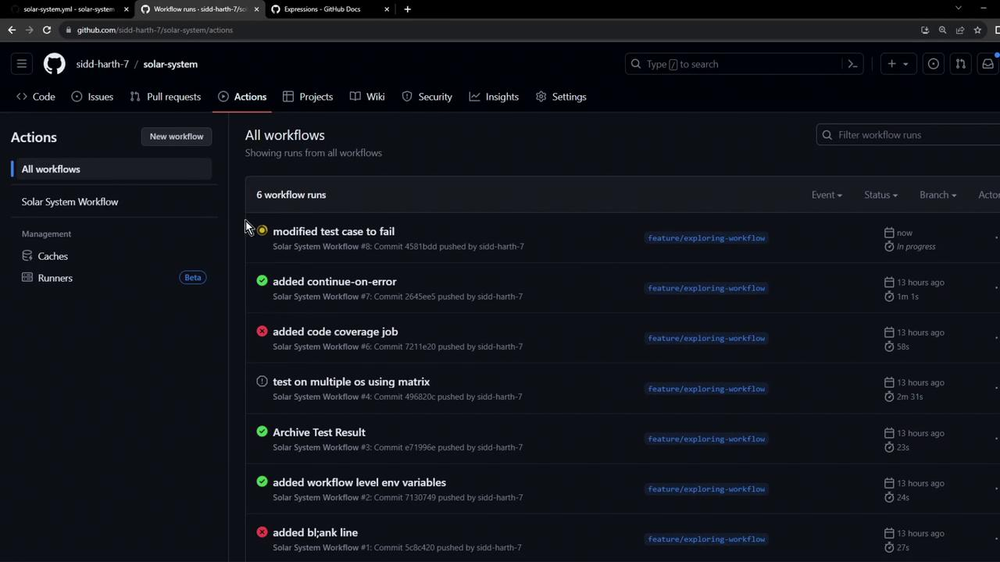
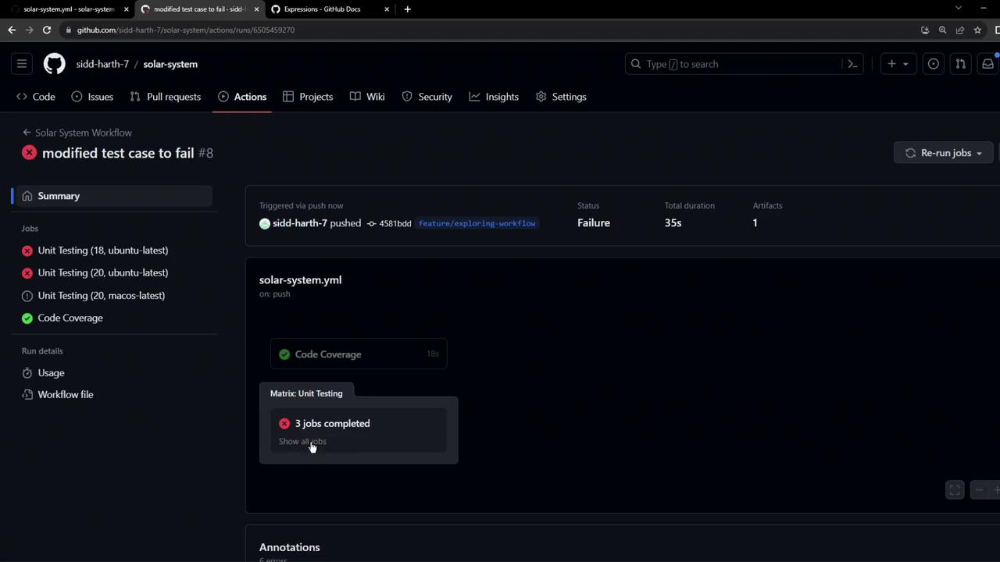
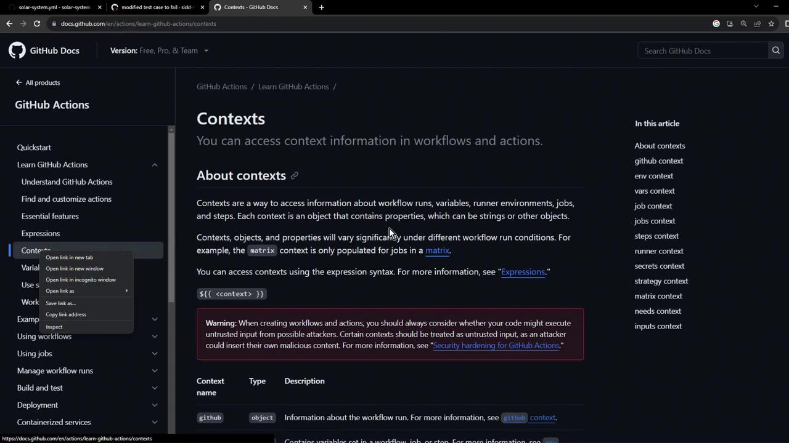
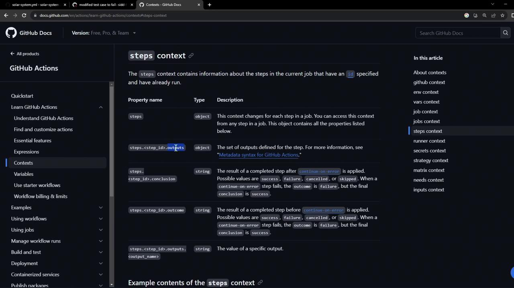
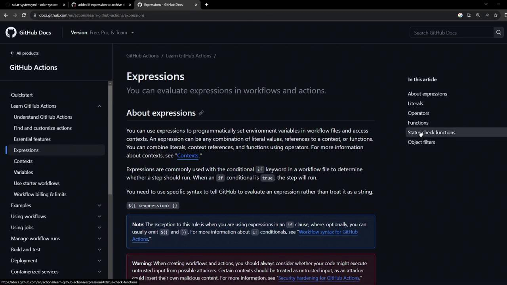
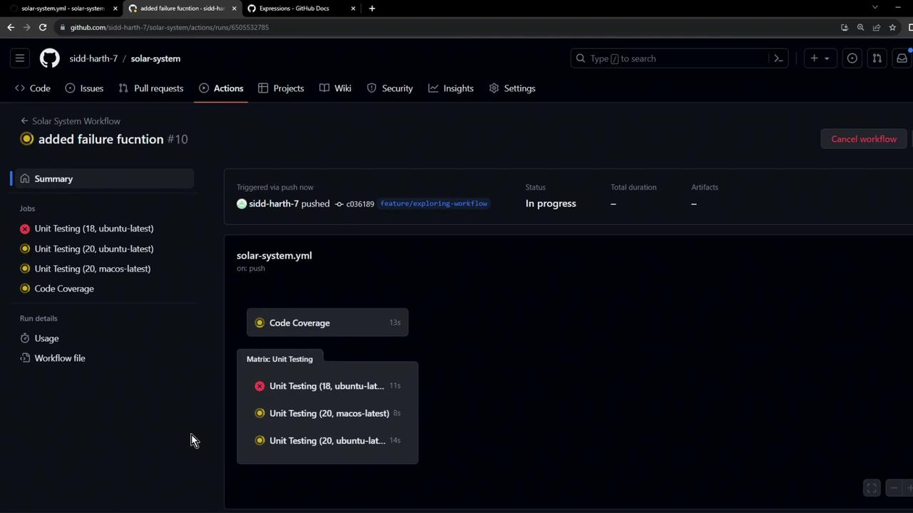
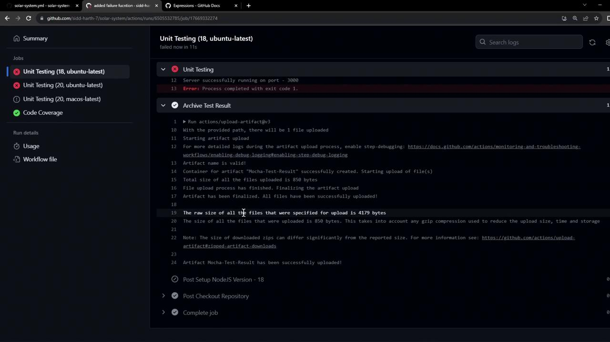
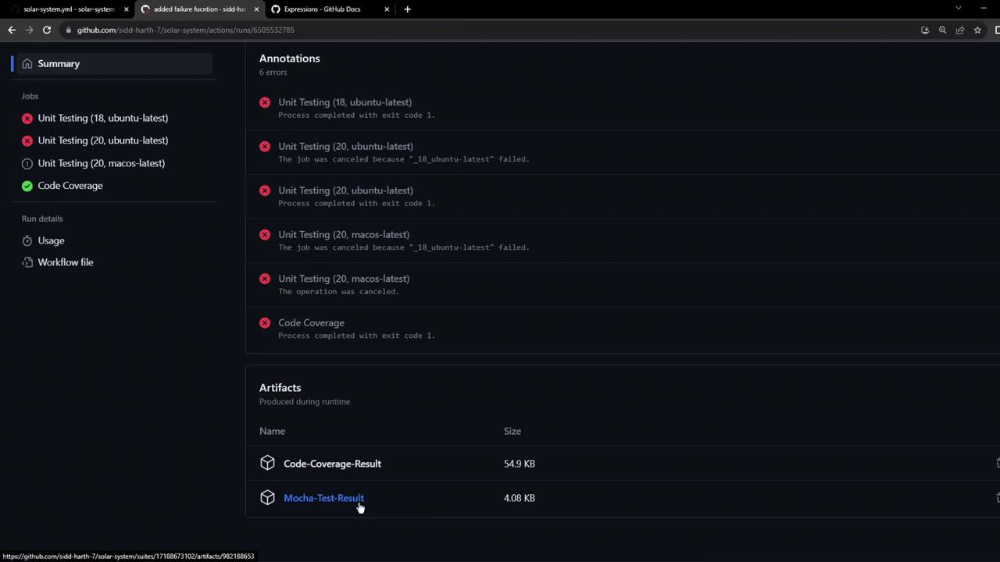
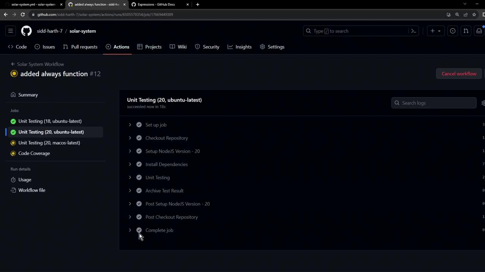

# Using if expressions with Step contexts

Source: https://notes.kodekloud.com/docs/GitHub-Actions-Certification/Continuous-Integration-with-GitHub-Actions/Using-if-expressions-with-Step-contexts/page

Learn to use if-expressions with steps context in GitHub Actions to archive test artifacts even when jobs fail.

In this guide, you’ll learn how to use **if-expressions** together with the **steps context** to ensure your test artifacts are always archived—even when a job fails. By assigning IDs to steps and leveraging status functions, you can control exactly when uploads occur, making debugging and reporting much easier.

## 1. Initial Workflow Configuration

Here’s our starting **Unit Testing** job. It runs tests via `npm test` and then uploads the results:

```yaml theme={null}
name: Unit Testing
strategy:
  matrix:
    nodejs_version: [18, 20]
    operating_system: [ubuntu-latest, macos-latest]
  exclude:
    - nodejs_version: 18
      operating_system: macos-latest
runs-on: ${{ matrix.operating_system }}
steps:
  - name: Checkout Repository
    uses: actions/checkout@v4

  - name: Setup Node.js ${{ matrix.nodejs_version }}
    uses: actions/setup-node@v3
    with:
      node-version: ${{ matrix.nodejs_version }}

  - name: Install Dependencies
    run: npm install

  - name: Unit Testing
    run: npm test

  - name: Archive Test Results
    uses: actions/upload-artifact@v3
    with:
      name: Mocha-Test-Result
      path: test-results.xml
```

<Callout icon="lightbulb">
  By default, when a step fails, all later steps (including uploads) are skipped.
</Callout>

## 2. Simulating a Test Failure

To demonstrate, we’ll break one of our tests in `app-test.js` so that it fails:

```javascript theme={null}
// app-test.js
const mongoose = require("mongoose");
const server   = require("../app");
const chai     = require("chai");
const chaiHttp = require("chai-http");

chai.should();
chai.use(chaiHttp);

describe("Planets API Suite", () => {
  describe("Fetching Planet Details", () => {
    it("should fetch a planet named Mercury", (done) => {
      const payload = { id: 1 };
      chai.request(server)
        .post("/planet")
        .send(payload)
        .end((err, res) => {
          res.should.have.status(200);
          // Intentionally wrong expected value
          res.body.should.have.property("name").eql("Mercury_ERROR");
          done();
        });
    });
    // ... other tests ...
  });
});
```

After committing, the **Unit Testing** job fails and the upload step is skipped:

<Frame>
  
</Frame>

<Frame>
  
</Frame>

## 3. Guarding with `steps.<id>.outcome`

Give your test step an `id`, then use `if` to check its `outcome`:

```yaml theme={null}
  - name: Unit Testing
    id: nodejs-unit-testing
    run: npm test

  - name: Archive Test Results
    if: steps.nodejs-unit-testing.outcome == 'failure' || steps.nodejs-unit-testing.outcome == 'success'
    uses: actions/upload-artifact@v3
    with:
      name: Mocha-Test-Result
      path: test-results.xml
```

The [`steps` context](https://docs.github.com/actions/learn-github-actions/contexts#steps-context) provides each step’s `outcome` property:

<Frame>
  
</Frame>

<Frame>
  
</Frame>

<Callout icon="lightbulb">
  You can use comparison operators (`==`, `!=`, `>`, `<`) and functions in [expressions](https://docs.github.com/actions/learn-github-actions/expressions) to control step execution.
</Callout>

Here’s the official expressions reference:

<Frame>
  
</Frame>

Rerun the workflow, and you’ll see the Archive step execute in all scenarios:

<Frame>
  
</Frame>

Inspecting the logs confirms the upload ran:

```bash theme={null}
> Solar System@6.7.6 test
> mocha app-test.js --timeout 10000 --reporter mocha-junit-reporter --exit

Server successfully running on port - 3000
Error: Process completed with exit code 1.
```

<Frame>
  
</Frame>

The workflow summary now lists the test-result artifact:

<Frame>
  
</Frame>

## 4. Simplifying with `always()`

Testing both `failure` and `success` is redundant. Use `always()` to run the step unconditionally:

```yaml theme={null}
  - name: Archive Test Results
    if: always()
    uses: actions/upload-artifact@v3
    with:
      name: Mocha-Test-Result
      path: test-results.xml
```

With `always()`, the upload executes on success, failure, or cancelation:

<Frame>
  
</Frame>

## 5. Quick Reference: Status Functions

| Function    | Description                                 | Syntax            |
| ----------- | ------------------------------------------- | ----------------- |
| always()    | Runs step regardless of outcome             | `if: always()`    |
| success()   | Runs step only when all prior steps succeed | `if: success()`   |
| failure()   | Runs step only when a prior step fails      | `if: failure()`   |
| cancelled() | Runs step when the job is canceled          | `if: cancelled()` |

## Links and References

* [GitHub Actions Contexts](https://docs.github.com/actions/learn-github-actions/contexts)
* [GitHub Actions Expressions](https://docs.github.com/actions/learn-github-actions/expressions)
* [actions/upload-artifact](https://github.com/actions/upload-artifact)
* [Mocha JUnit Reporter](https://github.com/michaelleeallen/mocha-junit-reporter)

<CardGroup>
  <Card title="Watch Video" icon="video" href="https://learn.kodekloud.com/user/courses/github-actions-certification/module/56d72a06-285c-4516-9880-073fb56f579b/lesson/bd96ef78-887b-4e8f-aafa-a9a3b2c85832" />

  <Card title="Practice Lab" icon="installation" href="https://learn.kodekloud.com/user/courses/github-actions-certification/module/56d72a06-285c-4516-9880-073fb56f579b/lesson/aa5f1767-83ca-4516-ad3c-53166178232a" />
</CardGroup>
