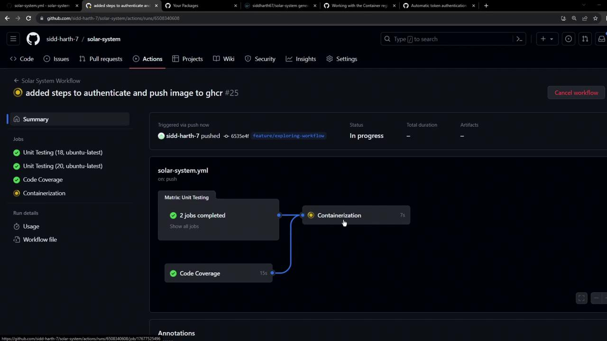
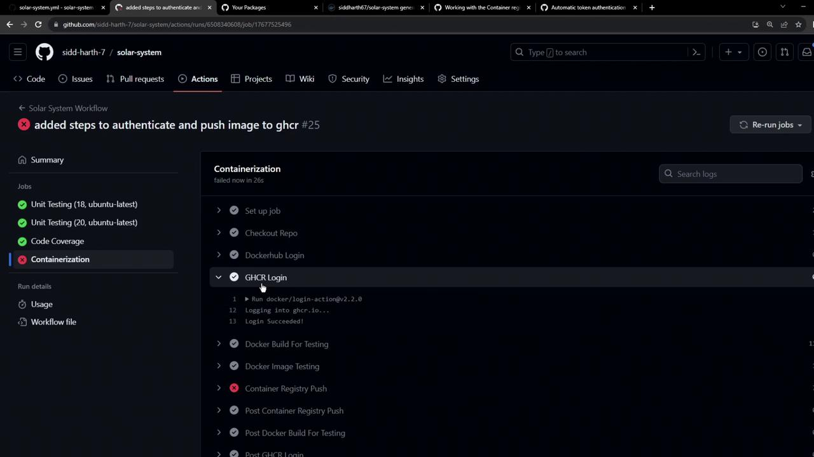
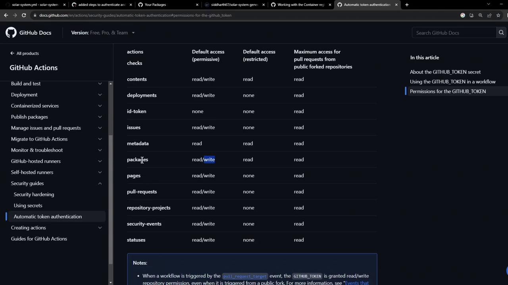
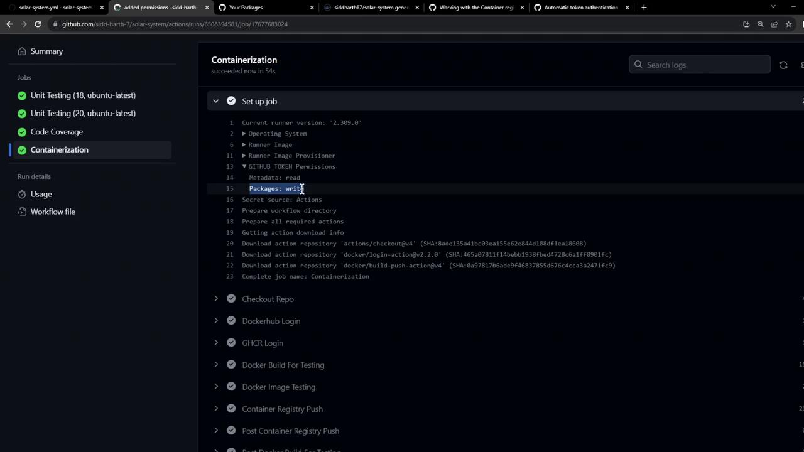
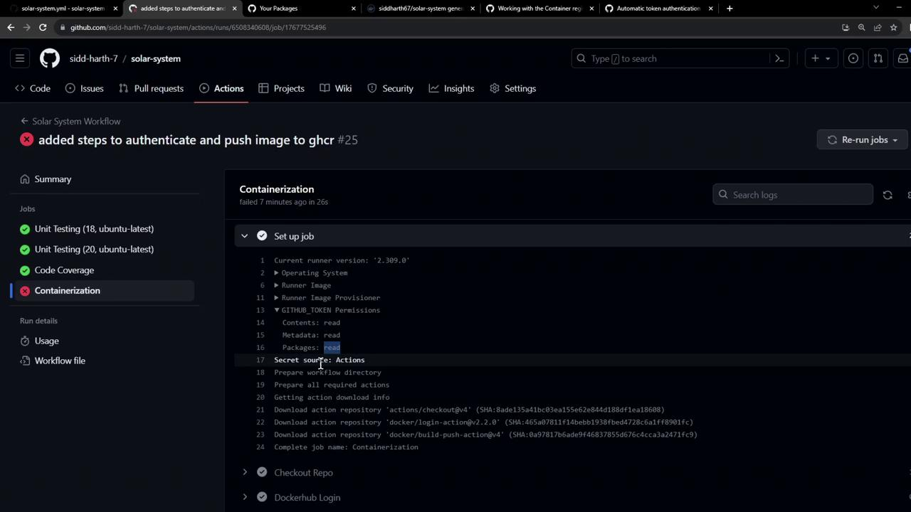

# Login Succeeded
docker push ghcr.io/YOUR_USERNAME/IMAGE_NAME:latest
```

You can push multiple tags:

```bash theme={null}
docker push ghcr.io/YOUR_USERNAME/IMAGE_NAME:latest
docker push ghcr.io/YOUR_USERNAME/IMAGE_NAME:2.5
```

<Callout icon="lightbulb">
  For automation, store your PAT as a GitHub Secret (e.g., `GHCR_PAT`) and reference it in workflows.
</Callout>

***

## Updating Your GitHub Actions Workflow

We’ll extend our CI workflow to:

1. Build the Docker image.
2. Run a quick container test.
3. Authenticate and push to Docker Hub and GHCR.

Add or update the **Containerization** job in `.github/workflows/workflow.yml`:

```yaml theme={null}
jobs:
  unit-testing: ...
  code-coverage: ...

  docker:
    name: Containerization
    needs: [unit-testing, code-coverage]
    runs-on: ubuntu-latest
    permissions:
      packages: write    # Grant write access to GHCR
      contents: read

    steps:
      - name: Checkout code
        uses: actions/checkout@v4

      - name: Login to Docker Hub
        uses: docker/login-action@v2
        with:
          username: ${{ vars.DOCKERHUB_USERNAME }}
          password: ${{ secrets.DOCKERHUB_PASSWORD }}

      - name: Login to GHCR
        uses: docker/login-action@v2
        with:
          registry: ghcr.io
          username: ${{ github.repository_owner }}
          password: ${{ secrets.GITHUB_TOKEN }}

      - name: Build image for tests
        uses: docker/build-push-action@v4
        with:
          context: .
          push: false
          tags: ${{ vars.DOCKERHUB_USERNAME }}/solar-system:${{ github.sha }}

      - name: Test container locally
        run: |
          docker run --rm -d -p 3000:3000 \
            -e MONGO_URI=$MONGO_URI \
            -e MONGO_USERNAME=$MONGO_USERNAME \
            -e MONGO_PASSWORD=$MONGO_PASSWORD \
            ${{ vars.DOCKERHUB_USERNAME }}/solar-system:${{ github.sha }}
          sleep 5
          wget -qO- http://localhost:3000/live | grep "live"

      - name: Push to Docker Hub & GHCR
        uses: docker/build-push-action@v4
        with:
          context: .
          push: true
          tags: |
            ${{ vars.DOCKERHUB_USERNAME }}/solar-system:${{ github.sha }}
            ghcr.io/${{ github.repository_owner }}/solar-system:${{ github.sha }}
```

### Workflow in Action

When the workflow triggers, you’ll see Unit Testing and Code Coverage complete before Containerization runs:

<Frame>
  
</Frame>

***

## Troubleshooting: Permissions Error

If you omit `permissions: packages: write`, the push to GHCR will fail:

<Frame>
  
</Frame>

Error message:

```plaintext theme={null}
#12 ERROR: denied: installation not allowed to Create organization package
```

<Callout icon="triangle-alert">
  By default, `GITHUB_TOKEN` only has **read** access to packages. You must explicitly set write permissions.
</Callout>

Refer to GitHub’s token permissions documentation:

<Frame>
  
</Frame>

After updating the workflow, pushes succeed:

<Frame>
  
</Frame>

***

### Verifying the Failure Case

In earlier runs (without write access), you can inspect the setup logs for clues:

<Frame>
  
</Frame>

***

## Using Your Published Image

Once the workflow finishes:

1. Navigate to **Packages** → **Container registry** in your repository.
2. You’ll see your Docker image listed under GHCR.

Pull your published image:

```bash theme={null}
docker pull ghcr.io/${{ github.repository_owner }}/solar-system:${{ github.sha }}
```

Use it as a base image in another `Dockerfile`:

```dockerfile theme={null}
FROM ghcr.io/${{ github.repository_owner }}/solar-system:${{ github.sha }}
```

Congratulations! You’ve successfully built, tested, and pushed Docker images to both Docker Hub and GitHub Container Registry in a single GitHub Actions workflow.

<CardGroup>
  <Card title="Watch Video" icon="video" href="https://learn.kodekloud.com/user/courses/github-actions-certification/module/56d72a06-285c-4516-9880-073fb56f579b/lesson/16105ff9-d709-4d84-8098-d57675af9b39" />
</CardGroup>


# Actions Release and Version Management

Source: https://notes.kodekloud.com/docs/GitHub-Actions-Certification/Custom-Actions/Actions-Release-and-Version-Management/page

This article covers methods for versioning GitHub actions to ensure stable and predictable workflow execution.

Ensure stable and predictable execution of your GitHub workflows by versioning your custom actions. In this guide, we’ll cover three methods to specify exact action releases: tags, branches, and commit SHAs.

## 1. Versioning with Tags

Tags are the most common approach to label and organize GitHub Action releases. They support both flexible version ranges and precise version pins.

| Tag Type            | Purpose                             | Example                          |
| ------------------- | ----------------------------------- | -------------------------------- |
| Major version       | Significant or breaking changes     | `uses: actions/checkout@v3`      |
| Pre-release (beta)  | Beta releases for testing before GA | `uses: actions/checkout@v3-beta` |
| Semantic versioning | Precise `MAJOR.MINOR.PATCH` tags    | `uses: actions/checkout@v3.6.0`  |

```yaml theme={null}
steps:
  - uses: actions/checkout@v3        # Major version
  - uses: actions/checkout@v3-beta   # Beta release
  - uses: actions/checkout@v3.6.0    # Semantic versioning
```

<Callout icon="lightbulb">
  Using [Semantic Versioning] ensures clear communication of changes and consistent release management.
</Callout>

## 2. Referencing a Branch

Referencing a branch name (e.g., `main` or `master`) always pulls the latest action code from that branch. While convenient for continuous updates, this approach can introduce unexpected breaking changes.

```yaml theme={null}
steps:
  - uses: actions/checkout@main      # Always uses the latest code on 'main'
```

<Callout icon="triangle-alert">
  Pinning to a branch like `main` can lead to non-deterministic builds if the branch receives breaking changes.
</Callout>

## 3. Pinning to a Commit SHA

Commit SHAs guarantee immutability by referencing a specific commit. This is the most reliable method for ensuring your workflow uses exactly the code you intend.

```yaml theme={null}
steps:
  - uses: actions/checkout@a8240080885750b8e136effc585c3cd6082bd575f  # Specific commit SHA
```

<Callout icon="lightbulb">
  Commit SHAs are tamper-proof and cannot be moved or deleted, providing maximum stability.
</Callout>

## Summary

Choosing the right versioning strategy depends on your needs:

* **Tags**: Best balance between flexibility and stability.
* **Branches**: Ideal for continuous updates, but risk instability.
* **Commit SHAs**: Maximum reliability with immutable references.

## Links and References

* [GitHub Actions Documentation][GitHub Actions]
* [Semantic Versioning][Semantic Versioning]
* [Git References (Commits)][Git Docs]

[GitHub Actions]: https://docs.github.com/en/actions

[Semantic Versioning]: https://semver.org

[Git Docs]: https://git-scm.com/book/en/v2/Git-Tools-Revision-Selection

<CardGroup>
  <Card title="Watch Video" icon="video" href="https://learn.kodekloud.com/user/courses/github-actions-certification/module/428391ee-45d0-4e9c-9e06-78d0c5ff7657/lesson/28793cd1-e573-4f2e-ba5f-c77896f3b7d4" />
</CardGroup>
