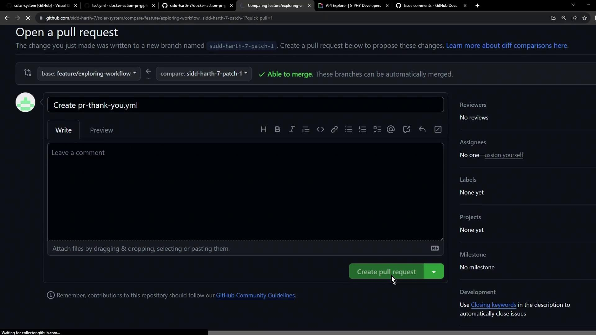
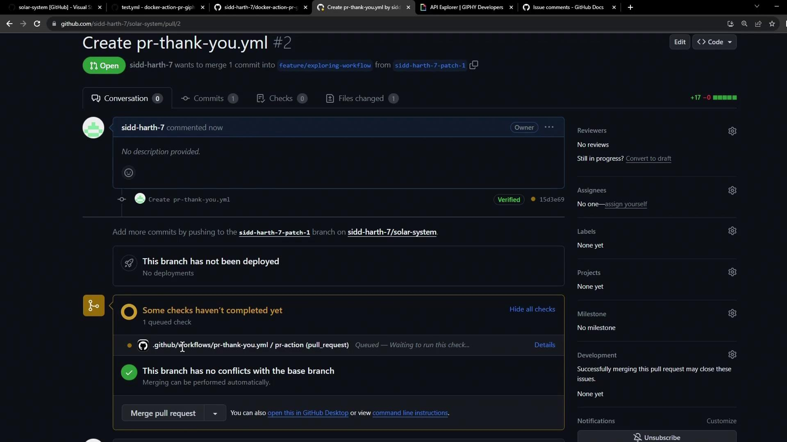
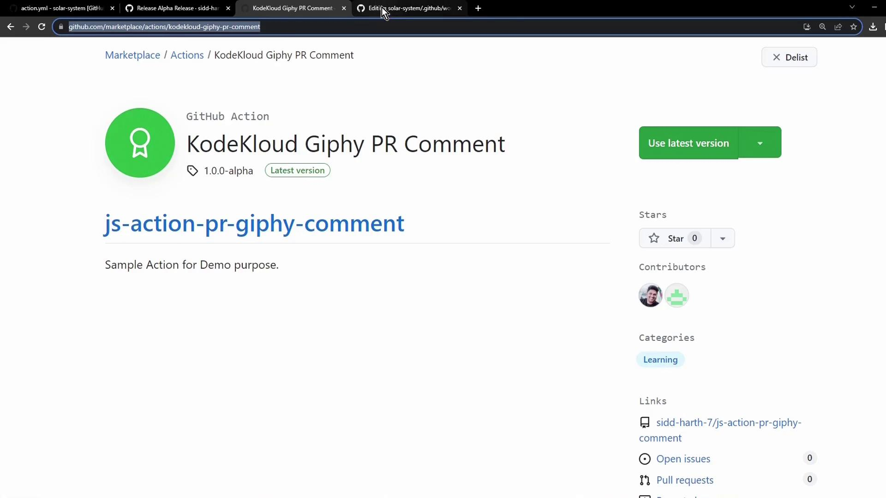
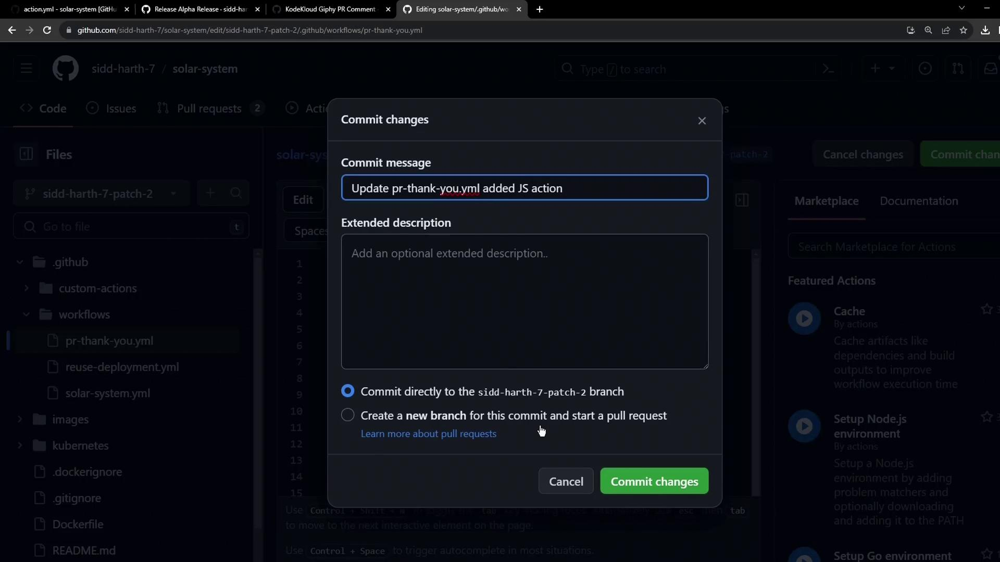
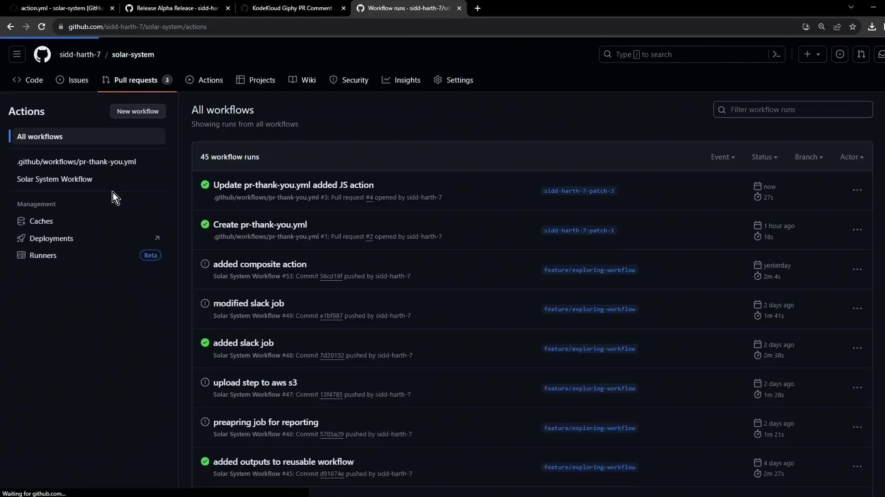
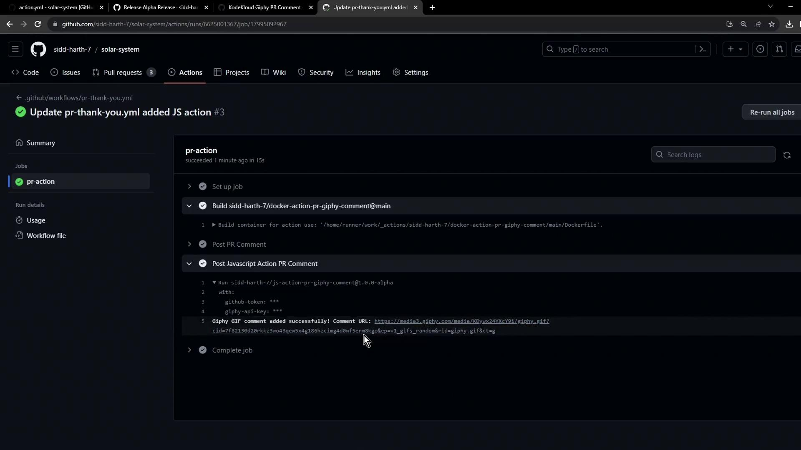

# .github/workflows/pr-thank-you.yml
name: PR Thank You Comment

on:
  pull_request:
    types: [opened]

jobs:
  pr-action:
    runs-on: ubuntu-latest
    permissions:
      issues: write
      pull-requests: write
    steps:
      - name: Post PR Comment with Giphy
        uses: siddharth-7/docker-action-pr-giphy-comment@main
        with:
          github-token: ${{ secrets.GITHUB_TOKEN }}
          giphy-api-key: ${{ secrets.GIPHY_API }}
```

### Permissions Reference

| Permission             | Purpose                 |
| ---------------------- | ----------------------- |
| `issues: write`        | Post comments on issues |
| `pull-requests: write` | Manage PR comments      |

Commit and push your branch, then open a pull request:

<Frame>
  
</Frame>

## 4. Observe the Workflow Run

Once the PR is created, GitHub Actions will trigger the workflow automatically:

<Frame>
  
</Frame>

Monitor progress under the **Actions** tab:

<Frame>
  
</Frame>

After success, the action posts a thank-you GIF comment on the pull request.

## 5. Behind the Scenes: Docker Build Logs

Each run of a container action rebuilds the Docker image. Example build output:

```bash theme={null}
#1 [internal] load .dockerignore
#1 DONE 0.0s
#2 [internal] load build definition from Dockerfile
#2 DONE 0.0s
#3 [internal] load metadata for docker.io/library/alpine:3.10
#3 DONE 0.0s
#6 [1/4] FROM docker.io/library/alpine:3.10
#6 DONE 0.1s
#9 [4/4] RUN chmod +x /entrypoint.sh
#9 DONE 0.3s
```

And the execution command:

```bash theme={null}
/usr/bin/docker run --name 2c046f464a14829b2e7791b519b_32bdb \
  --label 461ce --workdir /github/workspace -m -1 \
  --input_github_token="INPUT_GITHUB_TOKEN" \
  -e "GIPHY_API" -e "GITHUB_SHA"="GITHUB_SHA" \
  -v "/var/run/docker.sock":"/var/run/docker.sock" \
  --rm docker-action-pr-giphy-comment:main
```

<Callout icon="triangle-alert">
  Rebuilding the Docker image each run adds latency. For faster CI workflows, consider authoring a [JavaScript action](https://docs.github.com/actions/creating-actions/creating-a-javascript-action) that executes without a container build.
</Callout>

## References

* [GitHub Actions: Workflow syntax](https://docs.github.com/actions/using-workflows/workflow-syntax-for-github-actions)
* [Giphy Developer Portal](https://developers.giphy.com/)
* [Creating a JavaScript Action](https://docs.github.com/actions/creating-actions/creating-a-javascript-action)

<CardGroup>
  <Card title="Watch Video" icon="video" href="https://learn.kodekloud.com/user/courses/github-actions-certification/module/428391ee-45d0-4e9c-9e06-78d0c5ff7657/lesson/cf5b432a-57ef-4df9-bca1-a55049d352a5" />
</CardGroup>


# Using a Javascript Action in Workflow

Source: https://notes.kodekloud.com/docs/GitHub-Actions-Certification/Custom-Actions/Using-a-Javascript-Action-in-Workflow/page

This guide explains how to integrate a JavaScript custom action into a GitHub Actions workflow for posting comments on pull requests.

In this guide, you’ll learn how to extend an existing GitHub Actions workflow by integrating a JavaScript custom action from the GitHub Marketplace. We’ll start with a Docker-based PR comment action and then add the JavaScript version to post a “Thank You” GIF on every new pull request.

## 1. Review the Original Docker-Based Workflow

The `pr-thank-you.yml` workflow below triggers on pull request **opened** events and uses a Docker action to post a Giphy comment:

```yaml theme={null}
on:
  pull_request:
    types:
      - opened

jobs:
  pr-action:
    runs-on: ubuntu-latest
    permissions:
      issues: write
      pull-requests: write
    steps:
      - name: Post Docker Action PR Comment
        uses: sidd-harth-7/docker-action-pr-giphy-comment@main
        with:
          github-token: ${{ secrets.GITHUB_TOKEN }}
          giphy-api-key: ${{ secrets.GIPHY_API_KEY }}
```

<Callout icon="lightbulb">
  Be sure your workflow has `issues: write` and `pull-requests: write` permissions so the action can post comments on PRs.
</Callout>

## 2. Identify the JavaScript Action on Marketplace

Search the GitHub Marketplace for the JavaScript version of the Giphy PR comment action. In this example, the identifier is:

```text theme={null}
sidd-harth-7/js-action-pr-giphy-comment@1.0.0-alpha
```

<Frame>
  
</Frame>

## 3. Update Your Workflow to Include the JavaScript Action

Open `pr-thank-you.yml` and add a new step for the JavaScript action immediately after the Docker action:

```yaml theme={null}
on:
  pull_request:
    types:
      - opened

jobs:
  pr-action:
    runs-on: ubuntu-latest
    permissions:
      issues: write
      pull-requests: write
    steps:
      - name: Post Docker Action PR Comment
        uses: sidd-harth-7/docker-action-pr-giphy-comment@main
        with:
          github-token: ${{ secrets.GITHUB_TOKEN }}
          giphy-api-key: ${{ secrets.GIPHY_API_KEY }}

      - name: Post JavaScript Action PR Comment
        uses: sidd-harth-7/js-action-pr-giphy-comment@1.0.0-alpha
        with:
          github-token: ${{ secrets.GITHUB_TOKEN }}
          giphy-api-key: ${{ secrets.GIPHY_API_KEY }}
```

| Feature             | Docker Action                                      | JavaScript Action                                     |
| ------------------- | -------------------------------------------------- | ----------------------------------------------------- |
| Workflow Step Name  | Post Docker Action PR Comment                      | Post JavaScript Action PR Comment                     |
| Action Reference    | `sidd-harth-7/docker-action-pr-giphy-comment@main` | `sidd-harth-7/js-action-pr-giphy-comment@1.0.0-alpha` |
| Startup Performance | Slower (builds container)                          | Faster (runs natively on Node.js)                     |
| Version Pinning     | `@main`                                            | `@1.0.0-alpha`                                        |

## 4. Commit Changes and Open a Pull Request

Save your updated workflow on a branch, commit with a descriptive message, push the branch, and then create a pull request. This will trigger both actions on your new PR:

<Frame>
  
</Frame>

## 5. Monitor Workflow Runs and Logs

1. Go to the **Actions** tab in your repository.
2. Select the latest run of the “PR Thank You” workflow.
3. Expand the `pr-action` job to review logs for both the Docker and JavaScript steps.

<Frame>
  
</Frame>

<Frame>
  
</Frame>

Both actions will post separate “Thank You” GIF comments on your pull request, demonstrating how you can mix and reuse Docker and JavaScript actions from the GitHub Marketplace.

***

## Links and References

* [GitHub Actions Documentation](https://docs.github.com/actions)
* [GitHub Marketplace](https://github.com/marketplace)
* [Creating a JavaScript Action](https://docs.github.com/actions/creating-actions/creating-a-javascript-action)

<CardGroup>
  <Card title="Watch Video" icon="video" href="https://learn.kodekloud.com/user/courses/github-actions-certification/module/428391ee-45d0-4e9c-9e06-78d0c5ff7657/lesson/a22a8257-8ba4-4389-aabe-e58089399d64" />
</CardGroup>
