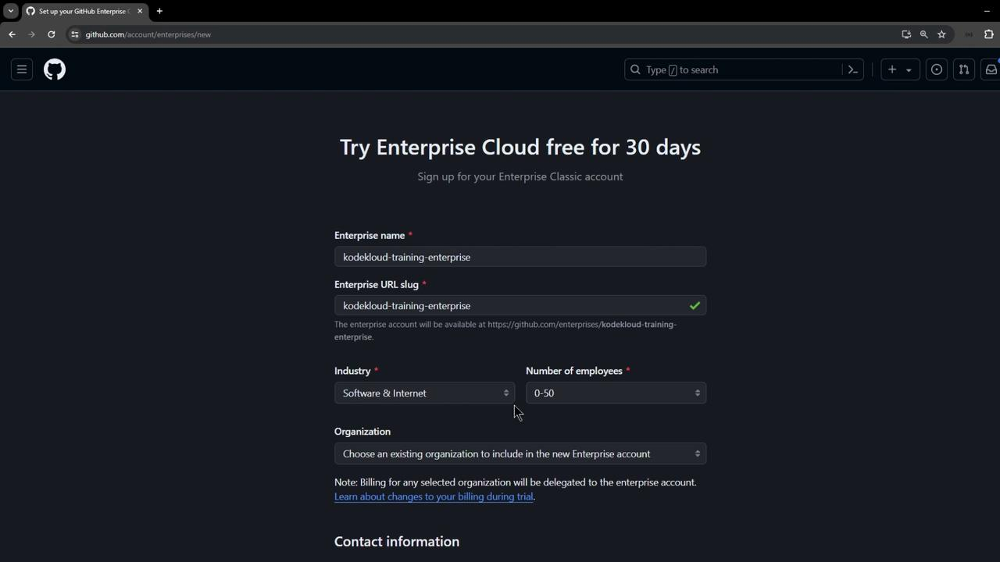
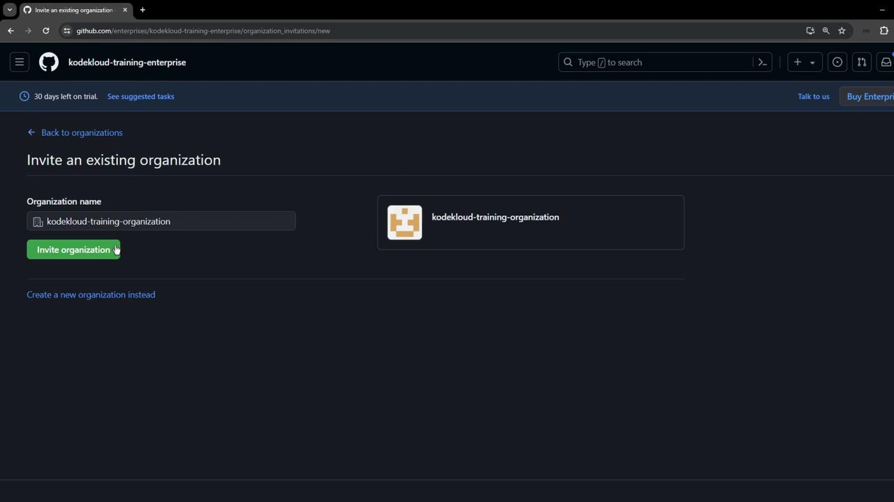
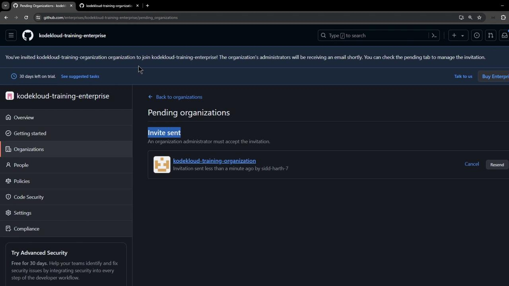
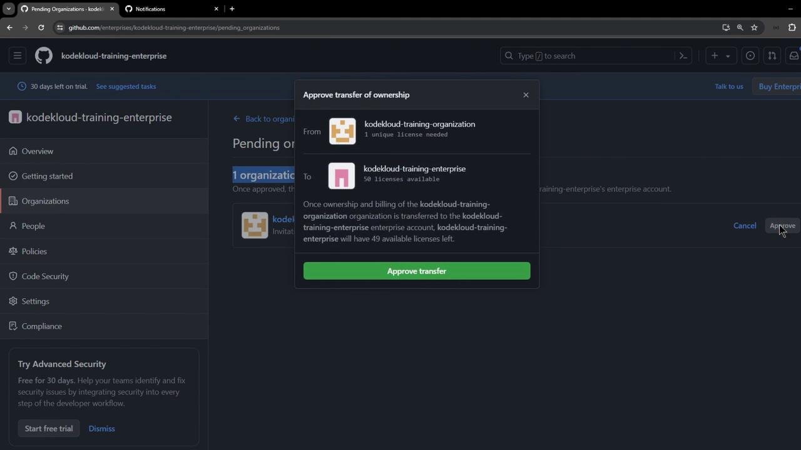
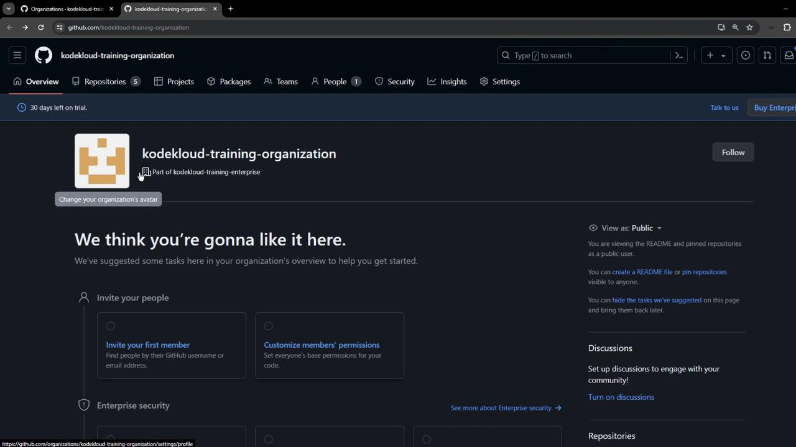
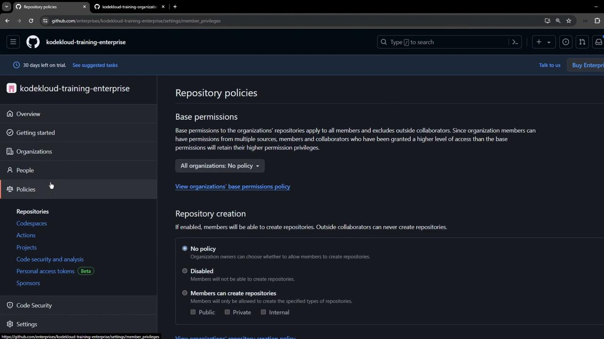

# Create Trial for Enterprise Cloud

Source: https://notes.kodekloud.com/docs/GitHub-Actions-Certification/GitHub-Actions-in-the-Enterprise-Cloud/Create-Trial-for-Enterprise-Cloud/page

This guide explains how to set up a 30-day trial for GitHub Enterprise Cloud, including account verification and organization association.

Kick off your journey with GitHub Enterprise Cloud by starting a 30-day free trial. In this guide, we’ll cover:

1. How to sign up for an Enterprise trial.
2. Verifying your account.
3. Creating and confirming your new enterprise.
4. Inviting and associating an existing organization.
5. Verifying that association.
6. Next steps for enterprise-wide policies.

By the end, you’ll have a fully functional GitHub Enterprise Cloud environment ready for Action policies and advanced security controls. For more on enterprise features, see [GitHub Enterprise Cloud docs](https://docs.github.com/en/enterprise-cloud).

***

## 1. Navigate to the Enterprise Cloud Trial Signup

1. From your GitHub dashboard, click **Your profile → Your organizations**.
2. Switch to the **Enterprises** tab. If you don’t have one yet, you’ll see a **Start trial** button.
3. Click **Start trial** to open the setup form.

<Frame>
  
</Frame>

Fill in the details on the form:

* **Enterprise name**: e.g., `KodeKloud Training Enterprise`
* **URL slug**: auto-generated or customize to match your brand
* **Industry**: Select **Software & Internet**
* **Number of employees**: Enter your estimate

<Callout icon="lightbulb">
  You can add an existing organization now or skip and invite one later.
</Callout>

***

## 2. Complete Account Verification

1. Select your country and proceed with verification.
2. Read and accept the terms and conditions.
3. Complete the verification task (e.g., rotating a 3D object) and submit.

<Frame>
  
</Frame>

<Callout icon="triangle-alert">
  If verification fails, you won’t be able to create the enterprise until you complete the task.
</Callout>

Once verified, click **Create enterprise**.

***

## 3. Confirm Your New Enterprise

After creation, you’ll land on your enterprise dashboard showing a 30-day trial and an overview of available features. Some settings may be limited until full activation.

<Frame>
  
</Frame>

Head to **Policies → Actions** to preview enterprise-wide Actions controls (we’ll configure these later).

***

## 4. Invite an Organization to Join

To enforce policies, associate at least one organization:

1. In the enterprise sidebar, select **Organizations**.
2. Click **Invite organization**, enter your org’s name (for example, `kodekloud-training-organization`), and send the invite.

<Frame>
  
</Frame>

***

## 5. Accept and Approve the Invite

1. The organization’s admin receives an invitation.
2. They navigate to their org and **Approve** the join request.

<Frame>
  
</Frame>

3. Back in the enterprise console, approve the organization’s transfer of ownership.

<Frame>
  
</Frame>

<Callout icon="triangle-alert">
  Ownership transfer is required to allocate your enterprise license. Ensure you trust the organization’s administrator before approving.
</Callout>

***

## 6. Verify the Organization Association

After approvals, refresh the page to confirm:

* Your enterprise **Organizations** list now includes the new org.
* The organization’s **Overview** indicates it’s part of your enterprise trial.

<Frame>
  
</Frame>

***

## 7. Next Steps and Policy Configuration

You’ve successfully created a GitHub Enterprise Cloud trial and associated an organization. Next, enforce enterprise policies and secure your workflows:

| Policy Category | Purpose                                                          | Documentation                                                                                                                                |
| --------------- | ---------------------------------------------------------------- | -------------------------------------------------------------------------------------------------------------------------------------------- |
| Actions         | Control GitHub Actions usage and permissions across repositories | [Configure GitHub Actions Policies](https://docs.github.com/en/enterprise-cloud@latest/admin/policies/enforcing-policies-for-github-actions) |
| SSO             | Enforce SAML single sign-on for all members                      | [Manage SAML SSO](https://docs.github.com/en/enterprise-cloud@latest/admin/authentication/managing-saml-single-sign-on)                      |
| Repository      | Restrict repository creation and manage base permissions         | [Enforce Repository Policies](https://docs.github.com/en/enterprise-cloud@latest/admin/policies/repository-policies)                         |

<Frame>
  
</Frame>

Ready to dive deeper? Check out our [Enterprise Security](/enterprise/security) and [Compliance workflows](/enterprise/compliance) guides next.

***

## References

* [GitHub Enterprise Cloud Documentation](https://docs.github.com/en/enterprise-cloud)
* [GitHub Actions Policies](https://docs.github.com/en/enterprise-cloud@latest/admin/policies/enforcing-policies-for-github-actions)
* [GitHub SAML SSO](https://docs.github.com/en/enterprise-cloud@latest/admin/authentication/managing-saml-single-sign-on)
* [GitHub Repository Policies](https://docs.github.com/en/enterprise-cloud@latest/admin/policies/repository-policies)

<CardGroup>
  <Card title="Watch Video" icon="video" href="https://learn.kodekloud.com/user/courses/github-actions-certification/module/9b181319-216b-42b5-8069-9d56650f2d53/lesson/a54d4990-0572-485f-874e-6289372082a4" />
</CardGroup>
