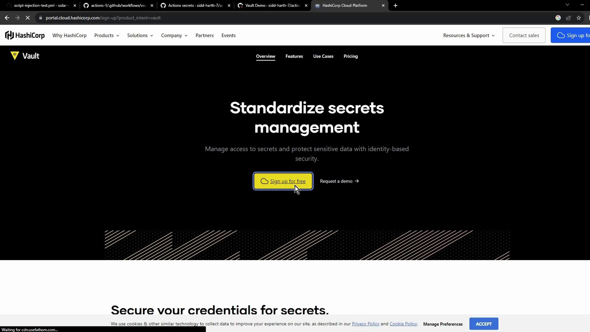
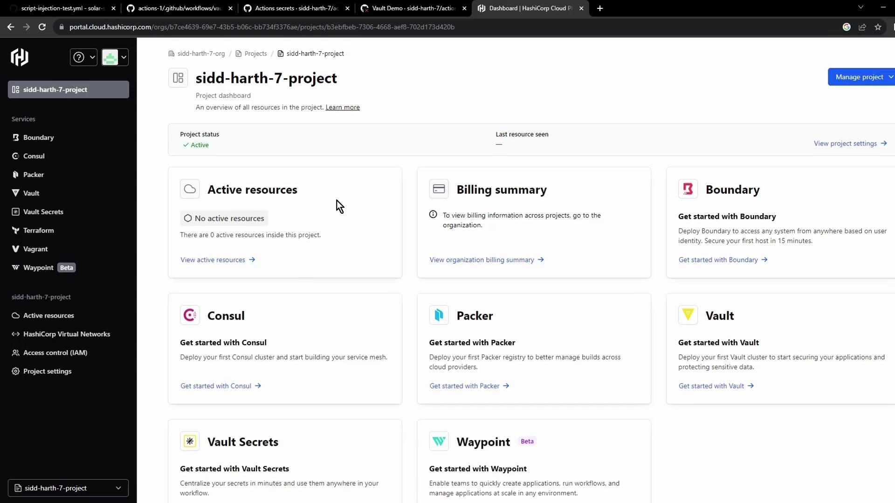
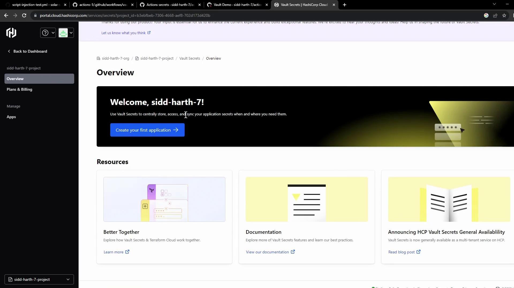
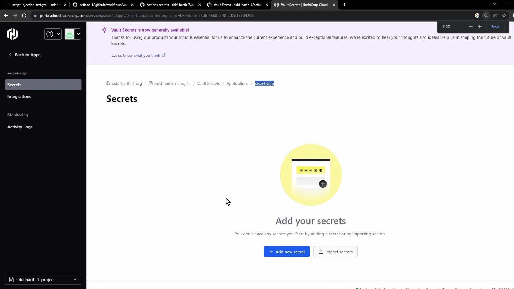
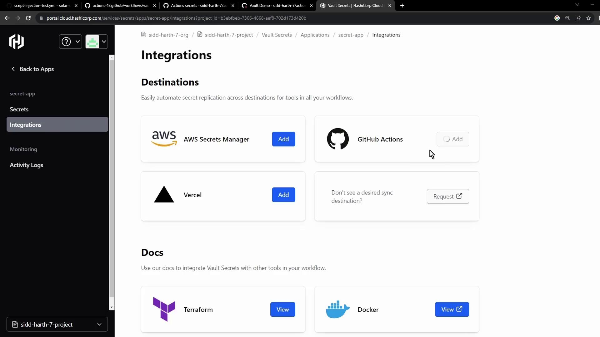
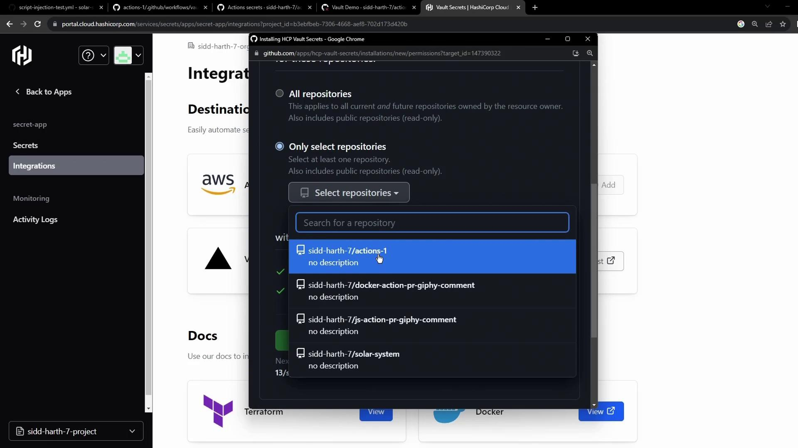
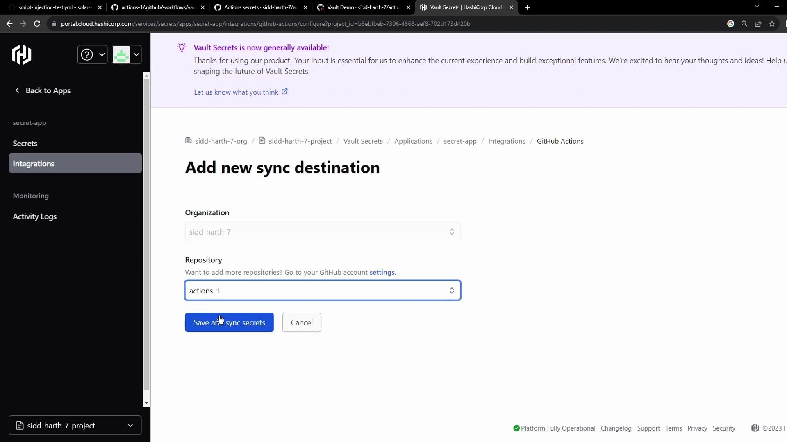
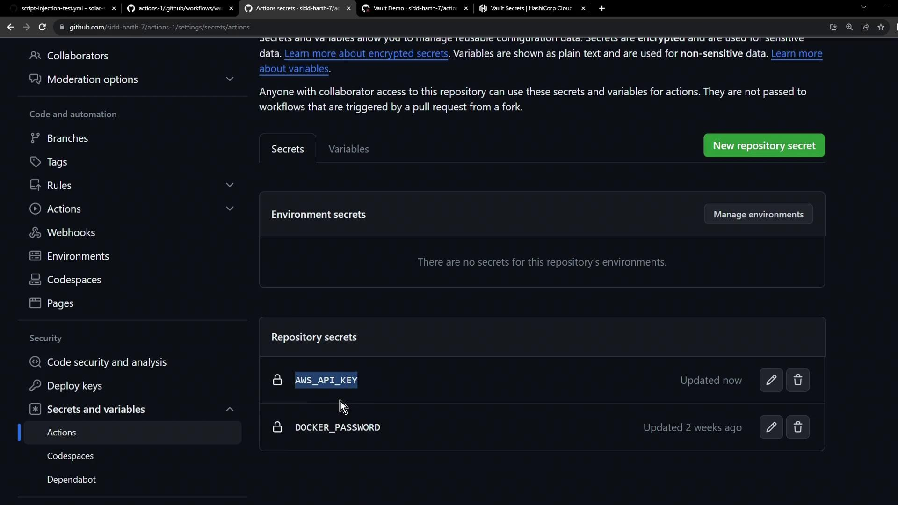
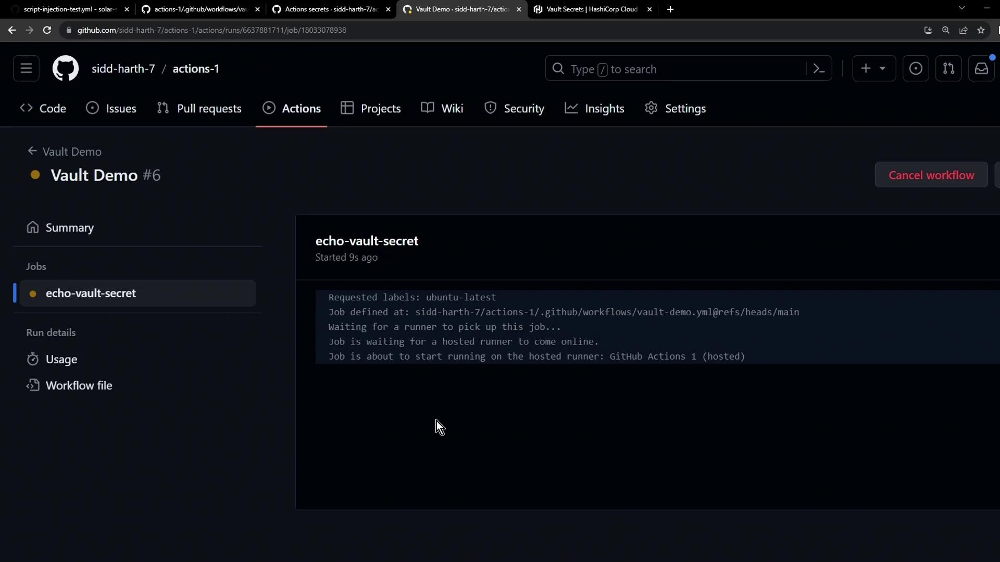

# Simulated check when AWS_API_KEY is unset
if [[ -z "" ]]; then
  echo "Secret Not Found"
  exit 1
fi

# Output:
Secret Not Found
```

## Provisioning HashiCorp Vault on HCP

HashiCorp Vault Secrets on the [HashiCorp Cloud Platform](https://cloud.hashicorp.com/) provides a fully managed service for centralized secret storage.

1. Sign in at the [HashiCorp Vault website](https://www.vaultproject.io/).

<Frame>
  
</Frame>

2. From the HCP dashboard, select **Vault Secrets**:

<Frame>
  
</Frame>

3. Click **Create application**, name it (e.g., **Secret App**), then add the `AWS_API_KEY` secret:

<Frame>
  
</Frame>

4. Use the **Add secret** button to insert your key/value pair:

<Frame>
  
</Frame>

<Callout icon="lightbulb">
  New users may be eligible for free credits on HCP. Check the [pricing page](https://cloud.hashicorp.com/pricing) for details.
</Callout>

## Integrating Vault with GitHub Actions

Enable automatic synchronization so GitHub Actions can retrieve secrets directly from Vault:

1. In the Vault console, select **Integrations → GitHub Actions**:

<Frame>
  
</Frame>

2. Authorize access to your GitHub account and grant Vault permission to the target repository:

<Frame>
  
</Frame>

3. Configure the sync destination and save:

<Frame>
  
</Frame>

Integration at a glance:

| Step              | Description                               |
| ----------------- | ----------------------------------------- |
| Authorize GitHub  | Grant Vault read access to selected repos |
| Select Repository | Choose the repo containing your workflow  |
| Configure Sync    | Map Vault path to GitHub secret name      |
| Save & Sync       | Trigger initial secret import             |

## Verifying the Workflow

After syncing, revisit **Settings → Secrets and variables → Actions** to confirm `AWS_API_KEY` appears alongside other repository secrets:

<Frame>
  
</Frame>

Re-run the **Vault Demo** workflow. The secret check now passes:

<Frame>
  
</Frame>

```bash theme={null}
# Masked secret check
if [[ -z "***" ]]; then
  echo "Secret Not Found"
  exit 1
else
  echo "Secret Found"
  exit 0
fi

# Output:
Secret Found
```

<Callout icon="triangle-alert">
  Always verify that only the minimum required permissions are granted when authorizing integrations. Avoid exposing secrets in plaintext logs.
</Callout>

## Links and References

* [HashiCorp Vault Documentation](https://www.vaultproject.io/docs)
* [GitHub Actions Secrets](https://docs.github.com/actions/security-guides/encrypted-secrets)
* [HashiCorp Cloud Platform](https://cloud.hashicorp.com/)
* [Vault Terraform Provider](https://registry.terraform.io/providers/hashicorp/vault/latest)

<CardGroup>
  <Card title="Watch Video" icon="video" href="https://learn.kodekloud.com/user/courses/github-actions-certification/module/a3e810f5-af92-4e1c-ac54-bdf50ddbe9cf/lesson/c50a8686-8a5d-4c58-bf96-d04a242ea354" />
</CardGroup>


# Security hardening for GitHub Actions

Source: https://notes.kodekloud.com/docs/GitHub-Actions-Certification/Security-Guide/Security-hardening-for-GitHub-Actions/page

This guide covers key areas for enhancing security in GitHub Actions workflows.

GitHub Actions is a powerful CI/CD platform, but without proper safeguards, workflows can introduce risks to your code, infrastructure, and sensitive data. This guide walks through four key areas of hardening your GitHub Actions security:

* Secrets Management
* OpenID Connect (OIDC)
* Mitigating Script Injection
* Third-Party Actions

***

## 1. Secrets Management

Storing credentials, tokens, and other sensitive information directly in workflows is a critical security risk. GitHub provides a robust secrets management system:

* **Encrypted storage**\
  Secrets are encrypted client-side with [Libsodium sealed boxes](https://doc.libsodium.org/public-key_cryptography/sealed_boxes) before being sent to GitHub.
* **Scoped access**\
  You can define secrets at the organization, repository, or environment level.
* **Masked output**\
  Any secret that appears in logs is automatically redacted.

Use the GitHub UI or REST API to add secrets. In your workflow, reference them as follows:

```yaml theme={null}
env:
  AWS_ACCESS_KEY_ID: ${{ secrets.AWS_ACCESS_KEY_ID }}
  AWS_SECRET_ACCESS_KEY: ${{ secrets.AWS_SECRET_ACCESS_KEY }}

jobs:
  build:
    runs-on: ubuntu-latest
    steps:
      - name: Checkout repository
        uses: actions/checkout@v3

      - name: Run build script
        run: |
          echo "Building project..."
          ./build.sh
```

<Callout icon="lightbulb">
  Regularly rotate your secrets and remove any unused credentials to limit blast radius.
</Callout>

***

## 2. OpenID Connect (OIDC)

Instead of long-lived cloud credentials, leverage short-lived tokens via OIDC. This eliminates static secrets and reduces credential exposure.

1. **Trust GitHub’s issuer**\
   Configure your cloud provider to trust `https://token.actions.githubusercontent.com` as an OIDC identity provider.

2. **Grant OIDC permissions**\
   In your workflow, request the `id-token` permission:

   ```yaml theme={null}
   permissions:
     id-token: write
     contents: read
   ```

3. **Configure credentials with an action**\
   For AWS, you can use the official AWS OIDC action:

   ```yaml theme={null}
   jobs:
     deploy:
       runs-on: ubuntu-latest
       steps:
         - name: Checkout code
           uses: actions/checkout@v3

         - name: Configure AWS credentials via OIDC
           uses: aws-actions/configure-aws-credentials@v2
           with:
             role-to-assume: arn:aws:iam::123456789012:role/MyRole
             aws-region: us-east-1

         - name: List S3 buckets
           run: aws s3 ls
   ```

<Callout icon="lightbulb">
  Short-lived tokens automatically expire, minimizing the risk of credential theft or misuse.
</Callout>

***

## 3. Mitigating Script Injection

When workflows process external or user-supplied data, attackers may inject malicious commands. Protect your runners by following these best practices:

* Never concatenate untrusted input into shell commands.
* Use action inputs or parameterized APIs instead of manually building commands.
* Validate and sanitize all external data.
* Prefer official or well-audited actions for complex processing.

<Callout icon="triangle-alert">
  Running unchecked user input in a shell step can expose secrets, corrupt workflows, or allow remote code execution.
</Callout>

***

## 4. Third-Party Actions

Community actions speed up development but can also introduce vulnerabilities or excessive permissions. Evaluate and manage third-party risks with this matrix:

| Action Type      | Risk                                    | Mitigation                                        |
| ---------------- | --------------------------------------- | ------------------------------------------------- |
| Community/Public | Malicious code, supply-chain attacks    | Pin to a specific commit SHA; review source code  |
| GitHub-Verified  | Lower risk but still subject to updates | Check blue-verified badge; grant least privilege  |
| Custom (Own)     | You control code integrity              | Maintain under version control; audit permissions |

Best practices:

* Pin actions to a commit SHA instead of a floating tag.
* Limit the `permissions` scope to the bare minimum (principle of least privilege).
* Periodically review third-party code for updates or security advisories.

<Frame>
  
</Frame>

***

## Links and References

* [GitHub Secrets Documentation](https://docs.github.com/en/actions/security-guides/encrypted-secrets)
* [OpenID Connect (OIDC)](https://openid.net/connect/)
* [Libsodium Sealed Boxes](https://doc.libsodium.org/public-key_cryptography/sealed_boxes)
* [GitHub-verified Actions](https://docs.github.com/en/products/actions/using-github-actions/trusted-publishing-program/about-github-verified-publishers)
* [aws-actions/configure-aws-credentials](https://github.com/aws-actions/configure-aws-credentials)

<CardGroup>
  <Card title="Watch Video" icon="video" href="https://learn.kodekloud.com/user/courses/github-actions-certification/module/a3e810f5-af92-4e1c-ac54-bdf50ddbe9cf/lesson/b816c060-d7d8-464a-becb-4ecc518cb5a7" />
</CardGroup>
