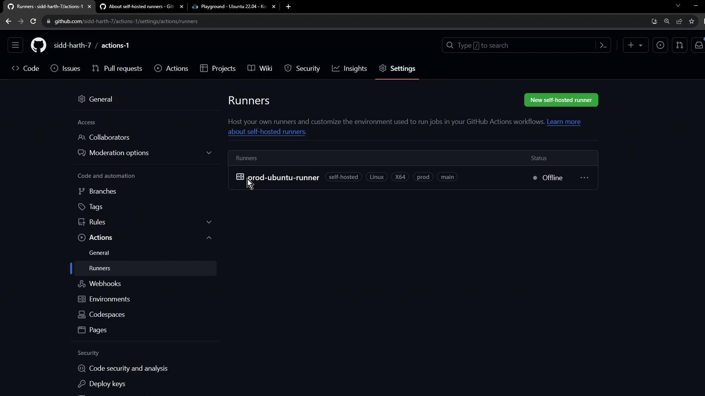
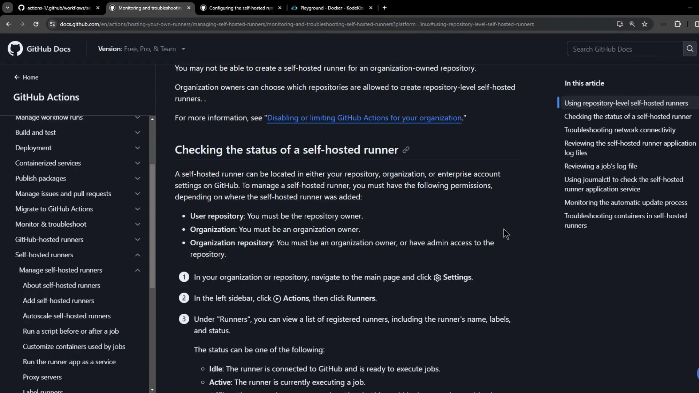
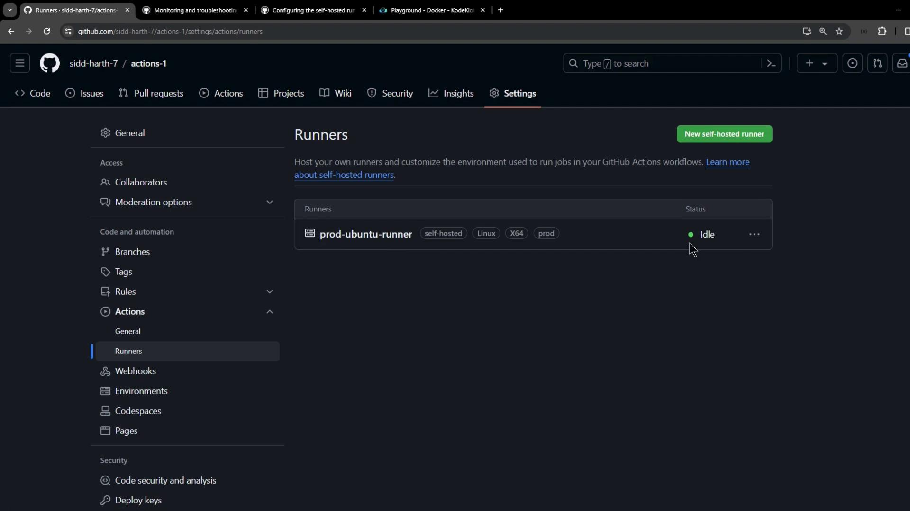
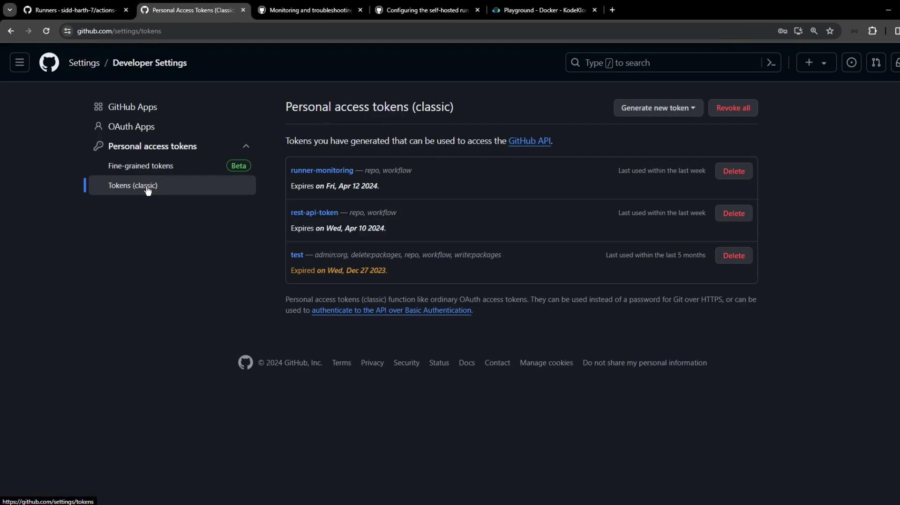
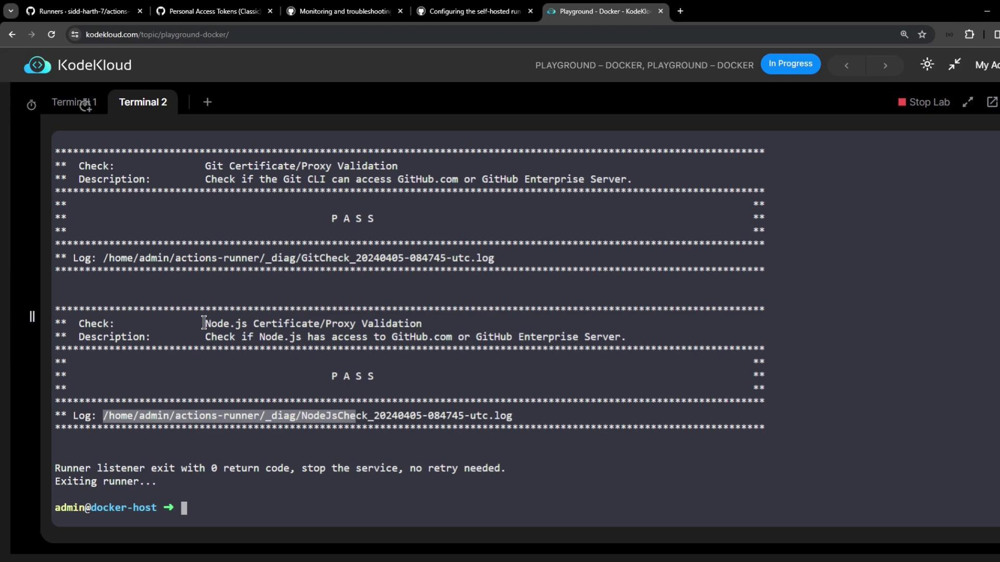
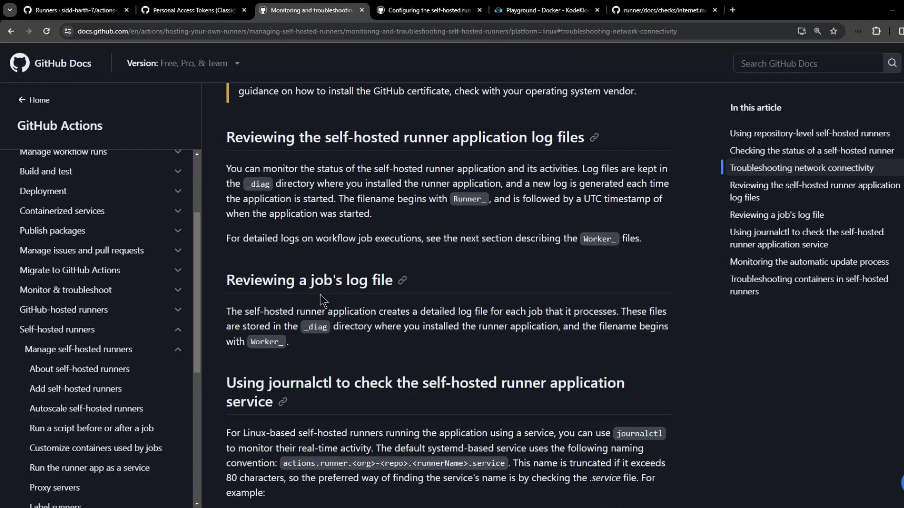
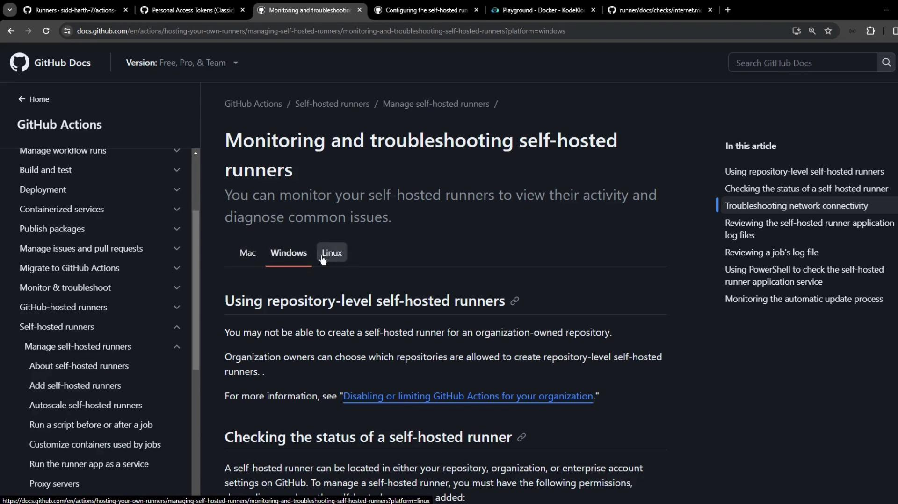
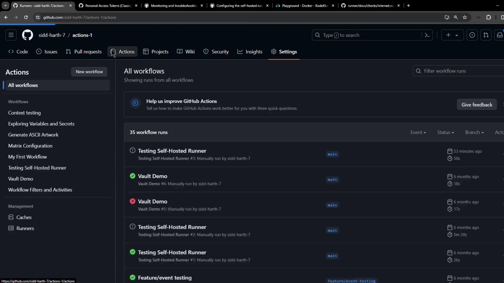
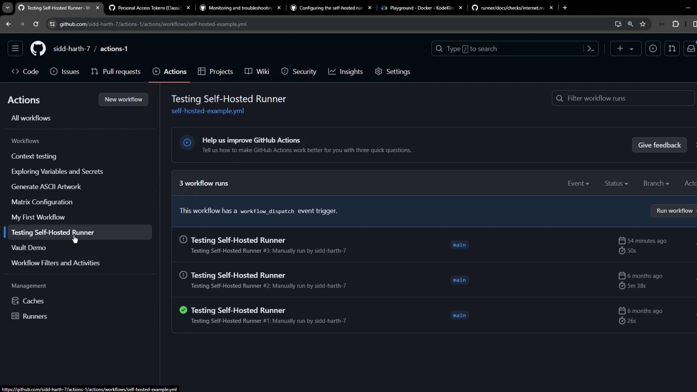

# Create a directory and enter it
mkdir actions-runner && cd actions-runner

# Download the latest runner package
curl -L -o actions-runner-linux-x64-2.310.2.tar.gz \
  https://github.com/actions/runner/releases/download/v2.310.2/actions-runner-linux-x64-2.310.2.tar.gz

# (Optional) Validate the SHA-256 checksum
echo "[SECRET_REDACTED]  actions-runner-linux-x64-2.310.2.tar.gz" \
  | sha256sum -c -

# Extract the archive
tar xzf actions-runner-linux-x64-2.310.2.tar.gz

# Verify extracted files
ls -1
```

You should see:

```plaintext theme={null}
bin
config.sh
env.sh
externals
run-helper.cmd.template
run.sh
safe_sleep.sh
```

## Step 3: Configure the Runner

Run the interactive configuration script:

```bash theme={null}
./config.sh --url https://github.com/<OWNER>/<REPO> --token YOUR_TOKEN_HERE
```

<Callout icon="triangle-alert">
  Do **not** run this script as root unless you intentionally bypass the check.\
  Running GitHub Actions jobs as `root` can introduce security and reliability risks.
</Callout>

The script enforces:

```bash theme={null}
#!/bin/bash
user_id=$(id -u)

if [[ $user_id -eq 0 && -z "$RUNNER_ALLOW_RUNASROOT" ]]; then
  echo "Must not run with sudo"
  exit 1
fi
```

### Bypass the Root Check (Optional)

If you need to run as root:

```bash theme={null}
export RUNNER_ALLOW_RUNASROOT=1
./config.sh --url https://github.com/<OWNER>/<REPO> --token YOUR_TOKEN_HERE
```

During setup, you will:

* Choose a runner group (default: **default** for repo-level).
* Name your runner (e.g., `prod-ubuntu-runner`).
* Assign labels (default: `self-hosted`, `Linux`, `X64`; you can add `prod`, `main`).
* Confirm or change the working directory (default: `_work`).

## Step 4: Verify Registration (Offline)

Once registration completes, your runner shows as **Offline** in the Runners list:

<Frame>
  
</Frame>

## Step 5: Start the Runner

Back in your VM, launch the runner process so it connects to GitHub and listens for jobs:

```bash theme={null}
./run.sh
```

Expected output:

```plaintext theme={null}
√ Connected to GitHub
Current runner version: '2.310.2'
2023-10-24 14:51:44Z: Listening for Jobs
```

## Step 6: Verify Runner Status (Online)

Refresh the **Runners** page. Your runner should now be **Online** and idle, ready to accept jobs:

<Frame>
  
</Frame>

## Step 7: Use Your Self-Hosted Runner in Workflows

Add this to any workflow file (`.github/workflows/*.yml`) to target your runner:

```yaml theme={null}
jobs:
  build:
    runs-on: self-hosted
    steps:
      # …
```

<Callout icon="lightbulb">
  Ensure your self-hosted runner has all required tools and permissions for your workflows.
</Callout>

## Links and References

* [GitHub Actions Self-Hosted Runners](https://docs.github.com/actions/hosting-your-own-runners)
* [GitHub Actions Runner Releases](https://github.com/actions/runner/releases)
* [Managing Self-Hosted Runners](https://docs.github.com/actions/hosting-your-own-runners/about-self-hosted-runners)

<CardGroup>
  <Card title="Watch Video" icon="video" href="https://learn.kodekloud.com/user/courses/github-actions-certification/module/7cc7bcee-0af6-41af-9653-dfd6e0403fe9/lesson/e8a5416c-25e5-4671-b596-6eb249cb10c8" />
</CardGroup>


# Monitor troubleshoot and update self hosted runners

Source: https://notes.kodekloud.com/docs/GitHub-Actions-Certification/Self-Hosted-Runner/Monitor-troubleshoot-and-update-self-hosted-runners/page

This guide covers monitoring, troubleshooting, and updating self-hosted GitHub Actions runners on your infrastructure.

Self-hosted runners let you run GitHub Actions on your own infrastructure, but they can fail due to configuration, connectivity, or environment issues. In this guide, we’ll walk through:

1. Checking runner status in the GitHub UI
2. Diagnosing network connectivity
3. Reviewing runner application logs
4. Monitoring via systemd and journalctl
5. Triggering and tracking workflows
6. Updating runners and verifying Docker availability

For more details, visit GitHub’s official docs on [Monitoring self-hosted runners](https://docs.github.com/en/actions/hosting-your-own-runners/monitoring-self-hosted-runners).

***

## 1. Checking Runner Status in the GitHub UI

Navigate to **Settings > Actions > Runners** in your repository (or organization) to see all self-hosted runners, their labels, and their status:

<Frame>
  
</Frame>

Example workflow using a self-hosted Linux runner labeled `prod`:

```yaml theme={null}
name: Testing Self-Hosted Runner
on:
  workflow_dispatch:
jobs:
  testing:
    runs-on:
      - self-hosted
      - linux
      - prod
    steps:
      - name: Echo Content
        run: |
          echo "OK"
          sleep 1500s
```

After dispatching, the runner appears as **Active** under Settings:

<Frame>
  
</Frame>

***

## 2. Diagnosing Network Connectivity

The runner provides `run.sh` with a `--check` flag to verify connectivity to GitHub services. Run:

```bash theme={null}
./run.sh --check \
  --url https://github.com/YOUR-ORG/YOUR-REPO \
  --pat YOUR_PERSONAL_ACCESS_TOKEN
```

<Callout icon="lightbulb">
  Generate a classic personal access token with the `workflow` scope under **Settings > Developer settings > Personal access tokens**.
</Callout>

<Frame>
  
</Frame>

Successful checks look like:

```bash theme={null}
✓ Connected to GitHub
Current runner version: '2.315.0'
✓ Git certificate/proxy validation
✓ Node.js certificate/proxy validation
...
```

<Frame>
  
</Frame>

If any test fails, inspect the `_diag` log:

```bash theme={null}
cat /home/admin/actions-runner/_diag/InternetCheck_YYYYMMDD-HHMMSS-utc.log
```

<Callout icon="triangle-alert">
  Disabling TLS verification reduces security. Use only for temporary troubleshooting:

  ```bash theme={null}
  export GITHUB_ACTIONS_RUNNER_TLS_NO_VERIFY=1
  ./config.sh --url https://github.com/ORG/REPO --token TOKEN
  ./run.sh
  ```
</Callout>

***

## 3. Reviewing Runner Application Logs

All runner logs reside in the `_diag` directory of your runner installation:

```bash theme={null}
ls /home/admin/actions-runner/_diag/
```

Refer to GitHub’s [self-hosted runner logs documentation](https://docs.github.com/en/actions/hosting-your-own-runners/monitoring-self-hosted-runners) for file descriptions.

<Frame>
  
</Frame>

***

## 4. Monitoring via systemd and journalctl (Linux)

When installed as a service, manage and view logs using `systemctl` and `journalctl`. The service name follows:

```text theme={null}
actions.runner.<ORG>-<REPO>.<RUNNER_NAME>.service
```

Install and start:

```bash theme={null}
cd actions-runner
sudo ./svc.sh install
sudo ./svc.sh start
```

Verify status:

```bash theme={null}
systemctl status actions.runner.octo-org-octo-repo.runner01.service
```

Stream real-time logs:

```bash theme={null}
sudo journalctl -u actions.runner.octo-org-octo-repo.runner01.service -f
```

<Frame>
  
</Frame>

Example log output:

```bash theme={null}
Apr 05 11:52:32 runner01 runsvc.sh[962]: Starting Runner listener with startup type: service
Apr 05 11:52:32 runner01 runsvc.sh[962]: ✔ Connected to GitHub
Apr 05 11:52:33 runner01 runsvc.sh[962]: Listening for Jobs
```

***

## 5. Triggering and Tracking a Workflow

Dispatch your workflow (`workflow_dispatch`) and watch both the service logs and GitHub Actions UI. In the Actions tab, monitor status, duration, and logs:

<Frame>
  
</Frame>

When running, service logs will indicate job execution:

<Frame>
  
</Frame>

```bash theme={null}
Apr 05 11:59:39 runner01 runsvc.sh[962]: 2024-04-05 08:59:39Z: Running job: testing
```

***

## 6. Updating Runners and Verifying Docker

Keep your runner and Docker up-to-date to avoid unexpected failures:

| Command                                           | Purpose                                        |
| ------------------------------------------------- | ---------------------------------------------- |
| `./svc.sh remove && ./config.sh --unattended ...` | Remove old config and reconfigure runner       |
| Follow GitHub’s \[runner update guide]            | Download and install the latest runner release |
| `sudo systemctl is-active docker.service`         | Check Docker service status                    |

<Callout icon="lightbulb">
  If Docker is not found, container actions will fail:

  ```text theme={null}
  [ERR StepsRunner] FileNotFoundException: File not found: 'docker'
  ```

  Install Docker with [official instructions](https://docs.docker.com/engine/install/).
</Callout>

| Issue                          | Symptom                                   | Resolution                                 |
| ------------------------------ | ----------------------------------------- | ------------------------------------------ |
| Outdated runner                | Workflow errors or deprecation warnings   | Update via GitHub runner update guide      |
| Missing Docker                 | `FileNotFoundException: 'docker'` in logs | Install and start `docker.service`         |
| Network / SSL certificate fail | Connectivity checks fail                  | Update certificates or set TLS\_NO\_VERIFY |

***

## Links and References

* [GitHub Actions: Hosting your own runners](https://docs.github.com/en/actions/hosting-your-own-runners)
* [Runner update documentation](https://github.[AWS_SECRET_ACCESS_KEY]-update.md)
* [Monitor self-hosted runners](https://docs.github.com/en/actions/hosting-your-own-runners/monitoring-self-hosted-runners)
* [Docker Engine installation](https://docs.docker.com/engine/install/)

<CardGroup>
  <Card title="Watch Video" icon="video" href="https://learn.kodekloud.com/user/courses/github-actions-certification/module/7cc7bcee-0af6-41af-9653-dfd6e0403fe9/lesson/193e91c4-d6e8-4fa0-9cac-5ba4fddcc992" />
</CardGroup>
