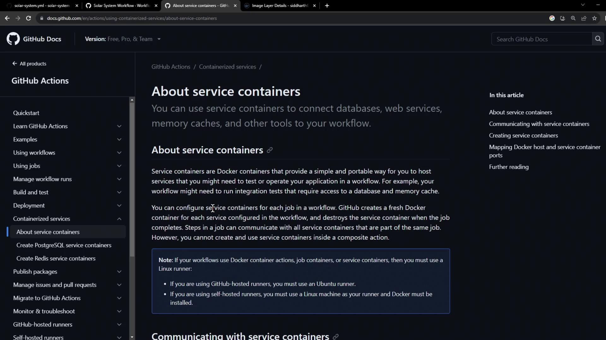
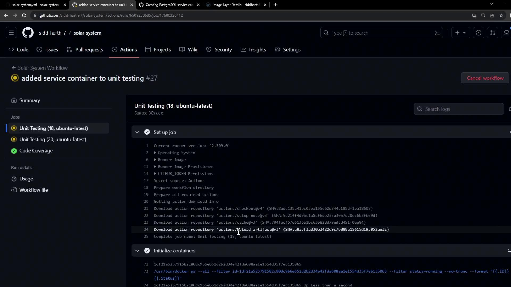
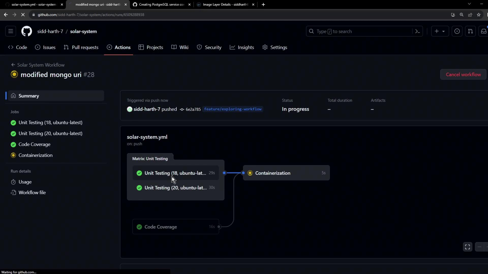

# Run Unit Testing Job using a Service

Source: https://notes.kodekloud.com/docs/GitHub-Actions/Continuous-Integration-with-GitHub-Actions/Run-Unit-Testing-Job-using-a-Service/page

This guide explains how to set up a non-production MongoDB service container for unit testing in GitHub Actions workflows.

In this guide, we’ll show you how to spin up a non-production MongoDB service container alongside your GitHub Actions workflow. By configuring a service container, you isolate test data from your production instance and ensure reliable, repeatable unit tests.

<Callout icon="lightbulb">
  Service containers are Docker containers that run in parallel with your job, providing databases, caches, or other dependencies in an isolated environment.
</Callout>

<Frame>
  
</Frame>

***

## 1. Base Workflow Configuration

Here’s our existing workflow using a production MongoDB instance. We need to replace it with a test container:

```yaml theme={null}
name: Solar System Workflow

on:
  workflow_dispatch:
  push:
    branches:
      - main
      - 'feature/*'

env:
  MONGO_URI: mongodb+srv://supercluster.d83jj.mongodb.net/superData
  MONGO_USERNAME: ${{ vars.MONGO_USERNAME }}
  MONGO_PASSWORD: ${{ secrets.MONGO_PASSWORD }}

jobs:
  unit-testing: ...
  code-coverage: ...
  docker: ...
```

***

## 2. Configuring MongoDB as a Service Container

We’ll use the pre-built image `siddharth67/mongo-db:non-prod` from [Docker Hub](https://hub.docker.com/). Add a `services` section to your `unit-testing` job:

```yaml theme={null}
jobs:
  unit-testing:
    name: Unit Testing
    runs-on: ubuntu-latest

    services:
      mongo-db:
        image: siddharth67/mongo-db:non-prod
        ports:
          - 27017:27017

    strategy:
      matrix:
        nodejs_version: [18, 20]
        operating_system: [ubuntu-latest]
        exclude:
          - nodejs_version: 18
            operating_system: macos-latest

    steps:
      - name: Checkout Repository
        uses: actions/checkout@v4

      - name: Setup Node.js ${{ matrix.nodejs_version }}
        uses: actions/setup-node@v3
        with:
          node-version: ${{ matrix.nodejs_version }}
```

Mapping port `27017` on the host to the container lets your tests connect via `localhost:27017`.

***

## 3. Overriding Environment Variables

Job-level environment variables override global settings. Point your test suite at the local MongoDB service:

```yaml theme={null}
jobs:
  unit-testing:
    # ... (services config)

    env:
      MONGO_URI: 'mongodb://localhost:27017/superData'
      MONGO_USERNAME: non-prod-user
      MONGO_PASSWORD: non-prod-password

    # ... (strategy & steps)
```

<Callout icon="lightbulb">
  Job-level `env` entries take precedence over workflow-level `env` values.
</Callout>

Commit and push to trigger the updated workflow.

***

## 4. Initialization Behind the Scenes

During the `initialize containers` step, GitHub Actions:

1. Creates an isolated Docker network
2. Pulls the service image
3. Launches the container and maps its ports
4. Waits for any health checks to pass

```bash theme={null}
/usr/bin/docker ps --filter id=... --no-trunc --format "{{.ID}}"
/usr/bin/docker inspect --format "{{if .Config.Healthcheck}}{{print .State.Health.Status}}{{end}}"
```

<Frame>
  
</Frame>

***

## 5. Fixing Connection String Errors

If you encounter:

```bash theme={null}
MongoParseError: Invalid connection string
```

ensure your URI starts with the correct scheme:

```yaml theme={null}
env:
  MONGO_URI: 'mongodb://localhost:27017/superData'
```

<Callout icon="triangle-alert">
  Check for typos and ensure `mongodb://` (not `mongodb+srv://`) when connecting to a local container.
</Callout>

You can also update to the latest setup-node action:

```yaml theme={null}
- name: Setup Node.js ${{ matrix.nodejs_version }}
  uses: actions/setup-node@v4
  with:
    node-version: ${{ matrix.nodejs_version }}
```

Push your fixes and rerun the workflow.

***

## 6. Successful Run

A successful unit-testing job looks like this:

```bash theme={null}
npm test
shell: /usr/bin/bash -e {0}
env:
  MONGO_URI: mongodb://localhost:27017/superData
  MONGO_USERNAME: non-prod-user
  MONGO_PASSWORD: non-prod-password
Solar System@0.7.6 test
mocha app-test.js --timeout 10000 --reporter mocha-junit-reporter --exit
Server successfully running on port - 3000
```

<Frame>
  
</Frame>

Your tests now run against a dedicated non-production MongoDB container, keeping real data safe and test environments reproducible.

***

## References

* [Using a service container in GitHub Actions](https://docs.github.com/en/actions/using-containerized-services/containers-in-your-workflow#using-a-service-container)
* [GitHub Actions: Runner container initialization](https://docs.github.com/actions/using-github-hosted-runners/about-github-hosted-runners)
* [Docker Hub: MongoDB Official Image](https://hub.docker.com/_/mongo)
* [GitHub Actions: setup-node action](https://github.com/actions/setup-node)

<CardGroup>
  <Card title="Watch Video" icon="video" href="https://learn.kodekloud.com/user/courses/github-actions/module/6136c7b5-8fe0-4a84-ae77-0274623512d5/lesson/6d90f43f-91a0-4a91-aa59-ce423ccf0399" />
</CardGroup>
