# 1. Build the Docker image without pushing
- name: Docker Build for Testing
  uses: docker/build-push-action@v4
  with:
    context: .
    push: false                   # disable push during test build
    tags: ${{ vars.DOCKERHUB_USERNAME }}/solar-system:${{ github.sha }}

# 2. Run tests against the local image
- name: Docker Image Testing
  run: |
    docker images
    docker run --name solar-system-app -d \
      -p 3000:3000 \
      -e MONGO_URI=${{ secrets.MONGO_URI }} \
      -e MONGO_USERNAME=${{ secrets.MONGO_USERNAME }} \
      -e MONGO_PASSWORD=${{ secrets.MONGO_PASSWORD }} \
      ${{ vars.DOCKERHUB_USERNAME }}/solar-system:${{ github.sha }}

    # Inspect container IP and test /live endpoint
    IP=$(docker inspect -f '{{range .NetworkSettings.Networks}}{{.IPAddress}}{{end}}' solar-system-app)
    echo "Container IP: $IP"
    echo "Testing /live endpoint"
    wget -qO- "http://127.0.0.1:3000/live" | grep live

# 3. Push the tested image to Docker Hub
- name: Docker Push
  uses: docker/build-push-action@v4
  with:
    context: .
    push: true                    # enable push to registry
    tags: ${{ vars.DOCKERHUB_USERNAME }}/solar-system:${{ github.sha }}
```

After you commit and push, GitHub Actions will execute the build, test, and push steps in sequence.

## Step-by-Step Breakdown

| Step Name                | Action                        | Description                                                          |
| ------------------------ | ----------------------------- | -------------------------------------------------------------------- |
| Docker Build for Testing | `docker/build-push-action@v4` | Builds the image locally without pushing to the registry             |
| Docker Image Testing     | `run`                         | Starts a container, retrieves its IP, and tests the `/live` endpoint |
| Docker Push              | `docker/build-push-action@v4` | Re-builds (using cache) and uploads all layers to Docker Hub         |

## Inspecting the Push Logs

During the **Docker Push** step you’ll see output similar to:

```bash theme={null}
/usr/bin/docker buildx build \
  --iidfile /tmp/docker-actions-toolkit/iidfile \
  --tag youruser/solar-system:[AWS_SECRET_ACCESS_KEY] \
  --push .
```

This confirms that Buildx is pushing each layer of your image to Docker Hub.

## Verify the Image on Docker Hub

Once the workflow completes:

1. Go to your repository on [Docker Hub](https://hub.docker.com/).
2. Look under **Tags** for the SHA-based tag (e.g., `[AWS_SECRET_ACCESS_KEY]`).

<Callout icon="triangle-alert">
  If you see authentication errors, double-check that `DOCKERHUB_TOKEN` is up to date and has the correct permissions.
</Callout>

## Manual Push (Optional)

You can also push an existing local image with:

```bash theme={null}
docker push youruser/solar-system:tagname
```

***

## Links and References

* [GitHub Actions: build-push-action](https://github.com/docker/build-push-action)
* [Docker Hub](https://hub.docker.com/)
* [GitHub Secrets Documentation](https://docs.github.com/actions/security-guides/encrypted-secrets)

<CardGroup>
  <Card title="Watch Video" icon="video" href="https://learn.kodekloud.com/user/courses/github-actions/module/6136c7b5-8fe0-4a84-ae77-0274623512d5/lesson/f59ce571-cc4b-422e-a12b-cd1842366c56" />
</CardGroup>


# Workflow Login and Push to GHCR

Source: https://notes.kodekloud.com/docs/GitHub-Actions/Continuous-Integration-with-GitHub-Actions/Workflow-Login-and-Push-to-GHCR/page

Automating Docker image builds and pushes to Docker Hub and GitHub Container Registry using GitHub Actions with environment variables and authentication steps.

Automating Docker image builds and pushes to multiple registries—Docker Hub and GitHub Container Registry (GHCR)—is straightforward with GitHub Actions. This guide walks you through defining environment variables, authenticating to GHCR, updating your workflow, and handling permissions.

## Step 1: Define Environment Variables

Keep secret credentials out of your code by declaring environment variables at the top of your workflow:

```yaml theme={null}
env:
  MONGO_URI: mongodb+srv://supercluster.d8jj.mongodb.net/superdata
  MONGO_USERNAME: ${{ vars.MONGO_USERNAME }}
  MONGO_PASSWORD: ${{ secrets.MONGO_PASSWORD }}

jobs:
  unit-testing: …
  code-coverage: …
  docker: …
```

<Callout icon="lightbulb">
  Use `vars` for non-sensitive values and `secrets` for confidential data.
</Callout>

## Step 2: View Recent Workflow Runs

After committing your `.github/workflows/ci.yml`, check the **Actions** tab to see your workflow executions:

<Frame>
  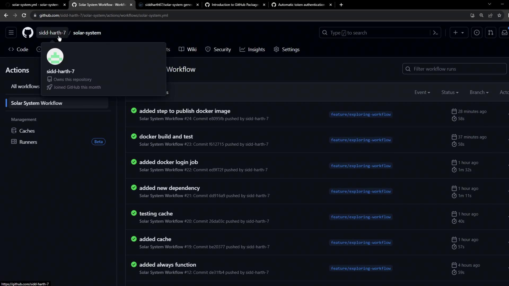
</Frame>

## Understanding GitHub Container Registry

GHCR lets you publish, store, and share Docker and OCI images under the `ghcr.io` namespace.

### Explore GHCR in GitHub Docs

Visit the GitHub Packages documentation and select **Container Registry**:

<Frame>
  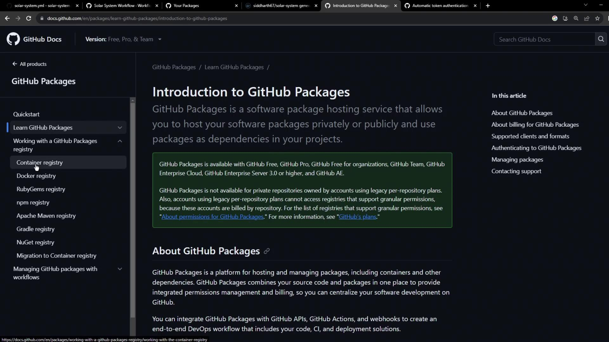
</Frame>

### GHCR Namespace Details

All images live under `ghcr.io/<OWNER>/<IMAGE>`:

<Frame>
  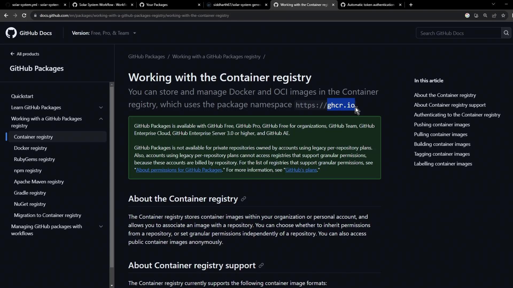
</Frame>

## Step 3: Authenticate to GHCR

Authenticating uses a GitHub token with *write* permissions to `packages`. The registry is `ghcr.io`, username is your GitHub account, and the password is a Personal Access Token (PAT) or `$GITHUB_TOKEN`.

<Frame>
  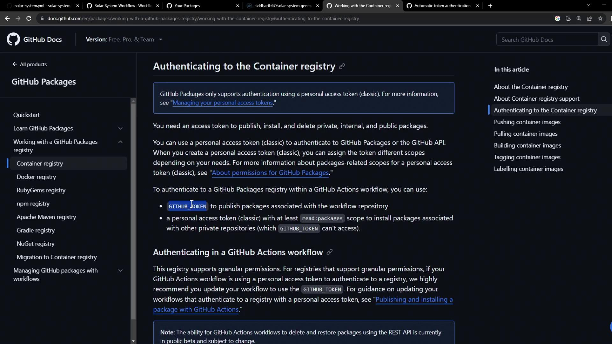
</Frame>

```bash theme={null}
export CR_PAT=YOUR_TOKEN
echo $CR_PAT | docker login ghcr.io -u USERNAME --password-stdin
docker push ghcr.io/NAMESPACE/IMAGE_NAME:latest
docker push ghcr.io/NAMESPACE/IMAGE_NAME:2.5
```

<Callout icon="triangle-alert">
  By default, `GITHUB_TOKEN` only has **read** access to packages. You must grant **write** permissions (shown later) to push images.
</Callout>

## Step 4: Update Your GitHub Actions Workflow

Under the `docker` job, add login, build, test, and push steps.

### Login Actions

| Registry                  | Action                       | Inputs                                                                                                   |
| ------------------------- | ---------------------------- | -------------------------------------------------------------------------------------------------------- |
| Docker Hub                | `docker/login-action@v2.2.0` | `username: ${{ vars.DOCKERHUB_USERNAME }}`, `password: ${{ secrets.DOCKERHUB_PASSWORD }}`                |
| GitHub Container Registry | `docker/login-action@v2.2.0` | `registry: ghcr.io`, `username: ${{ github.repository_owner }}`, `password: ${{ secrets.GITHUB_TOKEN }}` |

```yaml theme={null}
jobs:
  docker:
    name: Containerization
    needs: [unit-testing, code-coverage]
    runs-on: ubuntu-latest
    steps:
      - name: Checkout Repository
        uses: actions/checkout@v4

      - name: Docker Hub Login
        uses: docker/login-action@v2.2.0
        with:
          username: ${{ vars.DOCKERHUB_USERNAME }}
          password: ${{ secrets.DOCKERHUB_PASSWORD }}

      - name: GHCR Login
        uses: docker/login-action@v2.2.0
        with:
          registry: ghcr.io
          username: ${{ github.repository_owner }}
          password: ${{ secrets.GITHUB_TOKEN }}
```

### Build Image for Testing

Use `docker/build-push-action` with `push: false` to build without pushing:

```yaml theme={null}
      - name: Build image for testing
        uses: docker/build-push-action@v4
        with:
          context: .
          push: false
          tags: ${{ vars.DOCKERHUB_USERNAME }}/solar-system:${{ github.sha }}
```

### Run Container Tests

Start your container and verify health endpoints:

```yaml theme={null}
      - name: Test Docker image
        run: |
          docker images
          docker run --name solar-system-app -d \
            -p 3000:3000 \
            -e MONGO_URI=$MONGO_URI \
            -e MONGO_USERNAME=$MONGO_USERNAME \
            -e MONGO_PASSWORD=$MONGO_PASSWORD \
            ${{ vars.DOCKERHUB_USERNAME }}/solar-system:${{ github.sha }}

          export IP=$(docker inspect -f '{{range .NetworkSettings.Networks}}{{.IPAddress}}{{end}}' solar-system-app)
          echo "App IP: $IP"
          echo "Testing endpoint"
          wget -q -O - 127.0.0.1:3000/live | grep live
```

### Push to Both Registries

Finally, enable `push: true` and tag for both Docker Hub and GHCR:

```yaml theme={null}
      - name: Push to registries
        uses: docker/build-push-action@v4
        with:
          context: .
          push: true
          tags: |
            ${{ vars.DOCKERHUB_USERNAME }}/solar-system:${{ github.sha }}
            ghcr.io/${{ github.repository_owner }}/solar-system:${{ github.sha }}
```

Commit (e.g., `chore: add GHCR authentication and push steps`) and monitor:

<Frame>
  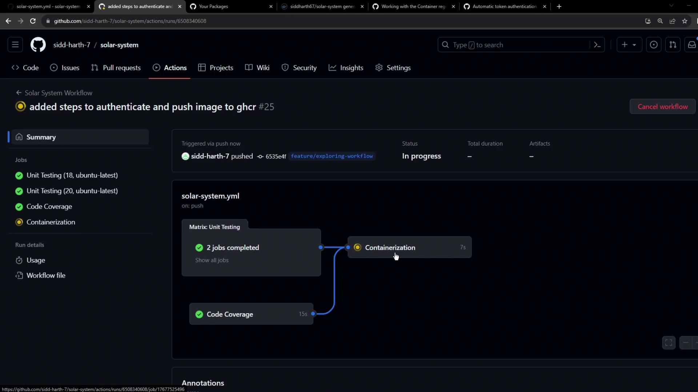
</Frame>

### Handling Push Errors

If you encounter:

`denied: installation not allowed to Create organization package`

you’ll see a failed **Containerization** job:

<Frame>
  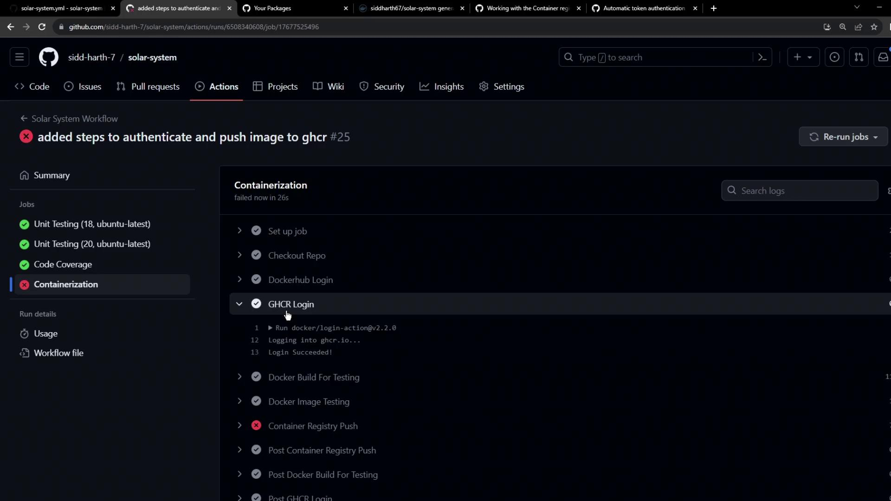
</Frame>

And logs may display:

<Frame>
  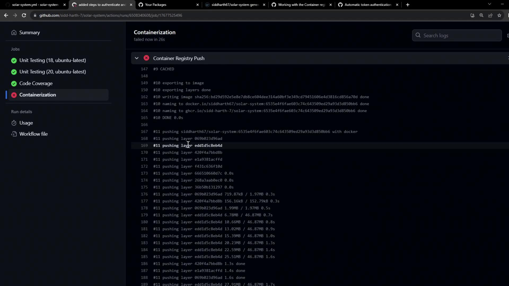
</Frame>

## Step 5: Grant Write Permissions to Packages

Add package write permissions to the `docker` job:

```yaml theme={null}
jobs:
  docker:
    permissions:
      packages: write
    …
```

Refer to the GitHub Token permissions table:

<Frame>
  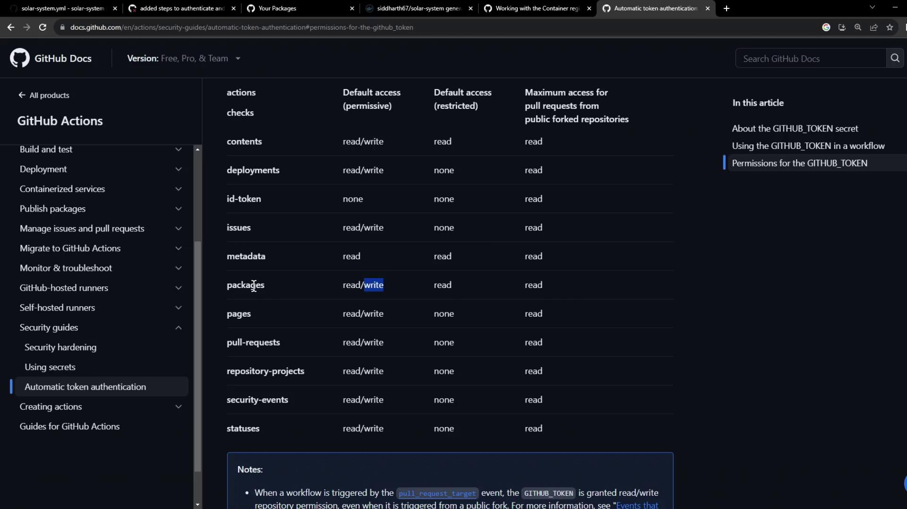
</Frame>

Re-run the workflow. The **Containerization** job should now succeed:

<Frame>
  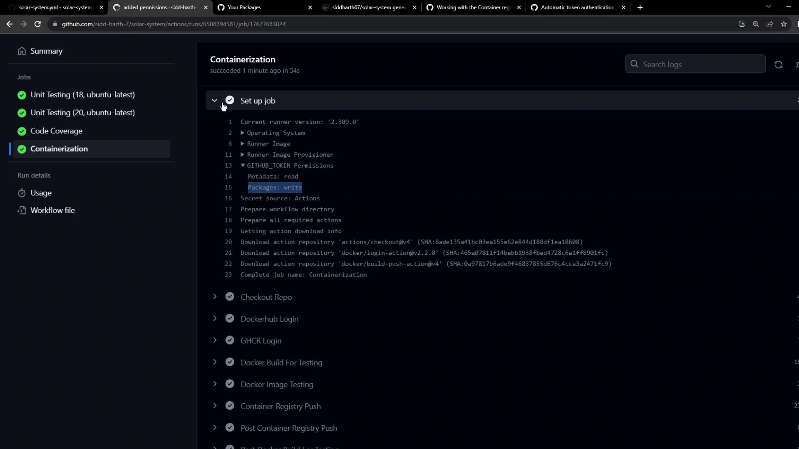
</Frame>

## Step 6: View All Workflow Runs

Check all runs under your workflow:

<Frame>
  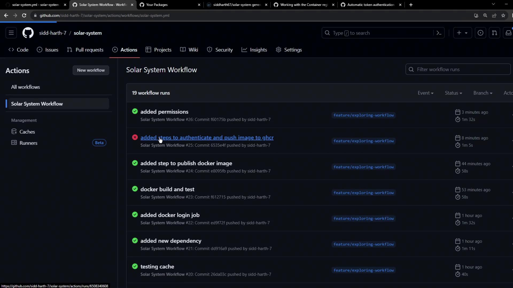
</Frame>

If you need to reference a failed run, it appears like this:

<Frame>
  
</Frame>

## Step 7: Pull and Use Your GHCR Image

Now that your image lives on GHCR, you can pull and reuse it:

```bash theme={null}
docker pull ghcr.io/${{ github.repository_owner }}/solar-system:${{ github.sha }}
```

Use it as a base in other Dockerfiles:

```dockerfile theme={null}
FROM ghcr.io/${{ github.repository_owner }}/solar-system:${{ github.sha }}
```

Visit your **Packages** tab to explore your new container package:

<Frame>
  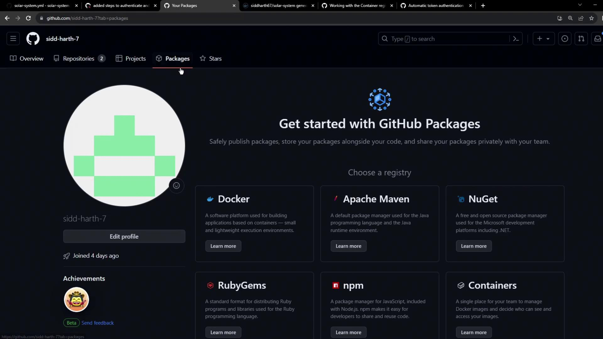
</Frame>

## Links and References

* [GitHub Actions Documentation](https://docs.github.com/actions)
* [GitHub Container Registry](https://docs.github.com/packages/working-with-a-github-packages-registry/working-with-the-container-registry)
* [Docker Build and Push Action](https://github.com/docker/build-push-action)
* [Permissions for the GITHUB\_TOKEN](https://docs.github.com/actions/security-guides/permissions-for-the-github_token)

<CardGroup>
  <Card title="Watch Video" icon="video" href="https://learn.kodekloud.com/user/courses/github-actions/module/6136c7b5-8fe0-4a84-ae77-0274623512d5/lesson/44d8fb39-66e0-484f-b815-2fd4d36b1644" />
</CardGroup>
