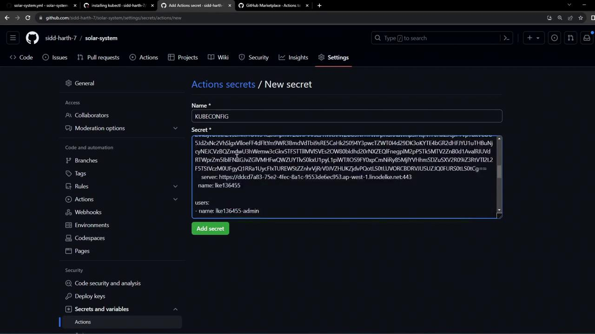
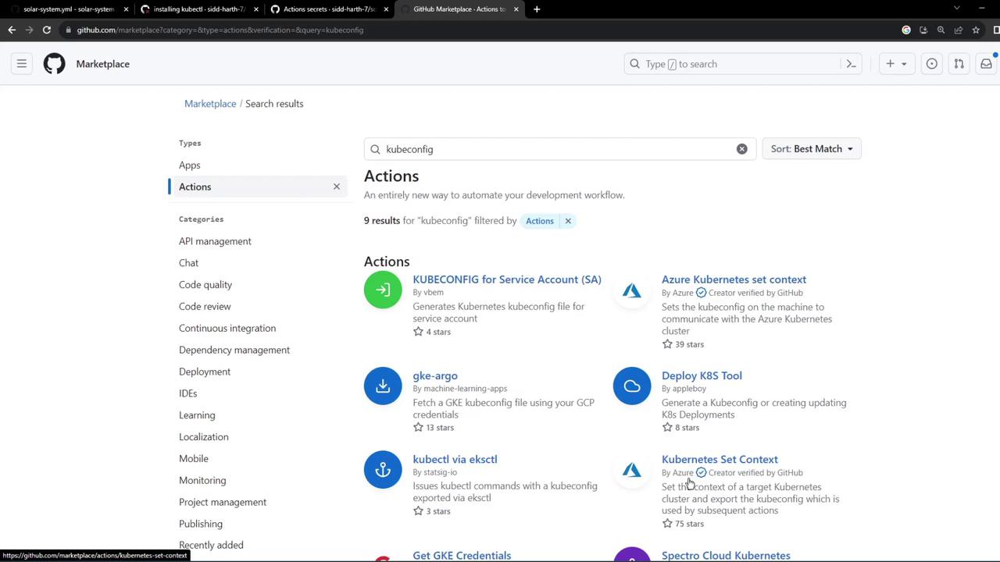
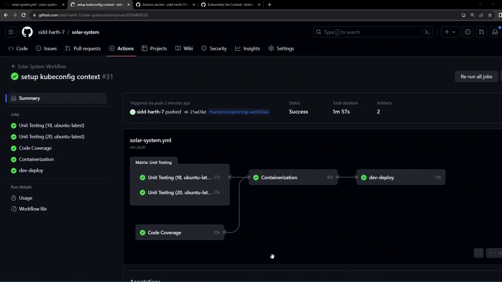

# Workflow Configuring Kubeconfig file

Source: https://notes.kodekloud.com/docs/GitHub-Actions/Continuous-Deployment-with-GitHub-Actions/Workflow-Configuring-Kubeconfig-file/page

This guide explains how to configure a Kubeconfig file in GitHub Actions for authenticating with a remote Kubernetes cluster.

In this guide, you'll learn how to configure a Kubeconfig file within a GitHub Actions workflow, enabling `kubectl` to authenticate and interact with a remote Kubernetes cluster as part of your CI/CD pipeline.

## Initial Workflow

Below is the existing `dev-deploy` job before integrating the Kubeconfig step:

```yaml theme={null}
dev-deploy:
  needs: docker
  runs-on: ubuntu-latest
  steps:
    - name: Checkout Repository
      uses: actions/checkout@v4

    - name: Install kubectl CLI
      uses: azure/setup-kubectl@v3
      with:
        version: '1.26.0'

    - name: Fetch Kubernetes Cluster Details
      run: |
        kubectl version --short
        echo "-----------------------------------------"
        kubectl get nodes
```

<Callout icon="lightbulb">
  Without a configured context, `kubectl` cannot authenticate against your Kubernetes cluster in GitHub Actions.
</Callout>

## Adding the Kubeconfig Secret

To securely provide your cluster credentials, add the Base64-encoded Kubeconfig to GitHub Actions secrets:

1. In your repository, go to **Settings > Secrets and variables > Actions**.
2. Click **New repository secret**.
3. Name the secret `KUBECONFIG`.
4. Paste your Base64-encoded Kubeconfig content and save.

<Callout icon="triangle-alert">
  Never commit your plain Kubeconfig file to source control. Always store it as an encrypted secret.
</Callout>

<Frame>
  
</Frame>

## Selecting the Context Action

Use the [azure/k8s-set-context@v3](https://github.com/Azure/k8s-set-context) action to apply the Kubeconfig in your workflow. You can find it by searching “kubeconfig” in the GitHub Marketplace under Actions.

<Frame>
  
</Frame>

## Final Workflow with Kubeconfig

Update your `dev-deploy` job to include a step that sets the Kubernetes context using the secret:

```yaml theme={null}
dev-deploy:
  needs: docker
  runs-on: ubuntu-latest
  steps:
    - name: Checkout Repository
      uses: actions/checkout@v4

    - name: Install kubectl CLI
      uses: azure/setup-kubectl@v3
      with:
        version: '1.26.0'

    - name: Set Kubeconfig Context
      uses: azure/k8s-set-context@v3
      with:
        method: kubeconfig
        kubeconfig: ${{ secrets.KUBECONFIG }}

    - name: Fetch Kubernetes Cluster Details
      run: |
        kubectl version --short
        echo "----------------------------------------------------------------"
        kubectl get nodes
```

### Workflow Step Summary

| Step Name                | Action                     | Purpose                                 |
| ------------------------ | -------------------------- | --------------------------------------- |
| Checkout Repository      | `actions/checkout@v4`      | Retrieves code from your repo           |
| Install kubectl CLI      | `azure/setup-kubectl@v3`   | Installs specified `kubectl` version    |
| Set Kubeconfig Context   | `azure/k8s-set-context@v3` | Applies the `KUBECONFIG` secret         |
| Fetch Kubernetes Details | Shell command              | Verifies cluster access and lists nodes |

Commit and push these changes to trigger the GitHub Actions workflow. The pipeline will now read the `KUBECONFIG` secret, configure context, and run `kubectl` commands against your remote cluster.

## Monitoring Workflow Results

After completion, you should see a green checkmark on all jobs, including `dev-deploy`. The **Set Kubeconfig Context** step applies your credentials, and the subsequent step confirms connectivity.

<Frame>
  
</Frame>

### Sample Logs

```bash theme={null}
