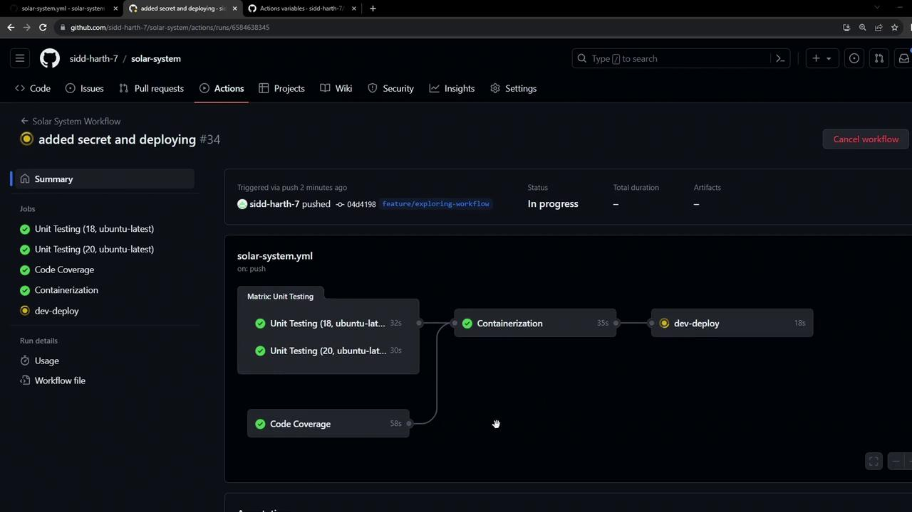
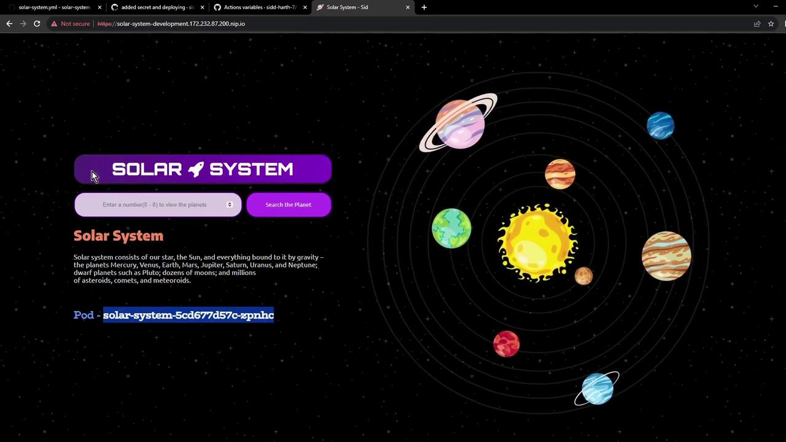
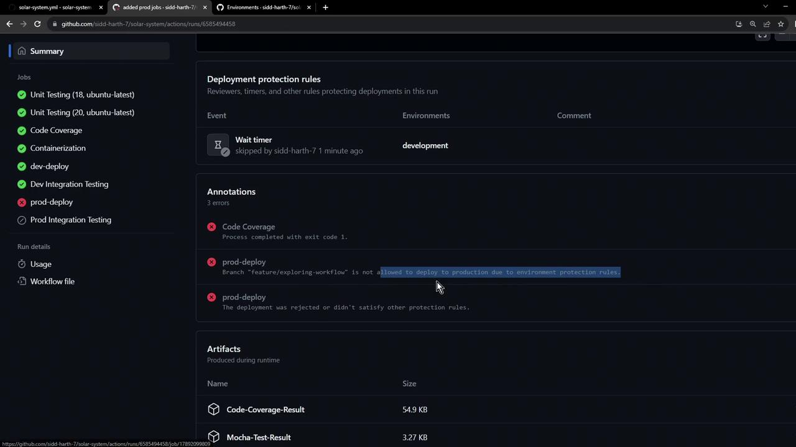
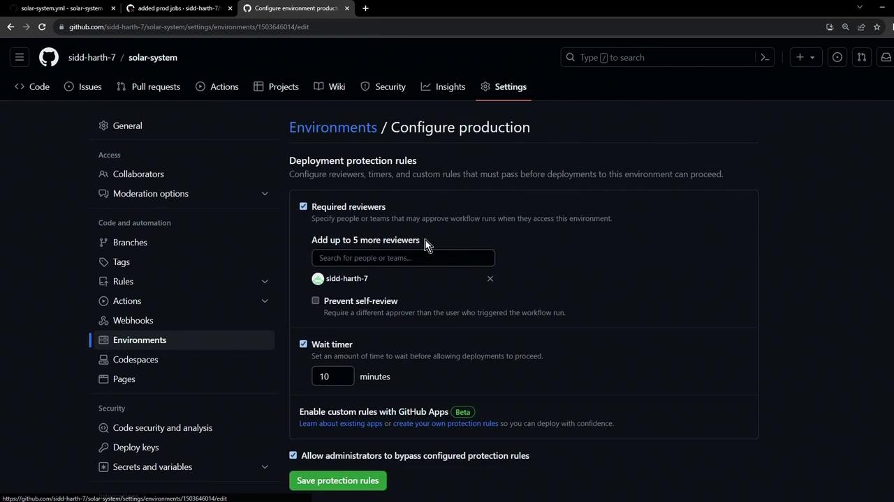
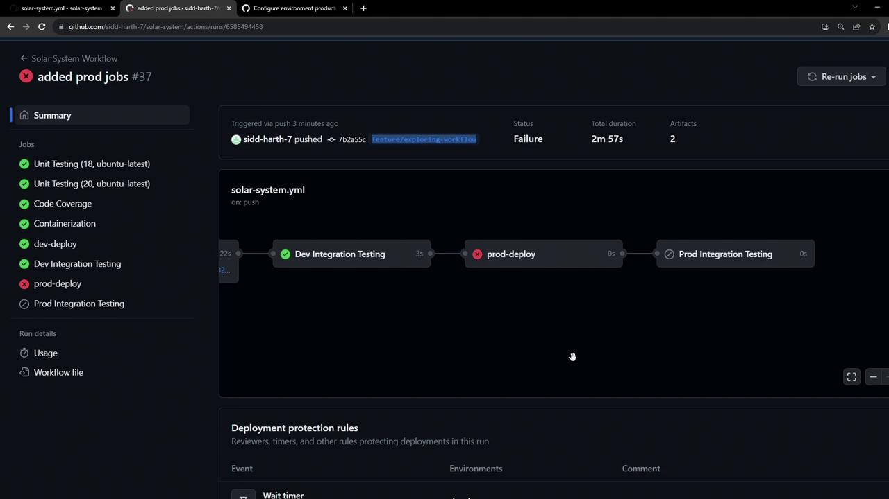

# NAME                 TYPE                                DATA   AGE
# default-token-xxxxx  kubernetes.io/service-account-token  3      47h
```

## 5. Watching GitHub Actions in Motion

When you push changes, the `dev-deploy` job runs alongside other CI tasks:

<Frame>
  
</Frame>

### 5.1 Secret Creation Logs

```bash theme={null}
kubectl -n development create secret generic mongo-db-creds \
  --from-literal=MONGO_URI=... \
  --from-literal=MONGO_USERNAME=... \
  --from-literal=MONGO_PASSWORD=...
# Output:
secret/mongo-db-creds created
```

### 5.2 Applying Manifests

```bash theme={null}
kubectl apply -f kubernetes/development
# Output:
deployment.apps/solar-system created
ingress.networking.k8s.io/solar-system created
service/solar-system created
```

## 6. Validate Resources in the Cluster

Check that your secret and resources are live:

```bash theme={null}
kubectl -n development get secrets
# NAME                 TYPE                                DATA   AGE
# default-token-xxxxx  kubernetes.io/service-account-token  3      47h
kubectl -n development get all
# NAME                                   READY   STATUS    RESTARTS   AGE
# pod/solar-system-xxxxx                 1/1     Running   0          30s
# NAME                  TYPE       CLUSTER-IP      EXTERNAL-IP   PORT(S)         AGE
# NAME                              READY   UP-TO-DATE   AVAILABLE   AGE
# NAME                                         DESIRED   CURRENT   READY   AGE
# replicaset.apps/solar-system-xxxxx           2         2         2       1m
```

Retrieve your ingress host:

```bash theme={null}
kubectl -n development get ing
# NAME           HOSTS                                             ADDRESS                                           PORTS   AGE
# solar-system   solar-system-development.172.232.87.200.nip.io   <none>                                            80      1m
```

## 7. Access the Application

Open the ingress hostname in your browser. You may see a self-signed TLS warning—proceed to view your live Solar System app:

<Frame>
  
</Frame>

Your Solar System application is now running in the development environment, ready for integration testing!

## References

* [GitHub Actions: Workflow Syntax](https://docs.github.com/en/actions/using-workflows/workflow-syntax-for-github-actions)
* [Kubernetes Secrets Documentation](https://kubernetes.io/docs/concepts/configuration/secret/)
* [Kubectl Cheat Sheet](https://kubernetes.io/docs/reference/kubectl/cheatsheet/)

<CardGroup>
  <Card title="Watch Video" icon="video" href="https://learn.kodekloud.com/user/courses/github-actions/module/92928734-1d5a-462d-9414-2d3865f5ef79/lesson/43bc8133-e5fb-40cf-993a-0a199d0f71a6" />
</CardGroup>


# Workflow Deploy to Kubernetes Prod Environment

Source: https://notes.kodekloud.com/docs/GitHub-Actions/Continuous-Deployment-with-GitHub-Actions/Workflow-Deploy-to-Kubernetes-Prod-Environment/page

This guide explains how to update a GitHub Actions workflow for deploying applications to a Kubernetes production environment.

Deploying to a Kubernetes production cluster involves extending your existing CI/CD pipeline. In this guide, we’ll walk through updating a GitHub Actions workflow to add production deployment jobs, enforce environment protection rules, and validate your release.

## 1. Workflow Skeleton

Begin by defining the workflow trigger, environment variables, and placeholders for your jobs:

```yaml theme={null}
name: Solar System Workflow

on:
  workflow_dispatch:
  push:
    branches:
      - main
      - 'feature/*'

env:
  MONGO_URI: 'mongodb+srv://supercluster.d83jj.mongodb.net/superData'
  MONGO_USERNAME: ${{ vars.MONGO_USERNAME }}
  MONGO_PASSWORD: ${{ secrets.MONGO_PASSWORD }}

jobs:
  unit-testing: {}
  code-coverage: {}
  docker: {}
  dev-deploy: {}
  dev-integration-testing: {}
```

## 2. Reference: Development Jobs

Use these `dev-deploy` and `dev-integration-testing` jobs as templates. They build, deploy to a development namespace, and verify the app is live.

```yaml theme={null}
dev-deploy:
  name: Dev Deploy
  needs: docker
  environment:
    name: development
    url: ${{ steps.set-ingress-host.outputs.APP_INGRESS_HOST }}
  outputs:
    APP_INGRESS_HOST: ${{ steps.set-ingress-host.outputs.APP_INGRESS_HOST }}
  runs-on: ubuntu-latest
  steps:
    - name: Checkout Repository
      uses: actions/checkout@v3

    - name: Install kubectl
      uses: azure/setup-kubectl@v3

    - name: Determine Ingress Host
      id: set-ingress-host
      run: |
        HOST=$(kubectl -n ${{ vars.NAMESPACE }} \
          get ingress -o jsonpath='{.items[0].spec.tls[0].hosts[0]}')
        echo "APP_INGRESS_HOST=$HOST" >> $GITHUB_OUTPUT

dev-integration-testing:
  name: Dev Integration Testing
  needs: dev-deploy
  runs-on: ubuntu-latest
  steps:
    - name: Validate Live Status
      env:
        URL: ${{ needs.dev-deploy.outputs.APP_INGRESS_HOST }}
      run: |
        echo "Testing https://$URL/live"
        curl https://$URL/live -s -k | jq -r .status | grep -i live
```

For more on kubectl commands, see the [kubectl Reference](https://kubernetes.io/docs/reference/kubectl/).

## 3. Adding Production Jobs

### 3.1 prod-deploy

Duplicate the `dev-deploy` job, adjust manifests, and target your production environment. This job also captures the load balancer IP for your Ingress controller.

```yaml theme={null}
prod-deploy:
  name: Prod Deploy
  needs: dev-integration-testing
  environment:
    name: production
    url: https://${{ steps.set-ingress-host.outputs.APP_INGRESS_HOST }}
  outputs:
    APP_INGRESS_HOST: ${{ steps.set-ingress-host.outputs.APP_INGRESS_HOST }}
  runs-on: ubuntu-latest
  steps:
    - name: Checkout Repository
      uses: actions/checkout@v4

    - name: Install kubectl
      uses: azure/setup-kubectl@v3

    - name: Capture Nginx Ingress IP
      run: |
        IP=$(kubectl -n ingress-nginx get svc ingress-nginx-controller \
          -o jsonpath='{.status.loadBalancer.ingress[0].ip}')
        echo "INGRESS_IP=$IP" >> $GITHUB_ENV

    - name: Replace Tokens in Manifests
      uses: cscheidlen/replace-tokens@v1
      with:
        tokenPrefix: '_'
        tokenSuffix: '_'
        files: ["kubernetes/production/*.yaml"]
      env:
        NAMESPACE: ${{ vars.NAMESPACE }}
        REPLICAS: ${{ vars.REPLICAS }}
        IMAGE: ${{ vars.DOCKERHUB_USERNAME }}/solar-system:${{ github.sha }}
        INGRESS_IP: ${{ env.INGRESS_IP }}

    - name: Preview Production Manifests
      run: cat kubernetes/production/*.yaml

    - name: Deploy to Production
      run: kubectl apply -f kubernetes/production

    - name: Determine Ingress Host
      id: set-ingress-host
      run: |
        HOST=$(kubectl -n ${{ vars.NAMESPACE }} \
          get ingress -o jsonpath='{.items[0].spec.tls[0].hosts[0]}')
        echo "APP_INGRESS_HOST=$HOST" >> $GITHUB_OUTPUT
```

### 3.2 prod-integration-testing

Once the production deploy finishes, verify the live endpoint:

```yaml theme={null}
prod-integration-testing:
  name: Prod Integration Testing
  needs: prod-deploy
  runs-on: ubuntu-latest
  steps:
    - name: Validate Production Live Status
      env:
        URL: ${{ needs.prod-deploy.outputs.APP_INGRESS_HOST }}
      run: |
        echo "Testing https://$URL/live"
        curl https://$URL/live -s -k | jq -r .status | grep -i live
```

## 4. Consolidated Jobs Table

| Job Name                 | Description                       | Depends On              |
| ------------------------ | --------------------------------- | ----------------------- |
| unit-testing             | Run unit tests                    | –                       |
| code-coverage            | Measure test coverage             | unit-testing            |
| docker                   | Build and push Docker image       | code-coverage           |
| dev-deploy               | Deploy to development namespace   | docker                  |
| dev-integration-testing  | Smoke-test development deployment | dev-deploy              |
| prod-deploy              | Deploy to production namespace    | dev-integration-testing |
| prod-integration-testing | Smoke-test production deployment  | prod-deploy             |

## 5. Running the Workflow

1. Commit and push your changes to `main` or a `feature/*` branch.
2. Trigger the workflow manually or via a push event.
3. Monitor the sequential execution: dev jobs ➔ prod-deploy ➔ prod-integration-testing.

<Callout icon="lightbulb">
  If `prod-deploy` is blocked by branch protection or environment rules, you’ll see an error and the integration test will be skipped.
</Callout>

<Frame>
  
</Frame>

## 6. Environment Protection Rules

Configure deployment protection rules in your repository settings to enforce review policies, wait timers, or required approvals before production deployments.

<Frame>
  
</Frame>

<Callout icon="triangle-alert">
  Triggering from an unauthorized branch (e.g., a feature branch without approval) will block `prod-deploy`. Subsequent jobs will be skipped.
</Callout>

<Frame>
  
</Frame>

***

## Links and References

* [GitHub Actions Documentation](https://docs.github.com/actions)
* [Kubernetes Basics](https://kubernetes.io/docs/concepts/overview/what-is-kubernetes/)
* [azure/setup-kubectl](https://github.com/Azure/setup-kubectl)
* [cscheidlen/replace-tokens GitHub Action](https://github.com/cscheidlen/replace-tokens)

<CardGroup>
  <Card title="Watch Video" icon="video" href="https://learn.kodekloud.com/user/courses/github-actions/module/92928734-1d5a-462d-9414-2d3865f5ef79/lesson/aefd5ad1-fbd5-4e60-8db9-a975738760c6" />
</CardGroup>
