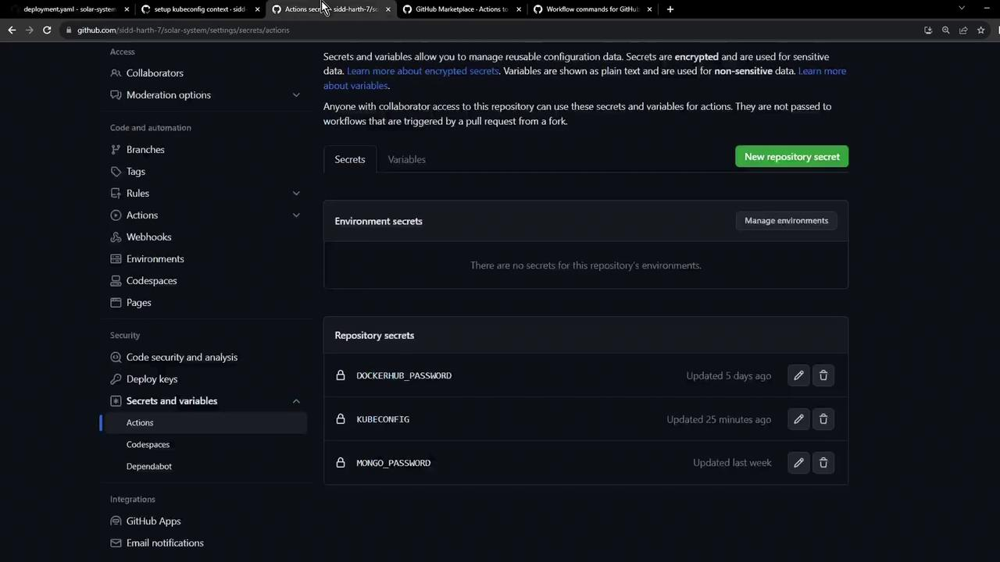
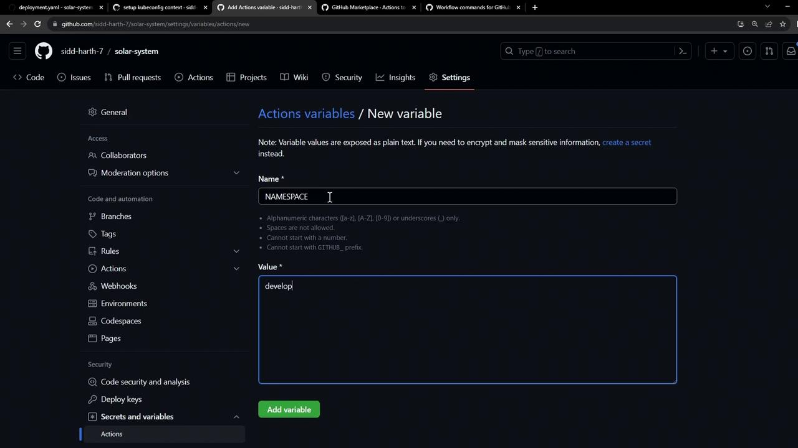
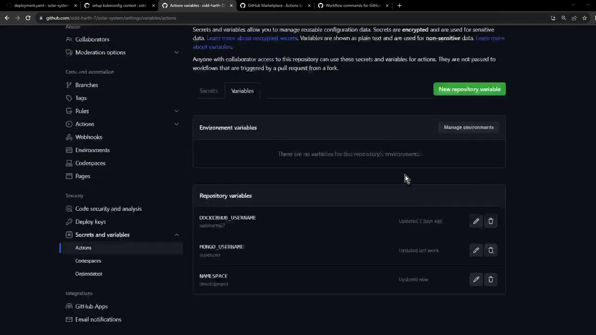
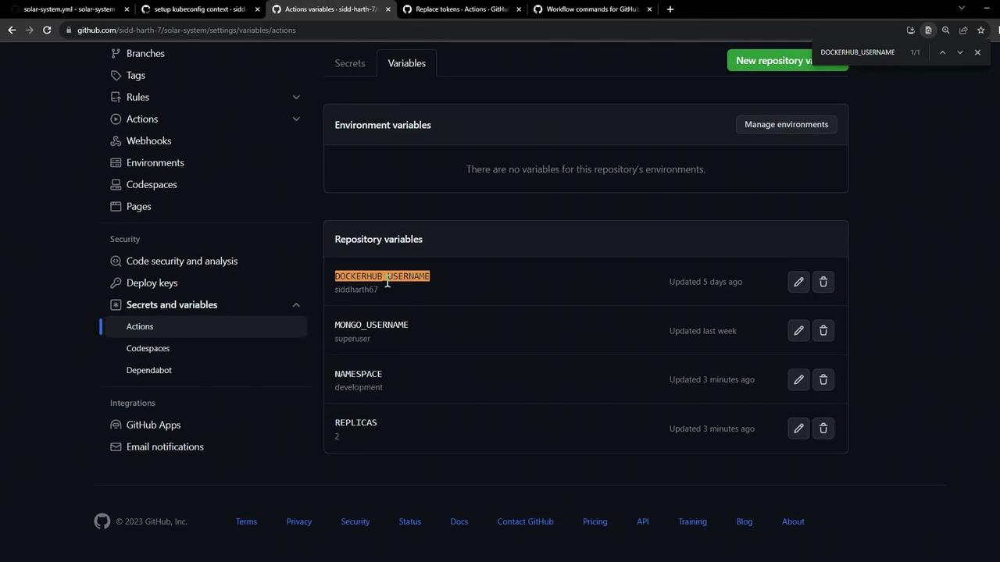
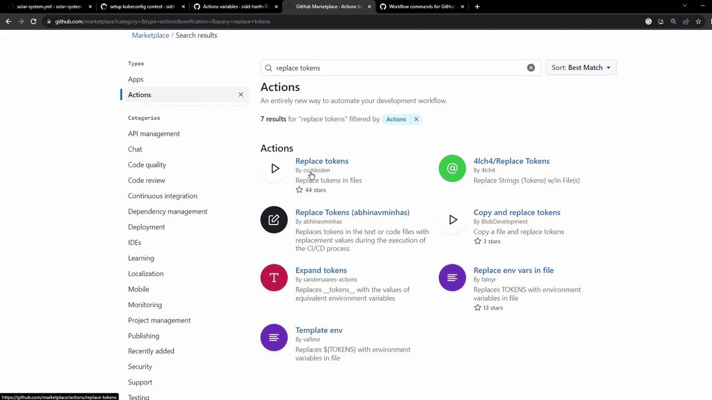
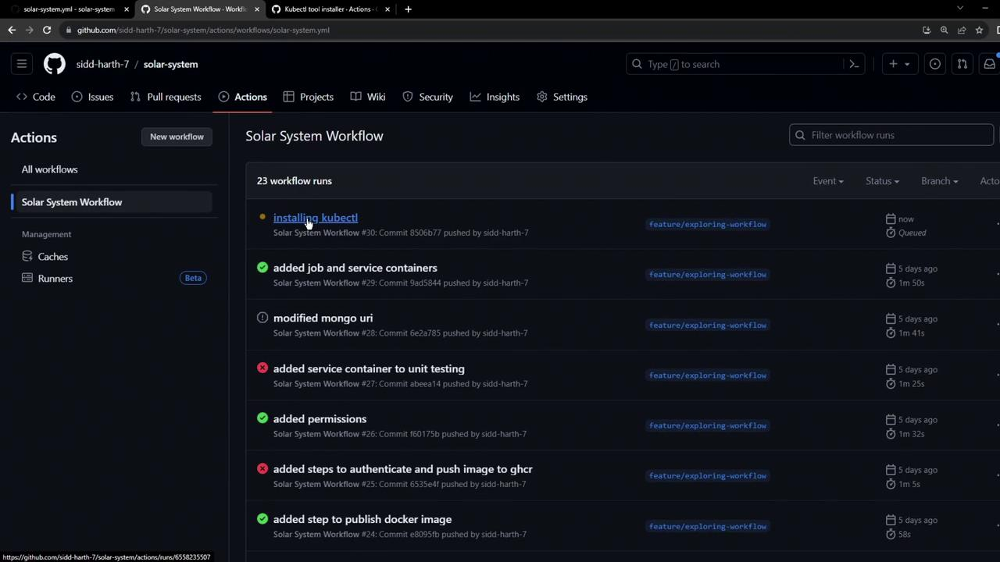
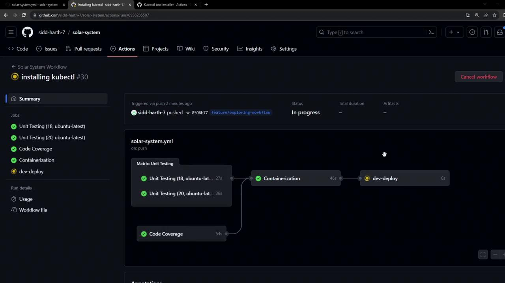

# kubernetes/development/deployment.yaml
apiVersion: apps/v1
kind: Deployment
metadata:
  name: solar-system
  namespace: {_NAMESPACE_}
spec:
  replicas: {_REPLICAS_}
  selector:
    matchLabels:
      app: solar-system
  template:
    metadata:
      labels:
        app: solar-system
    spec:
      containers:
      - name: solar-system
        image: {_IMAGE_}
        imagePullPolicy: Always
        ports:
        - containerPort: 3000
          name: http
```

```yaml theme={null}
# kubernetes/development/service.yaml
apiVersion: v1
kind: Service
metadata:
  name: solar-system
  namespace: {_NAMESPACE_}
spec:
  ports:
  - port: 3000
    targetPort: 3000
  selector:
    app: solar-system
```

```yaml theme={null}
# kubernetes/development/ingress.yaml
apiVersion: networking.k8s.io/v1
kind: Ingress
metadata:
  name: solar-system
  namespace: {_NAMESPACE_}
  annotations:
    kubernetes.io/tls-acme: "true"
spec:
  rules:
  - host: solar-system-{_NAMESPACE_}.{_INGRESS_IP_}.nip.io
    http:
      paths:
      - path: /
        pathType: Prefix
        backend:
          service:
            name: solar-system
            port:
              number: 3000
  tls:
  - hosts:
    - solar-system-{_NAMESPACE_}.{_INGRESS_IP_}.nip.io
    secretName: solar-system
```

All tokens must be replaced before applying these files to the cluster.

***

## 1. Define repository variables

Navigate to **Settings > Secrets and variables > Actions** in your GitHub repository. Here you can add both non-secret variables and secrets.

<Frame>
  
</Frame>

<Callout icon="lightbulb">
  Use **Variables** for non-sensitive configuration (e.g., `NAMESPACE`, `REPLICAS`) and **Secrets** for credentials (`KUBECONFIG`, `DOCKERHUB_PASSWORD`).
</Callout>

Add the following repository variables:

| Name      | Value       | Description                          |
| --------- | ----------- | ------------------------------------ |
| NAMESPACE | development | Kubernetes namespace for development |
| REPLICAS  | 2           | Number of replicas to deploy         |

<Frame>
  
</Frame>

Once added, your list should look like this:

<Frame>
  
</Frame>

Ensure you also have **DOCKERHUB\_USERNAME** defined for constructing the container image reference:

<Frame>
  
</Frame>

***

## 2. Choose a token-replacement action

From the GitHub Marketplace, install **cschleiden/replace-tokens\@v1**. This action will scan files and replace tokens based on your specified prefix and suffix.

<Frame>
  
</Frame>

Example configuration:

```yaml theme={null}
- uses: cschleiden/replace-tokens@v1
  with:
    tokenPrefix: '{_'
    tokenSuffix: '_}'
    files: 'kubernetes/development/*.yaml'
  env:
    NAMESPACE: ${{ vars.NAMESPACE }}
    REPLICAS: ${{ vars.REPLICAS }}
    IMAGE: ${{ vars.DOCKERHUB_USERNAME }}/solar-system:${{ github.sha }}
    INGRESS_IP: ${{ env.INGRESS_IP }}
```

***

## 3. Fetch the Ingress IP dynamically

Hard-coding the external IP limits flexibility. Instead, retrieve it at runtime using `kubectl` and store it in `GITHUB_ENV`:

```bash theme={null}
kubectl -n ingress-nginx get svc ingress-nginx-controller \
  -o jsonpath="{.status.loadBalancer.ingress[0].ip}"
```

In your workflow, you’ll capture this value:

```yaml theme={null}
- name: Save NGINX Ingress Controller IP
  id: save_ingress_ip
  run: |
    echo "INGRESS_IP=$(kubectl -n ingress-nginx \
      get svc ingress-nginx-controller \
      -o jsonpath='{.status.loadBalancer.ingress[0].ip}')" >> $GITHUB_ENV
```

***

## 4. Complete GitHub Actions workflow

Below is a full example workflow that ties everything together:

```yaml theme={null}
name: Dev Deploy

on:
  push:
    branches: [ main ]

jobs:
  deploy:
    runs-on: ubuntu-latest
    steps:

    - name: Checkout repository
      uses: actions/checkout@v3

    - name: Set Kubeconfig
      uses: azure/k8s-set-context@v3
      with:
        method: kubeconfig
        kubeconfig: ${{ secrets.KUBECONFIG }}

    - name: Fetch Kubernetes cluster details
      run: |
        kubectl version --short
        echo "----------------------------------------------"
        kubectl get nodes

    - name: Save NGINX Ingress Controller IP
      id: save_ingress_ip
      run: |
        echo "INGRESS_IP=$(kubectl -n ingress-nginx \
          get svc ingress-nginx-controller \
          -o jsonpath='{.status.loadBalancer.ingress[0].ip}')" >> $GITHUB_ENV

    - name: Replace tokens in Kubernetes manifests
      uses: cschleiden/replace-tokens@v1
      with:
        tokenPrefix: '{_'
        tokenSuffix: '_}'
        files: 'kubernetes/development/*.yaml'
      env:
        NAMESPACE: ${{ vars.NAMESPACE }}
        REPLICAS: ${{ vars.REPLICAS }}
        IMAGE: ${{ vars.DOCKERHUB_USERNAME }}/solar-system:${{ github.sha }}
        INGRESS_IP: ${{ env.INGRESS_IP }}

    - name: Verify token replacement
      run: |
        echo "=== deployment.yaml ==="
        cat kubernetes/development/deployment.yaml
        echo "=== service.yaml ==="
        cat kubernetes/development/service.yaml
        echo "=== ingress.yaml ==="
        cat kubernetes/development/ingress.yaml
```

***

## 5. Outcome

After the workflow completes:

* `namespace` will be set to `development`
* `replicas` updated to `2`
* `image` resolved as `<your-dockerhub-username>/solar-system:<commit-sha>`
* Ingress host entries generated with the actual load balancer IP

This pattern can be replicated for other environments (e.g., `kubernetes/production/`) by adjusting repository variables and glob patterns in the workflow.

***

## Links and References

* [GitHub Actions: Workflow syntax](https://docs.github.com/en/actions/using-workflows/workflow-syntax-for-github-actions)
* [Kubernetes Ingress](https://kubernetes.io/docs/concepts/services-networking/ingress/)
* [cschleiden/replace-tokens on GitHub Marketplace](https://github.com/cschleiden/github-action-replace-tokens)

<CardGroup>
  <Card title="Watch Video" icon="video" href="https://learn.kodekloud.com/user/courses/github-actions/module/92928734-1d5a-462d-9414-2d3865f5ef79/lesson/1cecbb34-c049-412d-85ed-591025505178" />
</CardGroup>


# Workflow Setup Kubectl

Source: https://notes.kodekloud.com/docs/GitHub-Actions/Continuous-Deployment-with-GitHub-Actions/Workflow-Setup-Kubectl/page

This guide enhances a GitHub Actions workflow by adding a job to install `kubectl` and deploy an application to a Kubernetes namespace.

In this guide, we’ll enhance our **Solar System** GitHub Actions workflow by installing the `kubectl` CLI on the runner. We’ll introduce a new job—`dev-deploy`—which deploys our application to the **development** Kubernetes namespace. This job will:

1. Check out the code
2. Install `kubectl`
3. Validate cluster connectivity by fetching version and node details

## Existing Workflow Overview

Below is the current workflow up to the `docker` job. It runs on pushes to the `main` branch or any `feature/*` branch, and it uses MongoDB credentials stored in GitHub Secrets and Variables.

```yaml theme={null}
name: Solar System Workflow

on:
  workflow_dispatch:
  push:
    branches:
      - main
      - 'feature/*'

env:
  MONGO_URI: mongodb+srv://supercluster.d3jj.mongodb.net/superData
  MONGO_USERNAME: ${{ vars.MONGO_USERNAME }}
  MONGO_PASSWORD: ${{ secrets.MONGO_PASSWORD }}

jobs:
  unit-testing:
    # …
  code-coverage:
    # …
  docker:
    name: Containerization
    needs: [unit-testing, code-coverage]
    permissions:
      packages: write
    runs-on: ubuntu-latest
    steps:
      - name: Checkout Repo
        uses: actions/checkout@v4

      - name: Docker Hub Login
        uses: docker/login-action@v2.2.0
        with:
          username: ${{ vars.DOCKERHUB_USERNAME }}
          password: ${{ secrets.DOCKERHUB_PASSWORD }}

      - name: GHCR Login
        uses: docker/login-action@v2.2.0
        with:
          registry: ghcr.io
          username: ${{ github.repository_owner }}
          password: ${{ secrets.GITHUB_TOKEN }}

      - name: Docker Build & Push
        uses: docker/build-push-action@v4
        with:
          context: .
          push: true
          tags: |
            ${{ vars.DOCKERHUB_USERNAME }}/solar-system:${{ github.sha }}
            ghcr.io/${{ github.repository_owner }}/solar-system:${{ github.sha }}
```

### Job Summary

| Job Name      | Purpose                          | Depends On                  |
| ------------- | -------------------------------- | --------------------------- |
| unit-testing  | Run unit tests                   | –                           |
| code-coverage | Generate code coverage reports   | unit-testing                |
| docker        | Build & push Docker images       | unit-testing, code-coverage |
| dev-deploy    | Install kubectl & verify cluster | docker                      |

***

## Adding the `dev-deploy` Job

Append the following job after `docker` to install `kubectl` and fetch cluster details:

```yaml theme={null}
  dev-deploy:
    name: Deploy to Development Cluster
    needs: docker
    runs-on: ubuntu-latest
    steps:
      - name: Checkout Repo
        uses: actions/checkout@v4

      - name: Install kubectl CLI
        uses: azure/setup-kubectl@v3
        with:
          version: 'v1.26.0'

      - name: Fetch Kubernetes Cluster Details
        run: |
          kubectl version --short
          echo "------------------------------"
          kubectl get nodes
```

You can find the `azure/setup-kubectl` action in the GitHub Marketplace:

<Frame>
  
</Frame>

After committing with the message “Installing kubectl,” your workflow will trigger a new run:

<Frame>
  
</Frame>

You can then view the real-time progress of each step:

<Frame>
  
</Frame>

***

## Troubleshooting: Kubeconfig Required

If you see an error like this, it means `kubectl` has no cluster context:

```bash theme={null}
kubectl version --short
Client Version: v1.26.0
Error from server (Unauthorized): the server is currently unable to handle the request
```

<Callout icon="triangle-alert">
  You must provide a valid **Kubeconfig** so `kubectl` can authenticate with your Kubernetes API. Never commit this file to version control—store it as a [GitHub Secret](/docs/actions/reference/encrypted-secrets).
</Callout>

A typical `kubeconfig` looks like this:

```yaml theme={null}
apiVersion: v1
kind: Config
preferences: {}
clusters:
- cluster:
    certificate-authority-data: <base64-encoded-ca>
    server: https://example.k8s.cluster:6443
  name: my-cluster
contexts:
- context:
    cluster: my-cluster
    namespace: default
    user: my-cluster-admin
  name: my-cluster-context
current-context: my-cluster-context
users:
- name: my-cluster-admin
  user:
    client-certificate-data: <base64-encoded-cert>
    client-key-data: <base64-encoded-key>
```

### Using the Kubeconfig in Your Workflow

1. **Add the Kubeconfig** as a secret, e.g., `KUBECONFIG_DATA`.
2. **Inject it** into the runner and write it to `~/.kube/config`:

```yaml theme={null}
      - name: Configure Kubeconfig
        run: |
          mkdir -p ~/.kube
          echo "${{ secrets.KUBECONFIG_DATA }}" | base64 --decode > ~/.kube/config
```

With this step in place, your `dev-deploy` job will authenticate successfully and you’ll see both version and node information printed.

***

## Links and References

* [GitHub Actions: Workflow Syntax](https://docs.github.com/actions/using-workflows/workflow-syntax-for-github-actions)
* [azure/setup-kubectl Action](https://github.com/Azure/setup-kubectl)
* [Kubernetes Configuration Docs](https://kubernetes.io/docs/concepts/configuration/organize-cluster-access-kubeconfig/)
* [GitHub Secrets](https://docs.github.com/actions/security-guides/encrypted-secrets)

<CardGroup>
  <Card title="Watch Video" icon="video" href="https://learn.kodekloud.com/user/courses/github-actions/module/92928734-1d5a-462d-9414-2d3865f5ef79/lesson/113baae1-442a-4756-b39e-fde67a9344ce" />
</CardGroup>
