# Install curl and jq
RUN apk update && apk add --no-cache curl jq

# Copy and set entrypoint
COPY entrypoint.sh /entrypoint.sh
RUN chmod +x /entrypoint.sh

ENTRYPOINT ["/entrypoint.sh"]
```

### Entrypoint Script (`entrypoint.sh`)

This script retrieves a GIF and posts a comment on the PR:

```bash theme={null}
#!/bin/sh
set -e

GITHUB_TOKEN=$1
GIPHY_API_KEY=$2

# Get PR number
pr_number=$(jq --raw-output .pull_request.number "$GITHUB_EVENT_PATH")
echo "PR #$pr_number"

# Fetch GIF
response=$(curl -s "https://api.giphy.com/v1/gifs/random?api_key=$GIPHY_API_KEY&tag=thank%20you&rating=g")
gif_url=$(echo "$response" | jq --raw-output .data.images.downsized.url)
echo "GIF URL: $gif_url"

# Post comment
comment=$(curl -s -X POST \
  -H "Authorization: token $GITHUB_TOKEN" \
  -H "Accept: application/vnd.github.v3+json" \
  -d "{\"body\":\"### PR #$pr_number\n\n🎉 Thank you for this contribution!\n\n\"}" \
  "https://api.github.com/repos/$GITHUB_REPOSITORY/issues/$pr_number/comments")

echo "Comment posted: $(echo "$comment" | jq --raw-output .html_url)"
```

Make it executable:

```bash theme={null}
chmod +x entrypoint.sh
```

### Action Metadata (`action.yml`)

```yaml theme={null}
name: "Giphy PR Comment"
description: "Add a Giphy GIF comment to new pull requests."
inputs:
  github-token:
    description: "GitHub token for API calls"
    required: true
  giphy-api-key:
    description: "Giphy API key"
    required: true
runs:
  using: "docker"
  image: "Dockerfile"
  args:
    - ${{ inputs.github-token }}
    - ${{ inputs.giphy-api-key }}
```

***

## 3. Test Your Action

Create a test workflow at `.github/workflows/test.yml`:

```yaml theme={null}
on:
  pull_request:
    types: [opened]

jobs:
  testing-action:
    runs-on: ubuntu-latest
    permissions:
      issues: write
      pull-requests: write
    steps:
      - name: Checkout code
        uses: actions/checkout@v3

      - name: Post PR comment
        uses: ./
        with:
          github-token: ${{ secrets.GITHUB_TOKEN }}
          giphy-api-key: ${{ secrets.GIPHY_API_KEY }}
```

Create the workflow folder:

```bash theme={null}
mkdir -p .github/workflows
```

<Frame>
  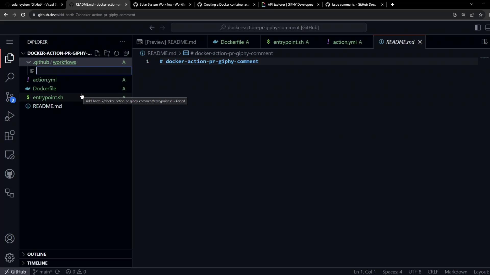
</Frame>

***

## 4. Commit, Push, and Trigger

1. Commit all changes and push to GitHub.
2. Edit `README.md` on a new branch and open a pull request.

<Frame>
  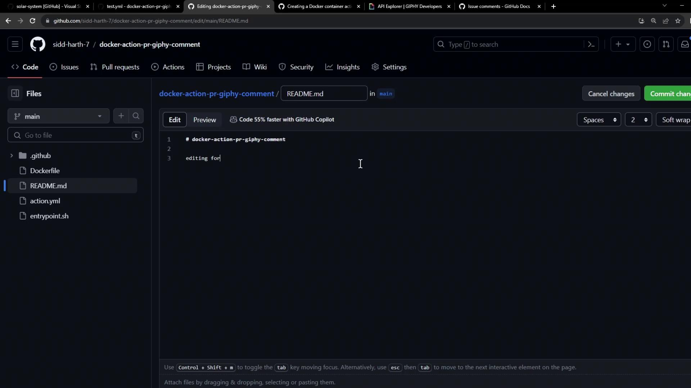
</Frame>

<Frame>
  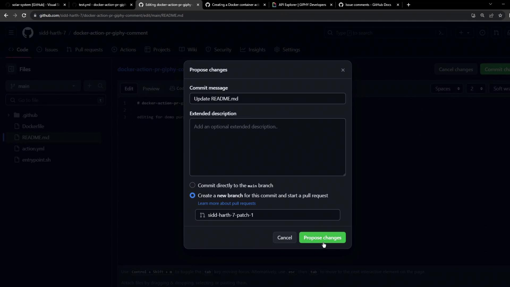
</Frame>

When the PR opens, your action runs automatically:

<Frame>
  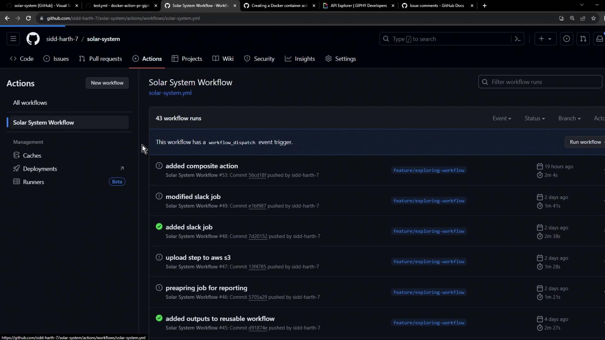
</Frame>

<Frame>
  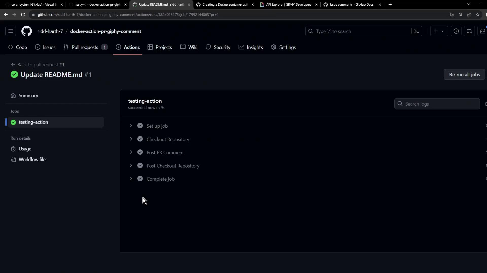
</Frame>

You’ll see a comment from the `github-actions` bot on your pull request:

<Frame>
  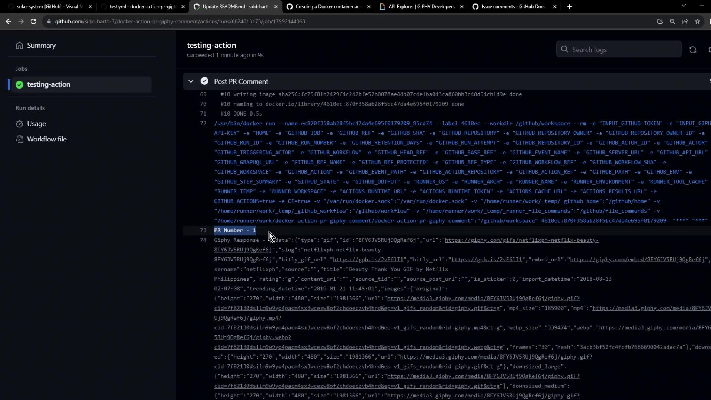
</Frame>

***

## Next Steps

You’ve built and tested a Docker-based GitHub Action that posts Giphy comments on PRs. To take it further:

* Publish your action to the [GitHub Marketplace](https://github.com/marketplace/actions).
* Consume the published action in other repositories.

## Links and References

* [Giphy API Documentation](https://developers.giphy.com/docs/)
* [GitHub REST API: Issues](https://docs.github.com/rest/issues/comments#create-an-issue-comment)
* [GitHub Actions Guide](https://docs.github.com/actions)

<CardGroup>
  <Card title="Watch Video" icon="video" href="https://learn.kodekloud.com/user/courses/github-actions/module/cdb7c2b7-442d-440c-a4f1-d6679733ffd8/lesson/b96418a4-9ba6-40c9-855c-a2fcd120a5aa" />
</CardGroup>


# Create a Javascript Action

Source: https://notes.kodekloud.com/docs/GitHub-Actions/Custom-Actions/Create-a-Javascript-Action/page

Learn to build a custom GitHub Actions JavaScript action from scratch, covering prerequisites, project setup, metadata, core logic, bundling, and publishing.

In this tutorial, you’ll learn how to build a custom GitHub Actions JavaScript action from scratch. We’ll cover:

* Prerequisites for local development
* Project scaffolding and configuration
* Defining metadata in `action.yml`
* Implementing core logic in `index.js`
* Bundling with Vercel NCC
* Publishing your action to GitHub Marketplace

<Frame>
  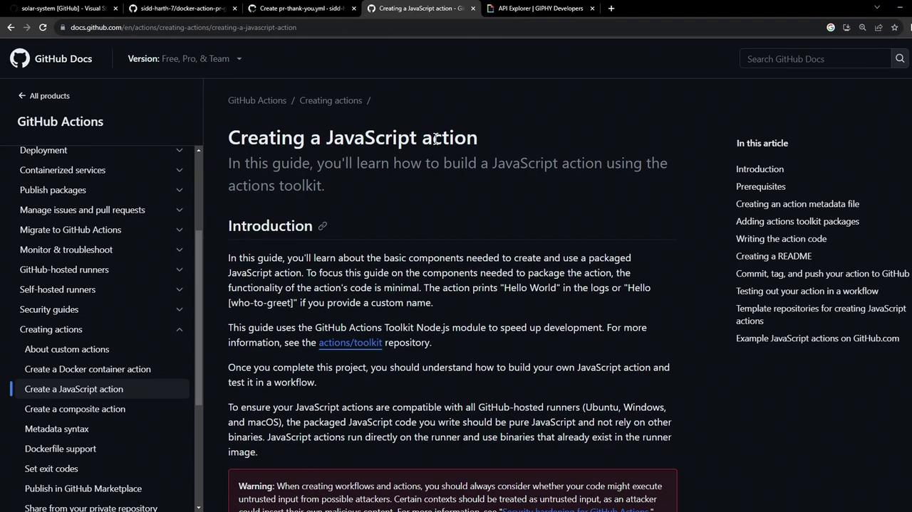
</Frame>

***

## Prerequisites

Before you begin, ensure you have:

* Node.js v20 or later installed
* A GitHub account and repository

<Callout icon="lightbulb">
  Keep your GitHub token and API keys secure. Never commit secrets directly to your repo.
</Callout>

<Frame>
  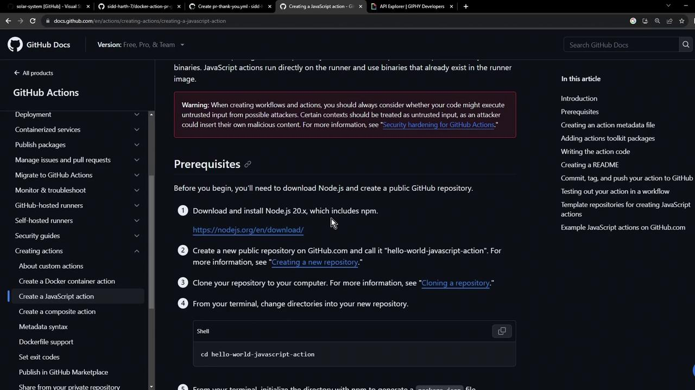
</Frame>

***

## 1. Define Your Action Metadata

All GitHub Actions require an `action.yml` file to declare inputs, outputs, and execution details. Here’s a minimal example:

```yaml theme={null}
name: 'Hello World'
description: 'Greet someone and record the time'
inputs:
  who-to-greet:
    description: 'Person to greet'
    required: true
    default: 'World'
outputs:
  time:
    description: 'Timestamp of the greeting'
runs:
  using: 'node16'
  main: 'index.js'
```

You can extend this file later to include more inputs or permissions.

***

## 2. Scaffold the Project

Create a new directory and initialize with npm:

```bash theme={null}
mkdir js-action-pr-giphy-comment
cd js-action-pr-giphy-comment
npm init -y
touch README.md
```

Your generated `package.json` will look like:

```json theme={null}
{
  "name": "js-action-pr-giphy-comment",
  "version": "1.0.0",
  "main": "index.js",
  "scripts": {
    "test": "echo \"Error: no test specified\" && exit 1"
  },
  "license": "ISC"
}
```

***

## 3. Create and Update `action.yml`

We’ll start with a Docker-based example and then switch to Node.js.

```yaml theme={null}
name: 'Giphy PR comment'
description: 'Add a Giphy GIF comment to new pull requests.'
inputs:
  github-token:
    description: 'GitHub Token'
    required: true
  giphy-api-key:
    description: 'Giphy API Key'
    required: true
runs:
  using: 'docker'
  image: 'Dockerfile'
```

Now update it for JavaScript:

```yaml theme={null}
name: 'Giphy PR Comment'
description: 'Add a Giphy GIF to new pull requests.'
inputs:
  github-token:
    description: 'GitHub Token'
    required: true
  giphy-api-key:
    description: 'Giphy API Key'
    required: true
runs:
  using: 'node16'
  main: 'index.js'
```

<Frame>
  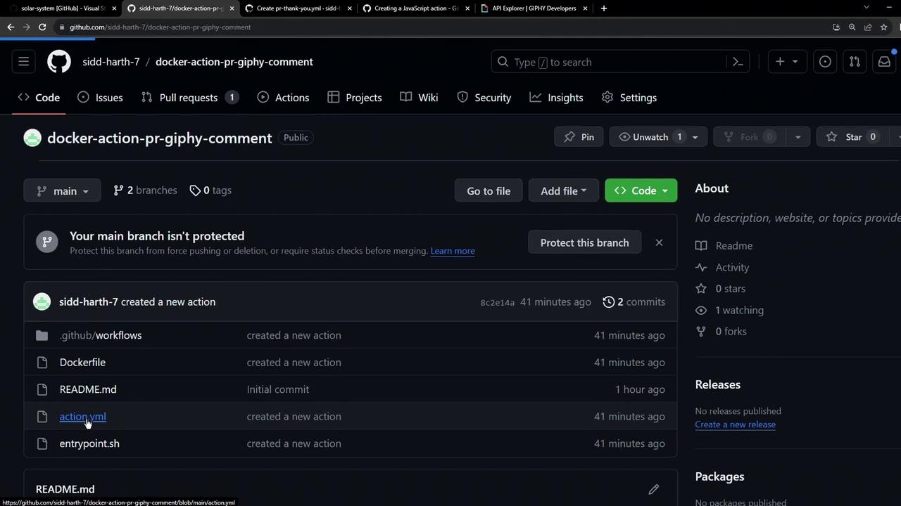
</Frame>

***

## 4. Install Dependencies

In `index.js`, we’ll require the following modules:

```javascript theme={null}
const { Octokit } = require('@octokit/rest');
const Giphy = require('giphy-api');
const core = require('@actions/core');
const github = require('@actions/github');
```

Install them with npm:

```bash theme={null}
npm install @actions/core@1.10.0 \
             @actions/github@5.1.1 \
             @octokit/rest@20.0.1 \
             giphy-api@2.0.2
```

### Dependency Versions

| Package         | Version | Purpose                        |
| --------------- | ------- | ------------------------------ |
| @actions/core   | ^1.10.0 | Access action inputs & outputs |
| @actions/github | ^5.1.1  | Interact with GitHub context   |
| @octokit/rest   | ^20.0.1 | GitHub REST API client         |
| giphy-api       | ^2.0.2  | Fetch random GIFs from Giphy   |

***

## 5. Write the Action Logic

Create an `index.js` file and implement the core workflow:

```javascript theme={null}
const { Octokit } = require('@octokit/rest');
const Giphy = require('giphy-api');
const core = require('@actions/core');
const github = require('@actions/github');

async function run() {
  try {
    const githubToken = core.getInput('github-token');
    const giphyApiKey = core.getInput('giphy-api-key');
    const octokit = new Octokit({ auth: githubToken });
    const giphy = Giphy(giphyApiKey);

    const { owner, repo, number: issue_number } = github.context.issue;
    const response = await giphy.random('thank you');
    const gifUrl = response.data.images.downsized.url;

    await octokit.issues.createComment({
      owner,
      repo,
      issue_number,
      body: `### 🎉 Thanks for contributing!\n`
    });

    core.setOutput('gif-url', gifUrl);
  } catch (error) {
    core.setFailed(error.message);
  }
}

run();
```

***

## 6. Bundle with Vercel NCC

To reduce file size and avoid committing `node_modules`, bundle your code into a single file:

```bash theme={null}
npm install --save-dev @vercel/ncc@0.38.0
ncc build index.js -o dist
```

Update `action.yml` to reference the bundled script:

```yaml theme={null}
runs:
  using: 'node16'
  main: 'dist/index.js'
```

<Callout icon="triangle-alert">
  Add a `.gitignore` file to prevent tracking large files:

  ```text theme={null}
  node_modules/
  dist/node_modules/
  ```
</Callout>

***

## 7. Publish Your Action

1. **Create a new repository** on GitHub, e.g., **js-action-pr-giphy-comment**.

<Frame>
  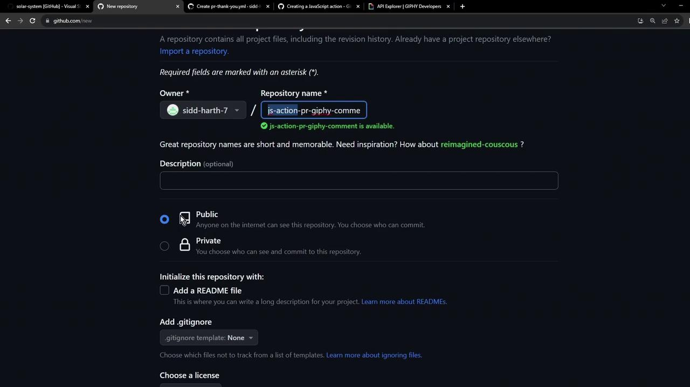
</Frame>

2. **Push your code**:

   ```bash theme={null}
   echo "# js-action-pr-giphy-comment" >> README.md
   git init
   git add .
   git commit -m "Initial commit"
   git branch -M main
   git remote add origin https://github.com/<your-user>/js-action-pr-giphy-comment.git
   git push -u origin main
   ```

3. **Tag a release** and **publish** on the GitHub Marketplace following [Publishing actions in the GitHub Marketplace](https://docs.github.com/actions/creating-actions/publishing-actions-in-github-marketplace).

Your final repository should resemble:

<Frame>
  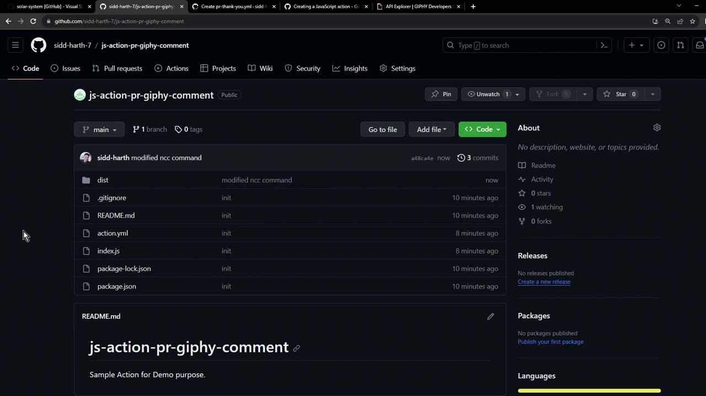
</Frame>

Congratulations! You now have a fully functional JavaScript-based GitHub Action that posts a Giphy GIF comment on new pull requests.

## Links and References

* [GitHub Actions Toolkit](https://github.com/actions/toolkit)
* [Octokit REST.js](https://github.com/octokit/rest.js/)
* [Vercel NCC](https://github.com/vercel/ncc)
* [Giphy API Documentation](https://developers.giphy.com/docs/)
* [Publishing actions in the GitHub Marketplace](https://docs.github.com/actions/creating-actions/publishing-actions-in-github-marketplace)

<CardGroup>
  <Card title="Watch Video" icon="video" href="https://learn.kodekloud.com/user/courses/github-actions/module/cdb7c2b7-442d-440c-a4f1-d6679733ffd8/lesson/0c355eec-5c4c-4e59-9636-fadabe7de6e6" />
</CardGroup>
