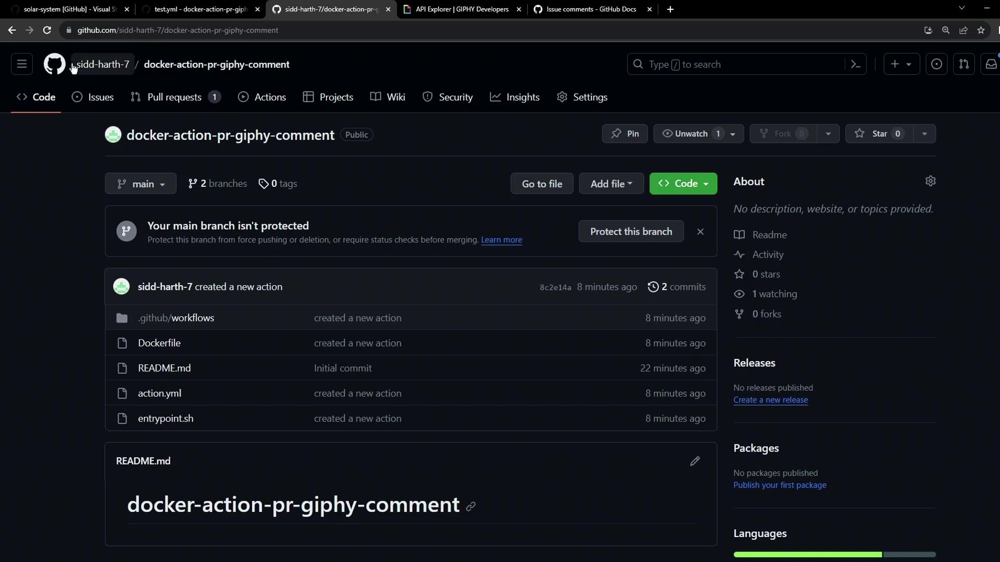
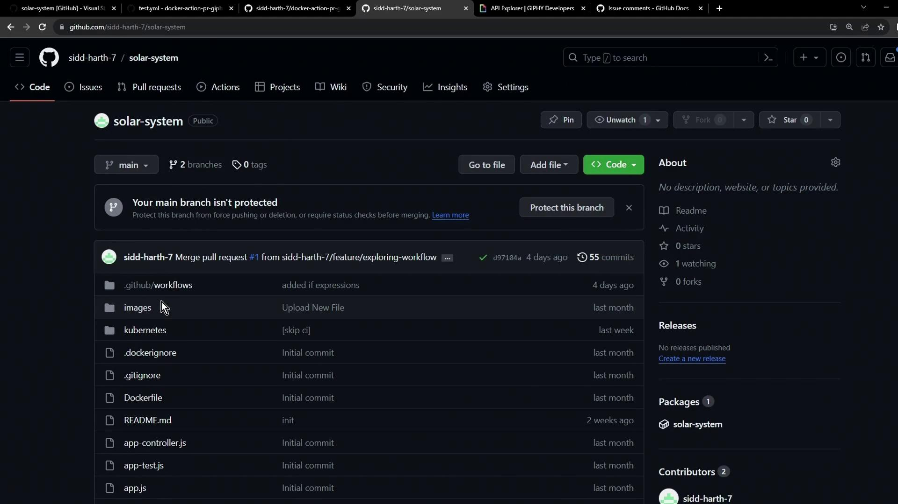
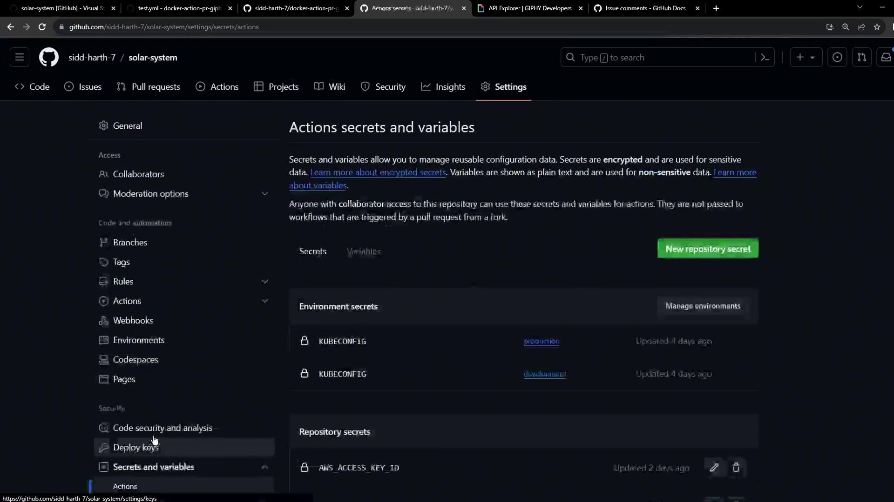
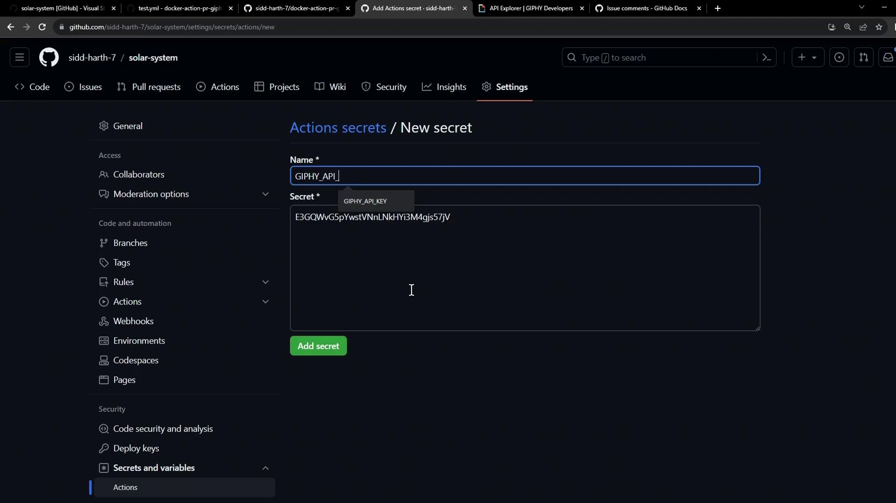
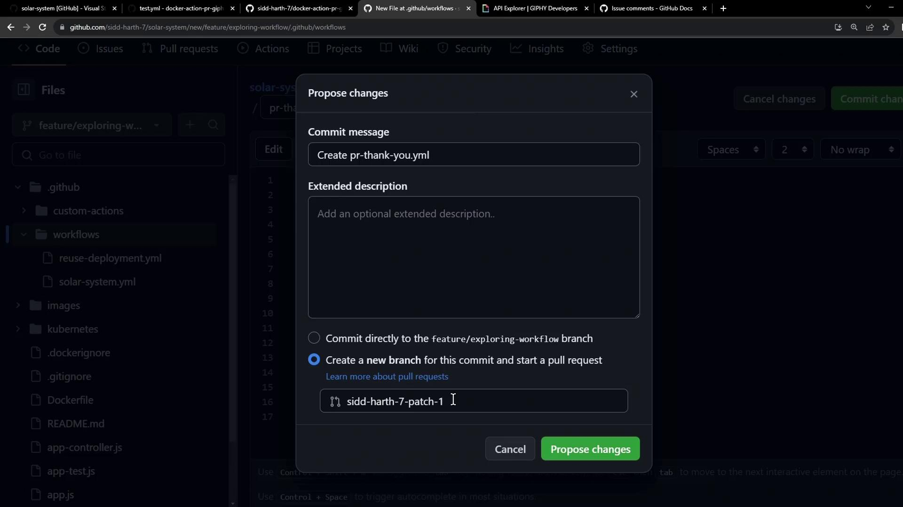
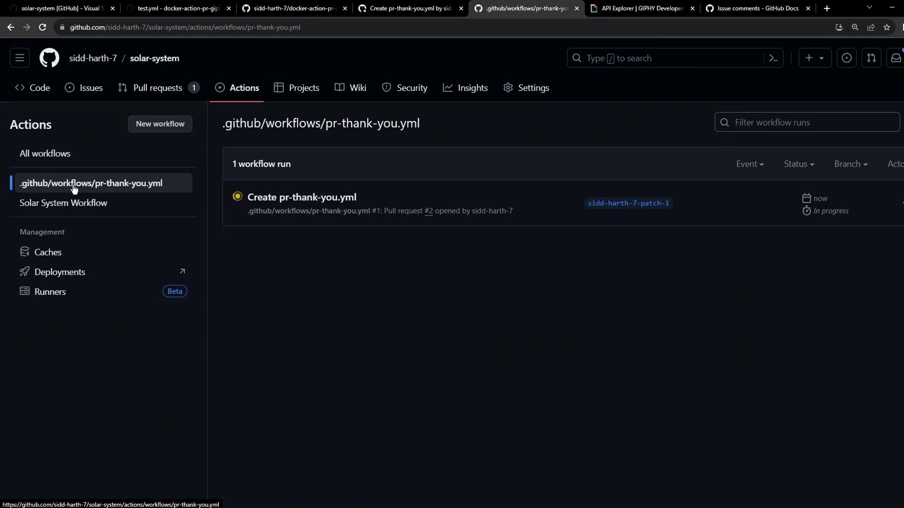

# Using a Docker Action in Workflow

Source: https://notes.kodekloud.com/docs/GitHub-Actions/Custom-Actions/Using-a-Docker-Action-in-Workflow/page

Learn to import and run a Docker-based GitHub Action to post GIF responses on pull requests automatically.

Learn how to import and run a Docker-based GitHub Action from one repository in another. In this guide, we’ll reuse the `docker-action-pr-giphy-comment` action in the **solar-system** project to automatically post a GIF response on pull requests.

<Frame>
  
</Frame>

## 1. Switch to the Target Repository

Open the **solar-system** repository where you want to integrate the custom action.

<Frame>
  
</Frame>

## 2. Store Your Giphy API Key

To fetch GIFs, the action requires a Giphy API key stored as a secret.

1. Navigate to **Settings → Secrets and variables → Actions**.
2. Click **New repository secret**.
3. Name it `GIPHY_API_KEY` and paste your API key.

<Frame>
  
</Frame>

<Frame>
  
</Frame>

<Callout icon="triangle-alert">
  Never expose your API keys in code or logs. Repository secrets are encrypted and only available to workflows.
</Callout>

## 3. Create a Pull Request Workflow

Under `.github/workflows/`, add a new file named `pr-thank-you-workflow.yml`:

```yaml theme={null}
on:
  pull_request:
    types:
      - opened

jobs:
  pr-action:
    runs-on: ubuntu-latest
    permissions:
      issues: write
      pull-requests: write
    steps:
      - name: Post GIF Comment
        uses: sidd-harth-7/docker-action-pr-giphy-comment@main
        with:
          github-token: ${{ secrets.GITHUB_TOKEN }}
          giphy-api-key: ${{ secrets.GIPHY_API_KEY }}
```

<Callout icon="lightbulb">
  Replace `sidd-harth-7/docker-action-pr-giphy-comment@main` with your own `owner/repo@branch` reference.
</Callout>

### Job Configuration

| Setting     | Value                                   |
| ----------- | --------------------------------------- |
| runs-on     | `ubuntu-latest`                         |
| permissions | `issues: write`, `pull-requests: write` |

Commit to a new branch and open a pull request:

<Frame>
  
</Frame>

## 4. Monitor the Workflow Execution

Head to the **Actions** tab to see your workflow run.

<Frame>
  
</Frame>

### Example Build Logs

Docker container actions build an image at runtime:

```bash theme={null}
